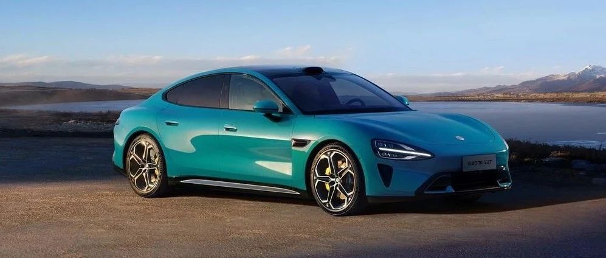

#  关于大家关心问题的回答

[ 小米汽车 ](<javascript:void\(0\);>)

______

  

****01 ‍****

湛江发生的事故是怎么回事？

2025年4月5日我们获悉，当日凌晨，一辆小米SU7标准版在湛江市徐闻县曲界镇376省道，在驾驶员（经查非车主本人）手动驾驶状态行驶过程中，与一辆电动二轮车发生碰撞。事故发生后，肇事司机弃车逃逸。据警方最新通报，肇事司机目前已被执行逮捕。对于事故造成的人员伤亡，我们深感痛惜。

  

**02**

事故中汽车为什么会被引燃？

目前，现场勘查已完成，最终结论以相关部门报告为准。

据初步了解，相关火情是 碰撞后电动二轮车锂电池严重挤压和变形起火，再引燃事故车辆。

**  
**

  

预览时标签不可点

微信扫一扫  
关注该公众号

继续滑动看下一个

轻触阅读原文

小米汽车 

向上滑动看下一个

[知道了](<javascript:;>)

微信扫一扫  
使用小程序

****

[取消](<javascript:void\(0\);>) [允许](<javascript:void\(0\);>)

****

[取消](<javascript:void\(0\);>) [允许](<javascript:void\(0\);>)

****

[取消](<javascript:void\(0\);>) [允许](<javascript:void\(0\);>)

× 分析

__

微信扫一扫可打开此内容，  
使用完整服务

： ， ， ， ， ， ， ， ， ， ， ， ， 。 视频 小程序 赞 ，轻点两下取消赞 在看 ，轻点两下取消在看 分享 留言 收藏 听过