> title:  小米汽车答网友问(第000集)
> source: https://mp.weixin.qq.com/s/yFMjIGID2q5JdPXlF7iifg
> date: 2024-01-10 19:01

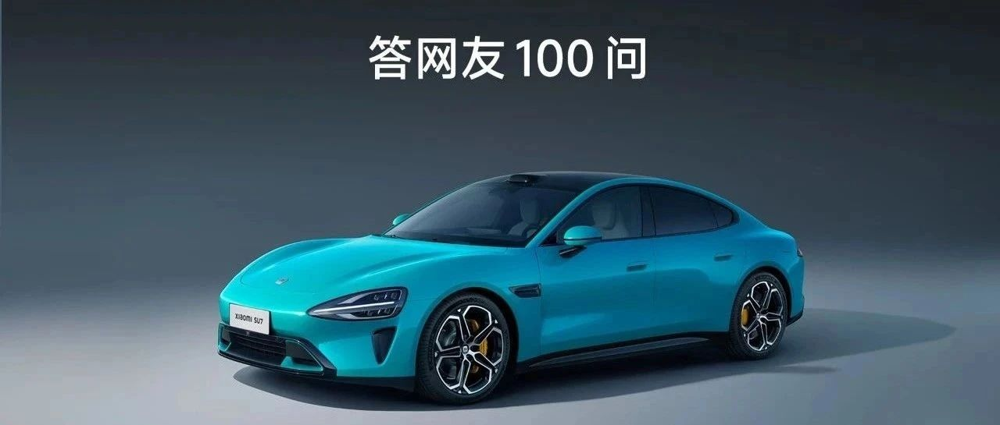

#  雷军：小米汽车答网友100问（完整版）

关于小米汽车，朋友们关心的话题比较多，小米汽车的同事挑选出了其中最典型的100个问题，我把分三天回答的完整版内容帮大家做了一下集中整理。当初规划了100条问题，实际上回答了101条，如果感兴趣的话，也欢迎大家再回看一下我们技术发布会的完整内容。  

##  _**01**_

### **很多米粉反馈，最近关于小米汽车的谣言这么多，小米法务真的有干活么？何时公布下相关进展？**

###  答：这次我们只是开了一场汽车技术发布会，热度这么高超过了我们的预期。一方面巨大的热度代表了用户对小米汽车的期待，我们真的很开心。一方面大量的不实信息、谣言和恶意抹黑也蜂拥而至，我们会及时澄清，我们也将坚决追究造谣抹黑者的法律责任。

##  _**02**_

### **小米汽车SU7定价大概是多少？什么时候公布？**

###  答：我们的确还没有最终定价。我在小米汽车技术发布会上也介绍过，确实有点贵，但会“贵得有理由”。
### 不会是9.9万、不会是14.9万、不会是19.9万。最终定价，我们将于小米SU7正式发布会上公布。

##  _**03**_

### **现在网上关于小米汽车售价的消息很多，有没有真的？**

###  答：网传小米汽车售价均为假消息，我们还没确定最终售价。最终售价会以小米汽车正式发布时对外公布。

##  _**04**_

### **小米SU7的主要内容算是基本发完了吗？**

###  答：2023年12月28日举办的是小米汽车的技术发布会。这次我们只介绍了智能电动汽车最核心的5项技术，关于产品也仅仅是梗概介绍。我们还有大量的技术、产品内容没有展开。在小米SU7正式发布会时跟大家详细介绍。

##  _**05**_

### **大压铸是不是压力越大越好？为什么小米大压铸是9100t？**

   

###  答：这里我们常说的是大压铸的锁模力。锁模力的确是由压铸件设计而来的。小米一体化大压铸后地板比特斯拉Model Y更大、结构更加复杂，故最终选定9100t额定锁模力。实际使用中小米超级大压铸锁模力最大值9500t，稳定值可以做到9300t。

### 锁模力并非大压铸技术的唯一指标。免热处理合金原料性能、压铸岛集群设计、缺陷检测等等均是衡量大压铸技术的核心指标。**小米目前是全球唯二、国内唯一的同时拥有自研免热处理合金材料、自研大压铸岛集群的车企。**

##  _**06**_

### **网上有人说，小米的大压铸是海天已有的8800t压铸机直接改名而来的，这是真的吗？**

  

###  答：当然不是。小米超级大压铸9100t（吨），不是型号，而是实际的额定锁模力，实际上，小米超级大压铸集群正常运行的锁模力可高达9500t。值得特别说明的是，小米超级大压铸9100t的压铸机，是小米跟海天联合研发的，小米研发团队在行业已有的压铸机技术基础上，进行了11项专利设计创新提升，其中大部分为发明专利，如AI主动优化压射参数设定系统等。

### 但压铸机只是一个环节，**小米自研了整个压铸集群系统，包括60个设备、433个工艺参数。** 详细介绍可点击此链接：

###  

### [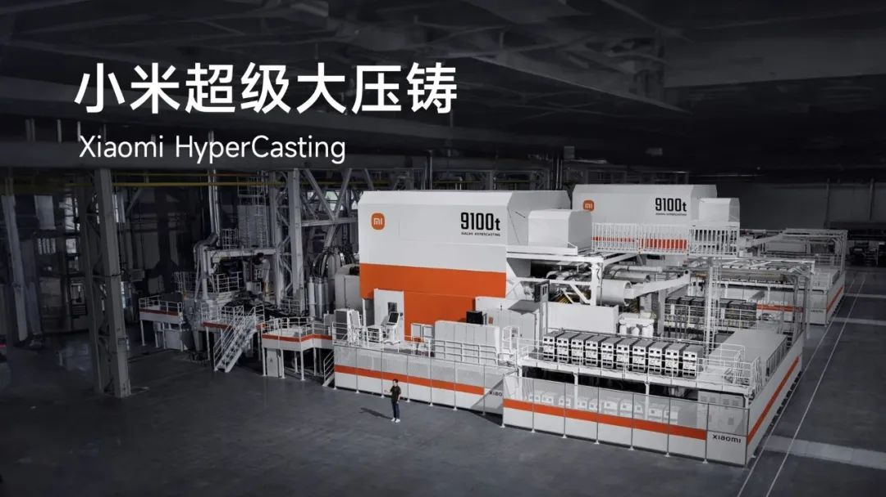](<https://mp.weixin.qq.com/s?__biz=MzkyNzU3MDI3Nw==&mid=2247484919&idx=1&sn=2df21ee868649638e0dd039fbdf5c1b7&scene=21#wechat_redirect>)

##  _**07**_

### **如果真的撞到了大压铸件，小米的维保成本到底多高？**

###   

###  答：小米SU7尾部采用了三段式设计，在一体化大压铸后地板的基础上设计了缓冲区。常规碰撞只需要更换缓冲溃缩区，维修成本和传统设计相同。当遇到极高速碰撞的时候，一体化大压铸后地板可以提供更好的安全防护。

###   

### 总体来说，小米SU7的一体化大压铸后地板设计是：**小碰撞轻松维修费用不肉疼，大碰撞更加坚固护你安全。是目前最佳的解决方案。**

##  _**08**_

### **小米大压铸良品率高么？一上来就用大压铸会不会带来质量问题？**

###   

###  答：大压铸技术是典型的长期主义技术，也是未来头部车企的入场券。小米汽车从一开始就决定要全栈自研，一次性投入两套压铸岛集群。为了确保万无一失，我们当时还增加了一套传统冲压方案，三套方案同时干。最后，小米超级大压铸项目顺利落地。

###   

### 同时我们自研的大压铸岛相关技术包括温控系统、铝液转运系统、压射系统、浇排系统等等，并通过自研的AI缺陷检测系统确保小米SU7一体化大压铸后地板良品率。

##  _**09**_

### **小米泰坦合金实际性能怎么样？自研合金是不是就是为了节省成本？**

###   

###  答：小米泰坦合金在压铸性能、力学性能、耐久性能、可循环、经济性等方面非常出色，小米泰坦合金还加入了30%循环铝，十分环保，小米成为了国内唯一、全球唯二拥有可量产自研大压铸材料的汽车厂商。

###   

### 至于当时为什么要自研合金材料，我发布会也讲过，是因为大压铸对合金原料要求极为苛刻，当时供应商的配方满足不了我们的要求，我们只能自研材料，自研材料的成本比直接用成熟方案肯定是高很多的。

##  _**10**_

### **小米泰坦合金确实是自研的吗？**

###   

###  答：是的。可能有网友此前被错误信息所误导，大家看到的是某大学杨姓教授的相关聊天记录，事实上，杨教授很快进行了澄清。为杨教授实事求是的精神点赞，也对由此引发的误解表示遗憾。希望大家帮忙转发澄清。

###   

### 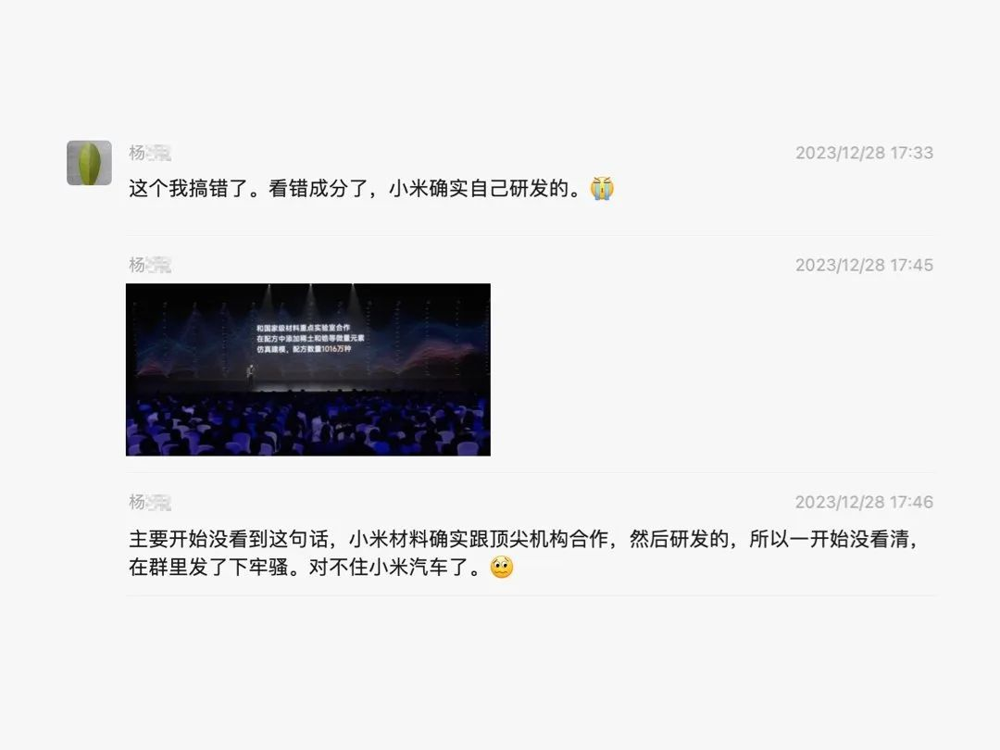

##  _**11**_

### **小米泰坦合金的具体配方有什么不一样？**

###   

###  答：相关专利已经公开可查，合金中使用的十一种元素的配比我们也已公开。

###   

### 专利号：ZL 2023 1 0604165.9

##  _**12**_

### **小米超级电机系列中多少是自研的？**

###   

###  答：我们一共正式发布了三款电机，并同时披露了一款已经实验实现的预研电机。其中，小米超级电机V6、V6s分别与联电、汇川联合研发，转速为21000转。同时，小米自研了小米超级电机V8s，转速27200转，这一信息同时也已被汇川在A股投资者互动平台上公开披露。关于小米超级电机的介绍，可以点击链接了解：

### [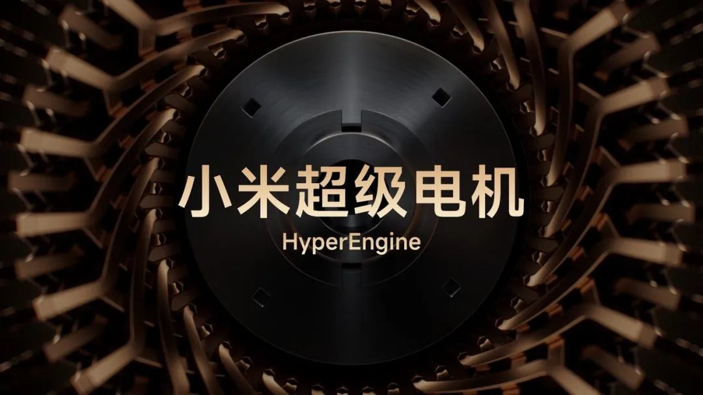](<http://mp.weixin.qq.com/s?__biz=MzkyNzU3MDI3Nw==&mid=2247484815&idx=2&sn=75bd69a79bcc166150f5fdb552ed279d&chksm=c2274585f550cc93f20611f5ef60e144ce008ab756617f53046326b796f37df0c561bff7a4ad&scene=21#wechat_redirect>)

##  _**13**_

### **小米电机V6是不是就是联电的老产品？为什么连型号名都一样？**

###   

###  答：小米电机V6是小米和联电联合研发的全新电机。经过双方的共同努力改进了电机转子应力拓扑结构，大幅提升电机转速和功率密度，并取得了相关专利。

###   

### **网传所谓“小米电机V6为2020年联电TZ220XS000老型号电机”，纯属谣言。** TZ220XS000仅为国家标准规则命名：TZ代表永磁同步电机；220代表电机外径；X代表旋变位置传感器；S代表水冷散热；000则为联电的品牌代号。**内部命名相同不代表是同一款电机，这一点从行业各公开可查信息均可获知。**

##  _**14**_

### **V8s电机确定量产吗？**

###   

###  答：V8s已实现量产，将于2025年上车。目前已有汽车评测媒体实测过装载V8s电机的工程车，实测V8s的转速可达到30000转以上。不过，相关测试为极限值测试，V8s的最高转速，我们还是标定为27200转。

##  _**15**_

### **小米超级电机35000转的高转速是怎么做到的，小米第一次做电机就比特斯拉等都厉害？**

###   

###  答：35000rpm高转速的背后，有从结构设计、材料工艺等诸多方面的创新努力。其中，最为关键的是，**小米利用“激光原位固化碳纤维缠绕技术”进行了高速电机转子套筒的创新设计，并取得了相关授权转子专利。**

###   

###  相比“碳纤维缠绕后需要刷树脂进行固化”的碳纤维湿式缠绕法；小米的激光原位固化缠绕工艺，不是采用碳纤维原丝和树脂胶水，而是碳纤维预浸带，在同一工站设备上边缠绕边利用激光实现碳纤维预浸带的固化，工序简单，一个工位全部搞定，缠绕过程张紧力直接保持。

##  _**16**_

### **CTB倒置电芯真的是业内首创吗？**

###   

###  答：电芯倒置，业内曾有过；泄压阀倒置，也曾有过。但前两者同时倒置的CTB电芯整体倒置，此前却从未有过。**小米首创的这项技术方案，是为了在保障极致电池安全的同时，更能保障极致的空间利用。**

###   

###  CTB是Cell to body，是汽车厂商的设计能力，不仅仅是电池厂商的技术，本质是电池包和车身融为一体，电池包上盖直接就是乘员舱的地板。小米拥有36个核心专利，CTB一体化上盖、侧围设计、底护、复合纤维龙脊梁等结构设计都是小米设计的，低导冷却液、电池管理软件和车云融合安全预警系统、高压架构等也都是小米设计的。

##  _**17**_

### **小米CTB倒置技术方案，具体能带来什么好处？**

###   

###  答：小米CTB电池包采用了倒置电芯设计，相比于传统的正置电芯，泄压阀朝下，配合国内唯一的无孔化高强钢上盖设计和全球最严苛的热失控安全标准，保证了极限状态下，乘员舱也是与电池舱完全隔离的安全状态。

###   

### 即便在55摄氏度热失控无明火、无热蔓延，泄压阀朝下，无孔化上盖，构成了电池安全守护能力的天花板。

##  _**18**_

### **小米电池气凝胶含量有多高？是标配么？**

###   

###  答：小米SU7采用了行业顶级的17层高压绝缘防护，并定制了行业最强的主动冷却技术：双大面冷却面积达到同级最高的7.8m²，这一惊人数据是行业平均水平的4倍，同时在电芯两个侧面铺设了165片业内目前最为领先的气凝胶隔热材料，最高可抵抗1000°C的高温。

###   

### 我们的工程师在测试中，对创新材料和工艺极为自信，敢于把自己的手紧贴气凝胶材料，在另一侧直接用1000°C喷枪火焰炙烤，依然安然无恙。

##  _**19**_

### **网友有人怀疑，小米SU7热管理适应低温，是否只能到-20℃，这是真的吗？**

###   

###  答：关于热泵的工作范围，目前行业没有严格的规范。有部分企业自称可以低至-30℃，其实并非纯“空气源热泵”，而是有加热器或水源热泵在工作。

###   

### 小米汽车技术发布会上透露的，-20℃，是依靠纯空气源热泵，依然能从空气中获得热量。

###   

### 如果按照前述相关公司相同口径，加上加热器等，小米汽车整体热管理能力，能适应的温度可以低至-30℃甚至更低。**所以，小米汽车可以挑战“冬季电车之王”，可以说“电车从此无惧寒冬”。**

###   

### 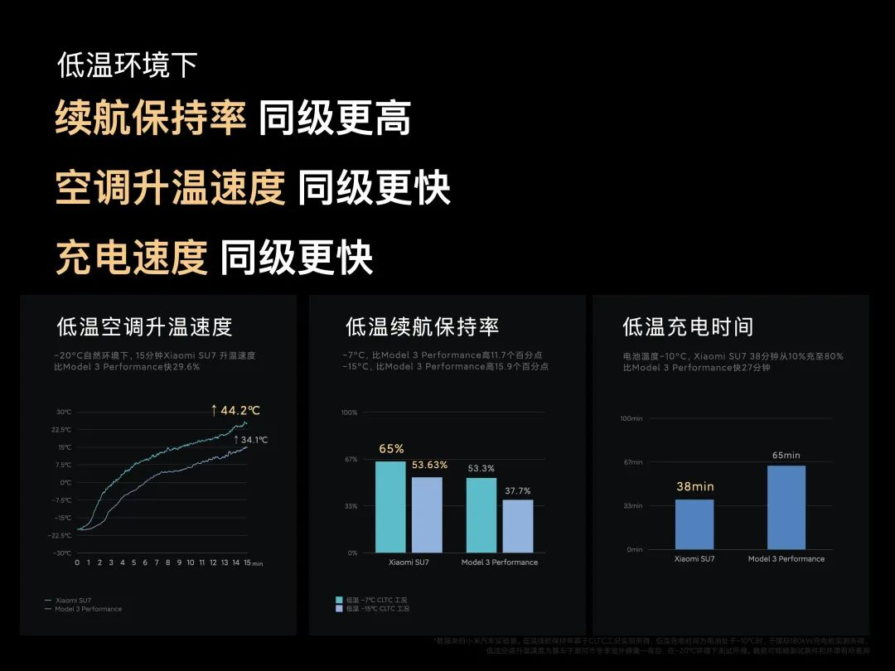

##  _**20**_

### **小米汽车的摩德纳平台是完全自研的吗？**

###   

###  答：小米汽车摩德纳平台为小米全自研汽车平台，之前有谣言称小米汽车使用其他车厂架构，完全失实。

###   

### 小米汽车摩德纳平台研发之初就确立了**100项“第一”“唯一”“最”的设计目标** ，小米汽车技术发布会上也跟大家分享了一部分成果，同时还有更多的成绩我们留在小米汽车正式发布的时候再跟大家详细汇报。

##  _**21**_

### **说是设计目标“100项第一、唯一、最”，实际达到了吗？**

###   

###  答：我们在发布会上，说的讲的“设计目标”。实际上，绝大多数都达到了。因为时间限制，我们只讲了一部分小米汽车的领先技术和功能。更多的点，我们在后续直到SU7正式发布，会陆续向大家介绍。

##  _**22**_

### **小米汽车智能驾驶，靠什么可以达成“2024年进入行业第一阵营”的目标？**

###   

###  答：小米汽车智能驾驶采用了全链路自研方案。并且，小米的起点很高，在最新一代的底层算法——BEV+Transformer+占用网络基础上，将大模型技术全面融入其中，**实现了在全球范围内，首次将端到端的感知决策大模型应用于量产车上。**

##  _**23**_

### **小米SU7的麋鹿测试82km/h的成绩，是按照什么标准测试的？**

###   

###  答：小米SU7麋鹿测试完全按照国际标准ISO 3888-2进行，麋鹿测试成绩为82km/h。如果大家细心的话，会发现测试中段的路宽还略窄于国标标准，给自己额外上了难度。麋鹿测试是反映操控、车身稳定性等一系列能力的综合测试，小米SU7正式上市后也欢迎媒体对比实测。

##  _**24**_

### **小米会不会为了降低起售价，搞一个“丐中丐”版本出来？**

###   

###  答：请大家放心，小米汽车内部有着充分一致的产品立项准则，“体验优先”始终放在第一位。小米SU7就是标准版。

##  _**25**_

### **五星安全碰撞是标配么？标准版和MAX版碰撞安全表现有差异么？**

###   

###  答：**无论是哪个版本的车，安全碰撞测试成绩都是顶级的** ，我们选择了最严格的标准来设计我们的产品，小米SU7系列都达到了C-NCAP 2024版 五星安全标准，E-NCAP 2023版 五星安全标准以及C-IASI 2023版 3G+优秀安全标准。

### 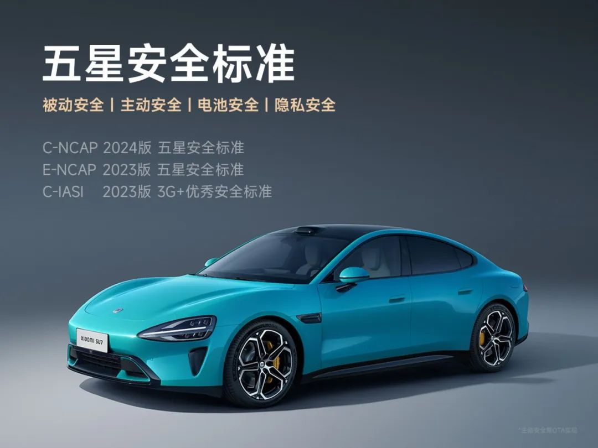

###  

##  _**26**_

### **小米汽车只有三种颜色么？量产版会有白色和黑色么？会有猛男粉么？**

###   

###  答：这次我们公布了小米SU7的三种配色，分别是海湾蓝、橄榄绿和雅灰，三种颜色在实车上都非常漂亮，我们的设计团队在颜色研发和车漆工艺方面下了非常大的功夫。

### 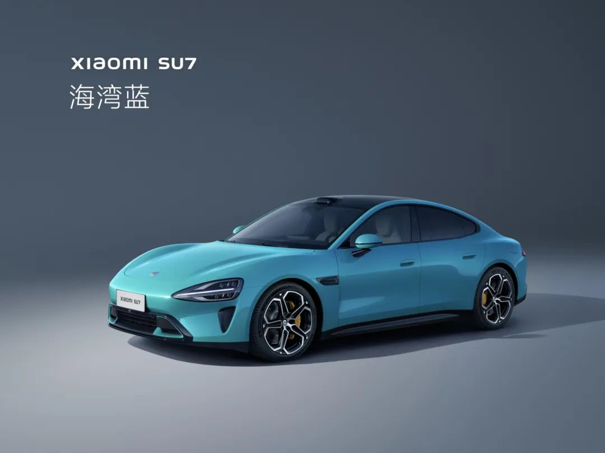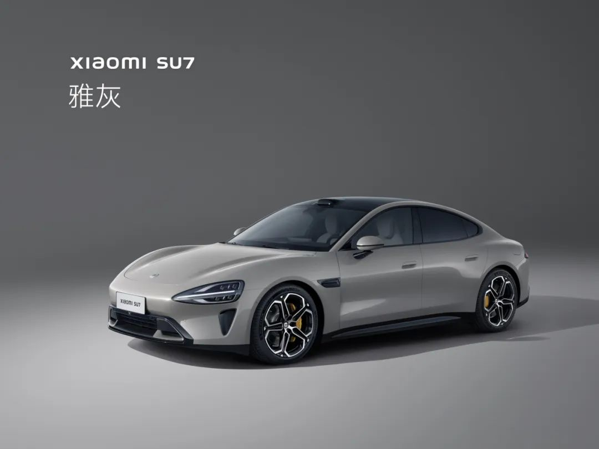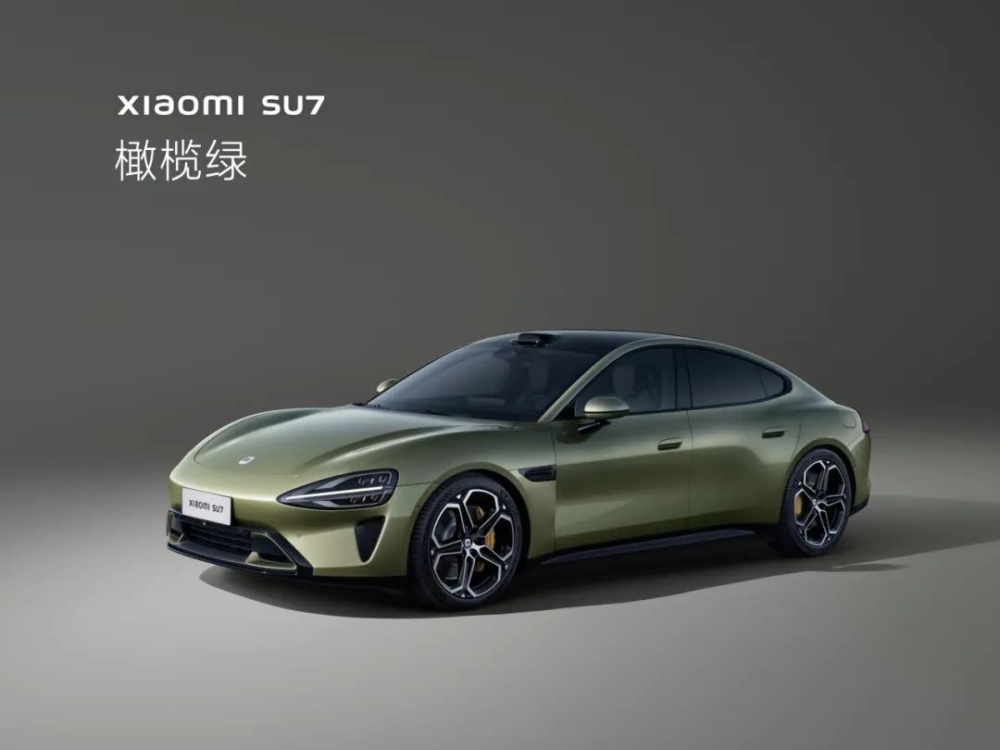  

### 我们也看到很多用户在问有没有经典的黑白配色。我们的确还有更多颜色可选，在正式发布时会向大家全面介绍。

##  _**27**_

### **小米汽车为什么没有考虑重新设计一个新车标？**

###   

###  答：小米汽车的logo设计我们内部非常满意，和小米品牌logo一脉相承，是我们重要的品牌资产，审美是比较主观的事，我们也会虚心倾听大家的不同声音。

##  _**28**_

### **第一辆车为什么叫小米SU7？**

###  

###  答：“SU”是Speed Ultra缩写，“7”是按照国内对车型定位的通常认知习惯确定的系列定位，车型大小大概跟宝马5系差不多。高性能是小米的基因，特斯拉说不造慢车，我们也是这样做的。至于如何念，我们内部也认真讨论过，最后大家都觉得还是叫“苏7”，就像叫一个朋友的名字一样，比较亲切。

##  _**29**_

### **小米SU7会在全球发售吗？**

###   

###  答：目前我们先聚焦国内的正式发布和上市发售。但我们的终极目标是：**让全世界每条街道上，都有小米汽车驰骋的身影。**

##  _**30**_

### **今后会推出Redmi汽车吗？**

###   

###  答：没有这个计划，目前我们还是专注于小米汽车，甚至具体而言，是把我们第一款车 —— **小米SU7的产销全链条做好。**

##  _**31**_

### **什么时候能在身边的小米之家看到小米汽车的实车？**

###   

###  答：在小米SU7正式发布后，我们会同步在全国重点城市的小米之家为大家提供实车体验，这项工作我们在积极准备，还请大家再耐心等待一段时间。

##  _**32**_

### **雷总之前说小米汽车50万内没有对手，是开玩笑还是认真的？**

###   

###  答：这是我当时在评论区回复网友的一句话，虽然是玩笑话，但也是认真的。我们在发布会上拿保时捷Taycan Turbo、特斯拉Model S来做了包括设计、性能、续航、整车安全等多项对比，实际的对比结果大家都很清楚，这两款车的定价大家也很清楚，我们比较务实，不会立那些离谱的flag，所以我们还是非常有信心，小米SU7目前在50万以内没有对手。

##  _**33**_

### **雷总后面是不是就聚焦造车了？还有精力造好手机么？**

###   

###  答：手机依然是小米最核心的业务，是我们「人车家全生态」战略最核心的基础，我依然非常关注手机业务的技术研发。现阶段我的时间精力分配大致是，至少1/4时间依然用在手机研发业务中，1/4关注集团运营和管理，1/2时间用在汽车业务上。

##  _**34**_

### **近日有不少网友反映，某些厂商在频繁恶意蹭小米汽车热度，甚至对小米汽车进行攻击，你们作何应对？**

###  

###  答：疾风知劲草、路遥知马力，时间会证明一切。我们相信，产品、技术和体验上堂堂正正的切磋才是良性的竞争，只有良性的竞争才能有效推动行业的健康发展。我们相信，以最大善意进行沟通可以解决同行之间绝大部分纷争。当然，必要的时候，我们也会以法律武器维护自身权益。

##  _**35**_

### **小米SU7为什么要设计物理按键的一键启动？**

###   

###  答：这个设计，我们经过了反复的思考：首先，小米SU7本着保留机械按键的理念，符合人的操作直觉，保留了一键启动、空调温度、风量、电动尾翼、悬架高低等机械按键，并且可在中控大屏上拓展物理按键。

###   

### 同时，**小米SU7是一个移动的智能空间** ，一键启动将驻车和行车区分为两个空间，驻车时生态屏会展示驻车车模页面，是虚拟与现实的连接，行车时为行车卡片页面简洁易操作。而且，还特别有驾驶仪式感。一键启动后，还会搭配旋转仪表、座椅调节驾驶位置、方向盘归位等一系列联动，驾驶仪式感拉满，每一次驾驶都值得纪念。

###   

##  _**36**_

### **小米SU7方向盘右下方的红色按钮是干什么的？**

###   

###  答：红色按钮是小米SU7的Boost模式激活按键。在加速超车时，按下“红色Boost键”，可提供持续20秒的超额扭矩输出，配合仪表屏和中控大屏的速度动线，让每一次加速都血脉贲张，尽享跑车体验！

###   

### 小米SU7也支持“弹射起步”模式，在起步时同时踩下双踏板，动力系统瞬间满额激活，在170ms内，提供0.95g的极致加速度。

###   

##  _**37**_

### **小米SU7采用的是屏幕换挡还是怀挡换挡杆？**

###   

###  答：小米SU7 采用了怀式电子拨杆换挡。

##  _**38**_

### **小米第一辆车为什么做轿车，而不是SUV？**

###   

###  答：汽车是“工业之王”，而轿车是每个时代 “时代精神”典型代表，是每个时代 “时代精英”第一选择。

###   

### 从产品定义之初，**小米SU7 就是既要高性能、又要生态科技，还要智能空间体验，只有一辆这样杰出的轿车，才有机会，把这三者都做出极致的表现。**

###   

###  所以，我们的首款车，定位成C级高性能生态科技轿车，定位成时代精英的第一选择，科技与人文的顶尖标杆。

###   

### 还有一个非常重要的原因。熟悉汽车研发的朋友都知道，“高车容易低车难”。做轿车是最难的一条路，但小米是立志要在汽车的百年赛道上持续稳健前进，我们坚定地选择了不走捷径，做难而有长期价值的事。

##  _**39**_

### **小米SU7采用溜背轿跑设计，车内空间怎么样？**

###   

###  答：小米SU7 同时拥有跑车姿态和C级轿车的大空间。我们设计空间使用的假人模型身高为188cm，小米SU7前排竖向空间达到1012mm，前排乘员拥有充足的头部空间，后排头部空间还有余量，后排膝部空间也可达105mm，超过同级Model S和宝马5系。

###   

### 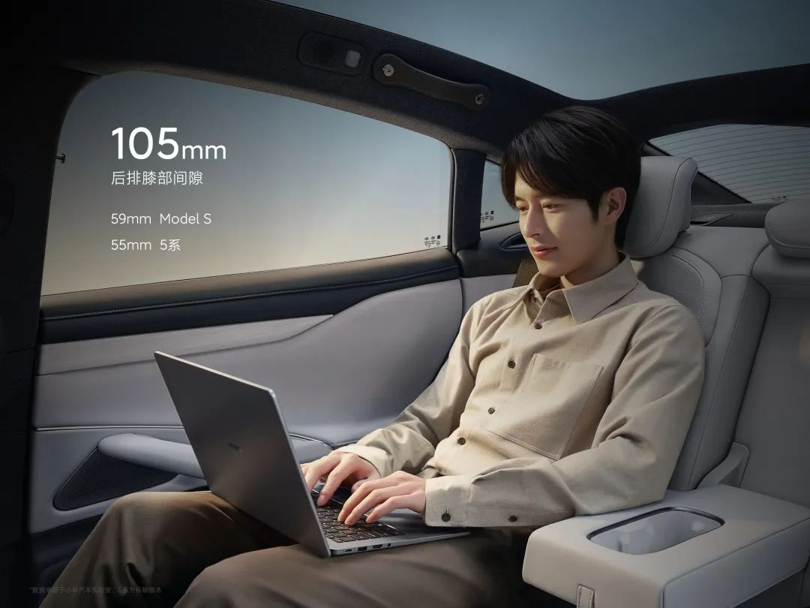

###   

##  _**40**_

### **小米汽车不公布价格是什么原因？有人说，是看到其他厂商的定价而犹豫，是这样吗？**

###   

###  答：当然不是。去年12月28日举办的是小米汽车技术发布会，我们主要聊技术，顺便讲了部分小米SU7的产品信息。关于小米SU7，还有不少内容，我们会等到正式产品发布会时跟大家详细介绍。

###   

### 现在汽车行业确实挺卷的，但小米是从小卷到大的，从来没怕过。**还是那句话，我们非常有信心，50万以内小米SU7没有对手。**

##  _**41**_

### **小米预研的35000转电机什么时候量产？会放在什么车型上？**

###   

###  答：电机技术是新能源车的核心技术，也是新能源领域的长期赛道。**小米在电机技术领域采用的是装配一代、量产一代、预研一代的策略。**

###   

###  发布会上我们展示的35000rpm转子，即为小米正在预研的下一代高性能电机的核心组成部分，其突破性的采用碳纤维激光缠绕转子技术，将进一步突破电机功率密度极限。目前该项目研发进度顺利，后续我们会和大家详细汇报相关进展。

###   

### 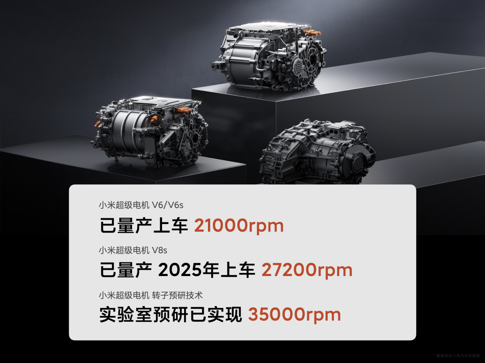

##  _**42**_

### **此前汽车媒体人亢岳视频中开的车是改装车还是量产车？和市售版差异大么？**

###   

###  答：亢岳测试的是搭载小米全自研电机V8s的测试车辆，这台车在标准的高环测试中轻松的突破了300+km/h的时速，达到了新能源车的性能巅峰。

###   

### 这台测试车辆与量产车除电机之外区别不大，同样搭载了小米自研摩德纳平台架构，300+km/h的极速也从侧面印证了小米SU7的平台性能潜力巨大。

##  _**43**_

### **风阻系数是不是智商税？只有赛车才有用？**

###   

###  答：风阻系数不是智商税，风阻就是科学，当车速达到一定程度，大量能耗都将消耗在对抗风阻上面，而降低风阻，就能显著降低能耗，举个例子，对新能源车来讲，风阻系数每降低10 count，行驶里程可以增加7-8km，同时降低风阻的同时风噪也会降低，可以提供更好的乘车舒适度。

###   

### 发布会上我们介绍了一个空气阻力公式，风阻系数是我们可以去努力降低的，**小米SU7在160km/h的时速下风阻系数为0.195，是全球量产轿车中的最强表现，** 将带来极低的能耗和出色的续航表现。

##  _**44**_

### **电动尾翼实际用处有多大？**

###   

###  答：小米SU7使用了大量在顶级性能车型中才会见到的空气动力学组件。其中电动尾翼就是小米SU7的主动空气动力学的核心组件。电动尾翼可以在高速驾驶中提供最多130公斤的下压力，提升整车动态极限，激烈驾驶中车身更稳定。

##  _**45**_

### **200+的速度一般人开不到，新能源车极速真的有用么？**

###   

###  答：所谓“新能源汽车极速不重要”是一个很大的误区，极速性能是汽车性能和品质的重要试金石。

###   

### 更高的转速带来加速性能和极速性能，同时高转速也为车辆在中高速下带来更好更宽裕的效率区间。我们除了关注极速，也应该注重电驱系统的能效。

###   

### 所以SU7 全轮驱动版，在0-100km/h 2.78s加速和265km/h极速的前提下，依然实现了800km公里的CLTC续航里程，充分证明了性能与效率可以兼得。

##  _**46**_

### **小米SU7有没有实打实的冬测成绩？**

###   

###  答：小米SU7在黑河进行了完整的冬测，取得了惊艳的冬季续航成绩，我们对做冬季续航之王信心满满。

###   

### 请大家相信小米在热管理系统上投入了非常多的开发，目前冬季测试还在进行中，我们会挖掘出更多的技术能力，等我们再优化优化，成绩一定会更优秀。这两天，我们披露了部分冬测中的实拍视频，大家可以观赏下。

###   

### 

##  _**47**_

### **目前汽车之家、懂车帝等各大平台上小米汽车的详细配置参数准确么？**

###   

###  答：距离小米SU7正式发布还有一段时间，现在各家媒体平台上关于小米SU7的参数配置均非最终版本，还请大家耐心等待小米SU7的正式发布。

##  _**48**_

### **发布会上讲了很多配置，小米汽车会不会只是个毛坯房，选配很多？**

###   

###  答：首先，肯定不是毛坯房。SU7是小米的第一款车，我们是按照“一步到位”的标准去做的，会把用户的体验放在第一位。同时，选装配置方面，肯定也会让米粉们满意。简单总结，就是**“标配厚道完善，选配丰俭由人。”**

##  _**49**_

### **小米SU7就只有标准****版和Max版本两个版本么？**

###   

###  答：通过之前工信部公示的信息，相信大家也发现了，小米SU7还有一个Pro版，关于这款车的具体信息，我们会在产品正式发布的时候向大家汇报，简单的透露一点就是，相比标准版，Pro版的各项表现会再提升一个台阶。

##  _**50**_

### **小米SU7标准版和MAX版在舒适配置上会有哪些差异？**

###   

###  答：小米SU7各版本之间存在配置差异，例如空气悬架、电动尾翼等等，具体配置请大家耐心等待小米SU7的正式发布。

##  _**51**_

### **小米SU7标准版和Max版在智能驾驶能力上会有什么区别？**

###   

###  答：**关于智驾，我们的目标很明确就是在2024年底进入行业第一梯队** ，小米SU7 Max配备激光雷达，所以在智驾方面会优先搭载更多前沿先进新功能，给了用户一个更进阶的选择，当然SU7标准版的智驾能力也已经非常强大，完全能够满足日常出行的需要，我们也会紧跟行业技术趋势，不断提升我们的智驾能力。

##  _**52**_

### **小米汽车会开放多少个城市NOA？**

###   

###  答：小米智能驾驶的目标是2024年底进入智能驾驶行业第一阵营。NOA是目前各品牌智能驾驶重点发力的核心方向之一，小米2024年在城市NOA数量上追齐行业第一梯队。

##  _**53**_

### **班戈和小米究竟是什么合作关系？**

###   

###  答：克里斯·班戈是全球最著名的十大汽车设计师之一，前宝马设计副总裁。也是“天使眼”和“火焰曲面”等经典设计的缔造者。班戈目前担任小米汽车设计顾问。未来班戈也将更多的参与到小米后续车型的设计工作当中。

###   

### 班戈对小米SU7的设计给出了高度评价，他认为“这是一台没有过度设计的车，一切都刚刚好”。

###   

### 

##  _**54**_

### **小米汽车后面会不会和第三方车企合作推出类似“智选”车？**

###   

###  答：我们没有这样的计划。从一开始，小米就决定要在设计、研发、制造等全链路全栈自研，由小米全资造车、风险自担。这不仅是小米all in造车的决心，更重要的是，**我们认为只有全资造车、全栈把控，才能把控好汽车每一个环节的品质与用户体验。**

##  _**55**_

### **小米澎湃OS车机系统会不会开放给第三方品牌使用？**

###   

###  答：小米澎湃OS是人车家全生态闭环的操作系统。以小米SU7为例，车辆的实时状态能够在车机端无延迟的展示；手机平板等设备能够和车机无缝流转均需要软件、硬件、生态等全面能力的加持。

###   

### 我们也预留了丰富的标准软硬件接口，欢迎第三方应用、生态配件等品牌加入到小米人车家全生态。

##  _**56**_

### **小米汽车的车机应用体验怎么样？**

###   

###  答：新能源汽车的智能体验，有很大比重来自于车机交互的流畅度和人性化程度，以及应用与服务生态的丰富、成熟程度。而这恰恰是我们最擅长的专业领域。我们的中控生态大屏在内的车内屏幕，可以直接应用小米的Pad应用生态，并有极其强大创新的手车互联交互体验。

###   

### 当然，Pad应用上车要保证体验，逐一筛选，体验达标才会适配上车。我们也做了大量的工作适配不同的工况，保障用户体验的完整度和流畅度，相信大家体验后都会有豁然开朗的感觉。

##  _**57**_

### **目前小米SU7车机应用都有哪些适配？**

###   

###  答：小米SU7车机拥有目前行业中最丰富的应用生态，5000+款小米平板应用将逐步适配车机。同时还可通过手机应用Pin到车机秒变原生应用。

###   

### 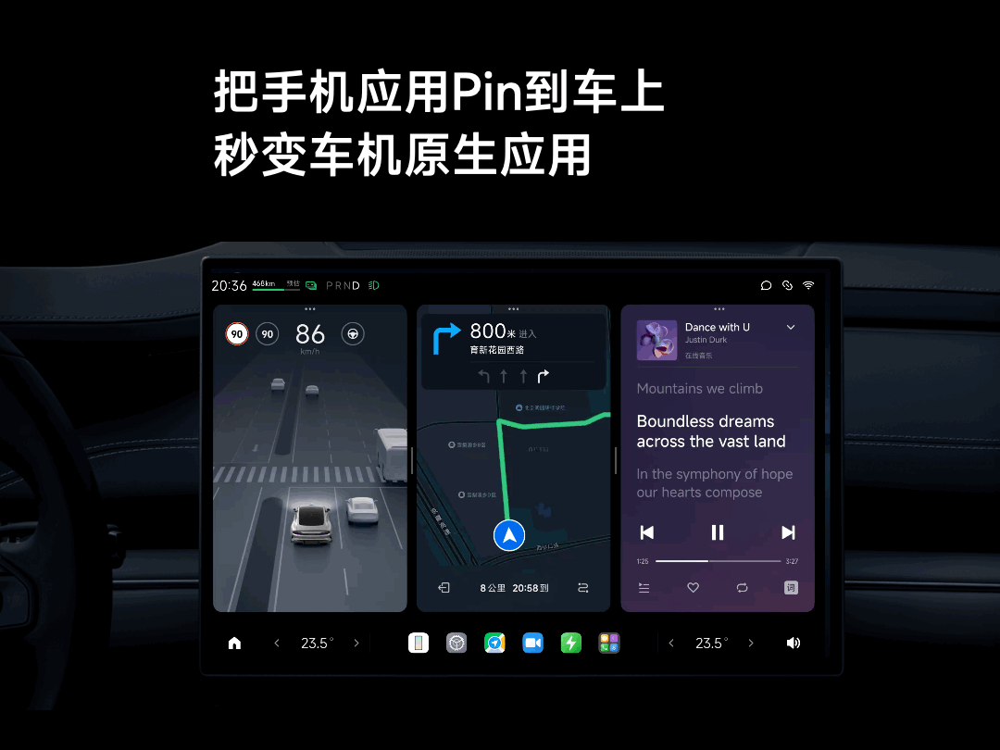

##  _**58**_

### **小米SU7预留的标准Pin点接口使用的什么通信协议？能否拓展视频接口等其他设备？**

###   

### 答：小米SU7预留了标准化的Pin点接口，也希望第三方品牌和开发者一同共建小米CarIoT生态，关于Pin点拓展性和CarIoT生态的详细内容，我们会在正式发布时和大家详细汇报。

##  _**59**_

### **小米SU7标准版是否标配HUD功能呢？**

###   

###  答：小米SU7各版本之间有配置差异，具体信息请大家耐心等待小米SU7的正式发布。

##  _**60**_

### **小米SU7的5屏联动包括哪5屏？是否均为标配？**

###   

###  答：小米SU7 MAX版本的五屏联动车机系统包含翻转仪表屏、HUD抬头显示、车机大屏和后排可拓展的2个平板屏幕。其中后排拓展屏幕非标配。

##  _**61**_

### **现在的小米CarWith还会更新么？小米汽车上哪些功能会下放到Carwith上？**

###   

###  答：小米CarWith一定会持续更新，我们的目标是尽可能让更多人享受到**「人车家全生态」体验。**

##  _**62**_

### **CTB电池维修成本高么？会不会车的寿命就等于电池寿命了？**

###   

###  答：小米SU7采用CTB一体化电池技术。相比传统方案拥有更高的电池体积效率，让新能源车的乘员舱空间得到进一步释放。与此同时CTB技术能够优化整车安全性，在扭转刚度、整车NVH等方面均有大幅提升。

###   

### 要特别说明的是CTB只是将电池仓上盖与乘员舱地板一体化，极端情况下维修仍可轻松拆卸电池包，保证高维修效率和低维修成本。

##  _**63**_

### **小米汽车CTB电池宣称体积效率77.8%是业内最高，但也有网友称某厂家宣称自研的电池体积效率达到80%以上，这是怎么回事？是小米吹牛吗？**

###   

###  答：小米汽车的CTB电池包，体积效率77.8%，是当下CTB方案电池中的天花板。问题中提到的友商电池并非采用CTB技术，直接对比这两项意义并不大。

###   

### 因为CTB技术集成了乘员舱地板，能够有效释放乘员舱空间，因此两种设计是不能通过单纯体积效率反映的。小米CTB一体化电池技术，也为车辆争取了更多竖向空间优化。

###   

### 如对比，需将含电池包＋乘员舱地板及相关子部件的整体体积效率进行统合计算。我们目前尚未进行过相关横向对比计算，日后可以请专业评测媒体进行实测衡量。

##  _**64**_

### **小米汽车产品对标保时捷特斯拉，售后服务对标谁？**

###   

###  答：进入汽车行业，我们对这个产业上的各个链路都保持着敬畏之心，其中，销服体系是我们最关注的环节之一，力争提供最安心贴心的服务。前几天在北京总部，我们与首批14家销服合作商正式签订了合作意向书，这意味着小米汽车新零售模式从规划阶段已进入实质落地阶段，有更进一步的规划我们也会及时向大家汇报。

##  _**65**_

### **小米会建立小米汽车4S店么？小米汽车售后维修是外包还是自己干？**

###   

###  答：小米汽车销服体系建设目前进展顺利，关于售后维修等相关政策我们会在合适的时机与大家汇报相关进展。

##  _**66**_

### **小米SU7什么时候开启预售或盲订？**

###   

###  答：目前小米官方尚未开启各种形式的预售活动，相关信息的进展，请大家关注小米汽车的官方账号。感谢大家对小米汽车的期待与厚爱，也提醒大家不要被各种虚假信息诈骗。

##  _**67**_

### **小米SU7什么时候会开放试乘试驾？**

###   

###  答：在小米SU7正式发布后，我们会尽快开放试乘试驾。我们非常有信心，很多朋友在试乘试驾后，都会把小米SU7视为心中的DreamCar。

##  _**68**_

### **雷总之前说3年时间试了100多辆车，这是真的么？具体试驾了哪些车？**

###   

###  答：是真的，大约试驾了150多辆车，并且做了大量试驾感受的笔记。如果大家感兴趣，我之后找机会分享。

##  _**69**_

### **小米汽车会请代言人吗？**

###   

###  答：没有这样的打算。

##  _**70**_

### **小米SU7什么时候正式发布？米粉节能不能开上小米汽车？今年的北京车展你们会参加吗？**

###   

###  答：目前小米汽车进展顺利，技术研发、产线爬坡、销服体系建设等所有项目均如期稳步进行。待一切准备就绪后，我们会通过官方渠道第一时间和大家公布正式发布时间。感谢大家对小米汽车的关注和对小米SU7的喜爱。北京车展的参展事宜，我们也在筹备中。

##  _**71**_

### **小米汽车的800V超级快充，充电效率实际表现到底怎么样？**

###   

###  答：小米SU7 Max采用小米自研800V碳化硅高压平台，**最高电压达到871V，是远超同级的真800V。**

###   

###  在800V超级快充加持下，小米SU7 Max充电5分钟续航增加220KM，充电15分钟续航可达510KM，20分钟内可将电量从10%充至80%。在续航和充电方面，大家完全不需要担心我们的实力。

###   

### 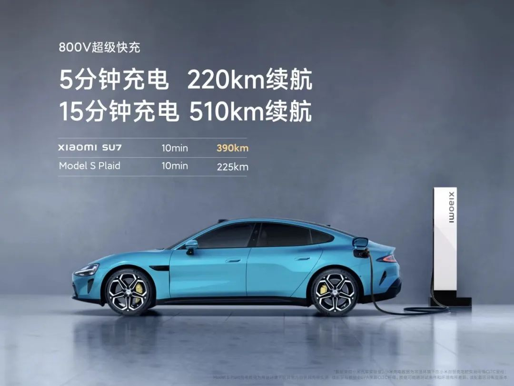

##  _**72**_

### **小米SU7的续航表现怎么样？真的能消除“里程焦虑”吗？**

###   

###  答：小米SU7 Max采用101kWh超大电池，CLTC续航可达800km，是目前市场上C级四驱轿车续航佼佼者。

###   

### 小米SU7标准版采用73.6kWh电池，CLTC续航也可达到668km，同样是非常出色的表现。

###   

### **我们的目标是实现用户“一周一充”，同时搭配小米汽车出色的极速充电技术，从此跟“里程焦虑”说再见。**

##  _**73**_

### **小米SU7风阻测试为什么是在160km/h时速下进行？这科学么？**

###   

###  答：目前国内并无统一的风阻系数时速测试标准。各家品牌会根据自身车辆性能和定位制定风阻测试企业标准，华为等企业也同样采用了160km/h的口径。

###   

### 小米SU7在时速160km/h下测得的认证风阻系数为0.195，在实测中我们甚至取得了低于0.19的成绩。**目前小米SU7是当之无愧的全球最低风阻量产轿车。**

##  _**74**_

### **小米汽车电池不是来自宁德时代么，为什么还要自建电池包工厂？**

###   

###  答：小米SU7采用CTB一体化电池技术，自建电池包工厂可以更好地实现电池包质量的自主管控和创新技术、结构，小米将持续地推动电池技术创新和生产创新。未来小米将持续和电池供应商一同联合研发相关技术，进一步提升电池安全性和突破电池效率。

##  _**75**_

### **小米汽车后续会有SU5么？网传小米后续还有增程车型是真的么？**

###   

###  答：我们目前聚焦在摩德纳平台的首车：小米SU7。我们决心十倍投入、认认真真造一辆好车，并打磨到极致。

###   

### **目 前没有SU5。在未来数年里，也没有增程车型。**

##  _**76**_

### **小米智能驾驶的自动代客泊车，算什么水平？**

###   

###  答：首先确认，小米智能驾驶有自动代客泊车功能。

###   

### 2022年，我们就首次展示了小米自动代客泊车技术，经过研发团队的不断完善，小米自动代客泊车技术也有了长足的进步。最近我们在东莞的7层网红立体停车楼中，进行了自动代客泊车的技术演示，复杂的停车场环境中小米SU7应对自如。感兴趣的同学可以看下视频。

###   

### （小米SU7停车楼自动代客泊车）​

##  _**77**_

### **小米SU7的加速性能是什么水平？**

###   

###  答：小米SU7 Max采用双电机四驱设计。**最大功率673马力，峰值扭矩838N·m，零百加速达2.78s** （加速成绩为减去起步响应时间成绩），超越保时捷Taycan Turbo，进入2s超跑俱乐部。

###   

### 不仅仅是加速能力出色，小米SU7的极速水平同样杰出，最高时速度265km/h。此前电车行业通常加速、极速不能兼得，但小米SU7证明了，这完全可以做到。

##  _**78**_

### **加速那么快，极速那么高，小米SU7的制动能力怎么样？**

###   

###  答：小米SU7 Max采用小米定制的brembo前四活塞制动卡钳，不仅加速快而且刹的稳，100km/h-0制动距离仅为33.3m，同级顶尖。小米SU7标准版百公里制动距离为35.5m，同样非常出色。

##  _**79**_

### **小米SU7怎么确保能刹得住、刹得稳呢？**

###   

###  答：为了保证小米SU7的刹车系统万无一失，我们采用了四重制动冗余策略：如果制动踏板卡滞，可以长按P挡减速制动；如果单个制动单元失灵，DPB与ESP可互为备份；如果DPB与ESP同时失效，仍然可以依靠传统机械液压正常制动。

###   

### 就算万一中的万一，极端小概率下，以上3重制动全部失效，小米超级电机的动能回收也是小米制动冗余的一层保障，最高0.36g的减速度可以让车辆快速制动。

##  _**80**_

### **小米SU7的整车结构安全性是什么水平？**

###   

###  答：小米SU7采用创新铠甲笼式钢铝混合车身设计，四大核心结构件全部加强。90.1%高强度钢和铝合金占比，2000MPa最高强度钢材，车身抗扭刚性超过51000N·m/deg。41项碰撞测试高标准通过，数据标准行业领先。

##  _**81**_

### **小米SU7会不会也只是“直道王，弯道亡”？有没有真实赛道成绩？**

###   

###  答：小米SU7前期已经在一些专业赛道上进行过了封闭测试，未来小米SU7 会驰骋在更多赛道上，后续我们将在合适的时机，陆续向大家汇报。

##  _**82**_

### **小米SU7运动性能突出，悬架会不会很硬不适合家用？**

###   

###  答：这个大家可以放心，基于全栈自研底盘控制算法，使得小米SU7不但拥有顶级的运动性能，同时也能提供优异的驾乘舒适度。基于智能感知算法，小米SU7能够最远探测150米路面情况，提前以1000次/秒的频率控制CDC减振器阻尼，配合500次/秒实时动态调节扭矩，从容应对减速带、路面湿滑等复杂的场景，实现穿越颠簸、如履平地。

##  _**83**_

### **小米SU7经过哪些碰撞测试？安全气囊配置怎么样？**

###   

###  答：我们内部进行了41项的碰撞测试，完全覆盖了C-NCAP2024、E-NCAP2023、C-IASI2023三大标准，三大标准下均取得最优等级成绩。甚至我们进行的很多测试都是超越现有碰撞标准的。例如追尾后碰国标是50km/h碰撞，我们采用的是超过现有最严格美国标准的90km/h 70%偏置碰撞。

###   

### 小米SU7配备7个安全气囊，包括2个2.04米超长侧气帘，保护前后排乘客。

##  _**84**_

### **小米SU7能不能和之前已经买过的小米智能生态设备联动？**

###   

###  答：小米SU7采用基于小米澎湃OS打造的小米智能座舱系统，目前已有超过1000+款小米智能生态设备可无感上车。小米SU7依托「人车家全生态」闭环的基础，打造先进的「移动智能空间」。

##  _**85**_

### **小米SU7的储物空间配置怎么样？**

###   

###  答：小米SU7行李厢总容积达到622L。其中前备箱容积达到105L，比同级的Model S和Taycan都要大，可能是目前中国市场上拥有最大前备箱的纯电轿车。后备厢容积517L，纵深达1136mm，可以轻松装下一家人的露营装备。

##  _**86**_

### **轮毂样式等是否可以选配？**

###   

###  答：之前工信部官网公示时，我们已经披露了19英寸、20英寸的选装方案，但全部方案目前还尚未全部最终确定，具体信息请大家耐心等待小米SU7的正式发布。

##  _**87**_

### **小米汽车标配什么轮胎？**

###   

###  答：小米SU7不同版本间配置会存在差异。大家放心，好马配好鞍，我们一定会给小米SU7“配一双好鞋”。

### 

  

##  _**88**_

### **小米汽车之前宣称“全身上下都是AI”，这是营销噱头吗？具体有什么意义？**

###   

###  答：AI不是营销噱头，而是先进的技术和生产力。当然，前提是AI技术和投入，“真干真强真先进”才行。

### 

###   

### 小米集团在AI方面从2016年就开始全力投入，因为，小米汽车在系统、材料、智驾、制造、结构等全方位都有AI技术的加持。**AI技术是智能汽车的核心竞争力，同时也是科技大厂的绝对优势。** 关于小米汽车上的AI技术加持具体情况，可点击链接查看：

### [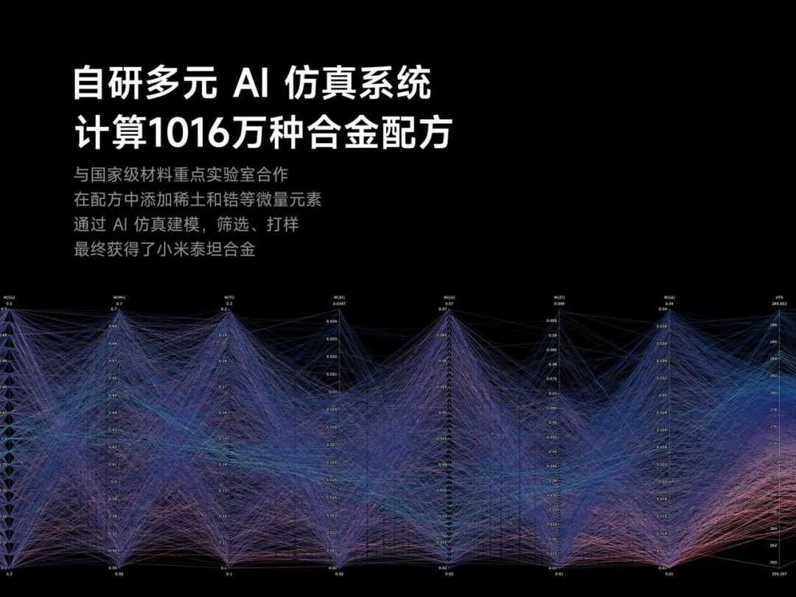](<http://mp.weixin.qq.com/s?__biz=MzkyNzU3MDI3Nw==&mid=2247485311&idx=1&sn=f22b821c3c7de9fedd93fa73a1707a48&chksm=c2274775f550ce6339acd76e6fff21e4dc58d96e2535b79959680a3ad56473db7c75b3766a12&scene=21#wechat_redirect>)

##  _**89**_

### **小米发布会上讲的热管理、安全性等等是否适用于标准版车型？**

###   

###  答：这个问题能看出大家对小米SU7标准版的配置和体验有很高期待，我想说的是，由于硬件配置差异，不同版本会有一些功能上的区别，但是我可以肯定的告诉大家，小米SU7不同版本的实际体验标准是高度拉齐的，这点请大家放心，而且小米的标准版向来是十分能打的。

##  _**90**_

### **到了夏天，小米的全景天窗能解决暴晒问题吗？**

###   

###  答：这一点我们非常有信心，拿出了业界领先的先进方案。小米SU7整车玻璃面积达到5.35㎡，视野非常通透。同时我们也做了非常出色的隔热防晒处理。顶部的全景天幕使用双层镀银工艺，紫外线隔绝率99.9%，红外线隔绝率99.1%。到了今年夏天，欢迎大家跟各类车型进行比较。

### 

  

##  _**91**_

### **小米智能驾驶研发进度怎么样？**

###   

###  答：智能驾驶是一个长期投入的技术，小米从一开始就决定智能驾驶全栈自研。第一期总投资33亿，目前已追加到47亿。小米智能驾驶团队规模已超1000人（未计入集团AI平台研发资源和工程师团队的支持），投入测试车辆超200台，目前测试里程已超过1000万公里。

### 

  

##  _**92**_

### **小米SU7有哪些驾驶模式？**

###   

###  答：小米SU7除传统的舒适、运动等模式以外，支持无限自由度的自定义驾驶模式。包括加速、转向、悬架高低、悬架阻尼、前后驱分配、动能回收等10大项调节，每一项都可精细调节。当所有参数组合起来可提供多达16.8亿种驾驶模式，这是在任何汽车上都不曾提供过的自由体验。

### 

  

##  _**93**_

### **小米会有官方的性能套件包么？会有更高性能的定制版么？**

###   

###  答：小米汽车摩德纳平台性能潜力巨大，我们在技术上也会追求小米SU7的性能充分释放。

###   

### 当然，我们也会基于上市后的用户反馈，考虑推出官方性能包，甚至是更高性能的定制版本，以充分满足用户对小米汽车的期待。

##  _**94**_

### **小米SU7量产车的首台车主会是谁？是不是就已经内定雷总了？**

###   

###  答：说真的，这个我们内部还真没有想过。

##  _**95**_

### **小米SU7为什么采用半隐藏式门把手？这样设计有什么好处？**

###   

###  答：由于风阻系数对新能源车型影响较大，故隐藏式门把手在新能源车设计中备受追捧，但同时隐藏式车门冬天雨雪冻住车门的情况也时有发生。小米SU7采用半隐藏式门把手，兼顾车身风阻设计的同时，更符合开门直觉，保持操作流畅自然，同时也杜绝了极端天气下车门冻住的窘境。

### 

  

##  _**96**_

### **小米SU7有电源外放功能吗？**

###   

###  答：小米SU7标配电源外放供电功能，能够提供丰富场景下的体验。详细配置我们将于正式发布时跟大家汇报。

### 

  

##  _**97**_

### **我们熟悉的“小爱同学”语音助手入驻小米汽车了吗？**

###   

###  答：小米SU7的智能语音由定制的小爱同学提供。请大家放心，小米汽车的智能语音控制无论在自由度、车辆互联深度、识别率、响应效率、AI大模型等全方位体验均为行业顶尖水平。

### 

  

##  _**98**_

### **小米SU7有什么机制保证用户隐私？车内私密信息不会泄露吧？**

###   

###  答：小米汽车拥有从底层到应用层、从单设备到跨端的全域安全保障。我们专门设计了多账号系统，账号“专人专用”，同时也设置了“临时用车”账号、匿名登录等模式保障车主隐私。即使车辆送修，在维保状态下，工作人员也无法查看用户的隐私数据。

###   

### 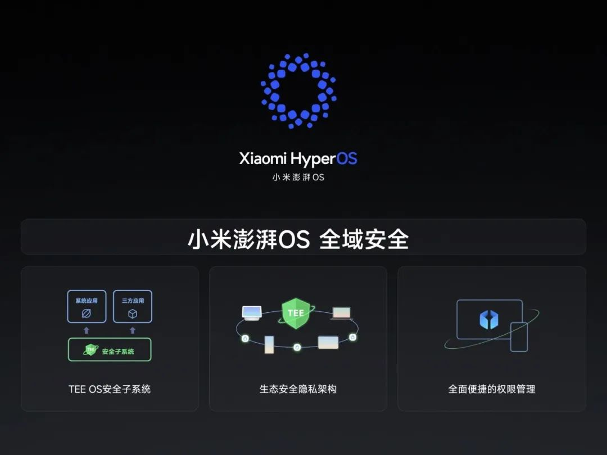

##  _**99**_

### **小米SU7的城市领航体验做得怎么样了？会跟随产品发布上市？**

###   

###  答：在技术发布会上我们播放了一段小米SU7在北京小米科技园附近的城市领航智能驾驶demo，我们特意挑选了雨雪天气后的晚高峰时段，在路面情况非常复杂的条件下进行测试。整个过程全程零接管，完整流畅度很高，像一位有经验的“老司机”在驾驶。详细情况可查看视频。

### 

###   

### 

###   

### 关于城市领航智能驾驶的相关进展，我们会在小米SU7正式发布时一并向大家汇报。

##  _**100**_

### **小米SU7内部有没有年销量目标？**

###   

###  答：基于我们的技术和产品力，**小米SU7的目标是做同级产品中的绝对爆品** ，对此我们充满信心。

##  _**101**_

### **小米入局时间短，三年干了别人十年干的事，这个真实吗？**

###   

###  答：小米汽车投入巨大，已投入超过100亿研发费用，聚集了3000多名全行业最优秀的工程师，其中有上千名技术专家，再加上小米整个研发体系的支撑。仅仅研发一辆车，这在行业中绝对是一个惊人的数字。

###   

### 智能电动汽车是汽车和消费电子的融合，小米过去13年在消费电子行业积累的大量技术和经验，和对软硬件融合的深刻认知，可以很好应用在智能电动汽车上。同时，过去10年，小米在智能汽车产业链上也有非常完善的布局，投资超过了100家相关的公司，其实并不是零基础出发的。

###   

### 此外，小米在系统、AI、智能制造方面也早有非常深入的投入和探索成果，这让小米对电动智能汽车发展方向的理解，以及形成先进的认知和技术积累，打下了深厚的基础。

###   

### 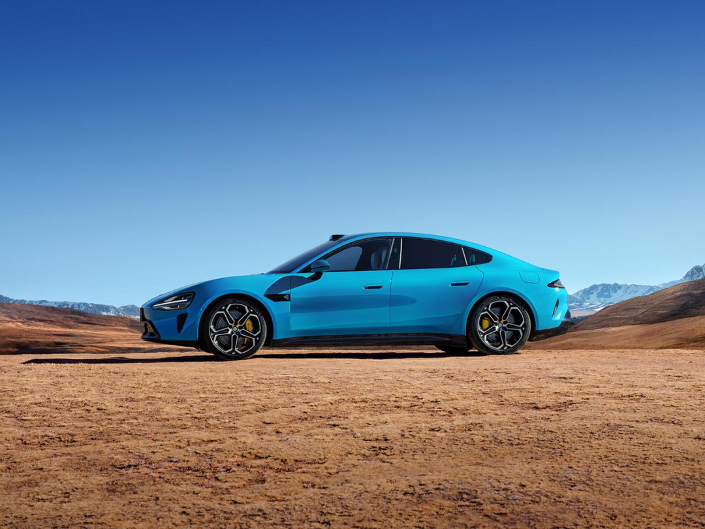

###   

### 附上小米汽车技术发布会视频完整版：

> 略

  

  

