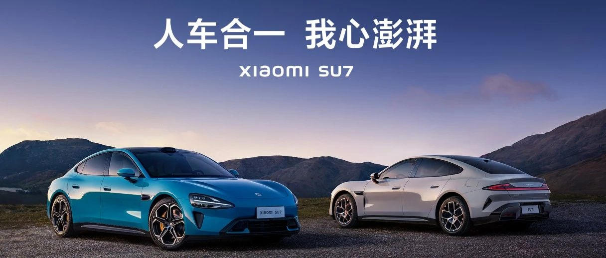
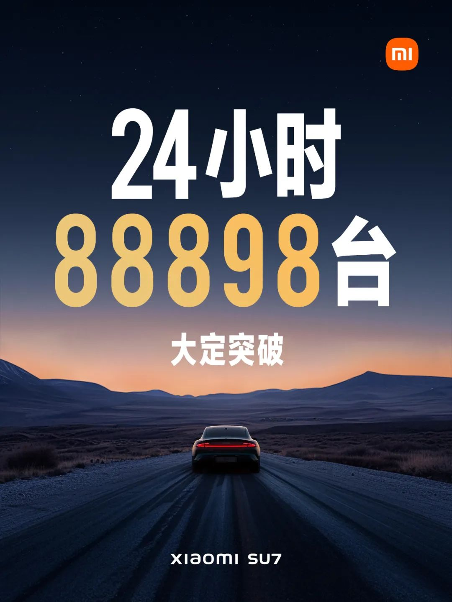
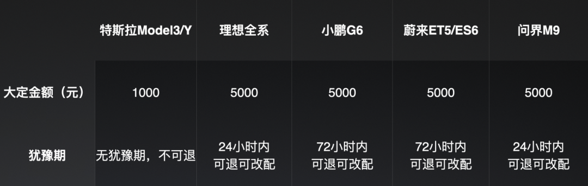
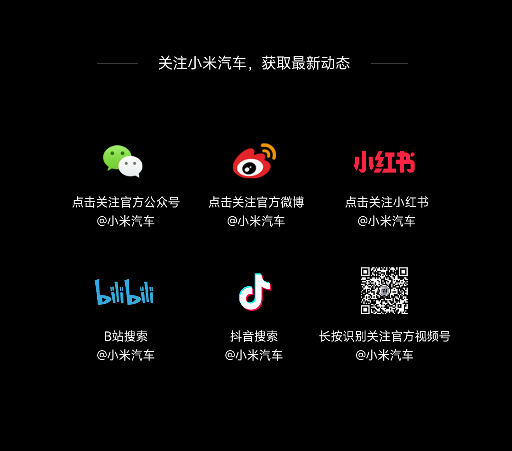

#  24小时大定88898台，大家关心的问题，我们集中解答

[ 小米汽车 ](<javascript:void\(0\);>)

______

## ****

上市24小时，大定突破88898台

非常感谢大家对小米SU7 的喜爱

试驾已在各地门店开启

诚邀你上车体验 

同时，大家对于小米SU7所关心的问题，

我们也将进行统一回答👇

  

  

  

## **01**

**小米SU7的大定为什么是7天可退？**

按行业惯例，大定一般都有犹豫期，从1-3天不等，在此期间可以退定也可以改配。一旦确认配置并锁单，车辆即进入生产。

考虑到小米SU7品鉴、试驾的预约量极大，同时，为了进一步保障用户权益，让大家有更充分的试驾体验和考量时间，我们将4月30日前的犹豫期延长至7天。

  

## **02**

## ****

**那为什么有用户反馈定金不可退？**

大定7天可退。但我们也提供了主动锁定配置的选择，一旦锁定配置也就意味着锁单完成，车辆将进入生产阶段，配置无法再次修改，这个时候定金是不可退的。截止3月29日中午12点，我们的客服体系，接到关于退单及改配需求，总计469例。

小米汽车APP购车流程中，关于主动锁单不可退，共计三次提示，并在最终「锁定配置」时直接弹窗提示。我们也在此希望大家理解，在锁定配置前，还请慎重选择。

## **03**

**支付定金，如何提前锁单？7天内如何正确退款？**

支付定金后，可登录小米汽车APP「我的」- 「订单」- 「车辆订单」- 「锁定配置」进行提前锁单；若您需要退款，可登录小米汽车APP 「我的」-「订单」-「车辆订单」中操作，7个工作日内定金原路退回。

  

## **04**

## **如果已经下定锁单，定单是否可以改名或权益转交他人？**

  

锁单后，下定人不可修改，权益随车不随单。  

## **05**

# ****

**门店每天接待试驾人数有多少，现在预约大约要等多久？**

目前试驾预约非常火爆。当前，我们门店预计试驾人数单店大约90-120人/天，现在预约大概等待3-5天。感谢大家的耐心与支持，还请大家多多理解。

  

## **06**

**这么火爆，现在下定多久能提车？产能跟得上吗？**

小米SU7创始版最早于4月3日开始交付。非创始版的小米SU7 与小米SU7 Max启动交付时间4月底开始，小米SU7 Pro启动交付时间5月底开始，具体可参照在APP选配时的预计提车周期。

目前的确定单持续火爆，我们的工厂正在全力以赴提高产能，并充分动员供应链伙伴全力保供。针对不同的车型、配置、颜色等，会有不同的提车周期，我们会基于调整后的生产情况更新至小米汽车APP和小程序中。

  

## **07**

**目前提供的金融服务有哪些？首付最低多少？**

## 

2024年6月30日前订购小米SU7可享受年费率最低2.5%优惠金融方案，首付最低15%，期限最长60期。

## **08**

**如果在订车时看到的交付时间内无法提车，是否会有相应补偿？**

基于目前火爆的定单，我们在全力拉动生产来进行对应。如果在展示的交付时间内因我方原因无法提车，我们会视情况制定相应的政策并及时公布。

  

## **09**

**我的城市没有交付中心，能否异地购车拖回本地上牌****？**

  

## 

对于异地上牌的用户，我们在交付中心办理提车手续时会协助办理异地临时牌照，方便用户可以开到所属地。

我们暂不支持交付中心到异地城市的送车上门服务，还请大家理解。

## **10**

**为什么黑色和白色需要加钱？黑白色免费，其他颜色收费，是不是更合理？**

12/28技术发布会后，大家对我们的海湾蓝、橄榄绿和雅灰反馈非常非常好，所以虽然这三个颜色成本也非常高，我们还是决定将它们免费给到大家。

我们希望每一台小米SU7都能成为街上一道靓丽的风景，所以精心打造了9个颜色，每一款都是从研制的数百个样漆中精心挑选的。

即使是最流行的黑白色，也不是普通的黑色和白色，我们也在珍珠白中加入了珍珠粉、在钻石黑中加入了金属粉，让最普遍的黑白也能呈现出远高于行业水平的质感。希望大家去我们的线下门店多多品鉴不同颜色。

  

## **11**

**小米SU7车模、不锈钢马克杯等小米Life周边什么时候补货？**

感谢大家对生态产品的喜爱，目前订单十分火爆，我们已连夜拉动工厂产能。新一批的产品已经在路上了，请您随时关注小米汽车APP商城。

## **12**

**4月30日之后再下定，还能享购车权益礼包吗？**

目前购车权益礼包仅针对4月30日前下大定的用户。4月30日后的购车权益请以后续官方通知为准。

## **13**

**第二批交付中心什么时候公布 ？**

根据米粉们对20个备选城市的评论数据，结合门店布局情况，我们精选了以下10城补充建设销售、服务门店：山东济南、江苏常州、江苏南通、浙江金华、广西南宁、吉林长春、贵州贵阳、广东珠海、福建泉州、湖北仙桃。以上10城，今年年内会陆续开业。

后续我们将继续及时增加其他城市门店，为大家提供更便捷的看车试驾体验。

  

## **14**

## **加装手机支架、实体按键等CarIoT，如果发生碰撞等意外情况，是否能保障安全？**

  

在小米SU7中控屏周圈和仪表台上安装的CarIoT设备，都是有螺纹安装口固定的，牢固性不用担心。

官方出品的CarIoT均通过长周期整车搭载性验证，含安全性、环境适应性、坚固性、NVH及密封性、可靠耐久性等 ，验证设备本身及设备对车辆影响，相比外部购买的配件更安心。  

此外，当副驾位有人乘坐时，建议行车过程中，不要在右侧1/4螺纹接口处安装手机支架等设备（右侧副驾驶位装有安全气囊）。

## **15**

**空气弹簧质保多久？**

  

空气弹簧质保60个月或10万公里里程。

我们为用户提供60个月或者行驶里程10万公里（以先到者为准）的整车质保权益（除了易损耗零部件），覆盖大家关注的悬架系统，包括弹簧（螺旋弹簧、扭杆弹簧、钢板弹簧、空气弹簧、液压弹簧等）、控制臂、连杆。详细质保政策可在小米汽车官网相关界面查询。

## **16**

## **小米SU7的能耗具体表现怎么样？**

  

小米SU7 一直把「长续航」作为最关键的产品目标之一，整车都做了低功耗的优化设计，拿出了非常出色的实际能耗表现，标准版CLTC最低能耗是12.3kWh/100km，小米SU7 Max的最低CLTC能耗是13.6kWh/100km。

正好今天就有媒体复验了我们的实际续航能力：在持续高速场景下，CLTC工况810km续航的小米SU7 Max，实际续航跑到了643公里（媒体测试至电量表显为0，实际上还可以继续行驶10多公里），续航保持率近80%。在高速高耗电的场景下，实际能耗15.7kWh/100km，这个成绩非常出色。

  

  

预览时标签不可点

修改于

微信扫一扫  
关注该公众号

继续滑动看下一个

轻触阅读原文

小米汽车 

向上滑动看下一个

[知道了](<javascript:;>)

微信扫一扫  
使用小程序

****

[取消](<javascript:void\(0\);>) [允许](<javascript:void\(0\);>)

****

[取消](<javascript:void\(0\);>) [允许](<javascript:void\(0\);>)

****

[取消](<javascript:void\(0\);>) [允许](<javascript:void\(0\);>)

× 分析

__

微信扫一扫可打开此内容，  
使用完整服务

： ， ， ， ， ， ， ， ， ， ， ， ， 。 视频 小程序 赞 ，轻点两下取消赞 在看 ，轻点两下取消在看 分享 留言 收藏 听过