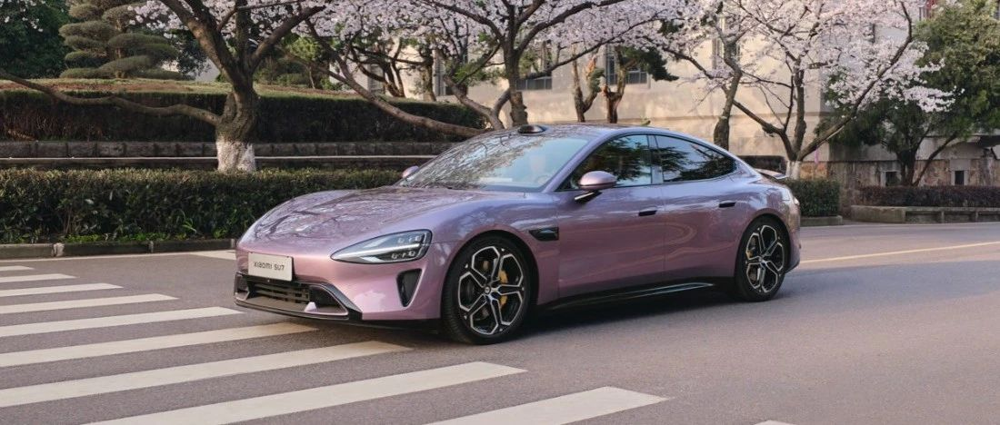

#  小米SU7答网友问（第九集）

## **01**

**小米SU7 命名有什么来由吗？**

SU，是 Speed Ultra 的缩写。高性能是小米的基因，小米SU7 的出色性能相信大家在看过那么多评测后已经不会有所质疑。至于如何念，我们内部也认真讨论过，最后大家都觉得，还是叫“苏七”，就像叫一个朋友的名字一样，更加亲切。

  

## **02**

**小米SU7 创始版方向盘上的专属编号铭牌，有网友说是贴纸，这是真的吗？**

专属铭牌是我们精心为创始版用户打造的。采用镍基镀铬金属板，编号则是用激光镭雕，质感非常好，当然不是贴纸。

为了给用户最大用车自由度，我们没有将编号激光镌刻于方向盘上，而是采用专属铭牌随车附送的方式，大家可在APP选择是否贴附。

  

## **03**

**小米SU7 保险费用和50多万油车接近，这是为什么？**

新能源车和燃油车商业险条款不同，新能源车专属《条款》既为“三电”系统提供保障，又全面涵盖新能源汽车行驶、停放、充电及作业的使用场景。且还会根据新车/旧车、品牌、车型、上户类型、险种、保额等多种因素综合计算，保费价格也不尽相同，不能简单只通过车价进行比较。

  

## **04**

**不采用小米官方合作保险，在提车时是否会被区别对待？**

小米提供官方合作保险服务，但用户可以自由选择保险公司，不会被区别对待。

  

## **05**

**小米SU7创始版为什么在APP上还是显示“待生产”状态？**

我们的交付同学正在紧锣密鼓地为大家的车辆协调发运资源，待车辆到达交付中心以后，大家就能看到自己的车辆状态更新了。

  

## **06**

**小米汽车APP是否有电子说明书，能提供快速功能查询？**

小米汽车APP中有电子说明书，车主或授权使用车辆的用户在激活车辆后，可以在小米汽车APP“【我的】→【服务】”里查看。

当然，遇到用车疑问时，问问小爱同学会更加方便直接。并且针对一些车控开关，使用小爱同学还能自动跳转到相应控制页，箭头高亮指示，操作直观方便。

  

## **07**

**小米智驾的代客泊车功能，支持跨越几层停车？**

小米的代客泊车功能支持创建最长2km的停车场路线，泊车路线的创建与长度有关，与地下停车场层数无关，即路线只要在2km以内，无论跨越几层皆可支持。

  

## **08**

**小米汽车APP是否支持在车外用手机控制进出车位？**

目前暂未支持，相关功能我们将在小米汽车APP后续升级中提供，敬请期待。

  

## **09**

**小米SU7标准版的智驾方案，后期可能升级支持城市NOA吗？**

小米SU7标准版不支持城市NOA功能。如您需要使用城市NOA，建议选择小米SU7 Pro 或 Max版。

  

## **10**

**小米SU7一键Boost，20秒扭矩峰值输出是否能连续使用？**

可以。小米SU7 Max版具备高效的热管理系统，搭载的小米超级电机V6s为全油冷却技术，小米CTB一体化电池具备双大面主动冷却技术，强大的冷却能力为持续的峰值输出提供了强大的支撑。

在媒体实测中，小米SU7 Max连续十次以上的一键Boost都未出现加速衰减的情况。

  

## **11**

**小米SU7设置了多少种车内模式？**

除了丰富的驾驶模式及相应的自定义能力，小米SU7还提供了应对多种特殊场景的功能设定组合。例如洗车模式、牵引模式、换胎模式、雨刮维护模式等。除此之外，还有保护车外隐私的“一键隐私”模式、最大化续航能力的“超级省电模式”等等。同时，更多的场景化模式与功能也即将通过OTA与用户见面。

  

## **12**

**在车上使用小爱同学的时候，车机、手机或平板会同时回答我吗？**

在车内呼唤小爱同学时，车载小爱会优先应答。这是因为小爱同学提供了智能“协同唤醒”功能，以达到最佳的用户体验。请确保您的手机已经更新到最新的Xiaomi HyperOS系统，同时手机小爱设置项中的“多设备协同唤醒”处于打开状态。

  

## **13**

**车机的内存和存储多大，屏幕刷新率多少？**

小米澎湃智能座舱，搭载骁龙8295旗舰座舱芯片，具备16GB运行内存、256GB存储空间。搭载先进的Xiaomi HyperOS系统，中控屏刷新率达60Hz，软硬件深度协同，车机操作更流畅，响应更顺滑。

  

## **14**

**所有CarIoT都是通过Pin点连接吗？**

大多数CarIoT都需要Pin点连接，比如中控屏四周的中控屏物理按键、拾音氛围灯、智能双表盘、无线充手机支架，都需要Pin点连接，从而为设备供电及通讯。当然，还有螺丝对生态件进行紧固，以确保安全性。

而智能香氛机-杯托版、多功能强光手电筒、车载K歌麦克风、儿童安全座椅等，均不需要Pin点进行供电及通讯。

我们将持续为大家提供更多的CarIoT车载智能设备，为大家的用车生活提供无限想象力。

  
