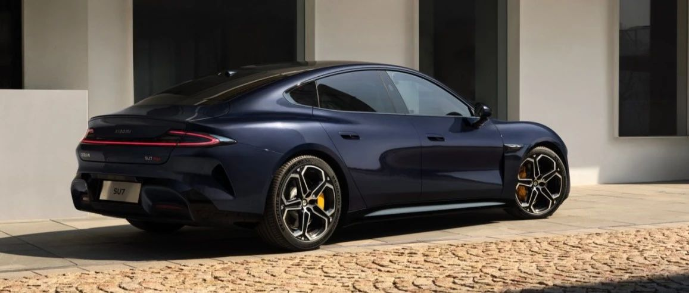

#  小米SU7答网友问（第十集）

[ 小米汽车 ](<javascript:void\(0\);>)

______

小米SU7答网友问  

持续进行中...

[小米SU7答网友问（第一集）](<http://mp.weixin.qq.com/s?__biz=MzkyNzU3MDI3Nw==&mid=2247486958&idx=1&sn=fa1835ddd2eee3bdafefcad5b74d2d94&chksm=c2274de4f550c4f28c7b9e54f1a6a8bcacc3459e88bbe256c362a899a36ca32c80be4f87c45a&scene=21#wechat_redirect>)

[小米SU7答网友问（第二集）](<http://mp.weixin.qq.com/s?__biz=MzkyNzU3MDI3Nw==&mid=2247487024&idx=1&sn=0c7cfca4d7c560dedf8062fa3a7230e3&chksm=c2274e3af550c72cdf2c4b04f2e6f3f66f10eac3634f77346b68be322d895dfb1398978ccbcf&scene=21#wechat_redirect>)

[小米SU7答网友问（第三集）](<http://mp.weixin.qq.com/s?__biz=MzkyNzU3MDI3Nw==&mid=2247487063&idx=2&sn=a0651af985a684e2379d3805947abc23&chksm=c2274e5df550c74b86d3871da393feb8fcadab0dfcdc8e77c806309341c89f1b37396b0e6318&scene=21#wechat_redirect>)

[小米SU7答网友问（第四集）](<http://mp.weixin.qq.com/s?__biz=MzkyNzU3MDI3Nw==&mid=2247487079&idx=1&sn=9cf62cd9e760babefdd444d29ee00b68&chksm=c2274e6df550c77b506f07fb315efff406bc12a55eba23c69b349cba973f61811d88fd0ade33&scene=21#wechat_redirect>)

[小米SU7答网友问（第五集）](<http://mp.weixin.qq.com/s?__biz=MzkyNzU3MDI3Nw==&mid=2247487101&idx=1&sn=9e00cc3239d1e6d9cb373f2efad42e3c&chksm=c2274e77f550c76157349d363d8e0c17ceadab29fae7538c156149e37c9c89e7cc22644201b2&scene=21#wechat_redirect>)

[小米SU7答网友问（第六集）](<http://mp.weixin.qq.com/s?__biz=MzkyNzU3MDI3Nw==&mid=2247487835&idx=2&sn=30cf8170af01397c46dc34cf495f7c02&chksm=c2275151f550d847fcc5d8d333c20a5d27d60276888d7192f51064f53e6fa738e21bf375ef29&scene=21#wechat_redirect>)

[小米SU7答网友问（第七集）](<http://mp.weixin.qq.com/s?__biz=MzkyNzU3MDI3Nw==&mid=2247487849&idx=1&sn=45b7ceae12489188c167129f3fb8b1a6&chksm=c2275163f550d87500cbacfac5ee05ea1b5083b97beb0d16e375b98480c98c823fbfdcc4d45a&scene=21#wechat_redirect>)

[小米SU7答网友问（第八集）](<http://mp.weixin.qq.com/s?__biz=MzkyNzU3MDI3Nw==&mid=2247487860&idx=1&sn=337ffc5a7972e5758d3208fb1eb7a28d&chksm=c227517ef550d86838d64b08036486d07a6ea303f0f8e2e9bb93b097750beeb6b2649b692ede&scene=21#wechat_redirect>)

[小米SU7答网友问（第九集）](<http://mp.weixin.qq.com/s?__biz=MzkyNzU3MDI3Nw==&mid=2247487868&idx=1&sn=8021638c108d845fab76580a6cc405e9&chksm=c2275176f550d86086dc3bcdbc3b4cf518b1ba41a294c3ad5d39504791907edcc6422b015131&scene=21#wechat_redirect>)

  

  

## **01**

**如何快速了解小米SU7的三个版本有啥区别、该怎么选？**

小米SU7 标准版 为「后驱 长续航 智驾版」，CLTC续航700km，零百加速5.28s，支持高速领航；

小米SU7 Pro 为「后驱 超长续航 高阶智驾版」，CLTC续航830km，零百加速5.7s，带激光雷达，支持城市领航；

小米SU7 Max为「高性能四驱 超长续航 高阶智驾版」，CLTC续航800km，零百加速2.78s，带激光雷达，支持城市领航；

当然，每款车在很多细节配置上也有所不同，详细的配置差异可以浏览小米汽车官网和小米汽车APP的完整参数配置表；具体体验上的差异可以预约到线下试驾来感受。

  

## **02**

**Max版三元锂电池是否建议每次都充满，会不会影响寿命？**

小米SU7 Max版的三元锂电池的质保和设计寿命都是按照每次满充的状态设计的，即使每次都充满电，电池使用寿命也无需担心。从材料特性上来说，三元锂电池最优电量使用区间为20%-80%，如有顾虑，建议长途出行充满，日常出行充电至90%及以下，可以在车机和小米汽车APP上方便地调节电池充电电量上限。

  

## **03**

**小米SU7电池设计寿命多少年或多少公里？**

小米SU7电池设计寿命是15年30万公里。所以在正常用车的情况下，您无需担心电池的使用寿命。我们在用车手册中，详细介绍了车辆保养的相关细节以及质保服务，也希望大家能够仔细阅读了解。

  

## **04**

**小米SU7前备箱有承重限制吗？**

为保障合理承重及行车体验，不建议在前备箱装载超过20kg的物品。

  

## **05**

**有用户反馈，在特斯拉充电桩出现了无法拔出充电枪的情况，这是什么原因？**

近期有用户在使用特斯拉交流家充桩，对小米SU7进行充电后，出现无法正常拔出充电枪的情况。我们通过客服联系到用户，已经核查清楚问题，情况如下：

通过分析，我们发现车辆在启动充电后，因用户所在社区电网的三相电压严重不平衡，导致车辆充电机系统（OBC）连续报错3次，同时进入充电保护机制，因此无法响应用户解锁指令。

因每个用户的社区电网电压平衡性不一致，后续我们也将通过OTA的方式，优化因报错而导致进入充电保护模式的运行机制。此外，如果用户充电枪出现解锁故障，可以使用应急解锁拉线进行解锁，操作如下：

首先在车机内点击“停止充电”后，开启后备厢，

使用合适的工具拆卸后备箱维修盖板，并找到解锁拉线开关，

向车头方向拉动充电枪应急解锁拉线，即可解锁充电枪，并正常取出。

  

## **06**

**小米SU7车机支持多少种音频、视频软件？**

目前车机原厂搭载的主流音频应用有网易云音乐、QQ音乐、酷狗音乐；视频应用有优酷视频、爱奇艺、腾讯视频、Bilibili、芒果TV、咪咕视频。

同时我们也将持续共享来自小米平板强大的“应用库”，继续补充影音类软件。除此之外，得益于小米SU7强大的手车互联能力，可以通过“一键PIN应用”将小米手机上的音视频等应用PIN到车机上使用。

简单来说，原生车机应用 + 平板应用拓展 + 一键PIN应用，三种方式融合，让小米SU7在车机上几乎不会受到应用的限制。

  

## **07**

**小爱同学车机能够识别车内多少音区，是否支持免唤醒？**

小米澎湃智能座舱采用行业领先的五音区语音交互，即使是后排中间位置的乘客呼唤“小爱同学”，小爱同学也能精准应答，不受后排左右乘客的干扰。而且支持各个音区唤醒的开闭、分区权限管理，涉及影响驾驶安全的语音指令，只有主驾说才生效。

目前的系统版本暂不支持免唤醒，后续将根据用户的反馈持续优化，以达到更好的语音交互体验。

  

## **08**

**小米SU7合金车模和小米Life不锈钢马克杯还会再次开售吗？**

首批开售的合金车模和金属马克杯非常受欢迎，我们正在紧急增加产能，已于今晚8点小米汽车APP商城再次开售。由于合金车模有大量手工制作工序，本次补货数量有限，也请大家理解。

  

## **09**

**提车时是否会有配件赠送？**

在4月30日24点前成功支付定金选购小米SU7的用户，除了发布会宣传的至高价值22000元的限时购车权益，以及至高价值26000元的小米智驾增强功能外，还可在车辆交付时，免费获得脚垫套装以及交付礼盒，包含NFC车钥匙卡套、车载U盘、Xiaomi Life 棒球帽。创始版用户还可额外获得创始版专属标识、专属编号证书、雷军签名版蓝牙钥匙。

  

## **10**

**如果运输过程中车辆发生了磕碰剐蹭漆面等问题，如何解决？**

当门店接车后，我们会对全车外观进行全面检查，如果遇到运输过程中剐蹭磕碰有损漆面等问题，在交付前小米工作人员一定会提前告知用户，积极沟通寻求处理方案，与用户达成一致后才会开启交车流程。

  

## **11**

**除了小米汽车，小米集团还有其他业务汽车业务吗？之前有传小米通过生态链和奇瑞合作，是真的吗？**

小米汽车是小米集团唯一的汽车业务。对于造车，我们充满敬畏、极度专注，小米也从没有通过生态链企业造车的安排。此前业内传闻的“智米与奇瑞造车”，并不属实。事实上是智米科技创始人苏峻个人与奇瑞合作的有关汽车业务，与小米集团、小米生态链完全无关；另据智米科技此前声明，也与智米科技无关。

  

  

预览时标签不可点

修改于

微信扫一扫  
关注该公众号

继续滑动看下一个

轻触阅读原文

小米汽车 

向上滑动看下一个

[知道了](<javascript:;>)

微信扫一扫  
使用小程序

****

[取消](<javascript:void\(0\);>) [允许](<javascript:void\(0\);>)

****

[取消](<javascript:void\(0\);>) [允许](<javascript:void\(0\);>)

****

[取消](<javascript:void\(0\);>) [允许](<javascript:void\(0\);>)

× 分析

__

微信扫一扫可打开此内容，  
使用完整服务

： ， ， ， ， ， ， ， ， ， ， ， ， 。 视频 小程序 赞 ，轻点两下取消赞 在看 ，轻点两下取消在看 分享 留言 收藏 听过