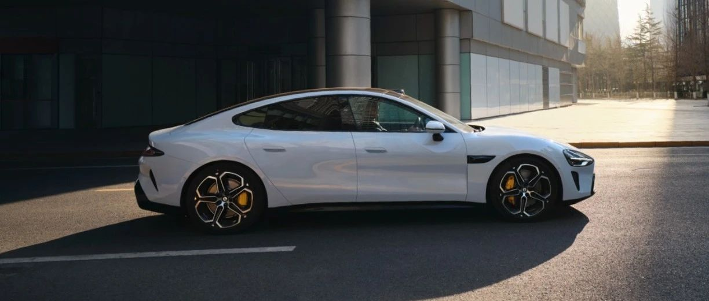
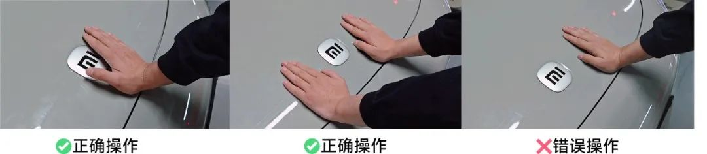

#  小米SU7答网友问（第十二集）

## **01**

**什么时候开始交付非创始版车型，现在的交付周期很长，会提拉吗？**

目前的定单量大大超出我们上市前的预期。因此，这段时间我们也在持续与供应链伙伴沟通提拉产能的事宜。

今天上午我们进行了小米SU7的供应链提产会议，几十个供应链伙伴企业参加了会议，我们与各位伙伴企业制定了新的产能提升计划，并将根据新的产能计划对预计交付周期进行测算。非创始版的小米SU7/小米SU7 Max，预计交付时间也会提前，将于4月下旬陆续启动交付，小米SU7 Pro则于5月下旬陆续启动交付。

对于创始版定单，我们正在全力攻关提升交付效率，会尽快将爱车交到您的手中。感谢大家对小米SU7的喜爱！

  

## **02**

**小米SU7是否支持为他人临时远程开锁，以及启动车辆？**

当然支持。当需要为他人临时远程开锁时，您可以打开小米汽车APP，在车辆页面点击“车锁”进行解锁；您也可以直接和手机上的小爱同学说“解锁车辆”，车辆即可自动解锁。

如果他人需要临时驾驶车辆，您可以在小米汽车APP车辆页面，下拉进入更多车控按钮，点击“启动”。他人即可在2分钟内踩制动踏板，以启动并驾驶车辆。他人用完车后，需要您通过小米汽车APP或手机小爱同学远程上锁，他人用车权限随即解除。

这样的设定很适合他人临时用车或请他人帮忙挪车的场景，非常方便。

（注意：使用手机小爱同学解锁/上锁时，需搭载Xiaomi HyperOS的手机，且将手机系统、小爱语音更新为最新版本）

  

## **03**

**我如何用方向盘按键唤醒小爱同学？**

您可以按下方向盘左侧滚轮，即可唤醒小爱同学。

  

## **04**

**车牌、人脸等信息都是经过模糊化处理的。如果车辆出现人为的损伤，是不是通过车机里面的录像还是能找到行为责任人的？**

出于对公共信息及隐私安全的考虑，只有通过小米汽车APP远程实时查看哨兵模式时，视频画面才会做模糊化处理。而在车机端查看时，哨兵模式录制的画面是完整未经模糊化处理的，以便于您查看必要的信息。

  

## **05**

**全系全域SiC碳化硅高压平台是什么意思，有什么优势？**

我们常说的IGBT/SiC是指代电驱控制器中的功率模块。是由一到多组功率芯片并联组成的开关器件。有以Si为材料的IGBT类型芯片，有以SiC为材料的MOSFET类型芯片（对，IGBT是半导体类型，SiC是指芯片材料）。功率模块负责电机驱动时将直流电转为交流电，能量回收时将交流电转换为直流电，所以它的效率对电动车至关重要。SiC MOSFET相比Si IGBT开关损耗小，效率更高。因为SiC的制造工艺难度高、生产周期长，得片率、良品率低，致使SiC的价格是Si的2～5倍。

全系全域SiC碳化硅高压平台，指的是小米SU7高低配不仅在驱动电机上都使用了SiC碳化硅功率模块，车载充电机（OBC）及热管理系统的空调压缩机这两个对能效要求极高的关键部件，同样都包含了碳化硅材料，以便实现更好的能效表现。全域碳化硅是小米SU7实现极致的整车低能耗的技术手段之一。

  

## **06**

**下坡辅助和舒适刹停有开关可以关掉吗？**

小米SU7配备智能全域坡道辅助功能，通过计算车辆行驶路面的坡度，进行智能化的坡道扭矩辅助，在正常坡道上实现车速稳定控制及缓降。目前小米SU7全系标配该功能，但我们接收到有部分用户不太习惯，希望可以手动关闭，我们也将在后续OTA版本中增加该功能的独立功能开关。

此外， CST舒适刹停功能为出厂默认开启，无法关闭。舒适刹停功能可以在城市日常减速制动中（减速度<0.5g)，带来平稳舒适的制动停车效果。但当出现紧急制动需求时，例如急减速、全力制动以及AEB制动时（减速度>0.5g)，舒适刹停功能将不会激活，从而确保拥有最佳的制动距离。

  

## **07**

**前备箱关闭的正确方式是什么？**

小米SU7前备箱盖无法凭自身重量锁止，正确且省力的关闭前备箱盖方法为：

1、缓慢降下前备箱盖，直到锁扣触碰锁体；

2、将双手或单手放在前备箱盖的最前端，或双手同时放在小米LOGO两侧区域，稳稳向下按压前备箱盖，当听到第一声“咔哒”声请继续向下按压，直至第二声“咔哒”声发出后停止按压动作，此时前盖已经达到全锁止状态；

3、检查前备箱盖前沿是否与前保缝隙齐平，如前备箱盖高于前保则前盖没有完全关闭，请重复按压前备箱盖确保其关闭。

  

  

## **08**

**Pro版能否加装尾翼调节实体按键？**

小米SU7 Pro版不能加装电动尾翼调节的实体按键。用户可以呼唤小爱同学（主驾位置）进行电动尾翼调节，比如“打开尾翼”、“尾翼调高点”、“尾翼调低点”等；用户也可在中控屏的“设置 - 驾驶偏好”页面，对电动尾翼开闭、角度进行调节。

  

## **09**

**小米SU7的车漆看起来非常亮，有什么特别之处吗？有人测试发现漆膜厚度不一致是什么原因？**

小米SU7采用行业领先的3C2B的涂装工艺，共计8层涂层，其中增加的中涂工艺，不仅让漆面漆膜更厚、视觉效果更好，还可以将UV的隔绝率从99%提升到99.9%左右，从而更好地保护电泳漆，抗氧化及防老化效果也有非常优秀的表现。

在8层漆面喷涂工艺的前提下，小米使用先进的杜尔7轴喷涂机器人，雾化器旋杯转速可达7万rpm，雾化效果让漆膜平整度更高。还拥有自研的中涂层打磨机器人，800目砂纸可打磨掉3-5μm漆层，再次有效提高漆面平整度，也让车辆的漆膜厚度控制在100到140μm之间；

通过用户自测漆面厚度的视频来看，我们猜测数据存在一定偏差，不排除有其他影响因素，我们也欢迎各家媒体到我们工厂进行实地参观，进一步了解小米的涂装工艺并实地检验。

  

## **10**

**网上有视频显示，可通过魔改升级车机硬件，这样是可行的吗？**

不可行，原车机硬件是经过了含安全性、环境适应性、坚固性、NVH及密封性、可靠耐久性等专业测试验证的，私自魔改将带来不确定的安全质量隐患并失去相应的质量保证（具体质保内容详见用户手册质量担保服务章节）。

  

## **11**

**小米SU7 Max可以下赛道么？**

我们强烈提示您，小米SU7 Max是城市用途的高性能豪华科技轿车，请勿轻易尝试专业赛道等极限驾驶。

小米SU7 Max 制动系统采用NAO摩擦片，此摩擦片适用于用户日常驾驶，是平衡了制动噪音和制动性能，且满足公共道路驾驶需求的主流产品。

NAO摩擦片除满足国标要求外，还满足针对制动性能的专项性能标准和性能验证：

• AMS性能，满载工况下10次连续100km/h-0全力制动后，百公里制动距离衰减<2m；

• 100km/h-0制动距离33.3m，处于行业领先水平；

• 模拟普通用户整车使用工况下，摩擦片磨损情况处于行业较好水平。

由于赛道工况下，车速高、动能累积大、制动急剧，持续高负载及高温下器件磨损速度急剧加快，所以对整车所有核心器件都提出了远超日常工况的要求。专业车手下赛道前，都需要对车辆进行系统级的专业整备。

赛道驾驶，无论对车手还是车辆都是最极限、最严苛的考验，需要对车辆专业知识以及专业驾驶有着深厚积累。我们再次呼吁，不要轻易尝试小米SU7赛道驾驶挑战，感谢大家的理解与支持。

  

  
