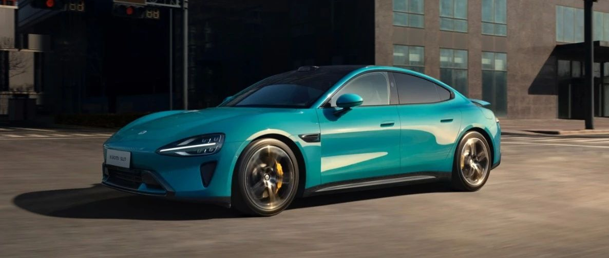
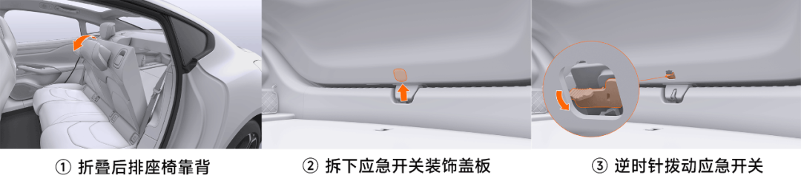
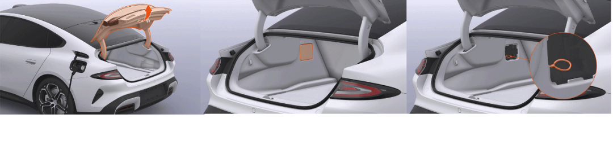

#  小米SU7答网友问（第十三集）

[ 小米汽车 ](<javascript:void\(0\);>)

______

小米SU7答网友问  

持续进行中...

[小米SU7答网友问（第一集）](<http://mp.weixin.qq.com/s?__biz=MzkyNzU3MDI3Nw==&mid=2247486958&idx=1&sn=fa1835ddd2eee3bdafefcad5b74d2d94&chksm=c2274de4f550c4f28c7b9e54f1a6a8bcacc3459e88bbe256c362a899a36ca32c80be4f87c45a&scene=21#wechat_redirect>)

[小米SU7答网友问（第二集）](<http://mp.weixin.qq.com/s?__biz=MzkyNzU3MDI3Nw==&mid=2247487024&idx=1&sn=0c7cfca4d7c560dedf8062fa3a7230e3&chksm=c2274e3af550c72cdf2c4b04f2e6f3f66f10eac3634f77346b68be322d895dfb1398978ccbcf&scene=21#wechat_redirect>)

[小米SU7答网友问（第三集）](<http://mp.weixin.qq.com/s?__biz=MzkyNzU3MDI3Nw==&mid=2247487063&idx=2&sn=a0651af985a684e2379d3805947abc23&chksm=c2274e5df550c74b86d3871da393feb8fcadab0dfcdc8e77c806309341c89f1b37396b0e6318&scene=21#wechat_redirect>)

[小米SU7答网友问（第四集）](<http://mp.weixin.qq.com/s?__biz=MzkyNzU3MDI3Nw==&mid=2247487079&idx=1&sn=9cf62cd9e760babefdd444d29ee00b68&chksm=c2274e6df550c77b506f07fb315efff406bc12a55eba23c69b349cba973f61811d88fd0ade33&scene=21#wechat_redirect>)

[小米SU7答网友问（第五集）](<http://mp.weixin.qq.com/s?__biz=MzkyNzU3MDI3Nw==&mid=2247487101&idx=1&sn=9e00cc3239d1e6d9cb373f2efad42e3c&chksm=c2274e77f550c76157349d363d8e0c17ceadab29fae7538c156149e37c9c89e7cc22644201b2&scene=21#wechat_redirect>)

[小米SU7答网友问（第六集）](<http://mp.weixin.qq.com/s?__biz=MzkyNzU3MDI3Nw==&mid=2247487835&idx=2&sn=30cf8170af01397c46dc34cf495f7c02&chksm=c2275151f550d847fcc5d8d333c20a5d27d60276888d7192f51064f53e6fa738e21bf375ef29&scene=21#wechat_redirect>)

[小米SU7答网友问（第七集）](<http://mp.weixin.qq.com/s?__biz=MzkyNzU3MDI3Nw==&mid=2247487849&idx=1&sn=45b7ceae12489188c167129f3fb8b1a6&chksm=c2275163f550d87500cbacfac5ee05ea1b5083b97beb0d16e375b98480c98c823fbfdcc4d45a&scene=21#wechat_redirect>)

[小米SU7答网友问（第八集）](<http://mp.weixin.qq.com/s?__biz=MzkyNzU3MDI3Nw==&mid=2247487860&idx=1&sn=337ffc5a7972e5758d3208fb1eb7a28d&chksm=c227517ef550d86838d64b08036486d07a6ea303f0f8e2e9bb93b097750beeb6b2649b692ede&scene=21#wechat_redirect>)

[小米SU7答网友问（第九集）](<http://mp.weixin.qq.com/s?__biz=MzkyNzU3MDI3Nw==&mid=2247487868&idx=1&sn=8021638c108d845fab76580a6cc405e9&chksm=c2275176f550d86086dc3bcdbc3b4cf518b1ba41a294c3ad5d39504791907edcc6422b015131&scene=21#wechat_redirect>)

[小米SU7答网友问（第十集）](<http://mp.weixin.qq.com/s?__biz=MzkyNzU3MDI3Nw==&mid=2247487890&idx=1&sn=47696df25bbc82e7c5aea71ccd30030e&chksm=c2275198f550d88e577cf942e5f0b4a7a6a21cc2cec4b0f04562b6acaa878177be8d8f2507b9&scene=21#wechat_redirect>)

[小米SU7答网友问（第十一集）](<http://mp.weixin.qq.com/s?__biz=MzkyNzU3MDI3Nw==&mid=2247487900&idx=1&sn=7765954b27cc8772008540f91ca7224d&chksm=c2275196f550d8807e8be4cee38e091559c454cfc8bed3e843d4e425f4b002ee0cb931c883d8&scene=21#wechat_redirect>)

[小米SU7答网友问（第十二集）](<http://mp.weixin.qq.com/s?__biz=MzkyNzU3MDI3Nw==&mid=2247487915&idx=1&sn=abbebbb9cbe0668b66a9c1026b12932f&chksm=c22751a1f550d8b73c8ad64a95a0158ef65c19c0becad656d616125a396dc6b4c6703e97f967&scene=21#wechat_redirect>)

  

## **01**

**小米SU7 Pro车型可选装电动尾翼，为什么不能选装物理按键？**

小米SU7 Pro 因默认并未标配电动尾翼和空气悬架，初期产品设计在中控台只保留了空调温度及风量调整两个物理按键。近期我们了解到广大小米SU7 Pro用户，在选装电动尾翼后，希望能够增加调节电动尾翼的物理按键。小米汽车产品团队经过多轮省慎讨论，并进行排产验证后，现作出如下调整：小米SU7 Pro车型，可选装电动尾翼，选装后即在中控台配备四个物理按键，支持调节电动尾翼。这一产品调整在小米SU7 Pro首批交付即可兑现。同时，4月30日之前下定小米SU7 Pro版本的用户，免费送电动尾翼，交付时同步配备四个物理按键。

从小米公司成立之初，就一直坚定与用户交朋友，秉承「参与感」的信条。“闭门造车”无法造出用户满意的完美产品，期待大家持续给予我们建议，我们一定会认真倾听。

## **02**

**能否自主调节方向盘转向反馈力度，还是只能跟随驾驶模式？**

在“舒适”“运动”“运动+”，这些固定的驾驶模式下有出厂预设的转向手感，不支持单独调节；

在“M1”“M2”自定义驾驶模式菜单中，驾驶者可以根据自己的喜好，灵活选择轻、中、重的转向手感。

  

## **03**

**小米SU7有车内摄像头吗，能否关闭不让拍摄以保护隐私？**

在方向盘和仪表屏之间有一颗用于检测驾驶员状态的摄像头。当检测到驾驶员闭眼、扭头、哈欠、使用手机接打电话等疲劳或分心行为时，系统会通过语音播报、中控屏弹窗等形式，提醒驾驶员注意安全驾驶。

该系统仅在车机本地进行行为判断和提醒，图像数据不会记录或对外传输，充分保护用户的隐私安全。

当然，如果您不需要驾驶员疲劳/分心提醒功能的话，可以在中控屏的“设置-驾驶偏好”菜单内将其关闭。甚至您也可以在车机的权限管理中直接将摄像头关闭。

  

## **04**

**设置中的超级省电模式具体有什么作用，何时会触发？**

超级省电模式是指车辆通过关闭智驾辅助功能、关闭或限制空调、座椅加热等舒适性功能、限制最高车速和整车加速性能，以达到降低整车功耗，增加更多续航里程。

在车辆预估续航里程低于50km时，中控屏会弹出相关设置项弹窗及说明，此时您可选择是否开启超级省电模式；同时您也可以在驾驶过程中的任意时刻主动开启或关闭超级省电模式。请在中控屏下方控制栏打开设置，进入驾驶偏好>超级省电模式，点击开启或关闭该功能。

超级省电模式开启后，以下车辆功能将受到限制：

  * 最大车速限制90km/h；

  * 系统设置单独的经济性动力响应，控制更平缓的扭矩输出；

  * 空调性能受限（风量降低、功率降低）；

  * 关闭方向盘加热功能；

  * 关闭座椅加热和座椅通风等舒适性功能；

  * 关闭氛围灯；

  * 关闭外后视镜加热和后风窗加热；

  * 智能辅助行车功能和智能辅助泊车功能关闭；

  * 关闭娱乐、生态服务功能、关闭哨兵模式；

  * 车载12V直流取电口断开；

  * 关闭电动尾翼控制；

  * 关闭车载智能冰箱。

当车辆通过中控屏弹窗开启超级省电模式后，在车辆充电预估里程大于300km后会自动退出超级省电模式。开启超级省电模式后，应对短时超车时，您仍可以深踩加速踏板进行短暂车速提升。

## **05**

**小米SU7标准胎压bar，比标准值低或者高有什么影响？**

小米SU7综合考量了行驶能耗、性能表现等多方面需求，制定了2.9bar的设计胎压，推荐用户定期（如一个月）按照冷态充气压力2.9bar调整胎压。

胎压不足或过高，也会对车辆行驶带来一定影响。例如胎压过高，会降低轮胎的滚动阻力、提升轮胎的承载能力以及抗冲击能力；此外，也会导致轮胎整体变硬，行驶起来路感更强。

反之胎压过低，会让轮胎的滚动阻力变大，轮胎的承载能力以及抗冲击能力变弱；同时，会让轮胎整体变软，让整车的乘坐舒适性更好。

  

## **06**

**小米SU7刹车踏板与卡钳活塞没有物理连接，这种设计是因为什么，有什么优势？**

小米SU7搭载博世全球首发的DPB+ESP10.0全解耦制动系统，具有以下4点优势：

相比传统机械真空制动系统，DPB全解耦制动系统可实现更快的建压速度，可有效缩短制动距离，助力小米SU7 Max版100km/h-0制动33.3m的优异性能。

DPB和ESP双建压模块的设计可互为冗余，结合动能回收可实现四重制动冗余功能，最大限度消除刹车失灵风险，可满足L4级别自动驾驶的安全冗余，给未来辅助驾驶系统的升级打下基础；

DPB全解耦制动系统在极限工况（如紧急制动）下，制动踏板不会传来因ABS工作或制动主缸压力波动导致的踏板反馈力度波动，可以给驾驶者提供更强的制动信心，保证安全性；

DPB全解耦制动系统可更有效地结合电机动能回收和机械液压制动，在日常驾驶中即便关闭动能回收，驾驶员踩下制动踏板时，车辆仍优先使用动能回收进行减速，可有效提高车辆的续航里程。

  

## **07**

**能否在自动泊车过程中，完全放心交给车辆操作，驾驶员完全不关注？**

现阶段智能驾驶皆为辅助驾驶，在使用智能泊车辅助APA及代客泊车辅助AVP功能时，驾驶员仍需观察周边环境情况，如遇特殊情况需随时进行接管。

## **08**

**可以设定自动泊车、AVP代客泊车的速度上限吗？**

目前不支持设定智能泊车辅助APA与代客泊车辅助AVP的速度上限。

  

## **09**

**内部有无应急机械开启后备厢的方式？**

如遇紧急情况，您可以从内部使用机械方式开启后备厢，具体操作如下：

  * 折叠后排座椅靠背，进入后备厢；

  * 拆下后备厢应急开关装饰盖板；

  * 逆时针拨动后备厢应急开关并向外推动，打开后备厢。

## **10**

**如果充电枪解锁功能出现故障，怎么紧急拔线？**

如果用户充电枪出现解锁故障，可以使用应急解锁拉线进行解锁，操作如下：

  * 首先在车机内点击“停止充电”后，开启后备厢；

  * 使用合适的工具（用手也行）拆卸后备厢维修盖板，并找到解锁拉线开关；

  * 向车头方向拉动充电枪应急解锁拉线，即可解锁充电枪，并正常取出。

  

预览时标签不可点

微信扫一扫  
关注该公众号

继续滑动看下一个

轻触阅读原文

小米汽车 

向上滑动看下一个

[知道了](<javascript:;>)

微信扫一扫  
使用小程序

****

[取消](<javascript:void\(0\);>) [允许](<javascript:void\(0\);>)

****

[取消](<javascript:void\(0\);>) [允许](<javascript:void\(0\);>)

****

[取消](<javascript:void\(0\);>) [允许](<javascript:void\(0\);>)

× 分析

__

微信扫一扫可打开此内容，  
使用完整服务

： ， ， ， ， ， ， ， ， ， ， ， ， 。 视频 小程序 赞 ，轻点两下取消赞 在看 ，轻点两下取消在看 分享 留言 收藏 听过