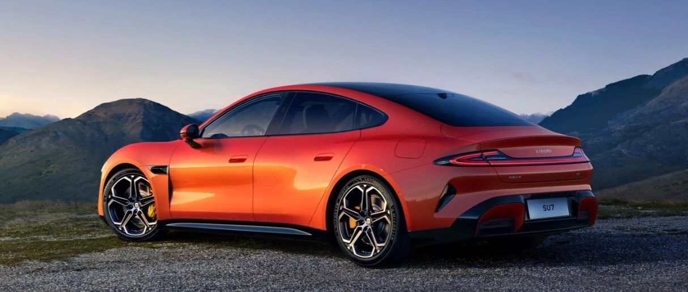
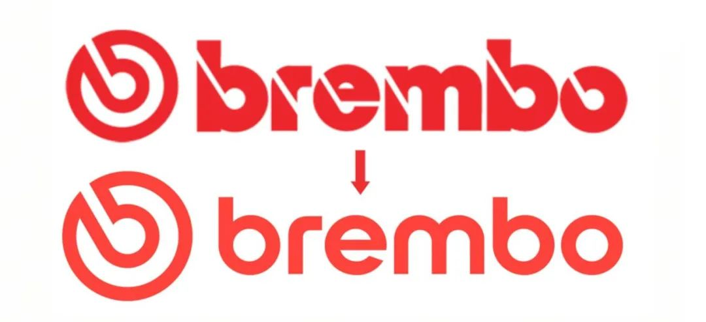
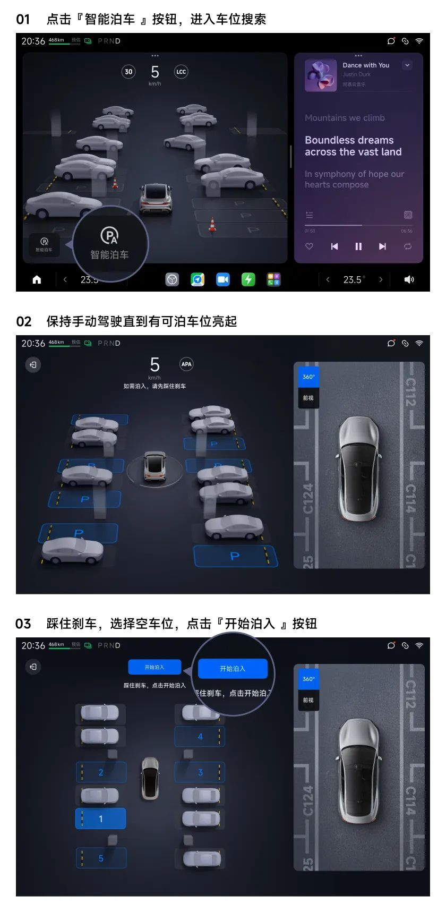

#  小米SU7答网友问（第十四集）

## **01**

**网上有人问小米SU7 Max刹车片面积是否足够大，能说明下吗？**

我们关注到今天网上流传了一组疑似小米SU7 Max刹车片的对比图，该组图将小米SU7 Max的前置制动卡钳与后置刹车片放在一起对比，陈述为“刹车皮面积感人”，**这本身就是一种错配的对比，事实上产生了信息误导。**

众所周知，前制动系统对刹车性能起到至关重要的作用，所以我们给小米SU7 Max配备了一套布雷博高性能四活塞固定卡钳。采用NAO刹车片，兼顾制动性能与舒适体验，并且**前刹车片有效接触面积相比豪华一线品牌的同级运动轿车更大，制动性和耐久性更佳。**

同时，小米SU7全系采用DPB+ESP10.0的制动系统，其中Max版本可通过电机能量回收，提供的最大减速度为-0.36g。对电动车来说，优异的动能回收系统能给予刹车片极大的负载缓冲，在日常使用中能够提供更长久耐用的使用体验。

在近期的媒体实测中，我们也看到小米SU7 Max呈现了非常出众的连续极限制动性能。在连续10次100km/h-0制动测试中，并未出现异常衰减现象。

我们非常感谢大家对我们的严苛要求，也实际证明了整车的制动性能。我们也再次重申，小米SU7 Max是为城市场景打造的高性能豪华科技轿车。而最严苛、最极限的赛道工况，需要对车辆进行重新整备，切勿直接原厂上赛道，我们也强烈不建议普通用户轻易尝试赛道等极限激烈驾驶。

## **02**

**布雷博brembo卡钳字体样式与以往不同，产品有什么区别吗？**

2022年10月25日起，布雷博发布了全新视觉形象和品牌标识，展现出布雷博的战略愿景：将能量转化为灵感。

小米SU7是国内最先采用换标后“brembo”新品牌标识的系列车型。布雷博作为全球一流的高性能制动器生产厂商，助力小米SU7 Max为大家提供高品质的制动性能，带来100km/h-0制动距离33.3米的优异表现。

## **03**

**小米SU7前次路程中的设置，下次上车会自动延续吗？**

小米SU7的绝大多数车辆设置都支持随车随账号记忆。

举一个舒适性设置相关的简单例子：如果前次路程开启空调、温度设定23℃、AUTO模式，那么下次上车时会保持前次的状态。同理，前排座椅的通风加热、方向盘加热，也会延续和前次用车同样的状态。

  

## **04**

**是否支持手机靠近车辆无感解锁，是否需要特定手机？软件需要在后台常开吗？**

开通并激活手机蓝牙钥匙之后，可实现拉门解锁：即携带手机靠近车辆时，拉开车门即可解锁。也可实现靠近车辆解锁/闭锁，当在车机“设置”-“门窗锁”页面开启此功能后，携带手机靠近车辆时，即可实现无感解锁；携带手机远离车辆时，车辆自动闭锁，同时可看到车辆闪灯并听到鸣笛提醒。

此功能并不需要特定品牌手机。但受限于各家手机品牌的内存限制及性能策略，小米汽车APP进程可能被系统结束运行，导致解锁失败。如果出现手机蓝牙钥匙解闭锁失败的情况，请确保小米汽车APP在前台或后台运行。

若您的设备是小米手机，建议您打开小米汽车APP，进入“钥匙与安全”，点击蓝牙钥匙卡片内的 “靠近自动解锁不稳定？去设置” ，然后勾选“无限制”，以提升无感解闭锁成功率。

  

## **05**

**智能泊车辅助应该如何开启？有什么注意事项？**

当车速低于15km/h时，中控屏智驾卡片左下角会显示智能泊车辅助功能入口：

  * 第一步：点击智能泊车入口图标  
第二步：保持手动驾驶直到找到空车位，踩下制动踏板

  * 第三步：在中控屏上选择想要泊入的空车位

  * 第四步：点击“开始泊入”按键，松开刹车和方向盘，听到“开始泊车了，请注意周围环境安全”，表示系统开始控制车辆

  * 第五步：系统完成泊入，并自动挂入P挡

需要注意的是：

  * 智能泊车辅助等辅助驾驶功能，无法完全取代驾驶员的目视检查，驾驶员依然是驾驶主体，并对车辆行驶过程中的行为负责，具体通过小米汽车APP或车机智驾功能设置页中的“智驾学堂”，或用户手册均可查看。

  * 部分车主喜提新车后，会在外后视镜处绑红绸带，或将“新手司机贴”贴在车身雷达上。在此温馨提示，遮挡车辆传感器（摄像头或雷达），会影响辅助驾驶的安全性，建议使用辅助驾驶功能前，做好传感器状态检查。

## **06**

**小米SU7全系都支持杜比全景声吗？有什么内容资源支持？**

小米SU7 Max标配25个扬声器（包含2个头枕音响），搭载7.1.4音响系统，更有杜比全景声；

小米SU7、小米SU7 Pro标配10个扬声器（包含2个头枕音响），可选装25扬声器，从而支持7.1.4系统、杜比全景声。2024年4月30日前大定小米SU7及小米SU7 Pro，均享受免费赠送25扬声器豪华音响的权益。

小米SU7车机搭载了丰富的在线音视频应用，其中爱奇艺有杜比全景声专区，酷狗音乐的高品质专区也有杜比全景声资源。

  

## **07**

**小米SU7 Max的HUD显示内容信息，可否根据个人喜好选择？**

您可以选择系统预设好的两种主题模式：标准主题可显示车速限速、智驾状态、地图导航、电量续航等信息；简洁主题可显示车速、限速及简要的导航信息。

后续我们也将根据用户的反馈，通过OTA持续优化HUD的使用体验，欢迎用户朋友提出宝贵意见。

  

## **08**

**车辆断电后，车内冰箱还能继续工作吗？**

可以断电持续工作。您可以在车载智能冰箱的设置页面，开启“离车持续工作”并选择工作时长，最长可设置为24小时。这样可以确保您在下次上车时无需等待即可享受到冰爽的饮品。您也可以在小米汽车APP中提前开闭冰箱、调节温度。夏天马上到了，助您清凉一夏。

  

## **09**

**小米SU7的方向盘脱手检测，需要行驶一定时间动一动方向盘吗？**

小米SU7全系标配电容方向盘，依据电容感应原理，通过检测驾驶员与方向盘上的感应层形成的电容回路变化，来判断驾驶员的手是否在方向盘上。所以，只要驾驶员手握方向盘即可满足脱手检测。相比“行驶一段时间就需要动一动”的扭矩方向盘，电容方向盘为用户带来的体验感更好，辅助驾驶过程更自然、更轻松。

此外仍需强调，辅助驾驶功能并不能完全代替驾驶员控制车辆，驾驶员在驾驶车辆过程中请务必全程保持注意力集中，保持手握方向盘，时刻关注车辆周围路况，并做好随时接管车辆的准备。

  

## **10**

**目前没有地库，充电桩想过一段时间再安装，这个最多能等多长时间？**

购买充电桩后，可随时预约安装日期，没有时效限制。

我们提供的充电桩产品，已包含家充设备和30米线缆内基础安装服务（中国大陆地区），但也建议大家先明确充电桩安装条件后再做选购。

  

  
