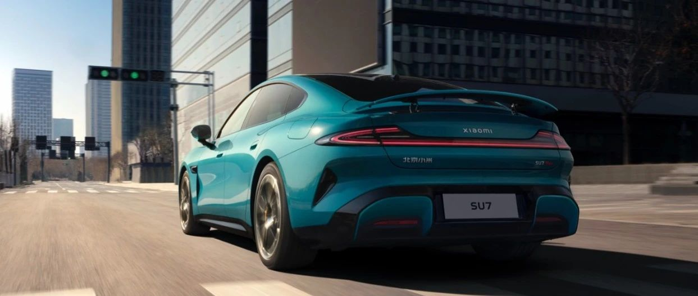
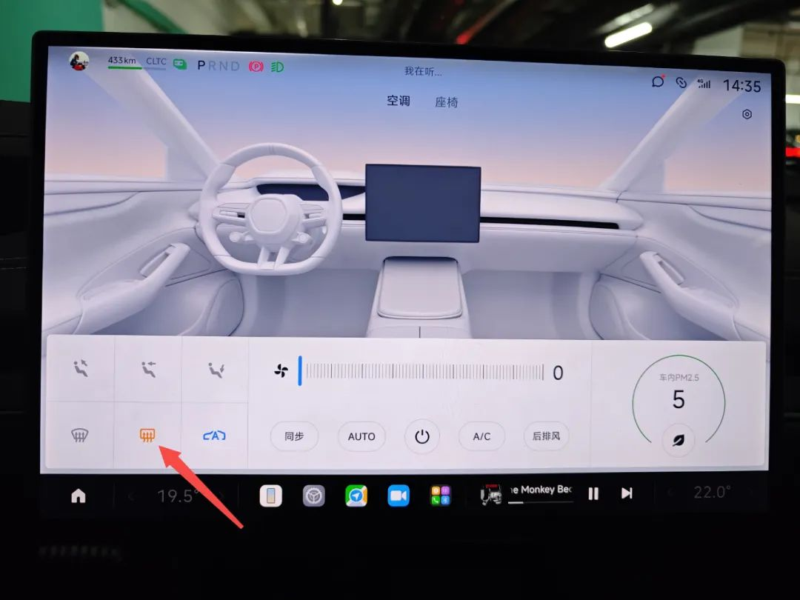
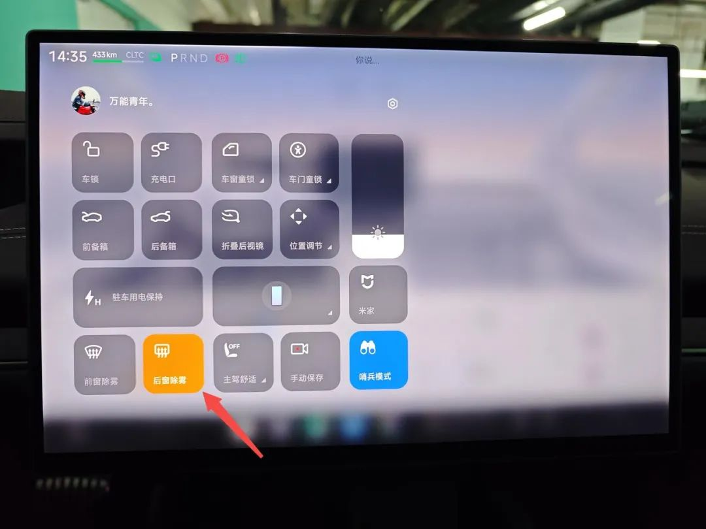
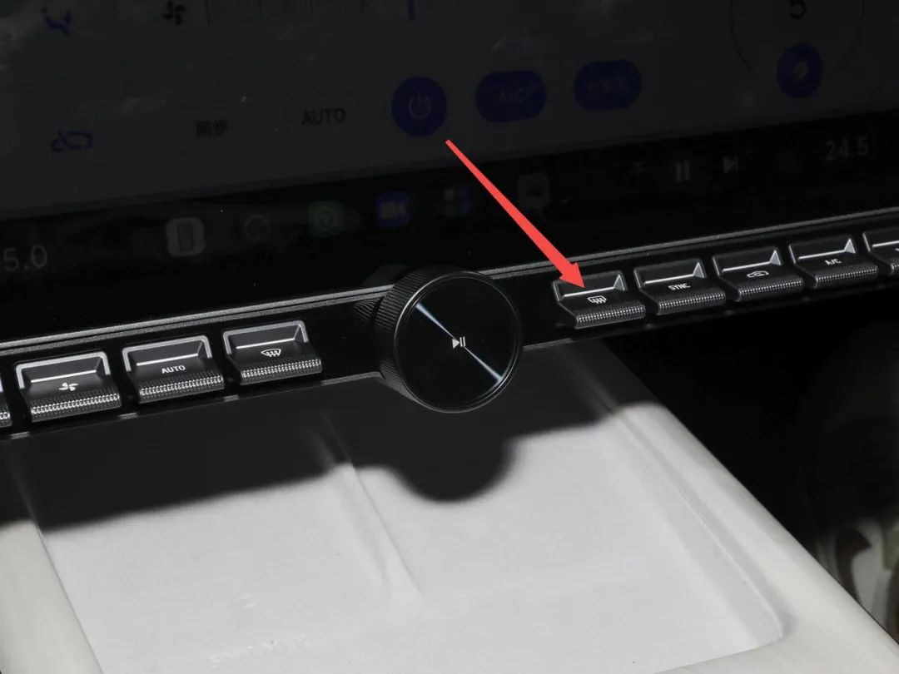

#  小米SU7答网友问（第十六集）

  

## **01**

**首批权益政策截止日期为4月30日，要是定金交在这个时间前，尾款在之后，首批权益还能享受吗？**

在4月30日24点前完成支付5000元定金选购小米SU7的客户，均可享受至高价值22000元的限时购车权益，尾款支付时间不影响以上限时权益的获得，具体信息您可以在小米汽车APP内的权益介绍中查看。

  

## **02**

**使用手机蓝牙解锁，如果关闭了蓝牙是否还能正常启动？**

不能。使用手机蓝牙解锁，包括拉门解锁、靠近自动解锁、离车自动闭锁，均需要手机与车辆通过蓝牙建立通讯。如果将手机端蓝牙关闭，则无法正常使用手机蓝牙钥匙。

因此您在使用手机蓝牙钥匙时，需将手机蓝牙打开。同时，受限于各家手机品牌的内存限制及性能策略，小米汽车APP进程可能被系统结束运行，导致解锁失败。如果出现手机蓝牙钥匙解闭锁失败的情况，请确保小米汽车APP在前台或后台运行。

## **03**

**车上的SIM卡可不可以更换成自己的SIM卡？**

小米SU7车机所用SIM卡为出厂内置，用户不能自行更换。

用户可在交付之日起免费使用「车载网络服务包」一年，此权益与车辆绑定。权益期结束后，车主可以通过小米汽车APP付费购买「车载网络服务包」，其定价是19.9元/月和199元/年。

  

## **04**

**中控屏下方的DP接口，能连接Switch等设备吗？**

中控屏下方左侧的Type-C接口，除了支持67W有线快充，还将在后续OTA升级中，支持DP拓展Switch等游戏设备，让您在停车休息时畅享游戏的乐趣。

## **05**

**运动声浪模拟跟车辆的版本、轮毂有关系吗？**

小米SU7运动声浪模拟需与25扬声器匹配，但与配置及轮毂版本无关。标准版、Pro版，在选配25扬声器后，均可以体验到极致的运动声浪模拟。

小米SU7的运动声浪模拟，在用户体验后均获得了一致好评。开发之初，我们从工程、声学、设计三个维度进行衡量，希望让乘客在真实反馈、音效品质、主观听感三个基础体验维度上，都拥有愉悦的体验。

小米SU7的运动声浪模拟由110轨音源合成，针对加速踏板开度、扭矩大小精准匹配音源，总计可覆盖81种不同工况。因此，性能更强的小米SU7 MAX版在音浪强度上，会比标准及Pro版更加震撼，配合独立的声浪算力芯片，拥有超低延迟，提供了流畅的音效体验。

  

## **06**

**下雨天想要解决后视镜雨水问题，如何开启后视镜加热功能？**

外后视镜加热和后风挡加热功能是绑定的，目前有4种开启方式：

1、点击中控屏空调控制主界面的外后视镜/后风挡加热图标，以开启/关闭该功能；

2、在中控屏下拉快捷操作栏，点击外后视镜/后风挡加热图标，以开启/关闭该功能；

3、如您购买了中控屏物理按键，点击外后视镜/后风挡加热按键，以开启/关闭该功能；

4、呼唤小爱同学，下达“打开后视镜加热” 或 “打开后风挡加热” 语音指令，以开启该功能。

  

## **07**

**车辆发生碰撞后，车窗会自动打开吗？**

高速碰撞后，车窗会自动降低，对应碰撞方向的安全气囊点爆，与此同时双闪灯自动激活，高压系统自动切断，车辆会自动刹车并驻车，同时自动进行呼叫救援，全维度保护乘员安全。

而如果仅为不涉及乘员安全的低速剐蹭，气囊和上述防护机制不会激活，以避免不必要的财产损失。

  

## **08**

**后排座椅安全带警报可以永久关闭吗？**

不可以。根据国内相关法规，车辆制造商不能将后排安全带未系警报永久关闭。出于安全考虑，也建议全车乘员在行车全程时刻保持安全带正确系好状态。

  

## **09**

**后续任何版本是否都能更换不同尺寸轮毂，更换后要做哪些动作？**

小米SU7/小米SU7 PRO版，可适用以下轮毂款型：

  * 19英寸低风阻轮毂-米其林

  * 20英寸梅花轮毂-米其林

小米SU7 MAX版，可适用以下轮毂款型：

  * 19英寸低风阻轮毂-米其林

  * 19英寸运动轮毂-普利司通

  * 20英寸梅花轮毂-米其林

  * 21英寸运动轮毂-倍耐力

不同的轮毂和轮胎对车辆行驶有不同的适配性，也是车辆年检的检查项之一，如购车后希望更换购买其他型款/尺寸的轮毂和轮胎，建议咨询官方授权服务中心后再行换购。
