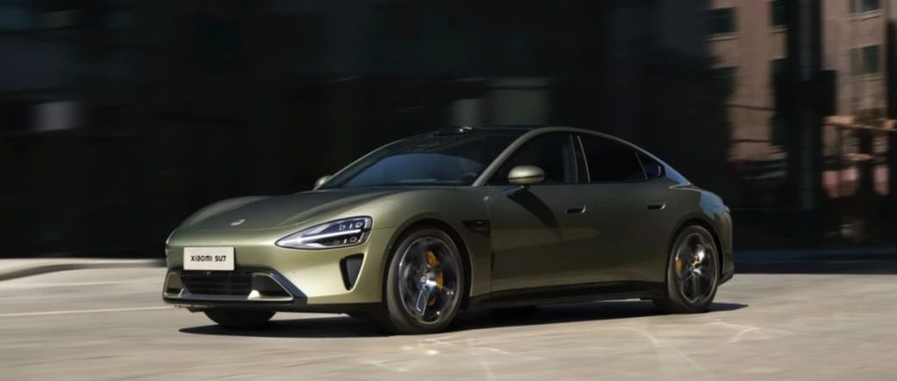

#  小米SU7答网友问（第十七集）

[ 小米汽车 ](<javascript:void\(0\);>)

______

小米SU7答网友问  

持续进行中...

[小米SU7答网友问（第一集）](<http://mp.weixin.qq.com/s?__biz=MzkyNzU3MDI3Nw==&mid=2247486958&idx=1&sn=fa1835ddd2eee3bdafefcad5b74d2d94&chksm=c2274de4f550c4f28c7b9e54f1a6a8bcacc3459e88bbe256c362a899a36ca32c80be4f87c45a&scene=21#wechat_redirect>)

[小米SU7答网友问（第二集）](<http://mp.weixin.qq.com/s?__biz=MzkyNzU3MDI3Nw==&mid=2247487024&idx=1&sn=0c7cfca4d7c560dedf8062fa3a7230e3&chksm=c2274e3af550c72cdf2c4b04f2e6f3f66f10eac3634f77346b68be322d895dfb1398978ccbcf&scene=21#wechat_redirect>)

[小米SU7答网友问（第三集）](<http://mp.weixin.qq.com/s?__biz=MzkyNzU3MDI3Nw==&mid=2247487063&idx=2&sn=a0651af985a684e2379d3805947abc23&chksm=c2274e5df550c74b86d3871da393feb8fcadab0dfcdc8e77c806309341c89f1b37396b0e6318&scene=21#wechat_redirect>)

[小米SU7答网友问（第四集）](<http://mp.weixin.qq.com/s?__biz=MzkyNzU3MDI3Nw==&mid=2247487079&idx=1&sn=9cf62cd9e760babefdd444d29ee00b68&chksm=c2274e6df550c77b506f07fb315efff406bc12a55eba23c69b349cba973f61811d88fd0ade33&scene=21#wechat_redirect>)

[小米SU7答网友问（第五集）](<http://mp.weixin.qq.com/s?__biz=MzkyNzU3MDI3Nw==&mid=2247487101&idx=1&sn=9e00cc3239d1e6d9cb373f2efad42e3c&chksm=c2274e77f550c76157349d363d8e0c17ceadab29fae7538c156149e37c9c89e7cc22644201b2&scene=21#wechat_redirect>)

[小米SU7答网友问（第六集）](<http://mp.weixin.qq.com/s?__biz=MzkyNzU3MDI3Nw==&mid=2247487835&idx=2&sn=30cf8170af01397c46dc34cf495f7c02&chksm=c2275151f550d847fcc5d8d333c20a5d27d60276888d7192f51064f53e6fa738e21bf375ef29&scene=21#wechat_redirect>)

[小米SU7答网友问（第七集）](<http://mp.weixin.qq.com/s?__biz=MzkyNzU3MDI3Nw==&mid=2247487849&idx=1&sn=45b7ceae12489188c167129f3fb8b1a6&chksm=c2275163f550d87500cbacfac5ee05ea1b5083b97beb0d16e375b98480c98c823fbfdcc4d45a&scene=21#wechat_redirect>)

[小米SU7答网友问（第八集）](<http://mp.weixin.qq.com/s?__biz=MzkyNzU3MDI3Nw==&mid=2247487860&idx=1&sn=337ffc5a7972e5758d3208fb1eb7a28d&chksm=c227517ef550d86838d64b08036486d07a6ea303f0f8e2e9bb93b097750beeb6b2649b692ede&scene=21#wechat_redirect>)

[小米SU7答网友问（第九集）](<http://mp.weixin.qq.com/s?__biz=MzkyNzU3MDI3Nw==&mid=2247487868&idx=1&sn=8021638c108d845fab76580a6cc405e9&chksm=c2275176f550d86086dc3bcdbc3b4cf518b1ba41a294c3ad5d39504791907edcc6422b015131&scene=21#wechat_redirect>)

[小米SU7答网友问（第十集）](<http://mp.weixin.qq.com/s?__biz=MzkyNzU3MDI3Nw==&mid=2247487890&idx=1&sn=47696df25bbc82e7c5aea71ccd30030e&chksm=c2275198f550d88e577cf942e5f0b4a7a6a21cc2cec4b0f04562b6acaa878177be8d8f2507b9&scene=21#wechat_redirect>)

[小米SU7答网友问（第十一集）](<http://mp.weixin.qq.com/s?__biz=MzkyNzU3MDI3Nw==&mid=2247487900&idx=1&sn=7765954b27cc8772008540f91ca7224d&chksm=c2275196f550d8807e8be4cee38e091559c454cfc8bed3e843d4e425f4b002ee0cb931c883d8&scene=21#wechat_redirect>)

[小米SU7答网友问（第十二集）](<http://mp.weixin.qq.com/s?__biz=MzkyNzU3MDI3Nw==&mid=2247487915&idx=1&sn=abbebbb9cbe0668b66a9c1026b12932f&chksm=c22751a1f550d8b73c8ad64a95a0158ef65c19c0becad656d616125a396dc6b4c6703e97f967&scene=21#wechat_redirect>)

[小米SU7答网友问（第十三集）](<http://mp.weixin.qq.com/s?__biz=MzkyNzU3MDI3Nw==&mid=2247487947&idx=1&sn=f544e6be6fd1221b57e5123f58c1f72c&chksm=c22751c1f550d8d76cf64deaaaf06423ad37525bfbda26eb8e1d0a5952a5b1ae30188c90c2c4&scene=21#wechat_redirect>)

[小米SU7答网友问（第十四集）](<http://mp.weixin.qq.com/s?__biz=MzkyNzU3MDI3Nw==&mid=2247487955&idx=1&sn=ee2a1734fe86b15000822bee9ae0ffd2&chksm=c22751d9f550d8cfdb48ae0c890173e37f66356ad6316e9ada00ee7c231d0772ee6e4c817c65&scene=21#wechat_redirect>)

[小米SU7答网友问（第十五集）](<http://mp.weixin.qq.com/s?__biz=MzkyNzU3MDI3Nw==&mid=2247487979&idx=1&sn=ab9d29fdf3c1147cd9c500ac5fafedde&chksm=c22751e1f550d8f725f7b294d004e04caa682567387ee5ee39a067fad1859fcaca2e68748e6f&scene=21#wechat_redirect>)

[小米SU7答网友问（第十六集）](<http://mp.weixin.qq.com/s?__biz=MzkyNzU3MDI3Nw==&mid=2247488003&idx=1&sn=9ed994132d197917e93f91b9f332e8d1&chksm=c2275209f550db1fe70c13abc492f5c01be8e5b5b81fba7379fe76c52c5256038eb4d6080ce6&scene=21#wechat_redirect>)

  

## **01**

**如果改配，是否意味着需要重新排队，会导致提车时间推迟很久？**

关于改配对订单顺序的影响，我们确实权衡了很多次，最终还是决定改配后需要重新排队，这样对所有用户更加公平。

提车时间的推迟幅度则取决于您当前订单的锁单时间。即便您锁单很早，排位比较靠前，也会因为改配成功使得交付周期显著增加。且改配成功后不可退回，请谨慎改配！

上市以来，我们一直认真聆听大家的建议，并持续尽力为大家解决问题。感谢大家一直以来的信任与支持。具体规则以小米社区内的改配规则为准，您也可以咨询您的销售顾问或交付顾问获取更个性化的咨询回复。

  

## **02**

**为什么改配限时一天，后续不能延续这个政策？**

工厂的生产和物料的筹备是根据大家的锁单情况提前准备的，如果持续大量改配，会导致生产混乱，物料供应不及时，进而影响生产和交付车辆的效率。从保障所有用户的交付周期出发，我们选择了把影响降到最低的方案，希望能得到大家的理解。

  

## **03**

**为什么在使用其他品牌家充桩充电时，可能遇到无法充电的情况？**

因不同品牌家充桩的默认权限设置不同，可能会因其仅限某品牌车型可用的设定或白名单授权机制，导致无法给小米SU7正常充电。请小米SU7用户使用其他品牌家充桩前，确保桩端打开充电权限设置，具体权限设置方法请查阅对应品牌桩的使用说明或与其客服沟通获取详细使用教程。

以特斯拉三代家充桩为例，需要将桩端的访问控制从「仅限Tesla」改为「所有车辆」，方可给小米SU7充电，修改初始设置程序的步骤如下：

  * 长按充电手柄按钮5秒，直至充电桩指示灯呈现绿色呼吸闪烁；

  * 使用手机打开WiFi，找到名为“TeslaWallConnector_XXX”；

  * 输入WiFi密码后连接，注意每个特斯拉三代家充桩包装内都附有《快速入门指南》，内嵌WPA2的12位字母就是密码；

  * 连接完成后，在手机上打开浏览器，输入192.168.92.1，跳转到设置界面；

  * 点击访问控制一栏，选择「所有车辆」完成设置。

  

## **04**

**小米SU7已经具备代客泊车功能，可以在停车场让车自己开到跟前吗？**

目前，小米智能泊车产品尚不支持在停车场特定位置，对车辆进行远距离召唤的相关功能。

  

## **05**

**很多车主反映前备箱想改成电动式，会影响整车质保吗？**

改装的结构和零件无法享受官方质保权益；因改装而导致的车辆结构和功能性受损，也超出质保权益覆盖范围。详细的小米SU7质保政策可在官网查询。

  

## **06**

**车机可以连接手机的共享网络吗？******

可以。您开启手机热点之后，在中控屏的“设置-连接-WLAN”找到相应的手机热点网络，进行连接即可。

当然，手机也可以连接车机的热点网络。如果您选购了中控屏物理按键，您可以用支持NFC的安卓系统手机，靠一靠中控屏物理按键中间的音量旋钮，即可连接车机热点。如果没有中控屏物理按键，在中控屏开启车机热点网络，用手机连接即可。

手机连接车机热点之后，不仅可以共享车机的网络。如果乘客用的是搭载Xiaomi HyperOS系统的手机，那么在手机的融合设备中心也可以实现对车辆座椅、空调、音乐等的便捷控制。

  

## **07**

**车载视觉摄像头是否有加热除雾功能呢？如何开启？**

小米SU7全系车型标配11个驾驶辅助摄像头，其中前向双目摄像头在检测到有遮挡时，会自动开启其视窗部分的加热丝，以进行加热、除雾/雨/雪，以上无需手动操作。如视窗有泥等脏污，仍需手动清除。

同时小米SU7 Pro、小米SU7 Max还配备激光雷达，检测到有遮挡时，激光雷达视窗也会自动开启加热功能，此加热功能同样无需手动操作。

  

## **08**

**空调出风口支持自动扫风或智能避人吹风吗？**

小米SU7全车有4个电动出风口，可自由选择吹风模式及风向。目前暂不支持自动扫风、避人吹风等功能，后续将通过OTA升级的形式推送相关功能。

另外，小米SU7的空调系统配备CN95级滤芯、PM2.5实时监测系统、AQS空气质量检测系统、抗菌蒸发器等，使座舱空气更加健康清新。

预览时标签不可点

微信扫一扫  
关注该公众号

继续滑动看下一个

轻触阅读原文

小米汽车 

向上滑动看下一个

[知道了](<javascript:;>)

微信扫一扫  
使用小程序

****

[取消](<javascript:void\(0\);>) [允许](<javascript:void\(0\);>)

****

[取消](<javascript:void\(0\);>) [允许](<javascript:void\(0\);>)

****

[取消](<javascript:void\(0\);>) [允许](<javascript:void\(0\);>)

× 分析

__

微信扫一扫可打开此内容，  
使用完整服务

： ， ， ， ， ， ， ， ， ， ， ， ， 。 视频 小程序 赞 ，轻点两下取消赞 在看 ，轻点两下取消在看 分享 留言 收藏 听过