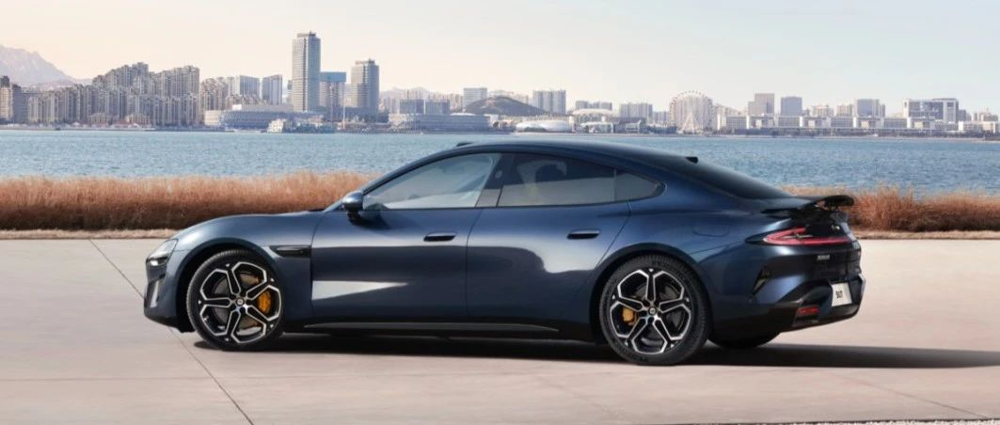

#  小米SU7答网友问（第二十集）

## **01**

**行车记录仪如果想换大容量U盘，有什么性能、规格要求吗？**

用户购车时，随车赠送了128GB行车记录专用U盘，该款U盘经历了充分的可靠性测试，可以稳定支持行车记录仪、哨兵模式的正常运行。因此，官方推荐使用附赠U盘作为行车记录U盘。

如确实有更换U盘的需要，选择U盘时应满足以下技术参数：

  * U盘支持exFAT格式，并确保U盘已格式化为兼容的格式；

  * 建议储存容量不小于128GB，读取、写入速度不小于150MB/s；

  * 工作温度维持在-25℃~70℃，支持持续稳定运行。

## **02**

**如果坐在后排，如何将手机上的音乐或视频投到中控屏呢？**

针对不同手机品牌的用户，我们都提供了丰富的音乐流转功能：

  * 小米手机用户，只需要通过控制中心的「妙播」卡片，选择投送设备为小米SU7即可；

  * 其他品牌安卓用户，可通过QQ音乐的设备投放功能进行分享；

  * iPhone用户，可通过系统音频投射功能将手机中的音乐投至车机。

不仅音乐可以分享，视频类内容也没有问题。就像在家中手机视频投屏到电视的操作一样，通过三方视频软件自带的投屏功能，任何品牌手机都可以轻松分享视频到小米SU7的中控大屏。

  

## **03**

**小米SU7标准版何时可体验代客泊车？**

小米SU7各车型版本均支持代客泊车辅助AVP功能。

现阶段小米SU7 Max车型版本用户已可使用代客泊车功能，小米SU7 Pro车型版本用户待车辆交付后也可使用代客泊车功能，小米SU7标准版用户则需等待后续OTA对此功能进行推送，具体推送时间建议关注小米汽车官方后续通知，敬请期待。

## **04**

**运动声浪能否自行调节声音大小？**

运动声浪主结构分为加速轨、减速轨、匀速轨三层内容，由不同的底盘信号控制动态变化，音色主观听感有较大差异。当前版本随速轨道的声浪与汽车路噪、风噪融合在一起自适应变化，以建立长期驾驶的耐听性和愉悦听感，还综合考虑了驾驶安全、听力保护等因素。后续根据用户反馈情况，可能增加更多的声浪风格，并开放部分自定义调节功能，敬请期待。

  

## **05**

**在车上呼唤“小爱同学”，出现车机和手机同时回应的情况，如何解决？**

在车内呼唤小爱同学时，车载小爱会优先应答。这是因为小爱同学提供了智能“协同唤醒”功能，以达到最佳的用户体验。

如果出现了同时回应现象，请核查以下设置：

  * 车机和手机登入了同一账号；

  * 请确保您的手机已经更新到最新的Xiaomi HyperOS系统；

  * 手机小爱设置项中的“多设备协同唤醒”处于打开状态。

## **06**

**如果选购时是19英寸轮胎轮毂，后续可换20或21英寸吗？在官方交付中心操作吗？**

小米SU7标准版和Pro版，标配19英寸低风阻轮毂，可选配20英寸梅花轮毂。而小米SU7 Max，拥有四种轮毂可选，包括19英寸低风阻轮毂、19英寸运动轮毂、20英寸梅花轮毂以及21英寸运动轮毂。

如购车后希望更换其他款型的轮毂和轮胎，可通过汽车400热线或专属服务群，查询自己车辆的适配款型，并预约到店换购安装时间。同时，为确保门店库存能满足您的需要，建议用户提前3-5天预约。轮毂为年检过户审查项,需咨询官方

  

## **07**

**后排车载Pad 在车内长时间挂载，能经受暴晒吗？有什么注意事项？**

发售于小米商城的所有CarIoT车载智能设备，在设计之初就综合考虑了其工业设计、可靠性与安全性等性能指标。

但值得注意的是，Pad本体系消费电子产品，执行了消费电子产品相关可靠性标准。极端情况下的暴晒，有可能对Pad的电池健康存在负面影响。

建议避免在环境温度过高、过低的情况下将任何含蓄电池的电子产品存放于车内。

  

  
