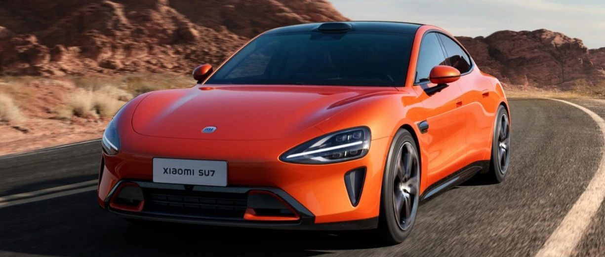

#  小米SU7答网友问（第二十六集）

[ 小米汽车 ](<javascript:void\(0\);>)

______

**01**  

**网上有传言说，有用户在小米SU7 Max提车两天时就出现前保险杠掉漆现象，是什么情况？**

经核实，该用户视频中存在失实的内容。该用户非车辆首任车主，也并非是提车两天。造成掉漆的原因是首任车主做了全车改色膜，后续该用户在撕掉贴膜之后造成的保险杠内侧漆面黏连掉漆，非产品出厂问题。

小米SU7保险杠采用底漆、面漆及清漆三层喷涂工艺，效果上保证了和车身颜色的一致性。但是如果在使用中不规范地贴膜/撕膜，都有可能造成对漆面的伤害，望周知。感谢大家的关注和支持。

## **02**

**在车内安装拓展配件，是否有安全隐患和法规风险？**

目前小米官方的CarIoT车载智能设备及拓展配件（包括车载手机支架、智能双表盘、椅背平板支架、中控屏物理键盘等），均严格合规。相关法规要求驾驶机动车不得在机动车驾驶室的前后窗范围内悬挂、放置妨碍驾驶人视线的物品。小米官方的相关拓展设备，均不存在遮挡驾驶人视线的风险。

小米SU7的车内拓展配件，均经过了碰撞、耐久性等相关测试。以手机支架为例，通过1/4英寸标准接口安装的手机支架，具有更强的牢靠性，并且在严苛的滑台碰撞试验中，测试全部通过。所以，可以保证在正常使用过程中，最大程度保障用户使用安全。

但也需要提醒一点，请按照CarIoT车载智能设备说明书对设备进行安装，并将螺丝拧紧。此外，往期的《小米SU7答网友问》中也曾提示过，在使用仪表台右侧1/4英寸标准接口时，请确保副驾驶未坐人。手机支架在使用时，手机放置位置需得当。

  

## **03**

**小米为小米SU7用户提供的道路救援都有什么？**

小米汽车为用户提供了官方道路救援服务（中国境内，暂不包含中国香港特别行政区、中国澳门特别行政区及中国台湾地区）；

在小米SU7的整车质保期内，如因车辆质量问题，致使车辆无法正常行驶，用户可通过小米汽车APP专属服务管家群或小米汽车APP 400一键拨号的方式联系线上服务中心，获得7*24小时的紧急救援服务；

此外，购买了小米汽车官方用车服务包与保险产品的用户，还可免费享受7*24小时的事故类道路救援服务。

相关服务细则和服务产品信息，可查询小米汽车官网或咨询小米汽车线上服务中心。

## **04**

**自动驻车功能能手动关闭吗？**

目前小米SU7的自动驻车功能无法手动关闭，但用户可以通过设置缓行模式实现不同的自动驻车使用方式：

  * 选择保持停止：车速降为0后激活自动驻车；

  * 选择缓慢行驶：车速降为0后，深踩制动踏板激活自动驻车，如果不深踩，松开刹车会按照6km/h车速缓慢行驶，类似燃油车怠速。

## **05**

**轮胎属于易损件1年保修，适用于哪些情况下？**

轮胎属于易损件质量保证期限是12个月或20,000公里，以先达到者为准。因零部件的设计、制造或原材料缺陷产生质量问题时，在小米汽车服务中心免费更换的纯正零部件的有限质量保证期，与被更换零部件的剩余有限质量保证期相一致，并随被更换零部件的剩余有限质量保证期的结束而结束。关于轮胎检查与保养，请参考用户手册相关章节。

  

## **06**  

**乘客在车上，可以用手机控车吗？**

可以的。如果乘客用的是搭载Xiaomi HyperOS系统的手机，可以先连接车机热点（如果选购了中控屏物理按键，可用手机碰一碰中间音量旋钮快速连接热点）。

热点连接成功后，从手机屏幕顶部下滑，可在“融合设备中心”发现一个汽车的图标。点击汽车图标，即可在弹出的窗口中，查看并控制车辆的导航、媒体、空调、座椅。

当您的家人或朋友乘车时，不需要下载小米汽车APP，也不需要被额外授权，即可轻松便捷控车，包括空调和座椅等功能的调整。

不仅如此，当乘客连接车机热点后，还可以将自己手机上的音视频投到车机，与全车人一起分享。

  

## **07**

**每日问答中提到过的优化改善事项，具体什么时候会推送？**

感谢大家在过去20多天对小米SU7提出的产品建议。每天的「小米SU7答网友问」在第一时间回应大家疑问的同时，我们的研发团队也在马不停蹄地推进优化工作。

我们计划将在4月24日，开始陆续向用户推送部分功能优化，包括以下内容：

  * 修复交流充电系统进入保护机制后，偶发无法通过充电枪按钮解锁电子锁的问题；

  * 优化充电逻辑，提升第三方品牌充电桩充电兼容性；

  * 修复开门降音功能的偶发失效。

当您收到车机向您推送更新信息后，点击【立即更新】即可，或在中控台选择【设置】→【系统】→【系统版本】，或在小米汽车App中选择【车辆】进入版本更新。

为了确保更新顺利，更新前请保证车辆剩余电量大于20%，并处于驻车状态，请将车辆停放于安全且网络条件良好的地方。更新过程中车辆无法使用，请您预留足够的更新时间，以防影响您的出行。

此次功能优化是个小的优化版本。小米SU7 上市后的首次大版本升级，将在4月25日北京车展上公布OTA计划，敬请期待。

  

小米SU7答网友问  

持续进行中...

[小米SU7答网友问（第一集）](<http://mp.weixin.qq.com/s?__biz=MzkyNzU3MDI3Nw==&mid=2247486958&idx=1&sn=fa1835ddd2eee3bdafefcad5b74d2d94&chksm=c2274de4f550c4f28c7b9e54f1a6a8bcacc3459e88bbe256c362a899a36ca32c80be4f87c45a&scene=21#wechat_redirect>)

[小米SU7答网友问（第二集）](<http://mp.weixin.qq.com/s?__biz=MzkyNzU3MDI3Nw==&mid=2247487024&idx=1&sn=0c7cfca4d7c560dedf8062fa3a7230e3&chksm=c2274e3af550c72cdf2c4b04f2e6f3f66f10eac3634f77346b68be322d895dfb1398978ccbcf&scene=21#wechat_redirect>)

[小米SU7答网友问（第三集）](<http://mp.weixin.qq.com/s?__biz=MzkyNzU3MDI3Nw==&mid=2247487063&idx=2&sn=a0651af985a684e2379d3805947abc23&chksm=c2274e5df550c74b86d3871da393feb8fcadab0dfcdc8e77c806309341c89f1b37396b0e6318&scene=21#wechat_redirect>)

[小米SU7答网友问（第四集）](<http://mp.weixin.qq.com/s?__biz=MzkyNzU3MDI3Nw==&mid=2247487079&idx=1&sn=9cf62cd9e760babefdd444d29ee00b68&chksm=c2274e6df550c77b506f07fb315efff406bc12a55eba23c69b349cba973f61811d88fd0ade33&scene=21#wechat_redirect>)

[小米SU7答网友问（第五集）](<http://mp.weixin.qq.com/s?__biz=MzkyNzU3MDI3Nw==&mid=2247487101&idx=1&sn=9e00cc3239d1e6d9cb373f2efad42e3c&chksm=c2274e77f550c76157349d363d8e0c17ceadab29fae7538c156149e37c9c89e7cc22644201b2&scene=21#wechat_redirect>)

[小米SU7答网友问（第六集）](<http://mp.weixin.qq.com/s?__biz=MzkyNzU3MDI3Nw==&mid=2247487835&idx=2&sn=30cf8170af01397c46dc34cf495f7c02&chksm=c2275151f550d847fcc5d8d333c20a5d27d60276888d7192f51064f53e6fa738e21bf375ef29&scene=21#wechat_redirect>)

[小米SU7答网友问（第七集）](<http://mp.weixin.qq.com/s?__biz=MzkyNzU3MDI3Nw==&mid=2247487849&idx=1&sn=45b7ceae12489188c167129f3fb8b1a6&chksm=c2275163f550d87500cbacfac5ee05ea1b5083b97beb0d16e375b98480c98c823fbfdcc4d45a&scene=21#wechat_redirect>)

[小米SU7答网友问（第八集）](<http://mp.weixin.qq.com/s?__biz=MzkyNzU3MDI3Nw==&mid=2247487860&idx=1&sn=337ffc5a7972e5758d3208fb1eb7a28d&chksm=c227517ef550d86838d64b08036486d07a6ea303f0f8e2e9bb93b097750beeb6b2649b692ede&scene=21#wechat_redirect>)

[小米SU7答网友问（第九集）](<http://mp.weixin.qq.com/s?__biz=MzkyNzU3MDI3Nw==&mid=2247487868&idx=1&sn=8021638c108d845fab76580a6cc405e9&chksm=c2275176f550d86086dc3bcdbc3b4cf518b1ba41a294c3ad5d39504791907edcc6422b015131&scene=21#wechat_redirect>)

[小米SU7答网友问（第十集）](<http://mp.weixin.qq.com/s?__biz=MzkyNzU3MDI3Nw==&mid=2247487890&idx=1&sn=47696df25bbc82e7c5aea71ccd30030e&chksm=c2275198f550d88e577cf942e5f0b4a7a6a21cc2cec4b0f04562b6acaa878177be8d8f2507b9&scene=21#wechat_redirect>)

[小米SU7答网友问（第十一集）](<http://mp.weixin.qq.com/s?__biz=MzkyNzU3MDI3Nw==&mid=2247487900&idx=1&sn=7765954b27cc8772008540f91ca7224d&chksm=c2275196f550d8807e8be4cee38e091559c454cfc8bed3e843d4e425f4b002ee0cb931c883d8&scene=21#wechat_redirect>)

[小米SU7答网友问（第十二集）](<http://mp.weixin.qq.com/s?__biz=MzkyNzU3MDI3Nw==&mid=2247487915&idx=1&sn=abbebbb9cbe0668b66a9c1026b12932f&chksm=c22751a1f550d8b73c8ad64a95a0158ef65c19c0becad656d616125a396dc6b4c6703e97f967&scene=21#wechat_redirect>)

[小米SU7答网友问（第十三集）](<http://mp.weixin.qq.com/s?__biz=MzkyNzU3MDI3Nw==&mid=2247487947&idx=1&sn=f544e6be6fd1221b57e5123f58c1f72c&chksm=c22751c1f550d8d76cf64deaaaf06423ad37525bfbda26eb8e1d0a5952a5b1ae30188c90c2c4&scene=21#wechat_redirect>)

[小米SU7答网友问（第十四集）](<http://mp.weixin.qq.com/s?__biz=MzkyNzU3MDI3Nw==&mid=2247487955&idx=1&sn=ee2a1734fe86b15000822bee9ae0ffd2&chksm=c22751d9f550d8cfdb48ae0c890173e37f66356ad6316e9ada00ee7c231d0772ee6e4c817c65&scene=21#wechat_redirect>)

[小米SU7答网友问（第十五集）](<http://mp.weixin.qq.com/s?__biz=MzkyNzU3MDI3Nw==&mid=2247487979&idx=1&sn=ab9d29fdf3c1147cd9c500ac5fafedde&chksm=c22751e1f550d8f725f7b294d004e04caa682567387ee5ee39a067fad1859fcaca2e68748e6f&scene=21#wechat_redirect>)

[小米SU7答网友问（第十六集）](<http://mp.weixin.qq.com/s?__biz=MzkyNzU3MDI3Nw==&mid=2247488003&idx=1&sn=9ed994132d197917e93f91b9f332e8d1&chksm=c2275209f550db1fe70c13abc492f5c01be8e5b5b81fba7379fe76c52c5256038eb4d6080ce6&scene=21#wechat_redirect>)

[小米SU7答网友问（第十七集）](<http://mp.weixin.qq.com/s?__biz=MzkyNzU3MDI3Nw==&mid=2247488035&idx=1&sn=fcfdeca83d7ca7c13e84b84a92146ed0&chksm=c2275229f550db3f3019dfe29d896a4c7c49a61351dd801e7b3520c9174e26ce040555c9756a&scene=21#wechat_redirect>)

[小米SU7答网友问（第十八集）](<http://mp.weixin.qq.com/s?__biz=MzkyNzU3MDI3Nw==&mid=2247488044&idx=1&sn=15e0313c7b352da563c38d6b64e5cb27&chksm=c2275226f550db303d96d77050e8fe6c21f6c0fd9453e84d129f29cd0024fcf7dd5d0cab4ec8&scene=21#wechat_redirect>)

[小米SU7答网友问（第十九集）](<http://mp.weixin.qq.com/s?__biz=MzkyNzU3MDI3Nw==&mid=2247488049&idx=1&sn=20d5d20c485040ccd9bbe1100ad0dd18&chksm=c227523bf550db2d8d6d7bb477f3f83742d63b451060848150a41d9bf819ff812b73c67add01&scene=21#wechat_redirect>)

[小米SU7答网友问（第二十集）](<http://mp.weixin.qq.com/s?__biz=MzkyNzU3MDI3Nw==&mid=2247488056&idx=1&sn=efcffc7ee04fad7bcb74c548c6941929&chksm=c2275232f550db24c3c6d404748637a9d2a1e60c653ddbf9ddafdc767e79454a3602f3d0ef1c&scene=21#wechat_redirect>)

[小米SU7答网友问（第二十一集）](<http://mp.weixin.qq.com/s?__biz=MzkyNzU3MDI3Nw==&mid=2247488116&idx=1&sn=023b64046c6b458d5d18d3127927f1d7&chksm=c227527ef550db683a84f930ced2a5490c3db91875d0f42b3f9389ccd9c7f28f2df9bc801981&scene=21#wechat_redirect>)

[小米SU7答网友问（第二十二集）](<http://mp.weixin.qq.com/s?__biz=MzkyNzU3MDI3Nw==&mid=2247488132&idx=1&sn=9886d3575c66671b6730a33b6306dab3&chksm=c227528ef550db987a53c13da3d506b2811d5055612cd653ef3991e43c17f4ec4537272e2921&scene=21#wechat_redirect>)

[小米SU7答网友问（第二十三集）](<http://mp.weixin.qq.com/s?__biz=MzkyNzU3MDI3Nw==&mid=2247488147&idx=1&sn=152e9e104197e2a3cf83a0752b29ab2c&chksm=c2275299f550db8f55fc3419acf0eaaa7942e67e59fd74824fe80163cc474cfe2c2c4f86b57e&scene=21#wechat_redirect>)

[小米SU7答网友问（第二十四集）](<http://mp.weixin.qq.com/s?__biz=MzkyNzU3MDI3Nw==&mid=2247488153&idx=1&sn=5813bae70bf685e3be696e424e91c2b8&chksm=c2275293f550db85b0f9e2c070e7e44c503db4898fc24aa5408212264c0047d4f027510be852&scene=21#wechat_redirect>)

[小米SU7答网友问（第二十五集）](<http://mp.weixin.qq.com/s?__biz=MzkyNzU3MDI3Nw==&mid=2247488181&idx=2&sn=8c839457b13992e0fa44edf3c74c9b89&chksm=c22752bff550dba973f0a90364cfd25c389abce8b4d1f193fd418ab7ec724579d6b6b7c70848&scene=21#wechat_redirect>)

  

  

  

预览时标签不可点

微信扫一扫  
关注该公众号

继续滑动看下一个

轻触阅读原文

小米汽车 

向上滑动看下一个

[知道了](<javascript:;>)

微信扫一扫  
使用小程序

****

[取消](<javascript:void\(0\);>) [允许](<javascript:void\(0\);>)

****

[取消](<javascript:void\(0\);>) [允许](<javascript:void\(0\);>)

****

[取消](<javascript:void\(0\);>) [允许](<javascript:void\(0\);>)

× 分析

__

微信扫一扫可打开此内容，  
使用完整服务

： ， ， ， ， ， ， ， ， ， ， ， ， 。 视频 小程序 赞 ，轻点两下取消赞 在看 ，轻点两下取消在看 分享 留言 收藏 听过