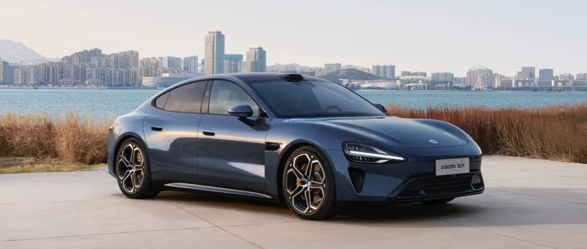

#  小米SU7答网友问（第二十七集）

[ 小米汽车 ](<javascript:void\(0\);>)

______

**01**  

**前风挡三层镀银是否会影响手机信号？**

小米SU7在开发过程中，做了充分的手机信号测试验证，不会对手机网络信号造成干扰。这个测试覆盖了主流的6个品牌15款手机，3大运营商，在全国多地的居民小区、商务写字楼区域、大型商超、地下车库、市区、郊区、山区、城市高架、隧道、高速、服务区、国道、省道场景，对不同车辆位置、开窗不开窗的状态都做了全面的测试验证。结论是：**所有测试手机均通过测试，导航信号、上网信号、通信信号、多媒体流畅度体验均无影响。**

小米SU7前风挡采用三层镀银玻璃，全景天幕采用双层镀银玻璃，四门车窗玻璃采用了UV-IR涂层技术，无需贴膜也能获得极佳的防晒隔热表现，并通过了“百万网友”亲测，且全面好评！

不具备原厂前挡风三层镀银玻璃的车型，选购第三方包含贵金属材料的隔热膜，由于没有严格的测试验证，确实有可能影响手机信号。

  

## **02**

**有网上用户反应，小米SU7翼子板脱落，是什么原因造成的？**

经核实，目前仅个例车辆出现了翼子板脱落的问题，且问题车辆均有过高速涉水的行驶工况。

在小米SU7设计之初，已充分考虑到雨天涉水的问题，并经过了严苛的高速涉水工况测试。包括60km/h通过潮湿路面、20km/h通过中高水位，甚至也进行过300mm高水位的低速缓行工况，所有测试小米SU7均车身完好、无任何零部件损伤情况发生。

目前我们还无法确认，事故车辆当时的具体涉水深度、通过速度、行驶转向姿态，以及路面是否有局部深坑或者有刮蹭。

同时因小米SU7全系采用空气动力学设计，翼子板风道在涉水路面会有水流通过，如进行超过标准情况下的高速行驶，高速水流会大幅加剧对翼子板的冲击。

建议大家在通过涉水路面的时候，都需要提前判断涉水深度，并且要缓慢驾驶。当无法判断路面水深时，建议绕行而非贸然强行通过。我们还在进一步就此类极端工况个案进行跟进研判。

  

## **03**

**小米SU7 Max 空簧气罐的后碰保护靠谱吗？**

小米SU7 Max后部防撞梁最低离地高度为440mm，在车辆发生追尾事故时，防撞横梁可有效参与碰撞，空气悬架气罐受到冲击损坏的风险很小。气罐是空气悬架的关键零部件，将其设计于舱外后侧并非小米独有，一线豪华品牌的不少车型也采用「舱外布置」设计，大家无需担忧。

在小米汽车内部进行的40余项安全测试中，我们同样考虑到了气罐碰撞安全性。在经历100%重叠 56km/h追尾工况时，防撞横梁承载吸能，气罐未受撞击，功能完好。

  

## **04**

**外后视镜支持防眩目吗？**

目前小米SU7 外后视镜并未配备自动防眩目功能，自产品上市我们也在收集所有用户的反馈，认真聆听、仔细考量，未来将会在后续产品规划中做合理改进。

  

## **05**

**如果忘记车停在哪里，如何快速找到车？**

小米汽车APP支持丰富的远程车辆控制功能，其中鸣笛、闪灯功能，可以便于您在停车场等场地，快速找到自己的爱车。

同时，后续我们将通过OTA升级的形式，推送停车位自动拍照功能。该功能可在每次您停好车之后，自动拍摄停车位多视角照片。之后您可以在小米汽车APP-车辆位置中查看，帮助您快速找到爱车。（出于隐私信息安全考虑，该功能所拍摄照片如有人员、车牌等信息，会进行模糊化处理）

## **06**  

**把车送去保养或维修，如何保护自己的隐私？**

我们基于账号对用户隐私数据进行隔离，交付给售后人员时，退出账号即可保证该账号下数据安全；用户远程解锁为维保人员开门时，车机会进入匿名模式，保护您账号下的隐私数据；

购车时会附赠两张卡片钥匙，用户可以选择一张卡片钥匙不绑定账号，借车、送去保养、维修或洗车时，服务人员用不绑定账号的卡片钥匙上车时，车机会进入匿名模式，保护您账号下的隐私数据；

此外，我们后续还将上线售后服务隐私数据自动隔离功能，车辆交给售后人员或上门取车人员时会自动进入代客模式保护您的隐私。

## **07**

**360环视能否打开的时候直接开启透明底盘？**

现阶段进入泊车影像界面需要手动点击透明底盘图标，以开启透明底盘功能。如后续大家呼声较高，希望打开泊车影像默认开启透明底盘功能，小米SU7将考虑通过OTA实现该功能。

  

小米SU7答网友问  

持续进行中...

[小米SU7答网友问（第一集）](<http://mp.weixin.qq.com/s?__biz=MzkyNzU3MDI3Nw==&mid=2247486958&idx=1&sn=fa1835ddd2eee3bdafefcad5b74d2d94&chksm=c2274de4f550c4f28c7b9e54f1a6a8bcacc3459e88bbe256c362a899a36ca32c80be4f87c45a&scene=21#wechat_redirect>)

[小米SU7答网友问（第二集）](<http://mp.weixin.qq.com/s?__biz=MzkyNzU3MDI3Nw==&mid=2247487024&idx=1&sn=0c7cfca4d7c560dedf8062fa3a7230e3&chksm=c2274e3af550c72cdf2c4b04f2e6f3f66f10eac3634f77346b68be322d895dfb1398978ccbcf&scene=21#wechat_redirect>)

[小米SU7答网友问（第三集）](<http://mp.weixin.qq.com/s?__biz=MzkyNzU3MDI3Nw==&mid=2247487063&idx=2&sn=a0651af985a684e2379d3805947abc23&chksm=c2274e5df550c74b86d3871da393feb8fcadab0dfcdc8e77c806309341c89f1b37396b0e6318&scene=21#wechat_redirect>)

[小米SU7答网友问（第四集）](<http://mp.weixin.qq.com/s?__biz=MzkyNzU3MDI3Nw==&mid=2247487079&idx=1&sn=9cf62cd9e760babefdd444d29ee00b68&chksm=c2274e6df550c77b506f07fb315efff406bc12a55eba23c69b349cba973f61811d88fd0ade33&scene=21#wechat_redirect>)

[小米SU7答网友问（第五集）](<http://mp.weixin.qq.com/s?__biz=MzkyNzU3MDI3Nw==&mid=2247487101&idx=1&sn=9e00cc3239d1e6d9cb373f2efad42e3c&chksm=c2274e77f550c76157349d363d8e0c17ceadab29fae7538c156149e37c9c89e7cc22644201b2&scene=21#wechat_redirect>)

[小米SU7答网友问（第六集）](<http://mp.weixin.qq.com/s?__biz=MzkyNzU3MDI3Nw==&mid=2247487835&idx=2&sn=30cf8170af01397c46dc34cf495f7c02&chksm=c2275151f550d847fcc5d8d333c20a5d27d60276888d7192f51064f53e6fa738e21bf375ef29&scene=21#wechat_redirect>)

[小米SU7答网友问（第七集）](<http://mp.weixin.qq.com/s?__biz=MzkyNzU3MDI3Nw==&mid=2247487849&idx=1&sn=45b7ceae12489188c167129f3fb8b1a6&chksm=c2275163f550d87500cbacfac5ee05ea1b5083b97beb0d16e375b98480c98c823fbfdcc4d45a&scene=21#wechat_redirect>)

[小米SU7答网友问（第八集）](<http://mp.weixin.qq.com/s?__biz=MzkyNzU3MDI3Nw==&mid=2247487860&idx=1&sn=337ffc5a7972e5758d3208fb1eb7a28d&chksm=c227517ef550d86838d64b08036486d07a6ea303f0f8e2e9bb93b097750beeb6b2649b692ede&scene=21#wechat_redirect>)

[小米SU7答网友问（第九集）](<http://mp.weixin.qq.com/s?__biz=MzkyNzU3MDI3Nw==&mid=2247487868&idx=1&sn=8021638c108d845fab76580a6cc405e9&chksm=c2275176f550d86086dc3bcdbc3b4cf518b1ba41a294c3ad5d39504791907edcc6422b015131&scene=21#wechat_redirect>)

[小米SU7答网友问（第十集）](<http://mp.weixin.qq.com/s?__biz=MzkyNzU3MDI3Nw==&mid=2247487890&idx=1&sn=47696df25bbc82e7c5aea71ccd30030e&chksm=c2275198f550d88e577cf942e5f0b4a7a6a21cc2cec4b0f04562b6acaa878177be8d8f2507b9&scene=21#wechat_redirect>)

[小米SU7答网友问（第十一集）](<http://mp.weixin.qq.com/s?__biz=MzkyNzU3MDI3Nw==&mid=2247487900&idx=1&sn=7765954b27cc8772008540f91ca7224d&chksm=c2275196f550d8807e8be4cee38e091559c454cfc8bed3e843d4e425f4b002ee0cb931c883d8&scene=21#wechat_redirect>)

[小米SU7答网友问（第十二集）](<http://mp.weixin.qq.com/s?__biz=MzkyNzU3MDI3Nw==&mid=2247487915&idx=1&sn=abbebbb9cbe0668b66a9c1026b12932f&chksm=c22751a1f550d8b73c8ad64a95a0158ef65c19c0becad656d616125a396dc6b4c6703e97f967&scene=21#wechat_redirect>)

[小米SU7答网友问（第十三集）](<http://mp.weixin.qq.com/s?__biz=MzkyNzU3MDI3Nw==&mid=2247487947&idx=1&sn=f544e6be6fd1221b57e5123f58c1f72c&chksm=c22751c1f550d8d76cf64deaaaf06423ad37525bfbda26eb8e1d0a5952a5b1ae30188c90c2c4&scene=21#wechat_redirect>)

[小米SU7答网友问（第十四集）](<http://mp.weixin.qq.com/s?__biz=MzkyNzU3MDI3Nw==&mid=2247487955&idx=1&sn=ee2a1734fe86b15000822bee9ae0ffd2&chksm=c22751d9f550d8cfdb48ae0c890173e37f66356ad6316e9ada00ee7c231d0772ee6e4c817c65&scene=21#wechat_redirect>)

[小米SU7答网友问（第十五集）](<http://mp.weixin.qq.com/s?__biz=MzkyNzU3MDI3Nw==&mid=2247487979&idx=1&sn=ab9d29fdf3c1147cd9c500ac5fafedde&chksm=c22751e1f550d8f725f7b294d004e04caa682567387ee5ee39a067fad1859fcaca2e68748e6f&scene=21#wechat_redirect>)

[小米SU7答网友问（第十六集）](<http://mp.weixin.qq.com/s?__biz=MzkyNzU3MDI3Nw==&mid=2247488003&idx=1&sn=9ed994132d197917e93f91b9f332e8d1&chksm=c2275209f550db1fe70c13abc492f5c01be8e5b5b81fba7379fe76c52c5256038eb4d6080ce6&scene=21#wechat_redirect>)

[小米SU7答网友问（第十七集）](<http://mp.weixin.qq.com/s?__biz=MzkyNzU3MDI3Nw==&mid=2247488035&idx=1&sn=fcfdeca83d7ca7c13e84b84a92146ed0&chksm=c2275229f550db3f3019dfe29d896a4c7c49a61351dd801e7b3520c9174e26ce040555c9756a&scene=21#wechat_redirect>)

[小米SU7答网友问（第十八集）](<http://mp.weixin.qq.com/s?__biz=MzkyNzU3MDI3Nw==&mid=2247488044&idx=1&sn=15e0313c7b352da563c38d6b64e5cb27&chksm=c2275226f550db303d96d77050e8fe6c21f6c0fd9453e84d129f29cd0024fcf7dd5d0cab4ec8&scene=21#wechat_redirect>)

[小米SU7答网友问（第十九集）](<http://mp.weixin.qq.com/s?__biz=MzkyNzU3MDI3Nw==&mid=2247488049&idx=1&sn=20d5d20c485040ccd9bbe1100ad0dd18&chksm=c227523bf550db2d8d6d7bb477f3f83742d63b451060848150a41d9bf819ff812b73c67add01&scene=21#wechat_redirect>)

[小米SU7答网友问（第二十集）](<http://mp.weixin.qq.com/s?__biz=MzkyNzU3MDI3Nw==&mid=2247488056&idx=1&sn=efcffc7ee04fad7bcb74c548c6941929&chksm=c2275232f550db24c3c6d404748637a9d2a1e60c653ddbf9ddafdc767e79454a3602f3d0ef1c&scene=21#wechat_redirect>)

[小米SU7答网友问（第二十一集）](<http://mp.weixin.qq.com/s?__biz=MzkyNzU3MDI3Nw==&mid=2247488116&idx=1&sn=023b64046c6b458d5d18d3127927f1d7&chksm=c227527ef550db683a84f930ced2a5490c3db91875d0f42b3f9389ccd9c7f28f2df9bc801981&scene=21#wechat_redirect>)

[小米SU7答网友问（第二十二集）](<http://mp.weixin.qq.com/s?__biz=MzkyNzU3MDI3Nw==&mid=2247488132&idx=1&sn=9886d3575c66671b6730a33b6306dab3&chksm=c227528ef550db987a53c13da3d506b2811d5055612cd653ef3991e43c17f4ec4537272e2921&scene=21#wechat_redirect>)

[小米SU7答网友问（第二十三集）](<http://mp.weixin.qq.com/s?__biz=MzkyNzU3MDI3Nw==&mid=2247488147&idx=1&sn=152e9e104197e2a3cf83a0752b29ab2c&chksm=c2275299f550db8f55fc3419acf0eaaa7942e67e59fd74824fe80163cc474cfe2c2c4f86b57e&scene=21#wechat_redirect>)

[小米SU7答网友问（第二十四集）](<http://mp.weixin.qq.com/s?__biz=MzkyNzU3MDI3Nw==&mid=2247488153&idx=1&sn=5813bae70bf685e3be696e424e91c2b8&chksm=c2275293f550db85b0f9e2c070e7e44c503db4898fc24aa5408212264c0047d4f027510be852&scene=21#wechat_redirect>)

[小米SU7答网友问（第二十五集）](<http://mp.weixin.qq.com/s?__biz=MzkyNzU3MDI3Nw==&mid=2247488181&idx=2&sn=8c839457b13992e0fa44edf3c74c9b89&chksm=c22752bff550dba973f0a90364cfd25c389abce8b4d1f193fd418ab7ec724579d6b6b7c70848&scene=21#wechat_redirect>)

[小米SU7答网友问（第二十六集）](<http://mp.weixin.qq.com/s?__biz=MzkyNzU3MDI3Nw==&mid=2247488457&idx=2&sn=dc543fd12a83946ac754f5587901551b&chksm=c22753c3f550dad5ffda70b1d547b1c1ebfb49acd80723e8532dbf868b6ce80322f3a21f54c2&scene=21#wechat_redirect>)

  

预览时标签不可点

微信扫一扫  
关注该公众号

继续滑动看下一个

轻触阅读原文

小米汽车 

向上滑动看下一个

[知道了](<javascript:;>)

微信扫一扫  
使用小程序

****

[取消](<javascript:void\(0\);>) [允许](<javascript:void\(0\);>)

****

[取消](<javascript:void\(0\);>) [允许](<javascript:void\(0\);>)

****

[取消](<javascript:void\(0\);>) [允许](<javascript:void\(0\);>)

× 分析

__

微信扫一扫可打开此内容，  
使用完整服务

： ， ， ， ， ， ， ， ， ， ， ， ， 。 视频 小程序 赞 ，轻点两下取消赞 在看 ，轻点两下取消在看 分享 留言 收藏 听过