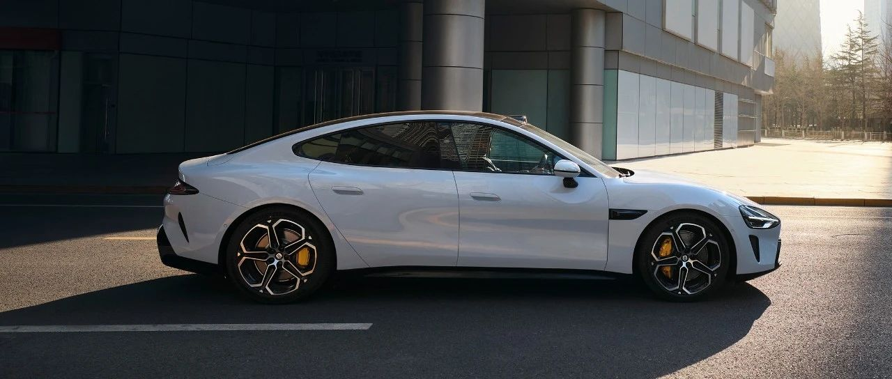

#  小米SU7答网友问（第四十一集）

[ 小米汽车 ](<javascript:void\(0\);>)

______

  

  

**01**  

**雷军18日直播时称，小米路测车要坚持跑到“全生命周期”，这是什么意思呢？**

在2024年5月18日，小米SU7 Pro直播中，雷军提到“15~20万公里”“全生命周期”，被部分网友误解为“小米SU7全生命周期是15~20万公里”。雷军所说的测试是指，小米SU7在标准测试车辆之外，投入了100辆测试车进行的全国公共道路测试。这些车是按照量产标准生产的车型，在完成标准测试后继续加测，并且有部分车辆会加测到15~20万公里，目的是为后续的功能OTA保驾护航，确保大家能持续获得高质量的新功能和更稳定的软硬件协同。在发布后仍然坚持大规模的道路测试，在行业内是十分少见的。实际上小米SU7在正式发布前的测试里程已超过540万公里，目的是在发布前进行充分验证。截至5月19日，小米SU7测试车总累计测试里程更是达到近700万公里，目标是跑到1100万公里。小米SU7投入的测试车辆数量是行业水平的10倍、测试里程是行业水平的2~3倍。小米SU7的耐久性、可靠性是毋庸置疑的，测试量也远超行业水平。

综上，请大家放心，“十倍投入，认认真真造一辆好车”不是一句空话，在大家看不见的幕后，小米汽车每天都在努力，以超出行业标准的高目标为大家造一辆好车，并坚持为新功能进行充分验证，确保产品发布后真正做到常用常新，越用越好用。

**02**  

**小米SU7 Pro续航首测直播，具体能耗表现如何？**

2024年5月18日，小米SU7 Pro进行了续航首测的直播，包括高速路段、城市路段，能耗表现如下：

  * **车辆状态**

    * 小米SU7 Pro（CLTC）续航里程：830km

    * 车内乘客：4人

    * 空调：23℃左右

    * 高速NOA设定速度：110km/h

  * ****** 能耗表现**

    * 出发电量98%、CLTC续航里程812km

    * 到达电量73%、CLTC续航里程598km

    * 实际行驶里程177km

    * **行驶能耗：13.7kWh/100km**

    * **续航保持率：82.7%**

**03**  

**小米SU7的OTA已经宣布陆续推送，为什么我还没有收到更新？**  

小米SU7的OTA升级安装包采取分批次推送策略，大家收到OTA更新提醒的时间可能略有差异。还请大家耐心等待，我们会尽快完成对所有车辆的Xiaomi HyperOS 1.1.2升级推送。

  

**04**  

**小米SU7 Pro的尾标，为什么是SU7而不是SU7 Pro？**

小米SU7 Pro，拥有「超长续航 高阶智驾」，增加了小米智驾Max以及超长续航的能力。未来小米SU7，还会根据用户的需求，存在推出其他衍生版本的可能。所以这一系列的车型，我们遵从行业惯例，尾标均会以统一的「小米SU7」作为展示。

  

  

  

小米SU7答网友问

持续进行中…

[小米SU7答网友问总集（上）：整车产品篇](<http://mp.weixin.qq.com/s?__biz=MzkyNzU3MDI3Nw==&mid=2247489972&idx=1&sn=b8c58d29e1da2eb08549f48262d2fcce&chksm=c22759bef550d0a88c50e70ab4bc59b26ab31ee5e634a52694ee0cc28f08979a4662fe598032&scene=21#wechat_redirect>)

[小米SU7答网友问总集（中）：智能体验篇](<http://mp.weixin.qq.com/s?__biz=MzkyNzU3MDI3Nw==&mid=2247490580&idx=1&sn=c0e685b4d60f817a799fd4594ab294ad&chksm=c2275c1ef550d508549e791b5b0d076288f55ee40a8145ea3642e6f9166aedba8b267cb11051&scene=21#wechat_redirect>)

[小米SU7答网友问总集（下）：交付服务篇](<http://mp.weixin.qq.com/s?__biz=MzkyNzU3MDI3Nw==&mid=2247490603&idx=1&sn=88ef8375987c8a7be5c1bc6b8a42e9f6&chksm=c2275c21f550d537cbed33f14c6062f066a768b19efdaa1fd3b67dc17c1abe494d5cffa15124&scene=21#wechat_redirect>)

[小米SU7答网友问（第四十集）](<http://mp.weixin.qq.com/s?__biz=MzkyNzU3MDI3Nw==&mid=2247490643&idx=1&sn=213f175676280f7958bace8d6d467568&chksm=c2275c59f550d54f201060f9c4c7dd8be6c6bd2737d38aa16cc3ccb85f8b7fd9598e0def18f8&scene=21#wechat_redirect>)

  

  

  

预览时标签不可点

修改于

微信扫一扫  
关注该公众号

继续滑动看下一个

轻触阅读原文

小米汽车 

向上滑动看下一个

[知道了](<javascript:;>)

微信扫一扫  
使用小程序

****

[取消](<javascript:void\(0\);>) [允许](<javascript:void\(0\);>)

****

[取消](<javascript:void\(0\);>) [允许](<javascript:void\(0\);>)

****

[取消](<javascript:void\(0\);>) [允许](<javascript:void\(0\);>)

× 分析

__

微信扫一扫可打开此内容，  
使用完整服务

： ， ， ， ， ， ， ， ， ， ， ， ， 。 视频 小程序 赞 ，轻点两下取消赞 在看 ，轻点两下取消在看 分享 留言 收藏 听过