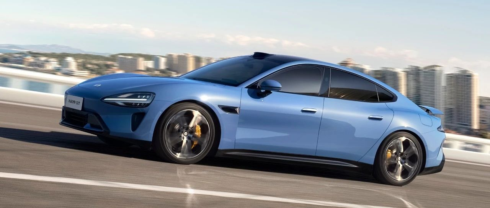

#  小米SU7答网友问（第四十三集）

[ 小米汽车 ](<javascript:void\(0\);>)

______

  

  

****

****

**01**  

**为了提拉小米SU7产能，有什么实质性举措吗？**

为了尽量提升产能，工厂从6月开始会双班生产，6月将确保单月交付破万；

经过5月初的产线改进维护，目前产能提升进展显著，并为进一步提升做好了准备。

同时，经过几轮关键的沟通与动员，供应商伙伴已确保与我们共同提升节奏，共同满足更高的需求。比如，小米SU7标准版在现有弗迪电池之外，新增宁德时代的电池，标准版上的两款电池都是行业头部电芯供应商；

搭载了宁德时代和弗迪电池的小米SU7标准版，续航里程同为700公里（CLTC），15分钟补能也都是350公里，整车和三电系统质保也都完全一致，5月25日0时开始锁单的标准版订单，将随机分配到装配弗迪或宁德时代电芯的小米SU7标准版。

今年全年，我们将确保交付10万辆以上，同时会进一步冲刺12万辆交付。

**02**  

**有用户反馈，分享的副钥匙无法使用最新的智能泊车辅助和直线进出功能，应该如何操作呢？**

每位小米SU7车主共计可分享7个蓝牙钥匙给家人朋友, 若需要分享蓝牙钥匙, 使用遥控泊车辅助和直线召唤功能需要完成以下两项内容:

  * **车主分享流程:**

    * 打开小米汽车APP, 在「车辆」界面中, 选择要授权的车辆, 点击「钥匙与安全」;

    * 进入「钥匙与安全」界面后, 点击「钥匙分享」, 通过手机号码添加想要授权的家人与朋友;

    * 在「添加驾驶员」界面, 确认遥控泊车与手机蓝牙钥匙授权处于选中状态;

    * 点击「添加」并完成二次弹窗确认。

*当车主完成以上步骤, 授权用户将收到两条手机短信提示;

  * **家人朋友创建流程:**

    * 打开小米汽车APP, 进入「车辆」界面中;

    * 收到“XX用户向你分享了车钥匙”的推送后, 点击「立即添加」。  

在进行此项操作时需要注意如下两点:

  * 副钥匙创建时需要车主APP保持开启状态;

  * 副钥匙首次使用时:

    * 需要保证手机网络正常;

    * 在车辆附近时, 打开汽车APP推送链接, 点击配对完成钥匙的连接和认证。

**03**  

**小米SU7的车载5G网络可以在欧洲等国外区域使用吗？**  

小米SU7车载网络服务的网络覆盖范围取决于电信运营商，当前的“车载网络服务包”仅提供中国大陆境内（不含香港特别行政区、澳门特别行政区及台湾地区）的车载网络服务。

**04**  

**升级到端到端代客泊车后，感觉行进速度过快，可否设置限速？**  

目前已经接收到部分用户关于代客泊车辅助升级至端到端版本后速度过快的反馈, 研发团队正在评估车速偏好设定的可能性, 该能力后续将通过OTA进行升级, 敬请期待。

  

  

  

小米SU7答网友问

持续进行中…

[小米SU7答网友问总集（上）：整车产品篇](<http://mp.weixin.qq.com/s?__biz=MzkyNzU3MDI3Nw==&mid=2247489972&idx=1&sn=b8c58d29e1da2eb08549f48262d2fcce&chksm=c22759bef550d0a88c50e70ab4bc59b26ab31ee5e634a52694ee0cc28f08979a4662fe598032&scene=21#wechat_redirect>)

[小米SU7答网友问总集（中）：智能体验篇](<http://mp.weixin.qq.com/s?__biz=MzkyNzU3MDI3Nw==&mid=2247490580&idx=1&sn=c0e685b4d60f817a799fd4594ab294ad&chksm=c2275c1ef550d508549e791b5b0d076288f55ee40a8145ea3642e6f9166aedba8b267cb11051&scene=21#wechat_redirect>)

[小米SU7答网友问总集（下）：交付服务篇](<http://mp.weixin.qq.com/s?__biz=MzkyNzU3MDI3Nw==&mid=2247490603&idx=1&sn=88ef8375987c8a7be5c1bc6b8a42e9f6&chksm=c2275c21f550d537cbed33f14c6062f066a768b19efdaa1fd3b67dc17c1abe494d5cffa15124&scene=21#wechat_redirect>)

[小米SU7答网友问（第四十集）](<http://mp.weixin.qq.com/s?__biz=MzkyNzU3MDI3Nw==&mid=2247490643&idx=1&sn=213f175676280f7958bace8d6d467568&chksm=c2275c59f550d54f201060f9c4c7dd8be6c6bd2737d38aa16cc3ccb85f8b7fd9598e0def18f8&scene=21#wechat_redirect>)

[小米SU7答网友问（第四十一集）](<http://mp.weixin.qq.com/s?__biz=MzkyNzU3MDI3Nw==&mid=2247490710&idx=1&sn=56d9b707c60ba5be5457d884f1013f88&chksm=c2275c9cf550d58a249cdd7bf8ea554d1b19869171a8addb307c4ab9daf17ae6f1a8ec8a190d&scene=21#wechat_redirect>)  

[小米SU7答网友问（第四十二集）](<http://mp.weixin.qq.com/s?__biz=MzkyNzU3MDI3Nw==&mid=2247490735&idx=1&sn=70a61bb524c263198c3db73cd0f4db6c&chksm=c2275ca5f550d5b3eacbf734b503cfdde5466232420a627886309ae897b7ae6cecdea1acc52a&scene=21#wechat_redirect>)

  

  

  

预览时标签不可点

微信扫一扫  
关注该公众号

继续滑动看下一个

轻触阅读原文

小米汽车 

向上滑动看下一个

[知道了](<javascript:;>)

微信扫一扫  
使用小程序

****

[取消](<javascript:void\(0\);>) [允许](<javascript:void\(0\);>)

****

[取消](<javascript:void\(0\);>) [允许](<javascript:void\(0\);>)

****

[取消](<javascript:void\(0\);>) [允许](<javascript:void\(0\);>)

× 分析

__

微信扫一扫可打开此内容，  
使用完整服务

： ， ， ， ， ， ， ， ， ， ， ， ， 。 视频 小程序 赞 ，轻点两下取消赞 在看 ，轻点两下取消在看 分享 留言 收藏 听过