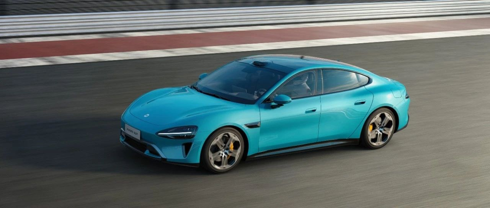

#  小米SU7答网友问（第五十二集）

[ 小米汽车 ](<javascript:void\(0\);>)

______

  

****01****

**小米汽车APP何时支持双端登录？一直双持手机希望有这个功能。**

为了保障用户用车安全，当前小米汽车APP仅支持单设备登录。在新设备登录时，原设备账号会自动登出。

如果有多人同时使用车辆，推荐车主通过分享共同用车人的方式，授权其他用户使用车辆。

  

**02**

**如何设置上车就自动续播音乐呢？**

如果音乐播放过程中离车，下次上车时即可自动续播，在线音乐和蓝牙音乐均可支持。

如果离车前手动暂停音乐，或进入自动泊车状态，再次上车是默认不续播的。

  

**03**

**如何打开停车拍照功能？会拍摄几个方向的照片呢？**

进入**车辆设置 >安全与服务**中找到**「停车拍照」** ，即可开启该功能 。

开启开关后，**下次停车时即会生效** 。

停车后切入p档，车辆会捕捉附近环境照片，并在锁车时统一上传至**小米汽车App** 。车主在**「车辆位置」** 模块即可查看停车照片。

停车拍照共计会拍摄 **5** 张照片，分别为：**俯视、前、后、左、右** 。

在整个泊车过程中，AVM影像如果持续开启，俯视停车照片还会**捕捉到车位号，** 方便您下次更精准找车。

如AVM影像未持续开启，您也可通过前、后、左、右视图中的环境信息，比如立柱上的“A区”、“B区”确认停车位置。

**04**

**如何设置像油车一样，挂倒挡松刹车就能缓慢倒车，而不需要再踩电门踏板呢？**

需要打开**「缓慢行驶」**

请在中控屏下方控制栏打开**设置** ，进入**驾驶偏好 >缓行模式**，即可对缓行模式进行设置。

选择**保持静止** ，车辆在行车过程中或静止状态下（自动驻车未开启）松开加速踏板和制动踏板后，车辆最终会保持静止。

选择**缓慢行驶** ，车辆在行车过程中或静止状态下（自动驻车未开启）松开加速踏板和制动踏板后，车辆最终会缓慢行驶。

  

**05**

**后排Pad可否上车自动亮屏、锁车自动息屏呢？**

在最近推送的OTA 1.2.3版本中，我们优化了后排平板省电策略。上车后，后排平板将开始充电并自动亮屏。离车关门时，后排平板将停止充电，同时屏幕自动熄灭。

  

小米SU7答网友问

持续进行中…

[小米SU7答网友问总集（上）：整车产品篇](<http://mp.weixin.qq.com/s?__biz=MzkyNzU3MDI3Nw==&mid=2247489972&idx=1&sn=b8c58d29e1da2eb08549f48262d2fcce&chksm=c22759bef550d0a88c50e70ab4bc59b26ab31ee5e634a52694ee0cc28f08979a4662fe598032&scene=21#wechat_redirect>)

[小米SU7答网友问总集（中）：智能体验篇](<http://mp.weixin.qq.com/s?__biz=MzkyNzU3MDI3Nw==&mid=2247490580&idx=1&sn=c0e685b4d60f817a799fd4594ab294ad&chksm=c2275c1ef550d508549e791b5b0d076288f55ee40a8145ea3642e6f9166aedba8b267cb11051&scene=21#wechat_redirect>)

[小米SU7答网友问总集（下）：交付服务篇](<http://mp.weixin.qq.com/s?__biz=MzkyNzU3MDI3Nw==&mid=2247490603&idx=1&sn=88ef8375987c8a7be5c1bc6b8a42e9f6&chksm=c2275c21f550d537cbed33f14c6062f066a768b19efdaa1fd3b67dc17c1abe494d5cffa15124&scene=21#wechat_redirect>)

[小米SU7答网友问（第四十集）](<http://mp.weixin.qq.com/s?__biz=MzkyNzU3MDI3Nw==&mid=2247490643&idx=1&sn=213f175676280f7958bace8d6d467568&chksm=c2275c59f550d54f201060f9c4c7dd8be6c6bd2737d38aa16cc3ccb85f8b7fd9598e0def18f8&scene=21#wechat_redirect>)

[小米SU7答网友问（第四十一集）](<http://mp.weixin.qq.com/s?__biz=MzkyNzU3MDI3Nw==&mid=2247490710&idx=1&sn=56d9b707c60ba5be5457d884f1013f88&chksm=c2275c9cf550d58a249cdd7bf8ea554d1b19869171a8addb307c4ab9daf17ae6f1a8ec8a190d&scene=21#wechat_redirect>)  

[小米SU7答网友问（第四十二集）](<http://mp.weixin.qq.com/s?__biz=MzkyNzU3MDI3Nw==&mid=2247490735&idx=1&sn=70a61bb524c263198c3db73cd0f4db6c&chksm=c2275ca5f550d5b3eacbf734b503cfdde5466232420a627886309ae897b7ae6cecdea1acc52a&scene=21#wechat_redirect>)

[小米SU7答网友问（第四十三集）](<http://mp.weixin.qq.com/s?__biz=MzkyNzU3MDI3Nw==&mid=2247490743&idx=1&sn=bffffaf2e910fc0e666a7648ed694fe5&chksm=c2275cbdf550d5ab1bf4c1d6b82c5a1f3b5206ee1a1d05198ae7a8f1af4d59f839dc34fd6ad2&scene=21#wechat_redirect>)

[小米SU7答网友问（第四十四集）](<http://mp.weixin.qq.com/s?__biz=MzkyNzU3MDI3Nw==&mid=2247490748&idx=1&sn=6160b9038c5209a9e64153ebcb2d3807&chksm=c2275cb6f550d5a0e14bab2b01483fad1bcee53889419e318e91d5768d3952c1c7b30ad0e185&scene=21#wechat_redirect>)

[小米SU7答网友问（第四十五集）](<http://mp.weixin.qq.com/s?__biz=MzkyNzU3MDI3Nw==&mid=2247494797&idx=1&sn=a97b403a4ff07ba213987e171f50119b&chksm=c224ac87f5532591b05a0ee18ef74c9372a10feb14481925ce4f496e9e11ef2f8d4b59336092&scene=21#wechat_redirect>)

[小米SU7答网友问（第四十六集）](<http://mp.weixin.qq.com/s?__biz=MzkyNzU3MDI3Nw==&mid=2247496002&idx=1&sn=581d0d1142d93ce150fea3965895558c&chksm=c224b148f553385e5f55cf9d7371f2db2fb70c3b8abb72b00774d4ffd446d16babcf1186ac00&scene=21#wechat_redirect>)

[小米SU7答网友问（第四十七集）](<http://mp.weixin.qq.com/s?__biz=MzkyNzU3MDI3Nw==&mid=2247496007&idx=1&sn=6a421c3b17cc1c65329d05cb32d9623c&chksm=c224b14df553385b03ed46354e48060b3936c02ef2eb6fc0525f42f293750ed873268571d202&scene=21#wechat_redirect>)

[小米SU7答网友问（第四十八集）](<http://mp.weixin.qq.com/s?__biz=MzkyNzU3MDI3Nw==&mid=2247496032&idx=1&sn=55195b432d452da064fcef7d5974a10f&chksm=c224b16af553387ccad87fac4f24947fa2d47458f9582f2346f5e289a8e7eb26a0347b2b811f&scene=21#wechat_redirect>)

[小米SU7答网友问（第四十九集）](<http://mp.weixin.qq.com/s?__biz=MzkyNzU3MDI3Nw==&mid=2247496197&idx=2&sn=20d2997ddaa8b4acd48320f29c065d02&chksm=c224b20ff5533b1970b474d54e1c45dc70270641db75757bc54f82d4eb96112b4acb25ec8ed3&scene=21#wechat_redirect>)

[小米SU7答网友问（第五十集）](<http://mp.weixin.qq.com/s?__biz=MzkyNzU3MDI3Nw==&mid=2247496220&idx=2&sn=8e78ba969d5a735cdcb52f80ed1ff8f4&chksm=c224b216f5533b002a0f73b964f8bc4c6789e5394dbab1a39f114d627bbe28bfcc054d08e868&scene=21#wechat_redirect>)

[小米SU7答网友问（第五十一集）](<http://mp.weixin.qq.com/s?__biz=MzkyNzU3MDI3Nw==&mid=2247496229&idx=2&sn=205628e113bd59563b8fe2132e536723&chksm=c224b22ff5533b39d44cd21f0e85fe29d7cc19e6541ccfbd8167999fddededf1f47f0144005a&scene=21#wechat_redirect>)

  

  

预览时标签不可点

修改于

微信扫一扫  
关注该公众号

继续滑动看下一个

轻触阅读原文

小米汽车 

向上滑动看下一个

[知道了](<javascript:;>)

微信扫一扫  
使用小程序

****

[取消](<javascript:void\(0\);>) [允许](<javascript:void\(0\);>)

****

[取消](<javascript:void\(0\);>) [允许](<javascript:void\(0\);>)

****

[取消](<javascript:void\(0\);>) [允许](<javascript:void\(0\);>)

× 分析

__

微信扫一扫可打开此内容，  
使用完整服务

： ， ， ， ， ， ， ， ， ， ， ， ， 。 视频 小程序 赞 ，轻点两下取消赞 在看 ，轻点两下取消在看 分享 留言 收藏 听过