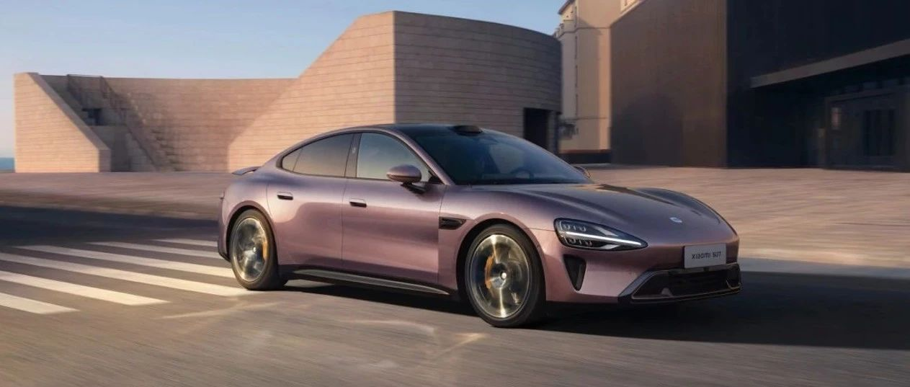
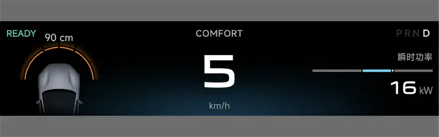

#  小米SU7答网友问（第五十七集）

[ 小米汽车 ](<javascript:void\(0\);>)

______

  

****01****

**NOA和低速碰撞预警等环节，是否有语音提示，能否进行打开与关闭设置？**

如NOA等智能行车功能，激活中的语音提示风格可以在车机「设置-辅助驾驶-小爱行车播报」中进行选择。目前支持关闭、简洁和详细三种模式。

PAS「低速防碰撞预警」是当车辆低速前进或倒车时，通过车辆雷达对本车周围的障碍物进行探测，并在车辆与障碍物存在碰撞风险时，通过声音和视觉方式提醒驾驶员，辅助驾驶员通过狭窄道路和确保倒车安全的一项功能。

为了提高行车安全性，减少交通事故的发生，该提示暂不支持关闭。驾驶员在驾驶过程中应保持对该系统的关注，并根据系统的提示及时做出反应。

**  
**

**02**

**小米SU7最大涉水深度是多少？**

在车辆涉水驾驶前，应先检查水深，以确保车辆能够安全通过。当无法判断路面水深时，建议绕行而非冒然强行通过。

小米SU7在半载状态下（乘员150kg+行李30kg），车辆最大涉水深度为350mm（相当于车轮轮心高度）。如意外超过该水深，建议立即联系售后进行车辆状态检查。

当车辆通过静止水面时，车速建议控制在5-7km/h。经过流动水面时，需更加小心。

**  
**

**03**

**雨天涉水行驶有什么注意事项？涉水后需要检查什么？**

车辆在雨天道路或湿滑路面行驶时，请务必降低车速并小心驾驶。尽量避免紧急制动、急加速或急打方向盘等可能会导致车辆难以控制，发生事故的操作。雨天驾驶要及时对汽车玻璃进行除雾，避免影响驾驶员视线。

特别提醒：车辆涉水只是为了避险。建议用户不要故意涉水，更不要高速涉水，以免带来额外的安全隐患。此外，涉水时若车速过高，也有可能面临车辆外饰件及车底护板冲脱的风险。

正常车辆涉水后，也建议用户对以下项目进行自行检查。若发现问题，可联系小米汽车服务中心进行检查：

  * 轻踩制动踏板（摩擦产生的热可使制动片变得干燥），并检查制动器是否正常工作；

  * 检查喇叭是否工作；

  * 转动方向盘以检查转向助力是否正常；

  * 检查外部车灯是否工常；

  * 在涉水路行驶发现车辆进水后，请勿继续使用车辆并立即联系小米汽车服务中心进行检查。

  

**04**

**“锁单等待用户关怀”只能收到一次吗，还是后续隔一段时间还继续有？**

锁单等待用户关怀活动，是小米汽车为了感谢已锁单未交付的用户的耐心等待，在满足三个月后不定期寄送车商城小商品作为关怀礼品的活动。

目前已确定的小礼品为：用户参与活动后，锁单等待周期满足三个月的用户赠送Xiaomi Life休闲小背包；锁单等待周期满足四个月的用户赠送Xiaomi Life防晒空顶帽。

**  
**

**05**

**NOA或LCC模式下，能否调整车辆的驾驶模式？**

目前在NOA或LCC模式下，不能调整车辆的驾驶模式。

  

小米SU7答网友问

持续进行中…

[小米SU7答网友问总集（上）：整车产品篇](<http://mp.weixin.qq.com/s?__biz=MzkyNzU3MDI3Nw==&mid=2247489972&idx=1&sn=b8c58d29e1da2eb08549f48262d2fcce&chksm=c22759bef550d0a88c50e70ab4bc59b26ab31ee5e634a52694ee0cc28f08979a4662fe598032&scene=21#wechat_redirect>)

[小米SU7答网友问总集（中）：智能体验篇](<http://mp.weixin.qq.com/s?__biz=MzkyNzU3MDI3Nw==&mid=2247490580&idx=1&sn=c0e685b4d60f817a799fd4594ab294ad&chksm=c2275c1ef550d508549e791b5b0d076288f55ee40a8145ea3642e6f9166aedba8b267cb11051&scene=21#wechat_redirect>)

[小米SU7答网友问总集（下）：交付服务篇](<http://mp.weixin.qq.com/s?__biz=MzkyNzU3MDI3Nw==&mid=2247490603&idx=1&sn=88ef8375987c8a7be5c1bc6b8a42e9f6&chksm=c2275c21f550d537cbed33f14c6062f066a768b19efdaa1fd3b67dc17c1abe494d5cffa15124&scene=21#wechat_redirect>)

[小米SU7答网友问（第四十集）](<http://mp.weixin.qq.com/s?__biz=MzkyNzU3MDI3Nw==&mid=2247490643&idx=1&sn=213f175676280f7958bace8d6d467568&chksm=c2275c59f550d54f201060f9c4c7dd8be6c6bd2737d38aa16cc3ccb85f8b7fd9598e0def18f8&scene=21#wechat_redirect>)

[小米SU7答网友问（第四十一集）](<http://mp.weixin.qq.com/s?__biz=MzkyNzU3MDI3Nw==&mid=2247490710&idx=1&sn=56d9b707c60ba5be5457d884f1013f88&chksm=c2275c9cf550d58a249cdd7bf8ea554d1b19869171a8addb307c4ab9daf17ae6f1a8ec8a190d&scene=21#wechat_redirect>)  

[小米SU7答网友问（第四十二集）](<http://mp.weixin.qq.com/s?__biz=MzkyNzU3MDI3Nw==&mid=2247490735&idx=1&sn=70a61bb524c263198c3db73cd0f4db6c&chksm=c2275ca5f550d5b3eacbf734b503cfdde5466232420a627886309ae897b7ae6cecdea1acc52a&scene=21#wechat_redirect>)

[小米SU7答网友问（第四十三集）](<http://mp.weixin.qq.com/s?__biz=MzkyNzU3MDI3Nw==&mid=2247490743&idx=1&sn=bffffaf2e910fc0e666a7648ed694fe5&chksm=c2275cbdf550d5ab1bf4c1d6b82c5a1f3b5206ee1a1d05198ae7a8f1af4d59f839dc34fd6ad2&scene=21#wechat_redirect>)

[小米SU7答网友问（第四十四集）](<http://mp.weixin.qq.com/s?__biz=MzkyNzU3MDI3Nw==&mid=2247490748&idx=1&sn=6160b9038c5209a9e64153ebcb2d3807&chksm=c2275cb6f550d5a0e14bab2b01483fad1bcee53889419e318e91d5768d3952c1c7b30ad0e185&scene=21#wechat_redirect>)

[小米SU7答网友问（第四十五集）](<http://mp.weixin.qq.com/s?__biz=MzkyNzU3MDI3Nw==&mid=2247494797&idx=1&sn=a97b403a4ff07ba213987e171f50119b&chksm=c224ac87f5532591b05a0ee18ef74c9372a10feb14481925ce4f496e9e11ef2f8d4b59336092&scene=21#wechat_redirect>)

[小米SU7答网友问（第四十六集）](<http://mp.weixin.qq.com/s?__biz=MzkyNzU3MDI3Nw==&mid=2247496002&idx=1&sn=581d0d1142d93ce150fea3965895558c&chksm=c224b148f553385e5f55cf9d7371f2db2fb70c3b8abb72b00774d4ffd446d16babcf1186ac00&scene=21#wechat_redirect>)

[小米SU7答网友问（第四十七集）](<http://mp.weixin.qq.com/s?__biz=MzkyNzU3MDI3Nw==&mid=2247496007&idx=1&sn=6a421c3b17cc1c65329d05cb32d9623c&chksm=c224b14df553385b03ed46354e48060b3936c02ef2eb6fc0525f42f293750ed873268571d202&scene=21#wechat_redirect>)

[小米SU7答网友问（第四十八集）](<http://mp.weixin.qq.com/s?__biz=MzkyNzU3MDI3Nw==&mid=2247496032&idx=1&sn=55195b432d452da064fcef7d5974a10f&chksm=c224b16af553387ccad87fac4f24947fa2d47458f9582f2346f5e289a8e7eb26a0347b2b811f&scene=21#wechat_redirect>)

[小米SU7答网友问（第四十九集）](<http://mp.weixin.qq.com/s?__biz=MzkyNzU3MDI3Nw==&mid=2247496197&idx=2&sn=20d2997ddaa8b4acd48320f29c065d02&chksm=c224b20ff5533b1970b474d54e1c45dc70270641db75757bc54f82d4eb96112b4acb25ec8ed3&scene=21#wechat_redirect>)

[小米SU7答网友问（第五十集）](<http://mp.weixin.qq.com/s?__biz=MzkyNzU3MDI3Nw==&mid=2247496220&idx=2&sn=8e78ba969d5a735cdcb52f80ed1ff8f4&chksm=c224b216f5533b002a0f73b964f8bc4c6789e5394dbab1a39f114d627bbe28bfcc054d08e868&scene=21#wechat_redirect>)

[小米SU7答网友问（第五十一集）](<http://mp.weixin.qq.com/s?__biz=MzkyNzU3MDI3Nw==&mid=2247496229&idx=2&sn=205628e113bd59563b8fe2132e536723&chksm=c224b22ff5533b39d44cd21f0e85fe29d7cc19e6541ccfbd8167999fddededf1f47f0144005a&scene=21#wechat_redirect>)

[小米SU7答网友问（第五十二集）](<http://mp.weixin.qq.com/s?__biz=MzkyNzU3MDI3Nw==&mid=2247496282&idx=2&sn=47a3e261e951d6f3ab3d32aed082b87a&chksm=c224b250f5533b46ffe02af67695f42360ad3edc1633fe9908efe07ece32baefbd5c7dae856b&scene=21#wechat_redirect>)

[小米SU7答网友问（第五十三集）](<http://mp.weixin.qq.com/s?__biz=MzkyNzU3MDI3Nw==&mid=2247496286&idx=1&sn=338b1ac90677a8dff55e43361658ec8e&chksm=c224b254f5533b42f34681c6d20794a0dff7bf8f3e7f35828d9b6d8d538d924f88949577b67f&scene=21#wechat_redirect>)

[小米SU7答网友问（第五十四集）](<http://mp.weixin.qq.com/s?__biz=MzkyNzU3MDI3Nw==&mid=2247496291&idx=1&sn=c8034dd43f1eab55c8c787131c82a81c&chksm=c224b269f5533b7f804d8eaaee982f6350e000b81a16b735b363f2cddc12e02c39157a1bd9d5&scene=21#wechat_redirect>)

[小米SU7答网友问（第五十五集）](<http://mp.weixin.qq.com/s?__biz=MzkyNzU3MDI3Nw==&mid=2247496295&idx=1&sn=0154fdb6e96799d53aa9650c55e0a7b3&chksm=c224b26df5533b7b3a5f79dda08eb4db2645d19796447c89850a61a5f18454338883a09c699a&scene=21#wechat_redirect>)

[小米SU7答网友问（第五十六集）](<http://mp.weixin.qq.com/s?__biz=MzkyNzU3MDI3Nw==&mid=2247496301&idx=1&sn=693cd3bf9e6ebd6e786e7954c4a54d2b&chksm=c224b267f5533b71beb167a4cbcfb74da91bfb970f6233c3d729b7ef0a2f766764bcfc6d861d&scene=21#wechat_redirect>)

  

  

预览时标签不可点

微信扫一扫  
关注该公众号

继续滑动看下一个

轻触阅读原文

小米汽车 

向上滑动看下一个

[知道了](<javascript:;>)

微信扫一扫  
使用小程序

****

[取消](<javascript:void\(0\);>) [允许](<javascript:void\(0\);>)

****

[取消](<javascript:void\(0\);>) [允许](<javascript:void\(0\);>)

****

[取消](<javascript:void\(0\);>) [允许](<javascript:void\(0\);>)

× 分析

__

微信扫一扫可打开此内容，  
使用完整服务

： ， ， ， ， ， ， ， ， ， ， ， ， 。 视频 小程序 赞 ，轻点两下取消赞 在看 ，轻点两下取消在看 分享 留言 收藏 听过