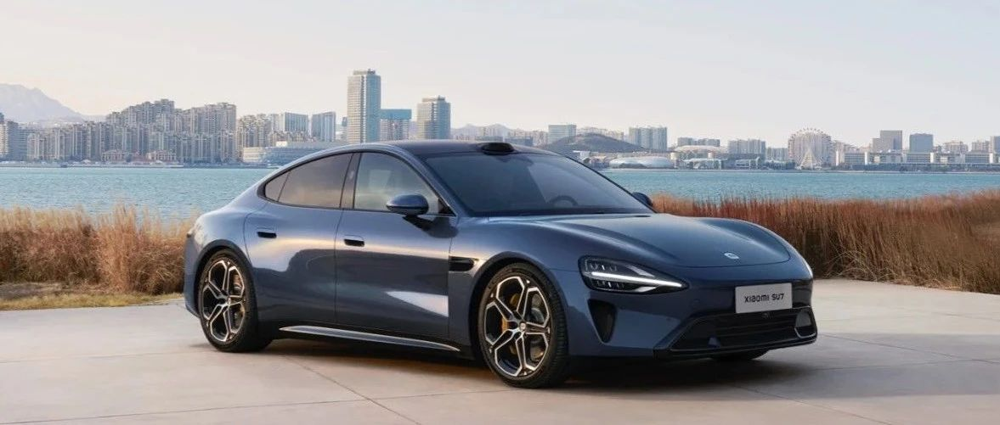

#  小米SU7答网友问（第六十三集）

[ 小米汽车 ](<javascript:void\(0\);>)

______

  

****01****

**小米汽车真的要推出对开门设计的车型么？**

小米汽车坚持从底层核心技术出发，十倍投入，认认真真造一辆好车。所以大家会看到很多小米汽车相关的专利信息，包括对开门设计也是小米汽车预研技术储备之一。技术储备并不代表一定要量产，请大家以官方公布信息为准。

汽车研发周期很长，新技术应用需要提前布局。2023年底的小米汽车技术发布会，我们第一次给大家分享了小米汽车在电池包、电驱、大压铸、智能驾驶和智能座舱方面的进展，其中就包含了很多已量产、在量产和预研的技术或功能。

2024年世界知识产权日，我们公布了小米的技术创新与知识产权成果：截至2023年底，小米全球授权专利数已超3.7万件，已申请正在审查的还有3万件。

**  
**

**02**  

**最新OTA中的红绿灯提醒功能，实际使用中提醒总是慢1-2秒，这是为什么？**

红绿灯提醒功能设计本意，是为了在跟车或等红灯时，驾驶员出现分神情况未及时起步时进行提醒。当驾驶员正常专注驾驶和起步时，则不触发提醒。因此并非功能延迟。

红绿灯提醒功能包含闯红灯提醒及绿灯起步提醒。系统通过前向摄像头识别本车所在车道标线及红绿灯的状态，判断车辆行驶方向意图。当驾驶员存在闯红灯风险，或在绿灯亮起后未及时起步的情况下发出提醒。

绿灯起步提醒：在红灯路口停车，当交通信号灯变为绿灯后，车辆未在一定时长内起步 (约1.5s)，中控屏幕即会显示“绿灯请通行”的文字提示并发出声音提醒。目前仅支持部分带直行车道标线的车道。

这里也要为大家强调——红绿灯提醒功能作为一种安全辅助功能，无法代替驾驶员的目视检查。驾驶员需要在驾驶过程中始终保持注意力，避免过度依赖或误用该功能，确保驾驶安全。关于红绿灯提醒功能的更多信息请参考用户手册。

**  
**

**03**

**小米汽车有新的交付中心的规划么？**

我们正加速渠道建设，争取尽早为广大米粉朋友带来更便利的看车、购车、交车、用车体验。

预计2024年年底将会建成53座交付中心，基本可覆盖大部分省会城市。

同时2025年交付中心建设也正在规划中，欢迎您留言提供更多参考建议。

**  
**

**04**

**哪些情况下无法唤醒小爱同学？**

车载「小爱同学」能够进行超多场景的深度智能控车，一句话即能实现人车家互联。

在少数场景下存在行车干扰隐患时，「小爱同学」无法被正常唤醒，如：语音电话呼叫与通话中、全景影像使用中、智能泊车使用中、报警弹窗时、关闭对应音区的语音唤醒时、未允许访问麦克风权限时。

「小爱同学」作为人工智能助手，进行了非常严谨的安全设计，以期在大幅提升用车便利性的同时，避免引发用车安全风险。

**  
**

**05**

**车机高德地图能否跟手机登录相同账号，使用类似“输入号牌规避限行”等功能？**

目前建议有限行需求的用户，使用手机高德地图的“限行提醒、规划避开限行路线”功能，在手机上规划好路线后流转到汽车，支持以下两种方式：

  * 手机地图发送路线：在手机高德地图路线规划界面，点击左下角“车机”按钮发送到车机。（需手机和车机地图登陆相同高德账号）

  * Xiaomi HyperOS 导航流转：使用Xiaomi HyperOS系统的用户，当您在手机端高德地图APP进行选点、规划路线、发起导航时，车机端地图会实时同步。无需在车机端进行任何操作，即可无缝流转。即使上车前在车外进行了相关操作，上车后也可自动同步。（需手机与车机登录相同的小米账号）

小米SU7答网友问

持续进行中…

[小米SU7答网友问总集（上）：整车产品篇](<http://mp.weixin.qq.com/s?__biz=MzkyNzU3MDI3Nw==&mid=2247489972&idx=1&sn=b8c58d29e1da2eb08549f48262d2fcce&chksm=c22759bef550d0a88c50e70ab4bc59b26ab31ee5e634a52694ee0cc28f08979a4662fe598032&scene=21#wechat_redirect>)

[小米SU7答网友问总集（中）：智能体验篇](<http://mp.weixin.qq.com/s?__biz=MzkyNzU3MDI3Nw==&mid=2247490580&idx=1&sn=c0e685b4d60f817a799fd4594ab294ad&chksm=c2275c1ef550d508549e791b5b0d076288f55ee40a8145ea3642e6f9166aedba8b267cb11051&scene=21#wechat_redirect>)

[小米SU7答网友问总集（下）：交付服务篇](<http://mp.weixin.qq.com/s?__biz=MzkyNzU3MDI3Nw==&mid=2247490603&idx=1&sn=88ef8375987c8a7be5c1bc6b8a42e9f6&chksm=c2275c21f550d537cbed33f14c6062f066a768b19efdaa1fd3b67dc17c1abe494d5cffa15124&scene=21#wechat_redirect>)

[小米SU7答网友问（第四十集）](<http://mp.weixin.qq.com/s?__biz=MzkyNzU3MDI3Nw==&mid=2247490643&idx=1&sn=213f175676280f7958bace8d6d467568&chksm=c2275c59f550d54f201060f9c4c7dd8be6c6bd2737d38aa16cc3ccb85f8b7fd9598e0def18f8&scene=21#wechat_redirect>)

[小米SU7答网友问（第四十一集）](<http://mp.weixin.qq.com/s?__biz=MzkyNzU3MDI3Nw==&mid=2247490710&idx=1&sn=56d9b707c60ba5be5457d884f1013f88&chksm=c2275c9cf550d58a249cdd7bf8ea554d1b19869171a8addb307c4ab9daf17ae6f1a8ec8a190d&scene=21#wechat_redirect>)  

[小米SU7答网友问（第四十二集）](<http://mp.weixin.qq.com/s?__biz=MzkyNzU3MDI3Nw==&mid=2247490735&idx=1&sn=70a61bb524c263198c3db73cd0f4db6c&chksm=c2275ca5f550d5b3eacbf734b503cfdde5466232420a627886309ae897b7ae6cecdea1acc52a&scene=21#wechat_redirect>)

[小米SU7答网友问（第四十三集）](<http://mp.weixin.qq.com/s?__biz=MzkyNzU3MDI3Nw==&mid=2247490743&idx=1&sn=bffffaf2e910fc0e666a7648ed694fe5&chksm=c2275cbdf550d5ab1bf4c1d6b82c5a1f3b5206ee1a1d05198ae7a8f1af4d59f839dc34fd6ad2&scene=21#wechat_redirect>)

[小米SU7答网友问（第四十四集）](<http://mp.weixin.qq.com/s?__biz=MzkyNzU3MDI3Nw==&mid=2247490748&idx=1&sn=6160b9038c5209a9e64153ebcb2d3807&chksm=c2275cb6f550d5a0e14bab2b01483fad1bcee53889419e318e91d5768d3952c1c7b30ad0e185&scene=21#wechat_redirect>)

[小米SU7答网友问（第四十五集）](<http://mp.weixin.qq.com/s?__biz=MzkyNzU3MDI3Nw==&mid=2247494797&idx=1&sn=a97b403a4ff07ba213987e171f50119b&chksm=c224ac87f5532591b05a0ee18ef74c9372a10feb14481925ce4f496e9e11ef2f8d4b59336092&scene=21#wechat_redirect>)

[小米SU7答网友问（第四十六集）](<http://mp.weixin.qq.com/s?__biz=MzkyNzU3MDI3Nw==&mid=2247496002&idx=1&sn=581d0d1142d93ce150fea3965895558c&chksm=c224b148f553385e5f55cf9d7371f2db2fb70c3b8abb72b00774d4ffd446d16babcf1186ac00&scene=21#wechat_redirect>)

[小米SU7答网友问（第四十七集）](<http://mp.weixin.qq.com/s?__biz=MzkyNzU3MDI3Nw==&mid=2247496007&idx=1&sn=6a421c3b17cc1c65329d05cb32d9623c&chksm=c224b14df553385b03ed46354e48060b3936c02ef2eb6fc0525f42f293750ed873268571d202&scene=21#wechat_redirect>)

[小米SU7答网友问（第四十八集）](<http://mp.weixin.qq.com/s?__biz=MzkyNzU3MDI3Nw==&mid=2247496032&idx=1&sn=55195b432d452da064fcef7d5974a10f&chksm=c224b16af553387ccad87fac4f24947fa2d47458f9582f2346f5e289a8e7eb26a0347b2b811f&scene=21#wechat_redirect>)

[小米SU7答网友问（第四十九集）](<http://mp.weixin.qq.com/s?__biz=MzkyNzU3MDI3Nw==&mid=2247496197&idx=2&sn=20d2997ddaa8b4acd48320f29c065d02&chksm=c224b20ff5533b1970b474d54e1c45dc70270641db75757bc54f82d4eb96112b4acb25ec8ed3&scene=21#wechat_redirect>)

[小米SU7答网友问（第五十集）](<http://mp.weixin.qq.com/s?__biz=MzkyNzU3MDI3Nw==&mid=2247496220&idx=2&sn=8e78ba969d5a735cdcb52f80ed1ff8f4&chksm=c224b216f5533b002a0f73b964f8bc4c6789e5394dbab1a39f114d627bbe28bfcc054d08e868&scene=21#wechat_redirect>)

[小米SU7答网友问（第五十一集）](<http://mp.weixin.qq.com/s?__biz=MzkyNzU3MDI3Nw==&mid=2247496229&idx=2&sn=205628e113bd59563b8fe2132e536723&chksm=c224b22ff5533b39d44cd21f0e85fe29d7cc19e6541ccfbd8167999fddededf1f47f0144005a&scene=21#wechat_redirect>)

[小米SU7答网友问（第五十二集）](<http://mp.weixin.qq.com/s?__biz=MzkyNzU3MDI3Nw==&mid=2247496282&idx=2&sn=47a3e261e951d6f3ab3d32aed082b87a&chksm=c224b250f5533b46ffe02af67695f42360ad3edc1633fe9908efe07ece32baefbd5c7dae856b&scene=21#wechat_redirect>)

[小米SU7答网友问（第五十三集）](<http://mp.weixin.qq.com/s?__biz=MzkyNzU3MDI3Nw==&mid=2247496286&idx=1&sn=338b1ac90677a8dff55e43361658ec8e&chksm=c224b254f5533b42f34681c6d20794a0dff7bf8f3e7f35828d9b6d8d538d924f88949577b67f&scene=21#wechat_redirect>)

[小米SU7答网友问（第五十四集）](<http://mp.weixin.qq.com/s?__biz=MzkyNzU3MDI3Nw==&mid=2247496291&idx=1&sn=c8034dd43f1eab55c8c787131c82a81c&chksm=c224b269f5533b7f804d8eaaee982f6350e000b81a16b735b363f2cddc12e02c39157a1bd9d5&scene=21#wechat_redirect>)

[小米SU7答网友问（第五十五集）](<http://mp.weixin.qq.com/s?__biz=MzkyNzU3MDI3Nw==&mid=2247496295&idx=1&sn=0154fdb6e96799d53aa9650c55e0a7b3&chksm=c224b26df5533b7b3a5f79dda08eb4db2645d19796447c89850a61a5f18454338883a09c699a&scene=21#wechat_redirect>)

[小米SU7答网友问（第五十六集）](<http://mp.weixin.qq.com/s?__biz=MzkyNzU3MDI3Nw==&mid=2247496301&idx=1&sn=693cd3bf9e6ebd6e786e7954c4a54d2b&chksm=c224b267f5533b71beb167a4cbcfb74da91bfb970f6233c3d729b7ef0a2f766764bcfc6d861d&scene=21#wechat_redirect>)

[小米SU7答网友问（第五十七集）](<http://mp.weixin.qq.com/s?__biz=MzkyNzU3MDI3Nw==&mid=2247496307&idx=1&sn=5e54c73955cbe723bc7bd2b166b1b89e&chksm=c224b279f5533b6f6086fa0a188746749f93e1694da1eeed0792a7c815fd79ecffe5dbb4d90a&scene=21#wechat_redirect>)

[小米SU7答网友问（第五十八集）](<http://mp.weixin.qq.com/s?__biz=MzkyNzU3MDI3Nw==&mid=2247496314&idx=2&sn=9b56033d82836fc6528c36e5a53cf0e8&chksm=c224b270f5533b662a8d92612a43e53790adb94443ef8f3399a2c5bcad6f97ab14c4d4dd8c65&scene=21#wechat_redirect>)

[小米SU7答网友问（第五十九集）](<http://mp.weixin.qq.com/s?__biz=MzkyNzU3MDI3Nw==&mid=2247496334&idx=2&sn=f94b71afc1c375a3bb272b5b58413ac6&chksm=c224b284f5533b926f371534c2a7ac665948630edd4043d62d65634e17e6513f448803bc09a6&scene=21#wechat_redirect>)

[小米SU7答网友问（第六十集）](<http://mp.weixin.qq.com/s?__biz=MzkyNzU3MDI3Nw==&mid=2247496343&idx=2&sn=f9fb0417e91c27bb56bca004782933e2&chksm=c224b29df5533b8b3f54e292ffe7ca3d0b1d46e4b1f19616965e99767eb131be070042df6b01&scene=21#wechat_redirect>)

[小米SU7答网友问（第六十一集）](<http://mp.weixin.qq.com/s?__biz=MzkyNzU3MDI3Nw==&mid=2247496368&idx=1&sn=ab0ff55f2076b79349aa1968ea7e01dc&chksm=c224b2baf5533bac4da5e3537330796dd0f2eddf1bedcc4523954fa451ad5644fbcac3f3831a&scene=21#wechat_redirect>)

[小米SU7答网友问（第六十二集）](<http://mp.weixin.qq.com/s?__biz=MzkyNzU3MDI3Nw==&mid=2247497034&idx=1&sn=31c6e5ee21038008f69626f8a86c2be9&chksm=c224b540f5533c56776c271d5715b4bfabb3bd799e8c0439a5a116989a4bb839ef34b33f8e8f&scene=21#wechat_redirect>)

  

  

预览时标签不可点

微信扫一扫  
关注该公众号

继续滑动看下一个

轻触阅读原文

小米汽车 

向上滑动看下一个

[知道了](<javascript:;>)

微信扫一扫  
使用小程序

****

[取消](<javascript:void\(0\);>) [允许](<javascript:void\(0\);>)

****

[取消](<javascript:void\(0\);>) [允许](<javascript:void\(0\);>)

****

[取消](<javascript:void\(0\);>) [允许](<javascript:void\(0\);>)

× 分析

__

微信扫一扫可打开此内容，  
使用完整服务

： ， ， ， ， ， ， ， ， ， ， ， ， 。 视频 小程序 赞 ，轻点两下取消赞 在看 ，轻点两下取消在看 分享 留言 收藏 听过