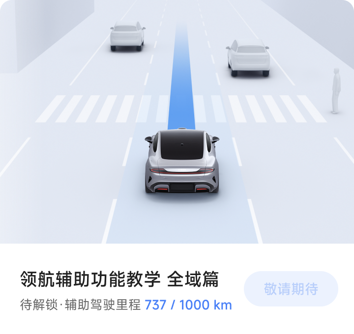
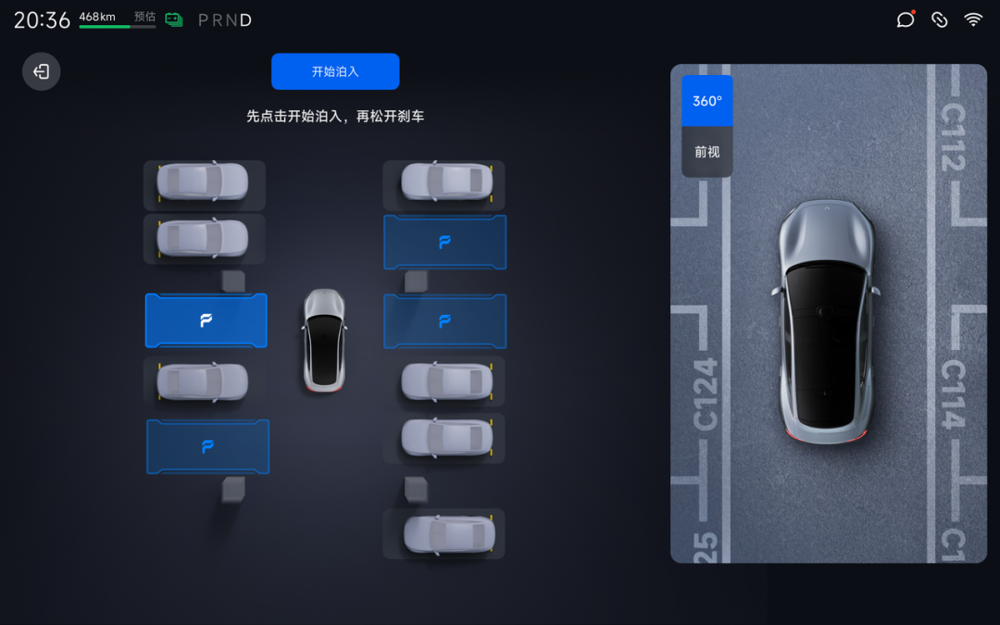
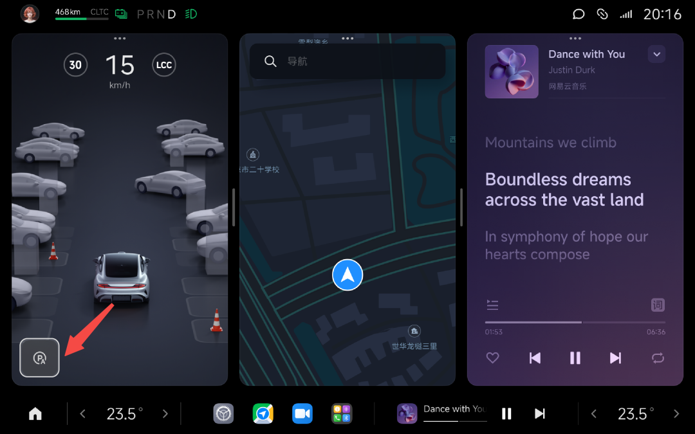
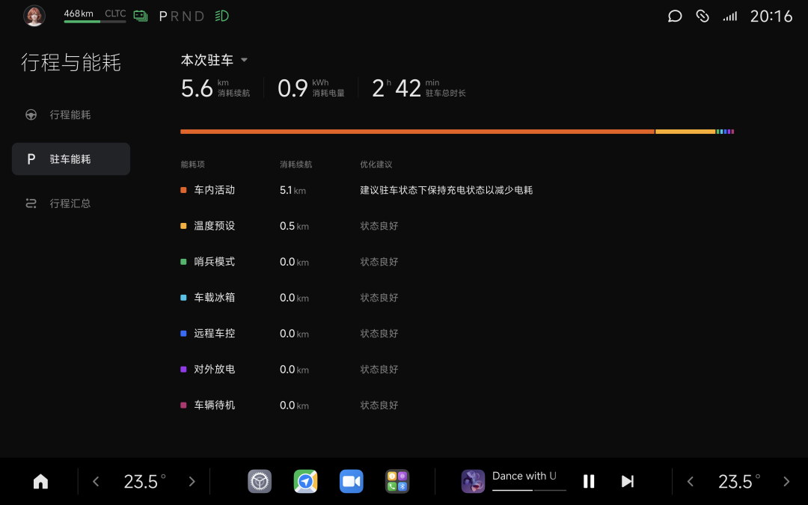

#  小米SU7答网友问（第六十九集）

[ 小米汽车 ](<javascript:void\(0\);>)

______

****  
****

****01****

**1.3.0版本升级了哪些智能驾驶功能？**

1.3.0版本优化了「小路通行」功能，升级后车辆具备对周围环境精细建模能力，尽可能还原真实路况路情；车辆在博弈过程中能够恰当拿捏尺度，实现跨线避让、车道内避让、借道避让、超车变道等驾驶行为，保证安全基础上绕行更灵活、自然。

优化了纵向功能，即进行了速度优化，应对逆向车辆、行人、三轮车，及车辆横穿、并行、加塞等场景，能更柔和、稳定减速和避让。

优化了路口限速逻辑，在保证安全的基础上提升路口通行效率。

优化了路口场景下的选道逻辑，减少方向盘摆动以及驶入逆向车道频次，路口通过更拟人。

优化了左右转通行，轨迹更合理、路口通行更流畅。

**  
**

**02**

**升级到1.3.0之后，在哪里可以查询智驾里程？**

**小米SU7 升级到1.3.0、且小米汽车APP 更新至最新版本** （安卓系统 1.6.0 / iOS系统 1.6.2）后，可通过“小米汽车APP-我的-智驾专区”进行「智驾数据」查询，查阅您**所绑定车辆** 的智驾总里程、智驾行车数据、行车功能里程占比、行车功能时长占比、智驾泊车数据在内的多维度数据信息，并可一键生成海报进行分享。

**  
**

**03**

**为什么APP显示的智驾总里程数超过1000km仍无法开启城市NOA？如何才能获得城市NOA功能？**

智驾里程可通过“小米汽车APP-我的-智驾专区”进行**所绑定车辆** 的「智驾数据」查询。

城市NOA功能解锁情况可通过**“智驾学堂-领航辅助全域篇功能教学”** 进行查询，该处所显示的智驾里程为**个人账号的安全智驾里程。**

考虑到多位驾驶员共同使用同一台车的情况，出于安全考量，需要驾驶员个人的**小米汽车APP账号安全智驾里程达到1000km** ，并完成智驾学堂学习后，才可开启城市领航辅助驾驶功能。

**  
**

**04**

**新更新的机械库位泊车如何使用？有哪些注意事项？**

机械库位和普通车位相比，泊车难度更大。核心挑战来自于机械库位内槽的宽度可能只有2.05米，单边的调整余地只有0.05米。其次来自于库位口前的工字钢立柱。工字钢立柱是机械库位口前的固定支撑，泊车时，工字钢与车身的距离很近，在后视镜折叠的情况下，只有不到10cm左右的空间供车主微调。这意味着，车辆自动泊入的精度要求被推向了新的高度。

机械库位泊车使用方法：

  * 首先，当车辆车速低于15km/h时，中控屏上会显示泊车入口，在屏幕上点击智能泊车按键，进入智能泊车辅助功能。请注意，如车辆搭载主动尾翼，请您在体验功能前降下尾翼，避免因尾翼遮挡摄像头视野导致泊车失败。

  * 当系统发现车位时，泊车界面内车位将以蓝色高亮状态显示，并文字提示“如需泊入，请先踩住刹车”，避免因提前松开刹车导致的溜车或者剐蹭事故。

  * 当驾驶员踩下制动踏板，在中控屏上点击或确认想要泊入的车位后，在中控屏点击开始泊入按键，当系统提示“开始泊车了，请注意周边环境安全”后，方可松开制动踏板和方向盘，系统即可帮助您将车辆泊入车位。

  * 待车辆泊入车位后，车辆自动挂入P挡开启驻车制动，泊车完成，同时中控屏将提醒泊车完成并自动退出泊车界面。

机械车位由于空间极窄，泊入难度较高，使用过程中请注意以下事项：

  * 小米SU7 Pro 和小米SU7 Max 版本车辆在泊入开始前，**要留意尾翼是否降下** ，否则会因为尾翼遮挡摄像头视野而导致泊车失败。

  * 泊入过程中，需要您密切观察周围障碍物，切勿依赖系统功能。如有潜在风险，请您及时通过刹车等方式接管，保障车辆安全，避免车辆与障碍物发生碰撞或车辆间剐蹭事故。**需要您密切关注的障碍物包括不限于：细小的柱子、金属链条、托板边缘。**

  * 机械车位泊入后，需要注意车辆在托板上有溜车风险，并确保托板升起后车头与顶部横梁无碰撞风险。

  

**  
**

**05**

**1.3.0更新的“能耗显示分类”具体有什么用？**

近日推送的1.3.0版本新增了「驻车能耗」统计，可查看“本次驻车”及“自充电后”的驻车电耗数据，即提供挂P挡情况下所有能耗分析，使能耗透明化。

我们发现电车用户对于电耗关注度很高，且存在很多疑问，比如：“车停了一晚上，为什么会掉电？”，“驻车状态下，电掉到了哪里？”。诸如上述问题，用户现在都可以通过“行程与能耗-驻车能耗”页面进行「能耗项」查看，包含车内活动、哨兵模式、温度预设、远程车控、车载冰箱、车辆待机、对外放电等诸多常用功能能耗一览无遗。

因为涉及全车所有零件的电耗统计，这是一次难度很大的功能开发。比如用户频繁通过「小米汽车APP」唤醒车辆、查看车辆状态也会耗电等细节也在统计范围内。可查看能耗显示的同时，也会针对能耗也提供优化建议，为用户带来更实用的功能体验。

**  
**

**06**

**Xiaomi Hyper OS 1.3.0推出的「能量回收增强」功能，在什么情况下起作用？**

「能量回收增强」功能仅限在「大师模式」下手动开启，日常工况下小米SU7 Max最大制动减速度可达0.36g，当此功能开启后，即使发生在紧急制动ABS（制动防抱死系统）触发时，制动能量回收系统仍可继续工作，并提供0.2g制动能量回收减速度，使得车辆在激烈驾驶工况时也能充分利用电机回收制动能量，大幅降低制动系统的负担，进而延后制动热衰退现象的发生。

此次推出的「能量回收增强」功能，配合此前小米汽车推出的高性能制动套装（包含低金属制动片和高沸点制动液），使得小米SU7 在软硬件双重能力加持后，极限驾驶下的制动抗热衰能力大幅提升。

**  
**

**07**

**「能量回收增强」功能开启后，动能回收增大会不会导致电池过热？**

不会。首先，小米SU7 Max 动能回收开到最大时充电功率远小于正常充电时的峰值功率，且能量回收增强功能是刹车时的瞬时状态，不会长时间持续运行。

  

**08**

**高性能制动系统的效果如何？升级后小米SU7 制动表现如何？**

高性能制动系统支持更高的工作温度，更耐高温、制动抗热衰能力更强，且能够适度增大制动力、增强制动脚感，更适合进阶驾驶体验；

高性能制动片采用了低金属配方，相比原装制动片的NAO（无石棉有机物）配方，最大摩擦系数增加至0.45，最佳工作温度可达400℃，抗热衰退能力更强；高沸点制动液通过配方的调整，干沸点可达320°C，同样适用于更激烈的非日常驾驶工况；

小米SU7定位城市高性能轿车，拥有极致的性能和驾控表现，为专业驾驶提供优秀基础，但任何极限驾驶均超出了原厂标定范围。若用户确定更换高性能制动系统，建议在尝试激烈驾驶前，充分了解产品性能边界，并掌握专业的驾驶知识，确保人车安全，切勿在车辆原厂状态下，贸然挑战极端的驾驶工况。

**  
**

**09**

**日常城市内驾驶，原厂刹车换高性能套装会有提升么？**

高性能套装专为有极限驾驶需求的性能爱好者打造，能够大幅度提升车辆在极限制动环境下的抗热衰能力，但在日常工况下，会带来一定的噪音、粉尘以及脚感变化等，影响舒适性。

小米SU7在日常城市工况下，用户无需升级高性能制动系统，原厂制动可以在日常行驶中，提供更好的静音及制动舒适性。用户可根据自己的使用场景，按需所选，切勿盲目升级。

特别提示，无论是高性能制动硬件套装、还是升级后的「能量回收增强」软件功能，都仅适用于封闭干燥路面的激烈驾驶场景。

小米SU7答网友问

持续进行中…

[小米SU7答网友问总集（上）：整车产品篇](<http://mp.weixin.qq.com/s?__biz=MzkyNzU3MDI3Nw==&mid=2247489972&idx=1&sn=b8c58d29e1da2eb08549f48262d2fcce&chksm=c22759bef550d0a88c50e70ab4bc59b26ab31ee5e634a52694ee0cc28f08979a4662fe598032&scene=21#wechat_redirect>)

[小米SU7答网友问总集（中）：智能体验篇](<http://mp.weixin.qq.com/s?__biz=MzkyNzU3MDI3Nw==&mid=2247490580&idx=1&sn=c0e685b4d60f817a799fd4594ab294ad&chksm=c2275c1ef550d508549e791b5b0d076288f55ee40a8145ea3642e6f9166aedba8b267cb11051&scene=21#wechat_redirect>)

[小米SU7答网友问总集（下）：交付服务篇](<http://mp.weixin.qq.com/s?__biz=MzkyNzU3MDI3Nw==&mid=2247490603&idx=1&sn=88ef8375987c8a7be5c1bc6b8a42e9f6&chksm=c2275c21f550d537cbed33f14c6062f066a768b19efdaa1fd3b67dc17c1abe494d5cffa15124&scene=21#wechat_redirect>)

[小米SU7答网友问（第四十集）](<http://mp.weixin.qq.com/s?__biz=MzkyNzU3MDI3Nw==&mid=2247490643&idx=1&sn=213f175676280f7958bace8d6d467568&chksm=c2275c59f550d54f201060f9c4c7dd8be6c6bd2737d38aa16cc3ccb85f8b7fd9598e0def18f8&scene=21#wechat_redirect>)

[小米SU7答网友问（第四十一集）](<http://mp.weixin.qq.com/s?__biz=MzkyNzU3MDI3Nw==&mid=2247490710&idx=1&sn=56d9b707c60ba5be5457d884f1013f88&chksm=c2275c9cf550d58a249cdd7bf8ea554d1b19869171a8addb307c4ab9daf17ae6f1a8ec8a190d&scene=21#wechat_redirect>)  

[小米SU7答网友问（第四十二集）](<http://mp.weixin.qq.com/s?__biz=MzkyNzU3MDI3Nw==&mid=2247490735&idx=1&sn=70a61bb524c263198c3db73cd0f4db6c&chksm=c2275ca5f550d5b3eacbf734b503cfdde5466232420a627886309ae897b7ae6cecdea1acc52a&scene=21#wechat_redirect>)

[小米SU7答网友问（第四十三集）](<http://mp.weixin.qq.com/s?__biz=MzkyNzU3MDI3Nw==&mid=2247490743&idx=1&sn=bffffaf2e910fc0e666a7648ed694fe5&chksm=c2275cbdf550d5ab1bf4c1d6b82c5a1f3b5206ee1a1d05198ae7a8f1af4d59f839dc34fd6ad2&scene=21#wechat_redirect>)

[小米SU7答网友问（第四十四集）](<http://mp.weixin.qq.com/s?__biz=MzkyNzU3MDI3Nw==&mid=2247490748&idx=1&sn=6160b9038c5209a9e64153ebcb2d3807&chksm=c2275cb6f550d5a0e14bab2b01483fad1bcee53889419e318e91d5768d3952c1c7b30ad0e185&scene=21#wechat_redirect>)

[小米SU7答网友问（第四十五集）](<http://mp.weixin.qq.com/s?__biz=MzkyNzU3MDI3Nw==&mid=2247494797&idx=1&sn=a97b403a4ff07ba213987e171f50119b&chksm=c224ac87f5532591b05a0ee18ef74c9372a10feb14481925ce4f496e9e11ef2f8d4b59336092&scene=21#wechat_redirect>)

[小米SU7答网友问（第四十六集）](<http://mp.weixin.qq.com/s?__biz=MzkyNzU3MDI3Nw==&mid=2247496002&idx=1&sn=581d0d1142d93ce150fea3965895558c&chksm=c224b148f553385e5f55cf9d7371f2db2fb70c3b8abb72b00774d4ffd446d16babcf1186ac00&scene=21#wechat_redirect>)

[小米SU7答网友问（第四十七集）](<http://mp.weixin.qq.com/s?__biz=MzkyNzU3MDI3Nw==&mid=2247496007&idx=1&sn=6a421c3b17cc1c65329d05cb32d9623c&chksm=c224b14df553385b03ed46354e48060b3936c02ef2eb6fc0525f42f293750ed873268571d202&scene=21#wechat_redirect>)

[小米SU7答网友问（第四十八集）](<http://mp.weixin.qq.com/s?__biz=MzkyNzU3MDI3Nw==&mid=2247496032&idx=1&sn=55195b432d452da064fcef7d5974a10f&chksm=c224b16af553387ccad87fac4f24947fa2d47458f9582f2346f5e289a8e7eb26a0347b2b811f&scene=21#wechat_redirect>)

[小米SU7答网友问（第四十九集）](<http://mp.weixin.qq.com/s?__biz=MzkyNzU3MDI3Nw==&mid=2247496197&idx=2&sn=20d2997ddaa8b4acd48320f29c065d02&chksm=c224b20ff5533b1970b474d54e1c45dc70270641db75757bc54f82d4eb96112b4acb25ec8ed3&scene=21#wechat_redirect>)

[小米SU7答网友问（第五十集）](<http://mp.weixin.qq.com/s?__biz=MzkyNzU3MDI3Nw==&mid=2247496220&idx=2&sn=8e78ba969d5a735cdcb52f80ed1ff8f4&chksm=c224b216f5533b002a0f73b964f8bc4c6789e5394dbab1a39f114d627bbe28bfcc054d08e868&scene=21#wechat_redirect>)

[小米SU7答网友问（第五十一集）](<http://mp.weixin.qq.com/s?__biz=MzkyNzU3MDI3Nw==&mid=2247496229&idx=2&sn=205628e113bd59563b8fe2132e536723&chksm=c224b22ff5533b39d44cd21f0e85fe29d7cc19e6541ccfbd8167999fddededf1f47f0144005a&scene=21#wechat_redirect>)

[小米SU7答网友问（第五十二集）](<http://mp.weixin.qq.com/s?__biz=MzkyNzU3MDI3Nw==&mid=2247496282&idx=2&sn=47a3e261e951d6f3ab3d32aed082b87a&chksm=c224b250f5533b46ffe02af67695f42360ad3edc1633fe9908efe07ece32baefbd5c7dae856b&scene=21#wechat_redirect>)

[小米SU7答网友问（第五十三集）](<http://mp.weixin.qq.com/s?__biz=MzkyNzU3MDI3Nw==&mid=2247496286&idx=1&sn=338b1ac90677a8dff55e43361658ec8e&chksm=c224b254f5533b42f34681c6d20794a0dff7bf8f3e7f35828d9b6d8d538d924f88949577b67f&scene=21#wechat_redirect>)

[小米SU7答网友问（第五十四集）](<http://mp.weixin.qq.com/s?__biz=MzkyNzU3MDI3Nw==&mid=2247496291&idx=1&sn=c8034dd43f1eab55c8c787131c82a81c&chksm=c224b269f5533b7f804d8eaaee982f6350e000b81a16b735b363f2cddc12e02c39157a1bd9d5&scene=21#wechat_redirect>)

[小米SU7答网友问（第五十五集）](<http://mp.weixin.qq.com/s?__biz=MzkyNzU3MDI3Nw==&mid=2247496295&idx=1&sn=0154fdb6e96799d53aa9650c55e0a7b3&chksm=c224b26df5533b7b3a5f79dda08eb4db2645d19796447c89850a61a5f18454338883a09c699a&scene=21#wechat_redirect>)

[小米SU7答网友问（第五十六集）](<http://mp.weixin.qq.com/s?__biz=MzkyNzU3MDI3Nw==&mid=2247496301&idx=1&sn=693cd3bf9e6ebd6e786e7954c4a54d2b&chksm=c224b267f5533b71beb167a4cbcfb74da91bfb970f6233c3d729b7ef0a2f766764bcfc6d861d&scene=21#wechat_redirect>)

[小米SU7答网友问（第五十七集）](<http://mp.weixin.qq.com/s?__biz=MzkyNzU3MDI3Nw==&mid=2247496307&idx=1&sn=5e54c73955cbe723bc7bd2b166b1b89e&chksm=c224b279f5533b6f6086fa0a188746749f93e1694da1eeed0792a7c815fd79ecffe5dbb4d90a&scene=21#wechat_redirect>)

[小米SU7答网友问（第五十八集）](<http://mp.weixin.qq.com/s?__biz=MzkyNzU3MDI3Nw==&mid=2247496314&idx=2&sn=9b56033d82836fc6528c36e5a53cf0e8&chksm=c224b270f5533b662a8d92612a43e53790adb94443ef8f3399a2c5bcad6f97ab14c4d4dd8c65&scene=21#wechat_redirect>)

[小米SU7答网友问（第五十九集）](<http://mp.weixin.qq.com/s?__biz=MzkyNzU3MDI3Nw==&mid=2247496334&idx=2&sn=f94b71afc1c375a3bb272b5b58413ac6&chksm=c224b284f5533b926f371534c2a7ac665948630edd4043d62d65634e17e6513f448803bc09a6&scene=21#wechat_redirect>)

[小米SU7答网友问（第六十集）](<http://mp.weixin.qq.com/s?__biz=MzkyNzU3MDI3Nw==&mid=2247496343&idx=2&sn=f9fb0417e91c27bb56bca004782933e2&chksm=c224b29df5533b8b3f54e292ffe7ca3d0b1d46e4b1f19616965e99767eb131be070042df6b01&scene=21#wechat_redirect>)

[小米SU7答网友问（第六十一集）](<http://mp.weixin.qq.com/s?__biz=MzkyNzU3MDI3Nw==&mid=2247496368&idx=1&sn=ab0ff55f2076b79349aa1968ea7e01dc&chksm=c224b2baf5533bac4da5e3537330796dd0f2eddf1bedcc4523954fa451ad5644fbcac3f3831a&scene=21#wechat_redirect>)

[小米SU7答网友问（第六十二集）](<http://mp.weixin.qq.com/s?__biz=MzkyNzU3MDI3Nw==&mid=2247497034&idx=1&sn=31c6e5ee21038008f69626f8a86c2be9&chksm=c224b540f5533c56776c271d5715b4bfabb3bd799e8c0439a5a116989a4bb839ef34b33f8e8f&scene=21#wechat_redirect>)

[小米SU7答网友问（第六十三集）](<http://mp.weixin.qq.com/s?__biz=MzkyNzU3MDI3Nw==&mid=2247497058&idx=1&sn=0b887f2c2df940dd828f2209ff7a7284&chksm=c224b568f5533c7ee022556d8ee6ebf135fce98a7741188c2b186ecf502c12b70cac94fbf894&scene=21#wechat_redirect>)

[小米SU7答网友问（第六十四集）](<http://mp.weixin.qq.com/s?__biz=MzkyNzU3MDI3Nw==&mid=2247497067&idx=1&sn=9a653701ec9bc3c6059d8a2d33d87609&chksm=c224b561f5533c77a1490b7cd7d21cc411068fa16245a6e2277e19d736cb9ac5c68c61a66d56&scene=21#wechat_redirect>)

[小米SU7答网友问（第六十五集）](<http://mp.weixin.qq.com/s?__biz=MzkyNzU3MDI3Nw==&mid=2247497072&idx=1&sn=a31c6a23ce4eaecb4baf26a61eb9a990&chksm=c224b57af5533c6c3c3814a074ab97b4e30bb79a9353b446ee19804632360c7bb07c5a452a32&scene=21#wechat_redirect>)

[小米SU7答网友问（第六十六集）](<http://mp.weixin.qq.com/s?__biz=MzkyNzU3MDI3Nw==&mid=2247497080&idx=1&sn=0a0d6cd08ca47b2a7b2f34d954cf0d94&chksm=c224b572f5533c6443833e3172b3bf4a3197f9aba3d0caa32058660f8ae9ae99668b5f951259&scene=21#wechat_redirect>)

[小米SU7答网友问（第六十六集）](<http://mp.weixin.qq.com/s?__biz=MzkyNzU3MDI3Nw==&mid=2247497080&idx=1&sn=0a0d6cd08ca47b2a7b2f34d954cf0d94&chksm=c224b572f5533c6443833e3172b3bf4a3197f9aba3d0caa32058660f8ae9ae99668b5f951259&scene=21#wechat_redirect>)

[小米SU7答网友问（第六十七集）](<http://mp.weixin.qq.com/s?__biz=MzkyNzU3MDI3Nw==&mid=2247500800&idx=1&sn=aa2b6b7f3649d452ad74b36e33d089d8&chksm=c224840af5530d1cd692fe5d44acd2e501b29d041b5380b6986c7c6f888c3275f79456002ad7&scene=21#wechat_redirect>)

[小米SU7答网友问（第六十八集）](<http://mp.weixin.qq.com/s?__biz=MzkyNzU3MDI3Nw==&mid=2247500931&idx=1&sn=50ff00f27134f3d5057fabbd1d273a30&chksm=c2248489f5530d9f7d0d963c46e28b59b7b94aab3f4c46f4d7eab7b4b7fd8e1c1e04e1e378d7&scene=21#wechat_redirect>)

  

  

预览时标签不可点

微信扫一扫  
关注该公众号

继续滑动看下一个

轻触阅读原文

小米汽车 

向上滑动看下一个

[知道了](<javascript:;>)

微信扫一扫  
使用小程序

****

[取消](<javascript:void\(0\);>) [允许](<javascript:void\(0\);>)

****

[取消](<javascript:void\(0\);>) [允许](<javascript:void\(0\);>)

****

[取消](<javascript:void\(0\);>) [允许](<javascript:void\(0\);>)

× 分析

__

微信扫一扫可打开此内容，  
使用完整服务

： ， ， ， ， ， ， ， ， ， ， ， ， 。 视频 小程序 赞 ，轻点两下取消赞 在看 ，轻点两下取消在看 分享 留言 收藏 听过