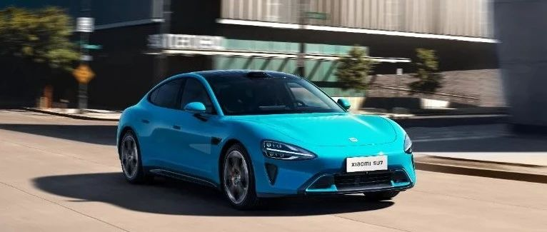

#  小米汽车答网友问（第七十二集）

[ 小米汽车 ](<javascript:void\(0\);>)

______

****  
****

****01****

**小米SU7原厂的行车记录功能可以录制声音吗？**

我们非常注重用户的隐私安全，行车记录功能不可录制声音。小米SU7的原厂行车记录功能通过调用前摄像头、后环视摄像头以及左后侧视摄像头、右后侧视摄像头，从而将车辆行驶途中的影像完整记录下来，但不调用车内麦克风等设备。此外，整车所有涉及用户个人隐私的信息，也均需用户授权。

关于行车记录功能的使用，您需要在副驾手套箱内插入购车时随车赠送的行车记录专用U盘，在**安全与服务** 的**行车记录** 页面中，点击开启或关闭行车记录功能。

在行车过程中如果有想记录的紧急瞬间，你也可以通过以下方式保存影像：

  * 在中控屏左上边缘向下滑动拉出**控制中心** ，点击**行车记录** ，系统将保存点击前1分钟、点击后30秒的视频。特别提示：行车记录功能处于未开启状态下，首次点击控制中心中的行车记录，将开启行车记录，再次点击才能激活控制中心保存功能；行车记录功能处于开启状态下，点击控制中心中的行车记录，将直接激活控制中心保存功能。

  * 在**安全与服务** 的**行车记录** 页面中，您也可打开**「鸣笛保存」** 功能，该功能是在车辆鸣笛后，将保存鸣笛前后一段时间的行车视频至USB设备中。特别提示：开启行车记录功能后，才能开启鸣笛保存功能。

  * 当车辆发生紧急事故时，行车记录会自动保存事故点前60s和事故发生后30s的紧急视频。

**02**

**苹果手机连接CarPlay时，还能使用车机热点网络吗？**

小米SU7支持无线CarPlay，在使用无线CarPlay时，该苹果手机暂不支持连接车机热点。但没有连接CarPlay的其他苹果手机是可以使用车机热点的。

  

**03**

**智能底盘氛围灯升级第二代了吗？**

我们关注到有博主提及小米商城内智能底盘灯的图片被更换，认为产品进行了升级换代，但事实并非如此。更换图片仅为商城产品详情页素材的正常迭代更新。

  

**04**

**钥匙卡片遗失后，可以补办吗？费用是多少？**

如果卡片钥匙不小心遗失，大家不用着急。您可将需补办卡片钥匙的车辆，开到您附近任意小米汽车官方授权服务中心即可办理，建议零售价118元。

在新的卡片钥匙成功补办之前，您也可使用小米汽车APP、手机蓝牙/NFC钥匙等多种方式进行车辆解闭锁。

  

  

  
  

预览时标签不可点

修改于

微信扫一扫  
关注该公众号

继续滑动看下一个

轻触阅读原文

小米汽车 

向上滑动看下一个

[知道了](<javascript:;>)

微信扫一扫  
使用小程序

****

[取消](<javascript:void\(0\);>) [允许](<javascript:void\(0\);>)

****

[取消](<javascript:void\(0\);>) [允许](<javascript:void\(0\);>)

****

[取消](<javascript:void\(0\);>) [允许](<javascript:void\(0\);>)

× 分析

__

微信扫一扫可打开此内容，  
使用完整服务

： ， ， ， ， ， ， ， ， ， ， ， ， 。 视频 小程序 赞 ，轻点两下取消赞 在看 ，轻点两下取消在看 分享 留言 收藏 听过