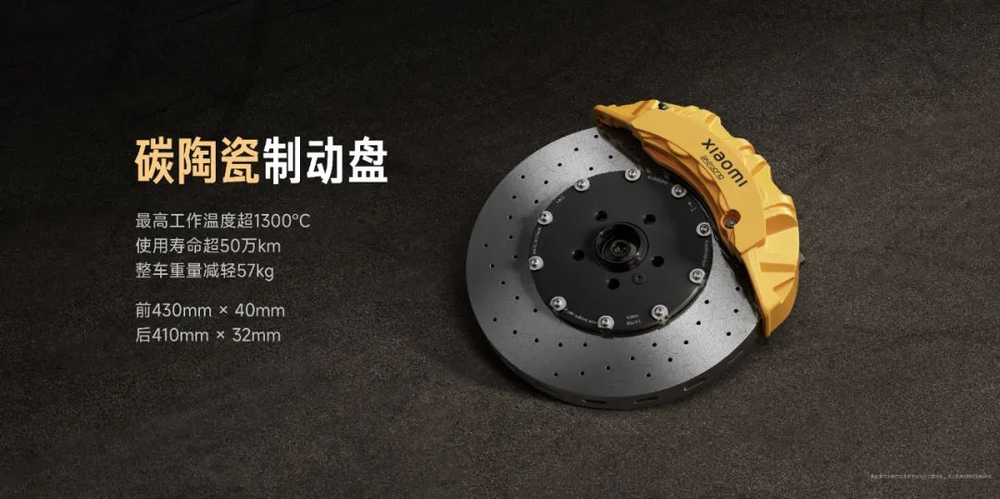
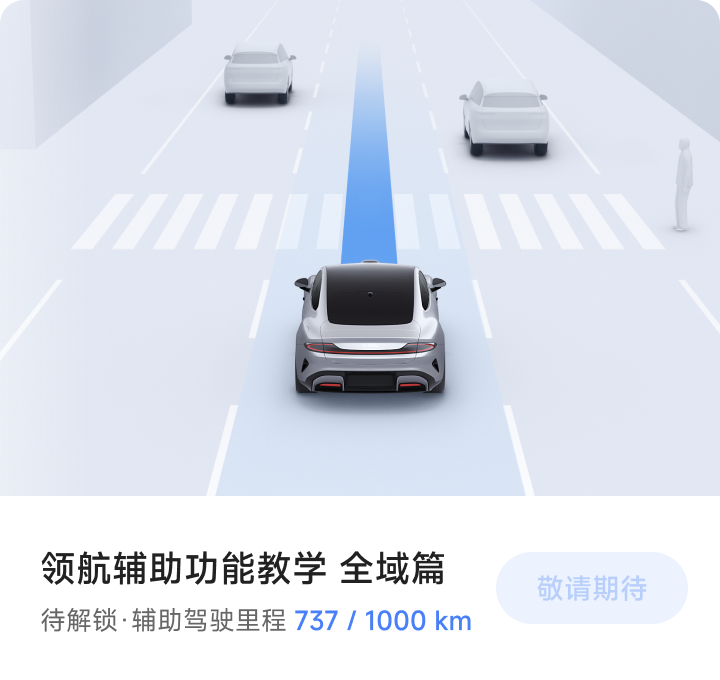

#  小米汽车答网友问（第七十六集）

[ 小米汽车 ](<javascript:void\(0\);>)

______

****  
****

****01****

**“原型车”和“量产车”，是什么关系，又有什么区别？**

原型车，是主要用于测试验证设计理念、性能、技术等内容的车型，通常小批量生产且造价昂贵，不需要完全符合相关法规及标准要求。

量产车，是用于规模生产和销售，且需要经历更严苛的耐久及安全等相关测试的车型，大规模生产需要更加考虑经济性及耐久性，同时要符合所有适用的标准及法规要求。

以小米汽车为例，小米SU7 Ultra Prototype是原型车，小米SU7 Ultra是量产车。我们会将原型车上搭载的小米超级三电机系统、赛道版高功率电池包、赛道版散热系统等核心技术，在经过纽北赛道长时间测试验证之后，充分下放到量产车，同时小米SU7 Ultra量产车本身也会在纽北测试验证。这个过程也让小米SU7 Ultra成为一台具备纯正赛道基因的四门跑车。

  

**02**

**小米SU7 Ultra上配备的闭式双腔空簧相比现在小米SU7 Max的空簧有什么区别和优势？**

小米SU7 Ultra和Max均搭载集成闭式空簧控制系统，相比传统开放式空簧，调节速度更快，速度提升100%；调节行程更长，最高调节行程可达50mm；运行也更安静，噪音下降7dB，兼顾了运动性能与豪华舒适体验。

为了满足极致赛道驾驶体验，小米SU7 Ultra上搭载闭式双腔空簧。优势是可根据驾驶模式、路况、车身响应智能切换，单独调节刚度和高度，在车身姿态最低时也能有超高刚度的支撑力，当然成本也更高。

小米SU7 Max满足城市个性化用车需求搭载闭式单腔空簧，相比传统开放式空簧调节速度更快、可靠性更高，能获得更好的日常驾驶体验。

  

**03**

**碳陶瓷刹车盘上为什么会有“裂纹”？**

碳陶瓷刹车盘表面的“裂纹”纹路，是涂层碳陶盘的固有特性，市面上采用相同工艺的涂层碳陶盘均有该特性。

以碳化硅为主要成分的涂层，有利于维持摩擦面均匀性并保护盘体内部基体材质，该涂层在生产过程中经历过高温后会自然形成细密的表面“裂纹”纹路，经验证，带涂层碳陶盘各项性能优于不带涂层碳陶盘，更不会对刹车盘强度和性能产生影响。

小米SU7 Ultra配备的赛用碳陶瓷制动盘最高工作温度超1300度，正常使用寿命可超过50万公里，正常使用可做到几乎终身免维护。

  

**04**

**昨天发布会说全量推送全国都能开的NOA，为什么我还不能使用？**

我们已于今早开始推送了全国都能开的城市领航辅助，实现了车载导航能到的地方智驾就能到。

为确保功能的正常使用，请确认：

1、您的爱车已升级至Xiaomi HyperOS 1.4.0。

2、登录您的账号，并且账号安全智驾里程达到**1000km。**

  * 智驾里程可通过“小米汽车APP-我的-智驾专区”进行**所绑定车辆** 的「智驾数据」查询。

  * 城市NOA功能解锁情况可通过**“智驾学堂-领航辅助全域篇功能教学”** 进行查询，该处所显示的智驾里程为**个人账号的安全智驾里程** 。

  * 考虑到多位驾驶员共同使用同一台车的情况，出于安全考量，需要驾驶员个人的**小米汽车APP账号安全智驾里程达到1000km** ，并完成智驾学堂学习后，才可开启城市领航辅助驾驶功能。

3、在车机导航上设置好目的地，确保车辆处于行进状态。

满足上述要求后，按下方向盘左侧智驾按键即可启动全国都能开的城市领航辅助功能。

城市NOA功能是在复杂的城市场景中，为车主提供从起点到终点的城市领航辅助。不同于高速NOA，城市NOA面临更加复杂的驾驶环境，基于安全考量，我们设定了1000公里智驾安全里程的门槛，希望可以帮助智驾新手熟悉功能，更好地应对复杂路况。此外，**当前智能驾驶不是自动驾驶，仍需要驾驶人随时关注路况，必要时及时进行干预，确保安全第一。**

**  
**

**05**

**1.4.0版本的智能驾驶，对比之前版本，优化了哪些功能？**

经过2个月的优化升级，1.4.0版本我们进行了更多场景的更新，体验更流畅，更好用。

想要实现全国都能开的城市NOA功能，需要实现四大能力：路口通行，灵活绕行，小路通行，路口掉头，这些场景都是1.4.0版本可以重点体验到的。

路口通行：想要车辆在全国大大小小的道路上行驶，车辆需要智驾精准地跟随导航进行驾驶，并分析道路拓扑结构，规划路口的通行轨迹。

灵活绕行：行驶过程中，遇到前方障碍在所难免，需要智驾在遇到施工，行人，两轮车或临停、慢速车辆时做到及时避障、适时超车，做到准确地识别各类交通参与者的行驶意图与障碍物，并执行相应的解决方案。

小路通行：在众多行驶工况中，小路最为复杂，需要智驾在极窄的空间内应对静止车、排队车、对向车等复杂场景，在准确还原真实路情后通过博弈实现跨线避让、车道内避让、借道避让、超车变道等各类驾驶行为。

路口掉头：1.4.0版本此次新增了掉头功能，可跟随导航自动提前变道至掉头车道，车辆会综合分析车道拓扑结构、红绿灯信息与对向来车情况，规划出掉头路径与时机，并在掉头过程中实时观察行人、两轮车等交通参与者位置，及时避让。目前行业内可实现这一功能的厂商并不多，我们也会不断优化、提升能力，满足更多出行场景需求。

  

**06**

**端到端版本的智驾什么时候可以体验到？**

11月底我们将开启端到端全场景领航辅助的定向邀请体验，12月底开启先锋版推送，请各位车主用户耐心等待，我们将在进行功能的充分验证后为大家进行推送。

  

预览时标签不可点

微信扫一扫  
关注该公众号

继续滑动看下一个

轻触阅读原文

小米汽车 

向上滑动看下一个

[知道了](<javascript:;>)

微信扫一扫  
使用小程序

****

[取消](<javascript:void\(0\);>) [允许](<javascript:void\(0\);>)

****

[取消](<javascript:void\(0\);>) [允许](<javascript:void\(0\);>)

****

[取消](<javascript:void\(0\);>) [允许](<javascript:void\(0\);>)

× 分析

__

微信扫一扫可打开此内容，  
使用完整服务

： ， ， ， ， ， ， ， ， ， ， ， ， 。 视频 小程序 赞 ，轻点两下取消赞 在看 ，轻点两下取消在看 分享 留言 收藏 听过