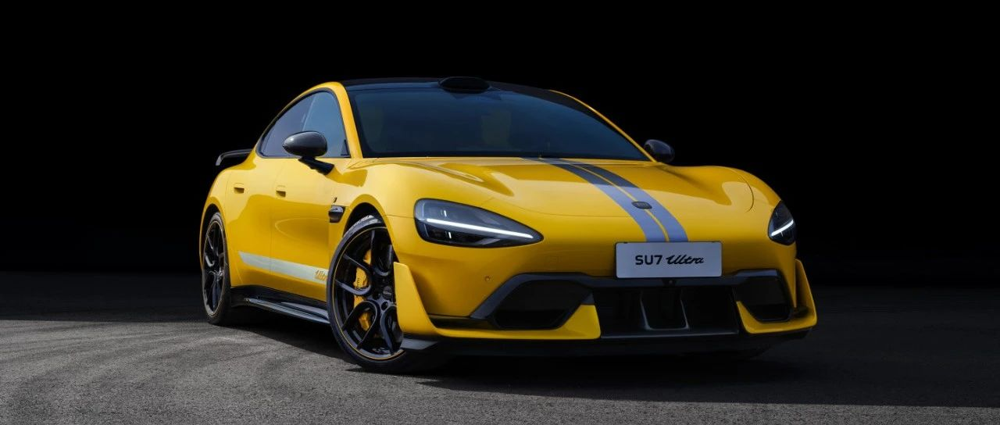
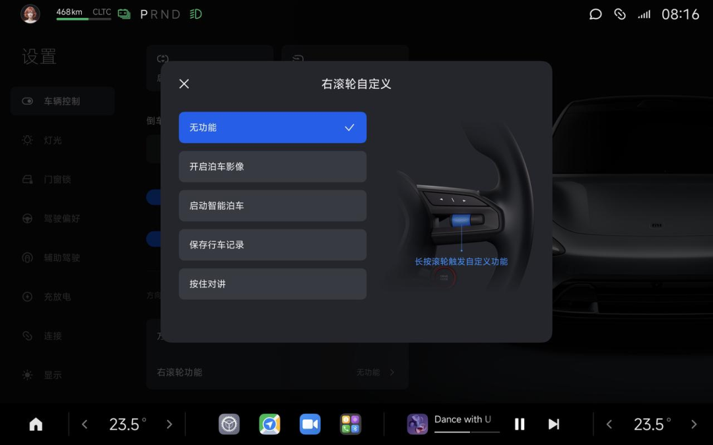
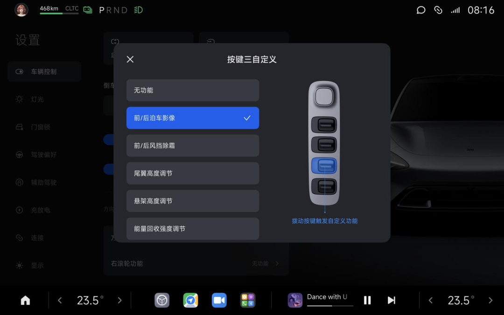
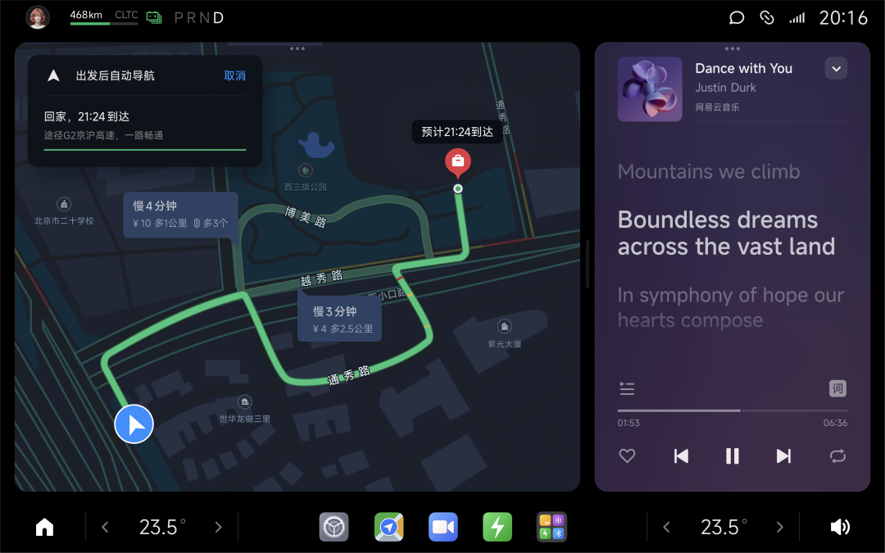

#  小米汽车答网友问（第七十七集）

[ 小米汽车 ](<javascript:void\(0\);>)

______

****  
****

****01****

**小米SU7 Ultra目前最高时速350km/h，为什么叫“设计最高时速”？**

设计最高时速：是指车辆在场地条件满足，车辆最佳状态可达到的最高车速。

最高时速认证结果受测试场地限制，不同区域的测试标准也不一样，因此在全球范围内的不同区域认证最高时速结果也可能不一样，所以表述为“设计最高时速”。正式发布时，我们也将公布更多小米SU7 Ultra的产品信息。

根据不同测试条件认证不同最高时速是业内的普遍做法，例如一些海外品牌的全球化车型，在国内的认证最高时速和部分海外市场的认证最高时速是不一样的，但是车型的实际能力保持一致。

**02**

**小米SU7 Ultra这么大马力，日常驾驶时，该怎么有效、便捷地限制性能输出呢？**

小米SU7 Ultra最大马力1548PS、零百加速1.98秒（不含起步时间），拥有极其强大的动力性能。大家在享受巅峰性能带来的驾驶乐趣同时，更要最大限度注意安全驾驶，因此我们在驾驶模式设定上，也做了非常多的安全设定，从功能上强化安全性。

针对赛道场景，我们打造了排位赛模式、耐力赛模式、漂移模式、大师自定义模式等，让大家充分享受赛道驾驶的乐趣。而在日常场景，新手模式、经济模式、标准模式、自定义模式等将对马力参数、加速时间、最高时速进行不同级别的限制，以保证驾驶安全。而用户第一次使用大师自定义模式时，我们也会强制学习安全手册及驾驶安全培训。具体详细信息等产品正式上市再和大家分享。

我们将持续呼吁广大用户敬畏速度，无论在赛道上还是日常驾驶，要确保充分了解产品的性能表现及驾驶技巧，切勿鲁莽操作，始终将安全驾驶放在第一位。

**03**

**更新1.4.0之后的小米汽车，都有哪些按键自定义能力？**

升级HyperOS 1.4.0版本之后，用户可以对长按方向盘右侧滚轮进行自定义，功能包括开启360泊车影像、开启智能泊车、手动保存一段行车记录、方控对讲（使用方控对讲功能，需车辆先连接小米对讲机3）。

同时Max车主和选配了尾翼的Pro车型用户，可以对中央扶手区域后两个按键进行自定义，除了原生的悬架高度调节和尾翼高度调节外，用户可自定义为动能回收强度调节、开启前/后360影像、开启前/后风挡除霜。

  

  

**04**

**如何才能开启1.4.0版本上的地图导航“通勤模式”？**

更新HyperOS 1.4.0版本后，在车载地图中“设置”-“通勤”页面中，设定“家”和“公司”的位置，即可开启“通勤自动导航”功能。

同时可以设置播报方式和自定义上下班时间，在通勤模式下，上车展示路况预知拥堵，出发后自动导航并动态规划更优路线，上下班出行更便捷。

****

预览时标签不可点

微信扫一扫  
关注该公众号

继续滑动看下一个

轻触阅读原文

小米汽车 

向上滑动看下一个

[知道了](<javascript:;>)

微信扫一扫  
使用小程序

****

[取消](<javascript:void\(0\);>) [允许](<javascript:void\(0\);>)

****

[取消](<javascript:void\(0\);>) [允许](<javascript:void\(0\);>)

****

[取消](<javascript:void\(0\);>) [允许](<javascript:void\(0\);>)

× 分析

__

微信扫一扫可打开此内容，  
使用完整服务

： ， ， ， ， ， ， ， ， ， ， ， ， 。 视频 小程序 赞 ，轻点两下取消赞 在看 ，轻点两下取消在看 分享 留言 收藏 听过