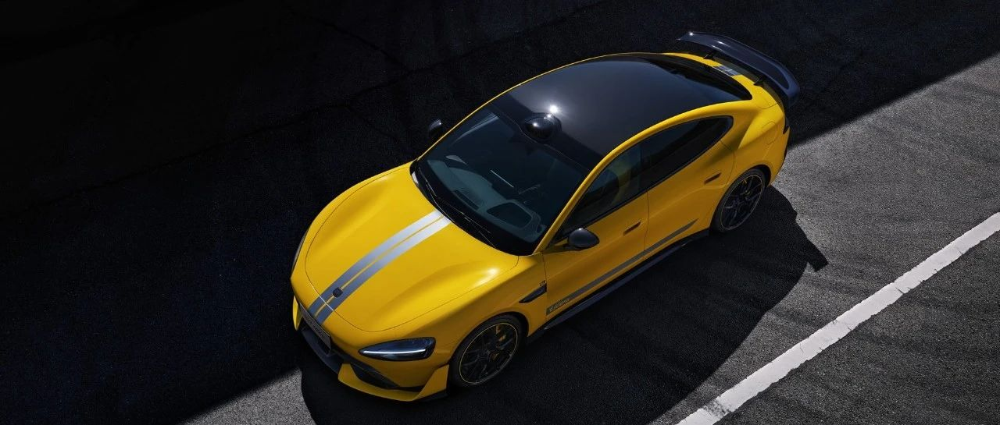

#  小米汽车答网友问（第八十七集）

[ 小米汽车 ](<javascript:void\(0\);>)

______

****  
****

****01****

**在洗车或者代驾时，可以为我的小米SU7设置代客模式么？**

临时用车支持匿名无账号用车，保护车主隐私，维修保养也安心。代客用车可开启代客模式，限制部分功能使用，保护车主隐私和人身财产安全。为了更好地保护车主的个人隐私安全，车机为每个登录用户分配独立的车机分身空间，实现用户的帐户、应用和数据等与主空间的完全隔离以及分别的加密保护。

购车时也会附赠两张卡片钥匙，用户可以选择一张卡片钥匙不绑定账号，借车、送去保养、维修或洗车时，服务人员用不绑定账号的卡片钥匙上车时，车机会进入匿名模式，保护您账号下的隐私数据。

  

**02**

**官方会为小米SU7推出Ultra运动套件么？**

目前暂无为小米SU7车型推出Ultra运动高性能套件的计划。最核心的原因是小米SU7 Ultra外观所有的运动套件都与车辆所需要的功能性有关，而不止于向设计感交付。

例如小米SU7 Ultra车头部分的超大尺寸前铲、气坝以及U形风刀等，均为增加前部下压力及散热。尾部根据车速变化的主动扩散器则兼顾低风阻的同时也可额外提供下压力，碳纤维固定式大尾翼更是为高速行驶时的提供充足的下压力。小米SU7 Ultra外观上全新的空气动力学设计，总计可提供最大285kg下压力。

我们充分理解大家对运动套件的喜爱，目前小米SU7 Max提供电动尾翼，小米SU7 Pro也提供选装电动尾翼，满足大家的需求。

  

**03**

**赛道大师App这个功能非常酷，以后会装到小米SU7上吗？**

小米SU7 Ultra定位于巅峰性能科技轿车，是一台用户可以直接用于赛道驾驶的车型，因此，赛道大师APP是专为小米SU7 Ultra用户开发的功能。该功能基于软硬件的深度融合，拥有大量创新功能，目的是帮助用户持续提升赛道成绩、提升驾驶技术。

小米SU7是一款定位城市公路的车型，不建议普通用户在赛道中使用，因此暂时没有为小米SU7开发赛道APP的计划。

  

预览时标签不可点

微信扫一扫  
关注该公众号

继续滑动看下一个

轻触阅读原文

小米汽车 

向上滑动看下一个

[知道了](<javascript:;>)

微信扫一扫  
使用小程序

****

[取消](<javascript:void\(0\);>) [允许](<javascript:void\(0\);>)

****

[取消](<javascript:void\(0\);>) [允许](<javascript:void\(0\);>)

****

[取消](<javascript:void\(0\);>) [允许](<javascript:void\(0\);>)

× 分析

__

微信扫一扫可打开此内容，  
使用完整服务

： ， ， ， ， ， ， ， ， ， ， ， ， 。 视频 小程序 赞 ，轻点两下取消赞 在看 ，轻点两下取消在看 分享 留言 收藏 听过