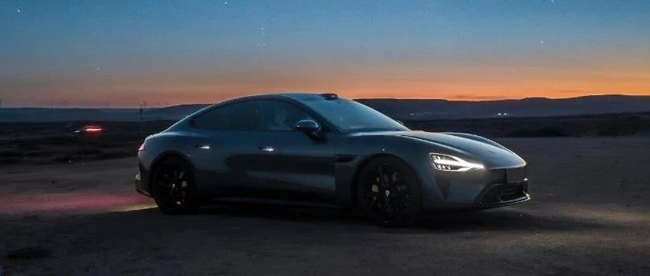
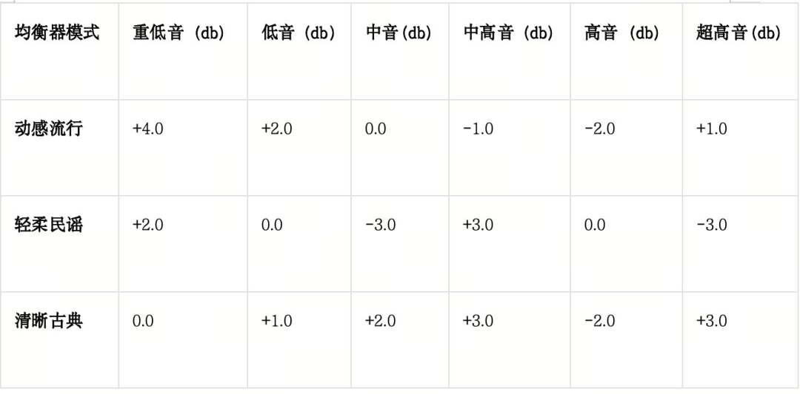

#  小米汽车答网友问（第九十八集）

[ 小米汽车 ](<javascript:void\(0\);>)

______

****  
****

****01****

**智能底盘氛围灯什么时候再次补货？**

非常感谢各位车主朋友对小米SU7智能底盘氛围灯的喜爱，我们在近期开启了首轮补货，但很快就已售罄。第二轮补货即将于11月28日17:00再次开启，欢迎各位车主朋友届时到小米汽车APP→商城→车品进行选购。请注意，该产品的唯一销售途径为小米汽车APP，请勿通过任何非官方售卖渠道进行购买，以免造成财物损失。

智能底盘氛围灯操作便捷，可通过车内Wi-Fi接入小米SU7车机系统和米家APP，支持小米澎湃智联，操作更便捷、连接更流畅。

智能底盘氛围灯智能玩法多，可匹配车辆多种状态：可提供驻车点亮模式；可与车辆充电状态联动；可与外车灯联动，离车时可实现延时照明；还可跟随近光灯联动等，与车辆深度互联，营造惊喜效果。

此外，智能底盘氛围灯还支持IP67防尘防水，通过扬尘路面、涉水路面时，不必特意拆卸，可放心行驶。

后续，智能底盘氛围灯也可通过OTA升级，解锁更多与车辆联动玩法，敬请期待。

  

**02**

**我们家大多使用的都是苹果设备，开小米SU7会不会不方便？**

目前有超过50%的小米SU7车主都是苹果用户，小米澎湃智能座舱用户非常丰富的生态拓展能力，对苹果生态用户非常友好。

  * 小米SU7全系支持无线Apple CarPlay互联。在CarPlay连接状态下，您可以正常使用小爱同学，同时CarPlay也支持Siri语音唤醒。

  * 同时，小米SU7的后排可支持iPad上车，在购买专用iPad拓展支架后，iPad可安装在前排椅背。下载安装“小米汽车拓展屏”APP，还可实现座椅空调调节、多媒体调节、影音娱乐等原生车机般的体验。

苹果手机也已支持小米汽车APP小组件功能，可以查看车辆续航和充电状态，并可通过四个快捷功能按键自由设置控车功能。添加小组件之前，需要您确认小米汽车 APP 已经升级到最新版本。

**03**

**我喜欢听纯音乐，音响如何设置比较好？**

小米SU7音响系统对于高中低音均有优秀的表现，低音结实不轰头，收尾干净利索；中音人声乐器自然还原，丰富饱满；高音清晰通透不嘈杂。对于纯音乐，我们推荐设置为标准音效。不加任何后期音效处理，注重中高频的细节还原。

同时对于其它类型的音乐，我们也有各类对应的预设音效模式，用户可以在音效中自行切换，或基于自己喜欢的音乐在预设模式上进行微调，预设模式均衡器设置参数如下表所示：

音效喜好千人千耳，推荐大家建议根据自己的喜好边听边调，得到属于自己的理想音效。小米SU7的音响风格：低音结实不轰头，收尾干净利索；中音人声乐器自然还原，丰富饱满；高音清晰通透不嘈杂。

  

**04**

**快要提车了，在交付中心提车大概分为哪些步骤？需要耗时多久？**

您的提车将分为3步：①前置手续→②预约到店→③现场提车

**1.前置手续准备**

负责交付的同事将提前与您确认提车信息并协助办理，包含但不限于：订单及配置、付款方式（分期/全款）、保险服务、车务办理、充电桩及置换需求、提车城市等。

**2.预约到店提车**

在您车辆下线后，我们将帮您预约到店时间和登记随行人员；等到车辆完成到店检测后，我们会再次与您确认到店时间，并完成行前提醒。

请务必携带以下资料：

①个人用户：身份证原件/授权委托书（如非本人提车）；

②企业用户：营业执照副本原件/公章/提车人身份证原件/授权委托书。

**3.现场提车办理**

提车当日，请您准时到达交付中心，我们将协助您完成车辆交付全部步骤:①车辆查验→②功能讲解→③临牌办理→④资料交接→⑤提车返程。

总时长根据前置手续准备情况，在交付中心所需要的时间约为30分钟-2小时不等。

**温馨提示：**

您的提车时间可能受物流等外部因素影响临时变更，如发生特殊情况，我们会第一时间与您沟通；若您到店前办理好所有手续，能有效减少您提车当天的等待时间；提前祝您提车愉快！

  

预览时标签不可点

微信扫一扫  
关注该公众号

继续滑动看下一个

轻触阅读原文

小米汽车 

向上滑动看下一个

[知道了](<javascript:;>)

微信扫一扫  
使用小程序

****

[取消](<javascript:void\(0\);>) [允许](<javascript:void\(0\);>)

****

[取消](<javascript:void\(0\);>) [允许](<javascript:void\(0\);>)

****

[取消](<javascript:void\(0\);>) [允许](<javascript:void\(0\);>)

× 分析

__

微信扫一扫可打开此内容，  
使用完整服务

： ， ， ， ， ， ， ， ， ， ， ， ， 。 视频 小程序 赞 ，轻点两下取消赞 在看 ，轻点两下取消在看 分享 留言 收藏 听过