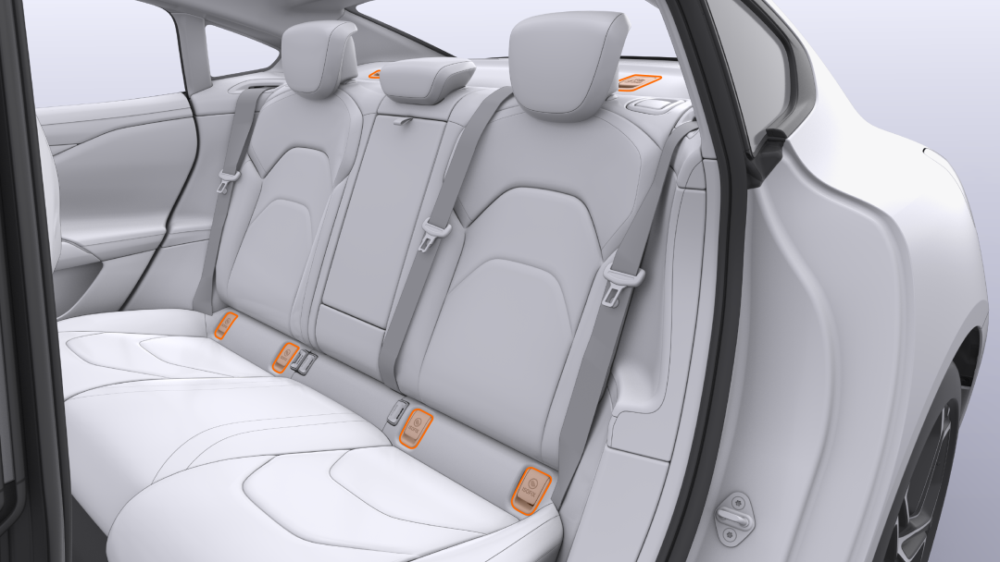
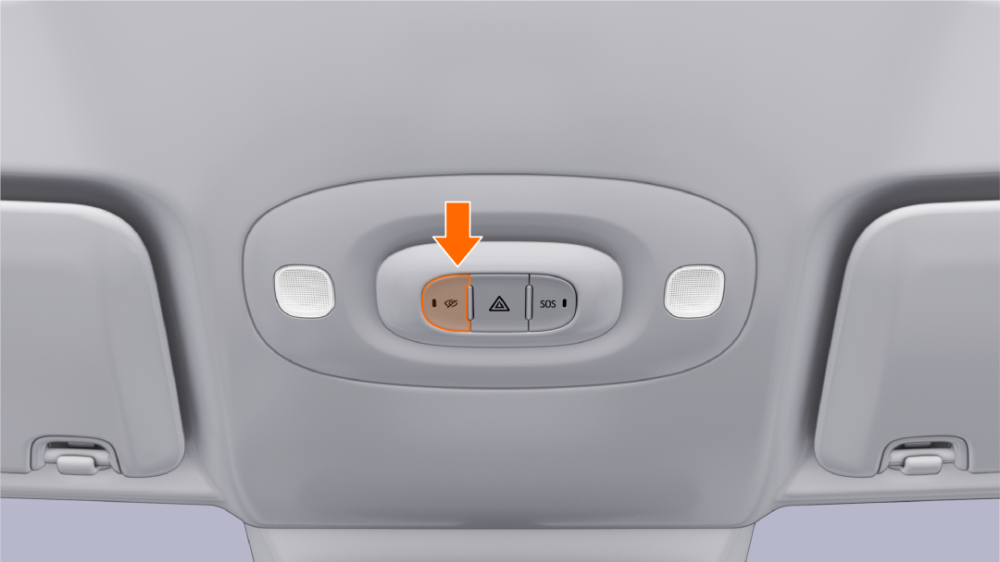

#  小米汽车答网友问（第101集）

[ 小米汽车 ](<javascript:void\(0\);>)

______

****  
****

****01****

**小米SU7的车漆非常好看，如果长期停靠在室外停车场，车漆会容易褪色么？**

小米SU7车漆不仅颜色丰富，同时也拥有非常优秀的抗氧化及防老化效果，长期在室外停放车漆也不会有明显的衰减，我们非常有自信在同业中有领先的表现。不过当然，相比车库而言，室外环境中的温湿度变化，沙尘，动物粪便等复杂因素，也会对车漆的光泽度寿命造成影响。

具体而言，小米SU7采用行业领先的3C2B的涂装工艺，共计8层涂层，其中增加的中涂工艺，不仅让漆面漆膜更厚、视觉效果更好，还可以将UV的隔绝率从99%提升到99.9%左右，从而更好地保护电泳漆。

此外，在8层漆面喷涂工艺的前提下，小米使用先进的杜尔7轴喷涂机器人，雾化器旋杯转速可达7万rpm，雾化效果让漆膜平整度更高。还拥有自研的中涂层打磨机器人，800目砂纸可打磨掉3-5μm漆层，再次有效提高漆面平整度，也让车辆的漆膜厚度控制在100到140μm之间，实现在不同光线下都拥有出众的色彩与光泽表现。

  

**02**

**在小米SU7上安装儿童座椅方便么，推荐什么类型的儿童座椅？******

小米SU7后排两侧座椅的ISOFIX接口专门设计有盖板，需要安装儿童安全座椅时，轻轻开启盖板，可将儿童安全座椅底部连杆轻松插入接口，非常便利。之后再将上拉带固定到头枕后侧的固定支座上即可。

当不需要使用儿童安全座椅时，可将此盖板盖上。可以说盖板实现了日常使用便利性与座椅美观度的完美平衡。

推荐大家根据自己宝宝的年龄和体重，选择适合的带有ISOFIX固定装置的儿童安全座椅。在安装儿童安全座椅前，建议您认真阅读儿童安全座椅使用说明书，按照说明提示安装固定好儿童安全座椅。

**03**

**小米SU7车内有几颗摄像头，是做什么用的？**

在方向盘和仪表屏之间有一颗用于检测驾驶员状态的摄像头。当检测到驾驶员闭眼、扭头、哈欠、使用手机接打电话等疲劳或分心行为时，系统会通过语音播报、中控屏弹窗等形式，提醒驾驶员注意安全驾驶。

该系统仅在车机本地进行行为判断和提醒，图像数据不会记录或对外传输，充分保护用户的隐私安全。

当然，如果您不需要驾驶员疲劳/分心提醒功能的话，可以在中控屏的“设置-驾驶偏好”菜单内将其关闭。甚至您也可以在车机的权限管理中直接将摄像头关闭。

除此之外，小米SU7还为您提供了“一键隐私”功能，当您按下车内顶部的“一键隐私”按键，车辆将关闭所有车外摄像头和激光雷达，从而避免车辆收集车外信息。

  

**04**

**「小米汽车移动服务车」是啥？它有啥用？**

「小米汽车移动服务」是小米汽车为用户提供的7*24小时便捷上门维保服务。它可提供车辆简易维修类服务，例如更换易损易耗件、更换门把手/内饰件，以及简易救援、应急搭电、系统软件类故障排除、轮胎补胎/更换等服务。

移动服务车上门补胎服务为180元/次；如购买小米汽车无忧服务包，则免费享受上门补胎服务，合同期内不限次；其他维修服务项目收费标准与门店收费保持一致。

  

  

预览时标签不可点

微信扫一扫  
关注该公众号

继续滑动看下一个

轻触阅读原文

小米汽车 

向上滑动看下一个

[知道了](<javascript:;>)

微信扫一扫  
使用小程序

****

[取消](<javascript:void\(0\);>) [允许](<javascript:void\(0\);>)

****

[取消](<javascript:void\(0\);>) [允许](<javascript:void\(0\);>)

****

[取消](<javascript:void\(0\);>) [允许](<javascript:void\(0\);>)

× 分析

__

微信扫一扫可打开此内容，  
使用完整服务

： ， ， ， ， ， ， ， ， ， ， ， ， 。 视频 小程序 赞 ，轻点两下取消赞 在看 ，轻点两下取消在看 分享 留言 收藏 听过