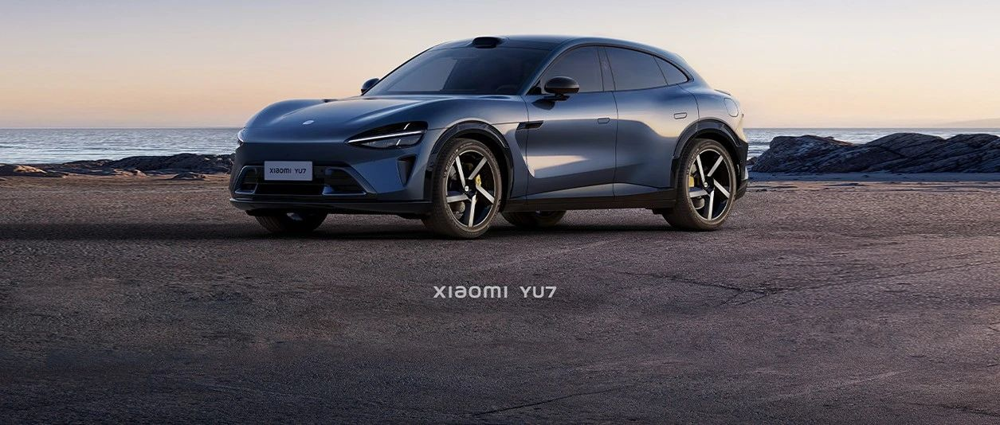

#  小米汽车答网友问（第103集）

[ 小米汽车 ](<javascript:void\(0\);>)

______

  

  

****01****

**小米YU7什么时候能买到？**

小米YU7预计将于2025年6、7月正式上市，目前我们正在进行大规模路测，会延续小米SU7同样的高品质交付。感谢大家的支持，敬请期待。

  

  

**02**

**一般新车在上市前1-2个月才登陆工信部公告，为什么小米YU7会公告得这么早？**

这么早公告，是为了尽早地去除重伪装，进行更加严密的道路测试验证，例如更精准的NVH验证、能耗测试、综合耐久测试等。

我们将确保小米YU7在正式上市前经历更全面、更细致的长时间大规模测试，以提供质量更稳定可靠的产品体验。

  

**03**

**小米YU7该怎么读？有什么寓意吗？**

就是直接以字母的原始发音来读：Y - U - 7。未来，当产品正式发布时，我们会做详细解释命名的由来和寓意。YU7你觉得怎么读更顺？欢迎在评论区告诉我们。

  

**04**

**小米YU7看着好帅，对比小米SU7 在设计上有什么不同吗？**

小米YU7和小米SU7沿用的是同一套家族式设计语言，在车身比例姿态、水滴大灯、光环尾灯、流畅饱满的涟漪曲面以及空气动力学风道设计等方面，都有一系列共同的特征。相信你在路上，一眼就能认出这是一台小米汽车。

当然，小米YU7作为一款全新的SUV车型，在不少设计细节上，我们也做了创新尝试。小米YU7测试车拆去重伪装后，相信大家会陆续发现更多惊喜的细节。

  

  

预览时标签不可点

修改于

微信扫一扫  
关注该公众号

继续滑动看下一个

轻触阅读原文

小米汽车 

向上滑动看下一个

[知道了](<javascript:;>)

微信扫一扫  
使用小程序

****

[取消](<javascript:void\(0\);>) [允许](<javascript:void\(0\);>)

****

[取消](<javascript:void\(0\);>) [允许](<javascript:void\(0\);>)

****

[取消](<javascript:void\(0\);>) [允许](<javascript:void\(0\);>)

× 分析

__

微信扫一扫可打开此内容，  
使用完整服务

： ， ， ， ， ， ， ， ， ， ， ， ， 。 视频 小程序 赞 ，轻点两下取消赞 在看 ，轻点两下取消在看 分享 留言 收藏 听过