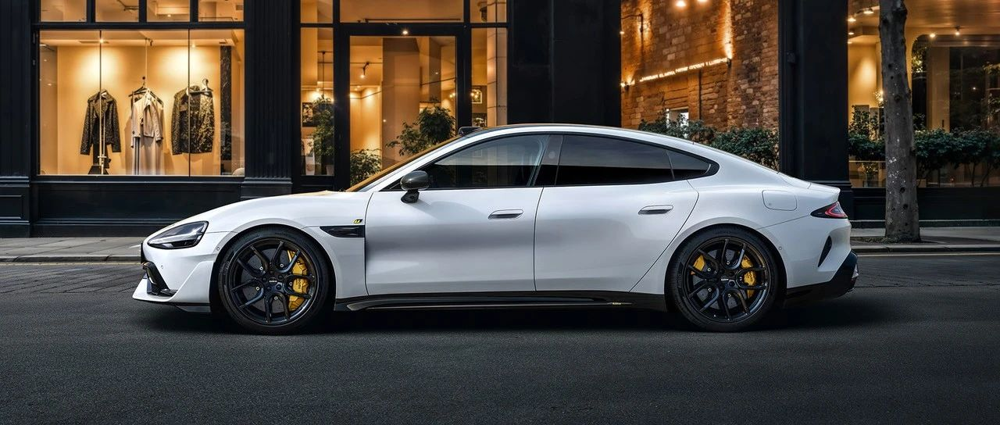

#  小米汽车答网友问（第114集）

[ 小米汽车 ](<javascript:void\(0\);>)

______

****01****

**听说SU7 Ultra的锁单订单可以有一次改配机会？怎么操作？**

是的。考虑到部分车主的期待和需求，我们特别开启一次**非现车订单** 的改配通道。

我们将在**2025年3月5日上午10点起** ，**至2025年3月6日上午10点** ，在小米汽车APP中开启SU7 Ultra限时改配活动。活动开始前已经锁单、未交付，且在开票流程前的**SU7 Ultra非现车订单** 可参与改配，用户可以更改车身/内饰颜色、轮毂、碳纤维尾翼等任意选装配置。更多详细规请见小米汽车APP。

**改配活动仅限一天** ，希望大家都能重新选配到心仪的小米SU7 Ultra。

  

**02**

**我是从SU7订单升级改配到SU7 Ultra订单的，也能参与此次SU7 Ultra非现车锁单用户的限时改配活动吗？**

能， 只要满足**“2025年3月5日10:00之前SU7 Ultra非现车的已锁单，未交付且未开票”的条件** ，您都可以参与此次改配活动。

  

**03**

**我是享有「优先交付权」的小订转大定用户，参加改配活动后，还能优先排产吗？**

抱歉，**参与改配活动后，您的小订优先交付权将失效** 。由于改配会调整工厂的备料节奏和生产计划，我们将在您改配后重新计算车辆预估交付周期，并将在小米汽车APP同步更新。我们也建议您谨慎考虑是否需要参与此次改配活动，感谢您的理解。

  

****04****

**SU7 Ultra选装固定式碳纤维大尾翼后，会影响续航么？**

选装碳纤维固定式大尾翼，提供下压力的同时，的确会对续航产生影响。还请您按需斟酌选择。

小米SU7 Ultra具备丰富的空气动力学设计，在满配状态下，提供的最大下压力可达285kg。其中，选装的碳纤维尾翼和配套的前气坝是提供整车下压力的重要部件，选配后可获得最大的下压力，但同时会也增加一定的阻力，造成续航里程的小幅降低。

具体而言，若选择长续航轮胎和碳纤维尾翼，小米SU7 Ultra的CLTC续航里程为600km；若不选配碳纤维尾翼，小米SU7 Ultra的CLTC续航里程为630km。

目前小米SU7 Ultra正处首销期，有丰厚的预定权益，其中包含：在3月31日前下定，免费赠送碳纤维尾翼，或免费选装车漆和内饰颜色。如果您是追求高性能的用户，推荐您选装固定式碳纤维大尾翼，可获得最强的性能表现；如果您以日常驾驶为主，推荐您选择原厂的电动尾翼，以获得更长的续航里程数。

****05****

**竞速套装为什么送两套轮胎？半热熔轮胎和普通轮胎有什么区别？**

小米SU7 Ultra「可街可赛」，竞速套装搭载了两套轮胎，分别为**倍耐力P ZERO TROFEO RS半热熔胎及倍耐力P ZERO 5高性能轮胎** ，均为小米与倍耐力的定制轮胎，分别面向赛道场景及日常使用。

半热熔胎面向赛道场景，采用特殊橡胶配方，当温度升高时，胎面会轻微软化，形成黏性表面，增强与路面的接触。因此，半热熔轮胎需要一定的工作温度（30℃以上）才能发挥更好的性能，不适应雨雪湿滑路面及低温环境使用，同时需要驾驶员具备一定的赛道驾驶技巧。小米SU7 Ultra刷新上赛最速量产车时使用的轮胎就是倍耐力P ZERO TROFEO RS半热熔胎。

相比半热熔轮胎，倍耐力P ZERO 5高性能轮胎常温下即可发挥正常性能，无需预热，适应性更广，同时更耐磨更静音，更适合日常使用。

  

  

  

  

  

预览时标签不可点

微信扫一扫  
关注该公众号

继续滑动看下一个

轻触阅读原文

小米汽车 

向上滑动看下一个

[知道了](<javascript:;>)

微信扫一扫  
使用小程序

****

[取消](<javascript:void\(0\);>) [允许](<javascript:void\(0\);>)

****

[取消](<javascript:void\(0\);>) [允许](<javascript:void\(0\);>)

****

[取消](<javascript:void\(0\);>) [允许](<javascript:void\(0\);>)

× 分析

__

微信扫一扫可打开此内容，  
使用完整服务

： ， ， ， ， ， ， ， ， ， ， ， ， 。 视频 小程序 赞 ，轻点两下取消赞 在看 ，轻点两下取消在看 分享 留言 收藏 听过