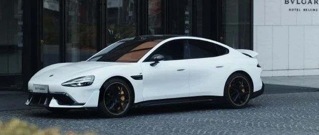

#  小米汽车答网友问（第131集）

[ 小米汽车 ](<javascript:void\(0\);>)

______

  

****01 ‍****

**小米SU7 Ultra电池包底部使用的「防弹涂层」，这是啥材质？** 这种技术广泛应用于军事装备和航空航天器件等，例如装甲车的防雷板，军车铠甲，防弹头盔等，具有抗爆防弹效果。我们创新性的将「防弹涂层」应用在了小米SU7 Ultra的电池包底部，较传统电池包底部防护材料，这种材料耐撕裂性能提升10倍、耐穿刺性能提升13倍、耐刮擦性能提升10倍、附着力提升10倍，能够充分的提高小米SU7 Ultra电池包的耐刮擦和耐穿刺性能。前两天雷总发布过一个趣味测试试验，把「防弹涂层」涂在西瓜上，从6楼高处扔下也没摔破。

  

**02**

**我看了中汽研给小米SU7 Ultra做的电池极端场景测试，为什么会选这些场景做测试？** 该视频所展示的所有测试项目和场景，均为中汽研和小米汽车针对小米SU7 Ultra赛道级电池包共同定制的。作为一款「可街可赛」的新豪车，小米SU7 Ultra需要充分兼顾日常通勤与极限赛道驾驶的双重需求，这些测试项目全部都来源于用户真实的用车场景。其中，「模拟碰撞」模拟了车辆高速撞墙、加速度超过60g时，电池所需要承受的巨大能量冲击。「凹坑刮底」也是非常接近用户日常生活的场景，模拟了车辆以30km/h的速度行驶时，被破损道路刮底的潜在情况。在刮底后，在电池受损程度不明的情况下直接进行涉水测试，既检验了电池包的抗刮擦和穿刺能力，也检验了其防水密封性能。而「飞坡刮底测试」则是当小米SU7 Ultra原型车早些时候在挑战纽博格林北环赛道最速4门车记录时，面对纽博格林北环的极端赛道条件时可能遇到的场景，如当车辆高速行驶过路面起伏地段后落地刮底、以及高速越过高耸的水泥路肩等。这也是我们自去年6月起在纽北开展调校工作所积累的宝贵经验之一。

**  
**

**03**

**看到了好多小米SU7 Ultra竞速套装的媒体体验视频，太帅了，到底什么时候才开售？** 感谢大家的关注，小米SU7 Ultra的「竞速套装」将和「纽北限量版」一样，会在晚些时候我们完成纽北挑战之后发售。我们保证，真的很快了！  

****04****

**最近发现胎压一直在提升，这是咋回事？有什么要注意的吗？**

随着气温回升，您的胎压可能会升高。我们推荐小米SU7和小米SU7 Ultra的四轮冷态胎压均为2.9bar，我们建议您在季节交替之际，时刻关注车辆状态，使之保持在2.9bar，以保证抓地力、续航和舒适性表现之间的最佳平衡。

此外，每年的3月-4月都是春季花粉过敏的高发季，小米SU7和小米SU7 Ultra拥有CN95级滤芯、AQS空气质量检测系统、抗菌蒸发器等装置，能够确保座舱空气清新、健康，让您免受花粉及其他污染源的危害。小米SU7和小米SU7 Ultra也标配PM2.5实时监测系统，您可在空调控制界面的右下角随时查看车内PM2.5浓度信息，通过点击PM2.5数值下方的“树叶”标识即可开启或关闭车内空气自动净化功能。

**  
**

  

  

  

预览时标签不可点

微信扫一扫  
关注该公众号

继续滑动看下一个

轻触阅读原文

小米汽车 

向上滑动看下一个

[知道了](<javascript:;>)

微信扫一扫  
使用小程序

****

[取消](<javascript:void\(0\);>) [允许](<javascript:void\(0\);>)

****

[取消](<javascript:void\(0\);>) [允许](<javascript:void\(0\);>)

****

[取消](<javascript:void\(0\);>) [允许](<javascript:void\(0\);>)

× 分析

__

微信扫一扫可打开此内容，  
使用完整服务

： ， ， ， ， ， ， ， ， ， ， ， ， 。 视频 小程序 赞 ，轻点两下取消赞 在看 ，轻点两下取消在看 分享 留言 收藏 听过