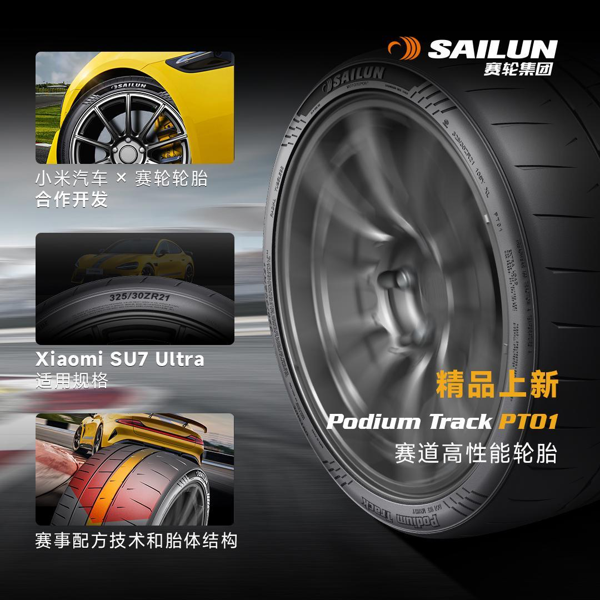
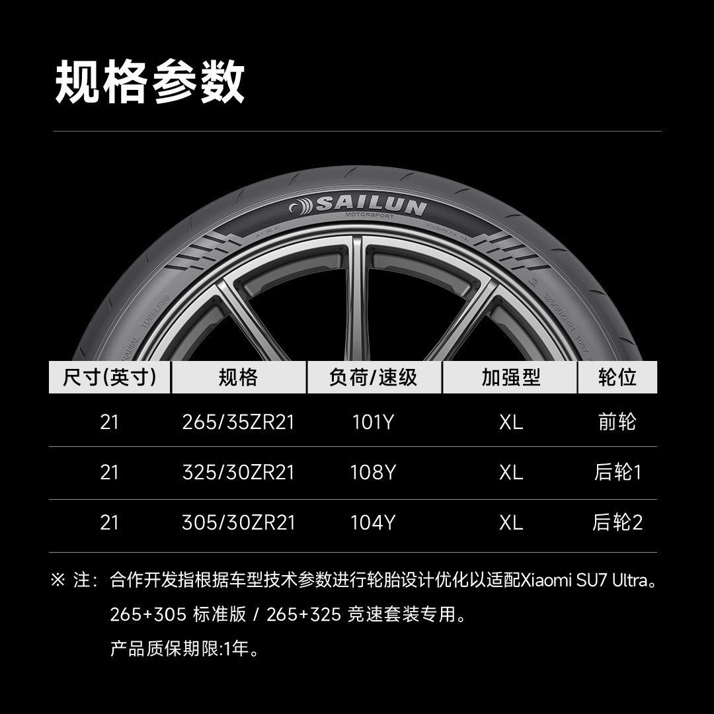

#  小米汽车答网友问（第137集）

[ 小米汽车 ](<javascript:void\(0\);>)

______

  

****01 ‍****

**小米****SU7 Ultra****的碳陶瓷刹车盘需要定期保养/更换么？**

小米SU7 Ultra全系标配的碳陶瓷制动盘凭借其极强的耐磨性能，正常使用寿命可超过50万公里，即便经常在赛道上激烈驾驶也能拥有远超钢制动盘的寿命，正常情况下可做到几乎终身免维护/更换，您可放心使用。这套赛级碳陶瓷制动盘的最大工作温度高达1300摄氏度，抗热衰性能极强，可以满足连续赛道驾驶的需求。在这套赛级制动系统的加持下，小米SU7 Ultra的100-0km/h制动距离仅为30.8m，180-0km/h制动测试可连续进行10次不衰减，性能非常强大。

极少数需要您注意的场景是，在车辆进入赛道前和退出赛道后，或在持续性的温度报警使用后，您需要对制动盘进行检查。如出现表面剥落、异常磨损等故障情况时，请将车辆停放至安全位置，并立即联系小米汽车服务中心。

**  
**

**02**

**小米****SU7 Ultra****的碳纤维前机盖防水么？进水了怎么办？有异物掉进去了会堵塞么？**

请您放心，如果您选装了小米SU7 Ultra的碳纤维双风道前舱盖，车辆前备箱将被两个风道取代，我们在其内部设置了排水孔，在雨天可保障雨水正常排出，不会对前舱内部零件产生任何影响。同时，我们还在风道的出口处还设计了防尘网，保证异物不会掉入风道中。如风道中进入灰尘或极小的异物，其也可在洗车或下雨时从排水孔中排出，您无需担心有任何堵塞风险。但如果有落叶或其他杂物掉进前机盖时，我们仍然建议您定期进行清理。

**  
**

**03**

**能否介绍一下今天在****小米有品****商城新上架的赛轮轮胎？和小米****SU7 Ultra****标配的轮胎有什么不同？**

赛轮PT01半热熔轮胎是小米汽车与赛轮轮胎在赛道中合作开发的新产品，可适配小米SU7 Ultra和竞速套装的各款21英寸轮毂。与小米SU7 Ultra标配的高性能街道轮胎不同，赛轮PT01为一款半热熔轮胎、更适用于赛道驾驶。

该轮胎采用赛事轮胎配方技术，并配合专属花纹和纯电车专用的加强结构设计，不但能提供强大的抓地力，在连续激烈驾驶时的耐久性能也有充分保证，是赛道刷圈的「高性价比」之选。

**需要****提醒您注意的是，半热熔轮胎在雨雪等湿滑路面和低温下的抓地力会严重下降，建议仅在赛道内使用** ，使用时请对轮胎进行充分预热、以达成更好的抓地力表现。关于这款轮胎的销售与售后信息请以赛轮轮胎官方为准。

<<左右滑动查看更多>>

  

****04****

**我的小米****SU7 Ultra****可以安装车顶架吗？**

如果您的小米SU7 Ultra选择的是全景天幕，则可以安装车顶架。小米SU7 Ultra预留有车顶行李架安装接口：在全景天幕的左前、左后、右前、右后均有“两条竖线，中间一个箭头”的黑色线条标识，这是车顶行李架横杆安装接口的定位点，以方便您安装行李架时快速找到预留的卡口。

如果您的小米SU7 Ultra选配了碳纤维车顶，由于其材质及结构设计限制，暂不支持安装车顶架，还请理解。

我们友情提示您，根据《机动车登记规定》《乘用车外观类改装要求及检验指南》要求，在不改变车身主体结构且保证安全的情况下加装车顶行李架，机动车所有人应当在信息或者事项变更后三十日内，向登记地车辆管理所申请变更备案。

**  
**

**  
**

  

  

  

预览时标签不可点

微信扫一扫  
关注该公众号

继续滑动看下一个

轻触阅读原文

小米汽车 

向上滑动看下一个

[知道了](<javascript:;>)

微信扫一扫  
使用小程序

****

[取消](<javascript:void\(0\);>) [允许](<javascript:void\(0\);>)

****

[取消](<javascript:void\(0\);>) [允许](<javascript:void\(0\);>)

****

[取消](<javascript:void\(0\);>) [允许](<javascript:void\(0\);>)

× 分析

__

微信扫一扫可打开此内容，  
使用完整服务

： ， ， ， ， ， ， ， ， ， ， ， ， 。 视频 小程序 赞 ，轻点两下取消赞 在看 ，轻点两下取消在看 分享 留言 收藏 听过