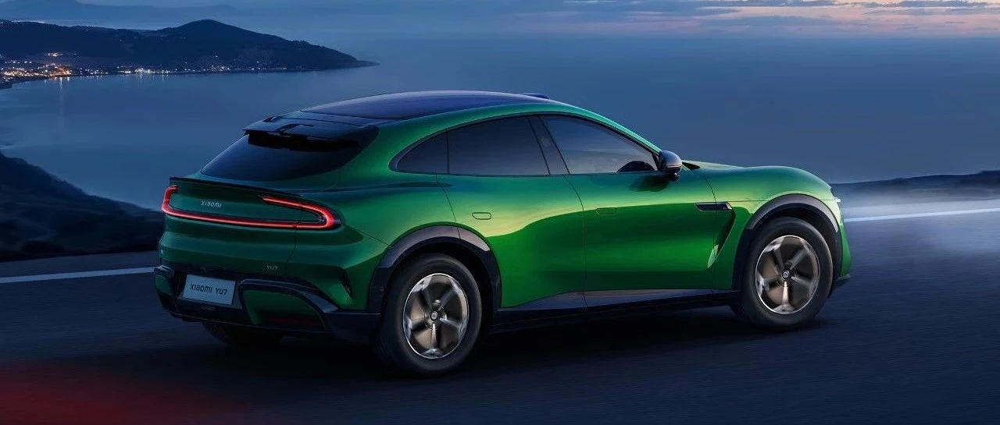
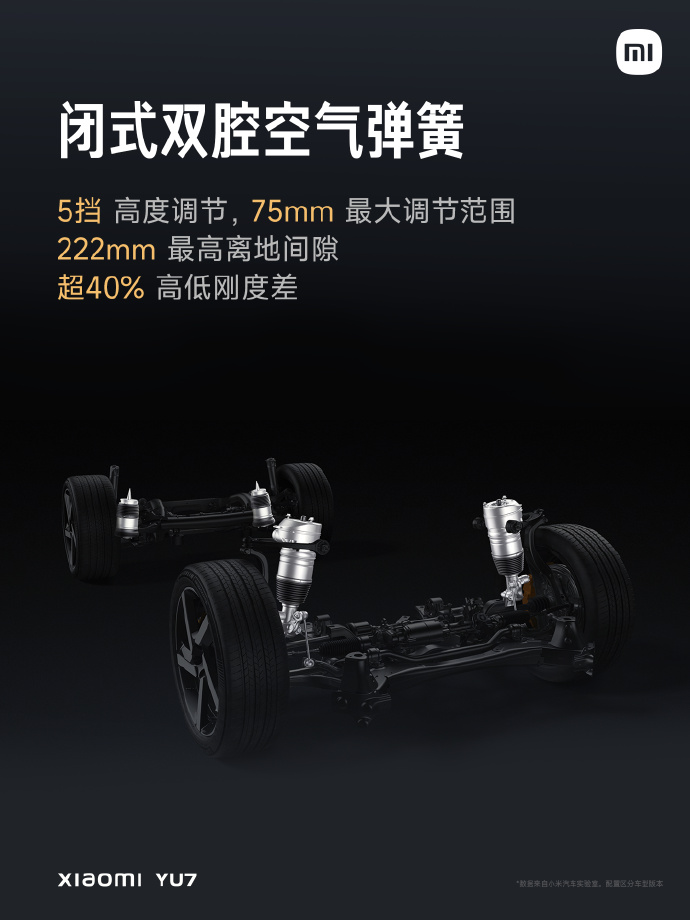

#  小米汽车答网友问（第141集）

[ 小米汽车 ](<javascript:void\(0\);>)

______

  

****01  
****

**小米YU7车内的空间表现怎么样？**

小米YU7定位「豪华高性能SUV」，不仅拥有低趴优雅、极具运动感的豪华外观设计，同时还具有舒适宽敞的内部空间。我们通过诸多高集成化设计、创新结构设计，以及“应挖尽挖”的理念，在保障结构强度的基础上，实现了优雅动感的外观设计和宽敞豪华空间的平衡兼得。

小米YU7采用了大量空间优化技术，比如CTB电池车身一体化技术，使小米YU7达成超高的垂向空间利用率，前后排头部空间非常宽敞；3000mm的轴距以及仪表台轻薄设计，使后排的腿部空间、前排的乘坐空间表现优异，同时视野开阔。

再比如储物空间，我们通过斜置散热器、小米汽车首创的集成式一体压铸铝三角梁等设计，使得小米YU7拥有141L超大电动前备箱；通过将重低音扬声器布置在后备厢侧边，增加了后备厢盖板下的储物容积，使得后备厢常规容积达到678L；后排座椅靠背电动放倒后，后备厢容积更达到1758L。乘员舱收纳空间也是“应挖尽挖”，达到了共计71L的储物容积。最终，小米YU7整车储物容积达到1970L，完全可以满足您无论是日常，还是自驾游、郊外骑行、滑雪等诸多场景的储物需求。

  

**02**

**小米YU7的大灯和机盖的风道很酷，平时容易清理么？**

请您放心，我们在小米YU7的前机盖风道上铺设了一层金属网罩，可以防止常见的落叶等杂物进入机盖风道内部。

日常用车过程中，如果风道中进入了灰尘或极小的异物，可在洗车或下雨时自动从排水孔中排出（也可使用高压水枪清洗），您无需担心有堵塞风险。如果大灯风道在一些特殊场景中堆积了异物，您可以打开前机盖，使用气枪对准美化板风道口，将异物从大灯风道口吹出。

  

**03**

**小米YU7配备的闭式双腔****空簧****系统相比普通的空簧系统有哪些优势？**

与普通开式单腔空簧系统相比，闭式双腔空簧系统在舒适性、操控性和响应速度等方面相对更有优势，悬架高度调节速度大幅提升。

小米YU7 Pro和小米YU7 Max搭载的闭式双腔空气弹簧系统支持 5 挡高度调节，高度调节范围达75 mm，最高离地间隙可达222 mm。闭式双腔空气弹簧系统可以通过快速调节空气弹簧刚度来满足舒适和操控的不同需求，刚度调节范围超过 40%，“刚柔并济”的满足日常蜿蜒山路、城市高架、城郊烂路等多场景路况运动和舒适需求。

  

  

**04**

**雨季到了，下雨天行驶时需要注意什么？**

车辆在雨天道路或湿滑路面行驶时，请您务必降低车速并小心驾驶。尽量避免紧急制动、急加速或急打方向盘等可能会导致车辆难以控制，发生事故的操作。此外，在雨天驾驶要及时对汽车玻璃进行除雾，避免影响驾驶员视线。

值得注意的是，现在很多地下车库铺设了环氧地坪，这种材料本身具备可自流平，美观、光滑、易清洁的特点，因此受到了广泛应用。但环氧地坪在遇水后会变得非常滑，在此类地面上轮胎抓地力会大幅下降。而一旦轮胎打滑，车辆的制动、转向能力会完全丧失，极易发生事故。因此在雨天进入铺设环氧地坪的车库时，请您一定**注意充分减速** ，尽可能避开有水覆盖的路面，**提前进行制动、且不要猛打方向** ，避免轮胎打滑。

  

  

< img alt="图片" class="rich_pages wxw-img" data-ratio="0.8824074074074074" src="https://mmbiz.qpic.cn/sz_mmbiz_png/UaK4PTh6Zpk2TaVLh0tUHxviapUIsTcXOFp1ATh7VRDuqnQr3V3oDvw9DodpJKDZDh0fV2YVzbrgHETVM5DzIqA/640?wx_fmt=png&from=appmsg&wxfrom=5&wx_lazy=1&wx_co=1" data-w="1080" style="visibility: visible !important;width: 350px !important;height: auto !important;" width="100%" data-imgqrcoded="1">

预览时标签不可点

微信扫一扫  
关注该公众号

继续滑动看下一个

轻触阅读原文

小米汽车 

向上滑动看下一个

[知道了](<javascript:;>)

微信扫一扫  
使用小程序

****

[取消](<javascript:void\(0\);>) [允许](<javascript:void\(0\);>)

****

[取消](<javascript:void\(0\);>) [允许](<javascript:void\(0\);>)

****

[取消](<javascript:void\(0\);>) [允许](<javascript:void\(0\);>)

× 分析

__

微信扫一扫可打开此内容，  
使用完整服务

： ， ， ， ， ， ， ， ， ， ， ， ， 。 视频 小程序 赞 ，轻点两下取消赞 在看 ，轻点两下取消在看 分享 留言 收藏 听过