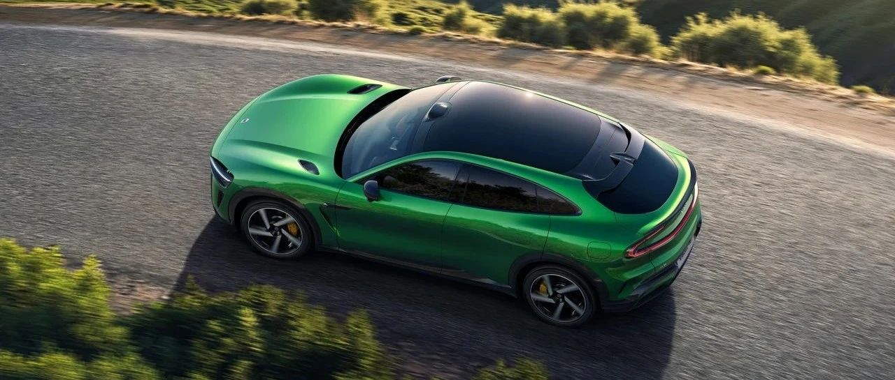
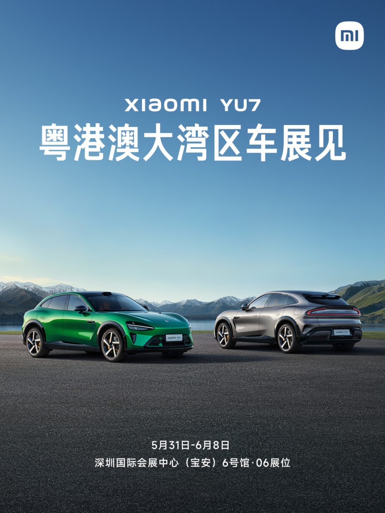

#  小米汽车答网友问（第143集）

[ 小米汽车 ](<javascript:void\(0\);>)

______

  

**01**

**之前小米SU7的中控台物理按键很好用，小米YU7上还有吗？**

**在小米SU7上，「固定物理按键」和「可拆卸物理键盘」的组合，收获了很多用户的正向反馈。同时我们也收到了很多用户反馈他们喜欢更简洁的设计，也非常喜欢屏幕+语音的交互方式。**

因此，在小米YU7上我们并没有取消物理按键，而是设计保留了可拆卸物理按键，希望把选择权还给用户。我们的「可拆卸的物理键盘」承载了固定物理按键功能，这样每个用户能够根据自己的习惯和喜好，找到更合适自己的交互方式。小米YU7支持我们的生态产品中控屏物理按键，如果对物理按键有需求，您可以购买这款产品。

  

**02**

**小米YU7作为中大型SUV，车身长度近5m，转弯掉头方便么？**

请您放心，小米YU7针对转向系统做了多方面调校，使其转弯掉头水平达到同级别优秀水平，实现转弯半径5.7m，三车道掉头可以一把过。

此外，小米YU7还全系标配可变转向比系统，兼顾不同的驾驶场景，让低速转弯更灵活，高速驾驶更稳定。

  

03

**小米YU7上的前排双零重力座椅和市面上其他零重力座椅有什么不同？**

我们考虑到很多朋友有在自己的车上休息的习惯，更习惯坐在主驾驶位。所以小米YU7在前排主、副驾均可配备零重力座椅，更加符合用户的日常习惯，一键进入零重力模式，操作快速且便捷。

同时，小米YU7的前排零重力座椅还配备了10点式座椅按摩，支持多种按摩模式和按摩力度调节，在需要休息的时候能更好的缓解疲劳。此外，以主驾零重力座椅为例，其采用12层座椅结构，层层有讲究，兼顾了包裹性和支撑性：如零压感海绵让短途乘坐更舒适柔软，而支撑性更好的高密度海绵，让长途乘坐久坐也不易疲劳。

  

04

听说粤港澳车展上亮相的小米YU7不能开车门，为什么？

首先感谢您对小米YU7的关注！小米YU7即将亮相与5月31日-6月8日举办的粤港澳大湾区车展。但因为诸多功能尚未正式发布，为确保大家能够获得更精准、完善的产品体验，在车展期间，小米YU7将以不开门的方式进行静态展示。车辆的具体配置等相关信息，请以最终上市销售的实车为准。

我们再次对大家的支持表示诚挚的谢意，欢迎来小米汽车展台打卡！

  
  
  
  
  
  
< img alt="图片" class="rich_pages wxw-img" data-ratio="0.8824074074074074" src="https://mmbiz.qpic.cn/sz_mmbiz_png/UaK4PTh6Zpk2TaVLh0tUHxviapUIsTcXOFp1ATh7VRDuqnQr3V3oDvw9DodpJKDZDh0fV2YVzbrgHETVM5DzIqA/640?wx_fmt=png&from=appmsg&wxfrom=5&wx_lazy=1&wx_co=1" data-w="1080" style="visibility: visible !important;width: 350px !important;height: auto !important;" width="100%" data-imgqrcoded="1">

预览时标签不可点

微信扫一扫  
关注该公众号

继续滑动看下一个

轻触阅读原文

小米汽车 

向上滑动看下一个

[知道了](<javascript:;>)

微信扫一扫  
使用小程序

****

[取消](<javascript:void\(0\);>) [允许](<javascript:void\(0\);>)

****

[取消](<javascript:void\(0\);>) [允许](<javascript:void\(0\);>)

****

[取消](<javascript:void\(0\);>) [允许](<javascript:void\(0\);>)

× 分析

__

微信扫一扫可打开此内容，  
使用完整服务

： ， ， ， ， ， ， ， ， ， ， ， ， 。 视频 小程序 赞 ，轻点两下取消赞 在看 ，轻点两下取消在看 分享 留言 收藏 听过