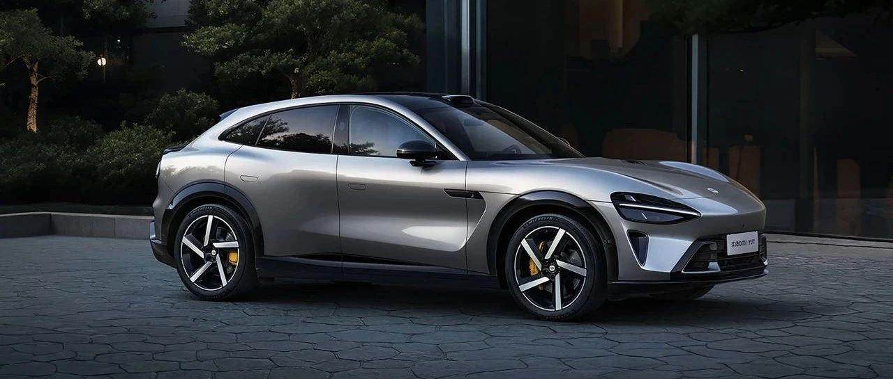
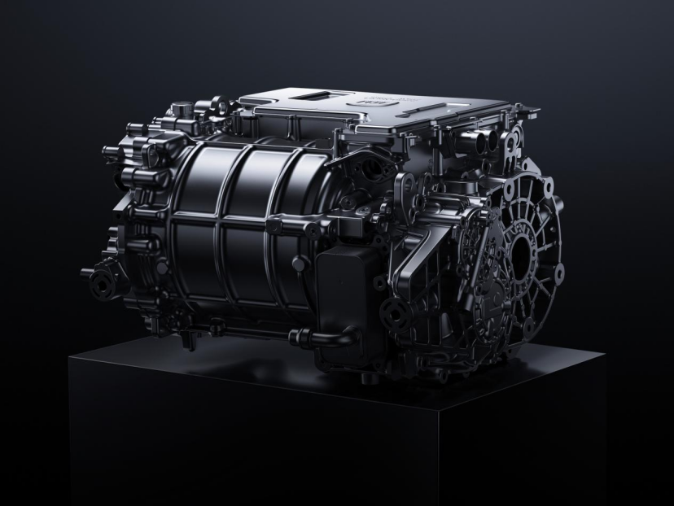

#  小米汽车答网友问（第144集）

[ 小米汽车 ](<javascript:void\(0\);>)

______

**01**

**小米精英驾驶-高阶驾驶培训会在哪些城市举行？什么时候能报名？**

我们已经于今日（5月27日）开启了北京场培训的报名，后续还将陆续开放上海、广州、深圳、杭州等10多个城市的报名，请密切关注小米汽车的官方消息，敬请期待。

温馨提示：目前北京站6月6日-12日所有场次名额已全部报满；6月13日-15日Ultra Club专场尚余少量名额。如您暂未报名成功，可在报名期间持续关注小米汽车APP高阶驾驶培训活动页面，若有已报名用户取消报名，系统将释放相应场次名额，建议您及时刷新页面以查看最新名额动态。再次感谢大家的支持。

**02**

**我报名成功了，培训当天我可以带朋友一起参加么？**

高阶驾驶培训仅限已成功报名的小米汽车车主本人到场参与。培训现场没有设置观摩区域，因此无法携带陪同人员，感谢您的理解与配合。

**03**

**小米YU7三个版本都搭载小米超级电机V6s Plus电机吗？功率一样吗？**

小米YU7全系三个版本均标配小米超级电机V6s Plus，其通过应用分段磁钢技术，把整段磁钢切割为多个小段，大幅降低损耗，以此提升电机效率；同时配合升级功率模块、优化拓扑寻优算法等方式，使得转速、扭矩、功率均有全面提升。

小米YU7各版本的电机最大输出功率会有所差异，以根据不同用户的场景需求。比如小米YU7 Max为高性能四驱版本，为满足更高性能需求，后主驱电机V6s Plus最大可输出288kW功率、528N·m峰值扭矩，相比标准版最大输出功率有所提升。

**04**

**Xiaomi 15S Pro支持UWB车钥匙，如果我的手机不慎丢失，那捡到的人也能解锁我的小米YU7了？**

您无需担心，如果您的手机丢失，请第一时间使用备用手机重新登录小米汽车APP，在创建新钥匙之后，旧钥匙将失效。如您是被分享人，也可以尽快通知车主取消用车权限，以保障车辆安全。

同时，您也可通过小米云服务远程定位遗失手机的位置，以帮助您找回手机。

  

  

< img alt="图片" class="rich_pages wxw-img" data-ratio="0.8824074074074074" src="https://mmbiz.qpic.cn/sz_mmbiz_png/UaK4PTh6Zpk2TaVLh0tUHxviapUIsTcXOFp1ATh7VRDuqnQr3V3oDvw9DodpJKDZDh0fV2YVzbrgHETVM5DzIqA/640?wx_fmt=png&from=appmsg&wxfrom=5&wx_lazy=1&wx_co=1" data-w="1080" style="visibility: visible !important;width: 350px !important;height: auto !important;" width="100%" data-imgqrcoded="1">

预览时标签不可点

微信扫一扫  
关注该公众号

继续滑动看下一个

轻触阅读原文

小米汽车 

向上滑动看下一个

[知道了](<javascript:;>)

微信扫一扫  
使用小程序

****

[取消](<javascript:void\(0\);>) [允许](<javascript:void\(0\);>)

****

[取消](<javascript:void\(0\);>) [允许](<javascript:void\(0\);>)

****

[取消](<javascript:void\(0\);>) [允许](<javascript:void\(0\);>)

× 分析

__

微信扫一扫可打开此内容，  
使用完整服务

： ， ， ， ， ， ， ， ， ， ， ， ， 。 视频 小程序 赞 ，轻点两下取消赞 在看 ，轻点两下取消在看 分享 留言 收藏 听过