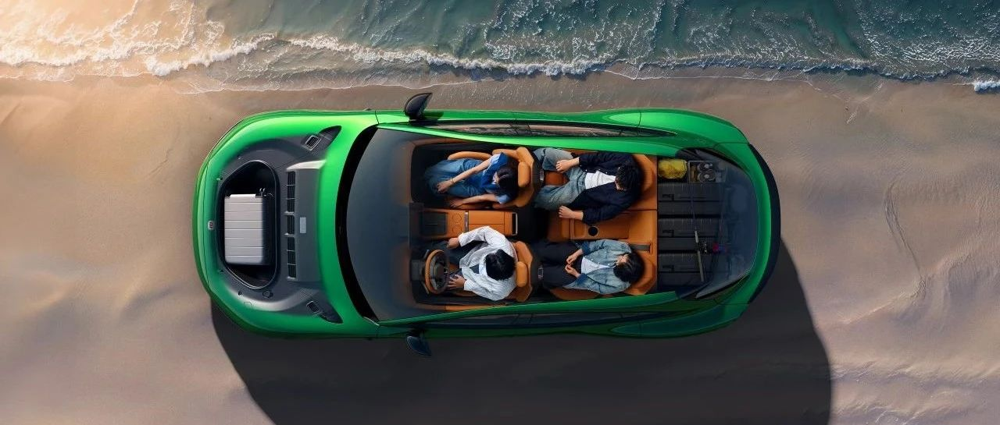
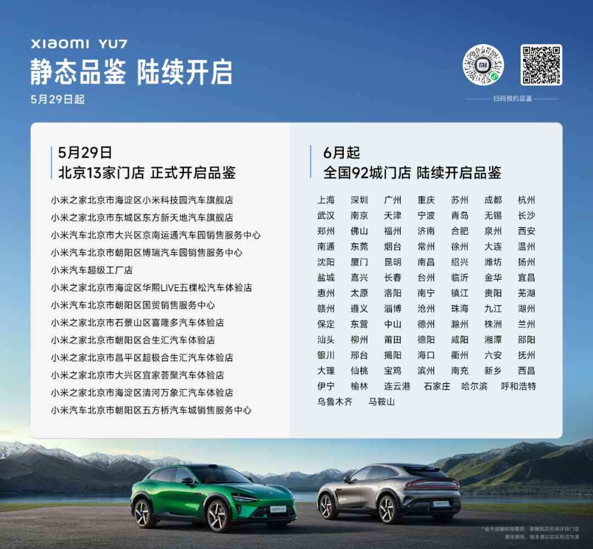
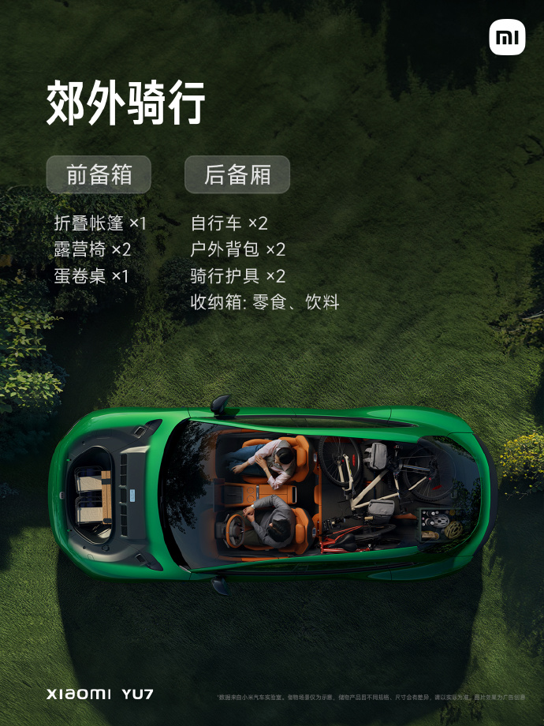
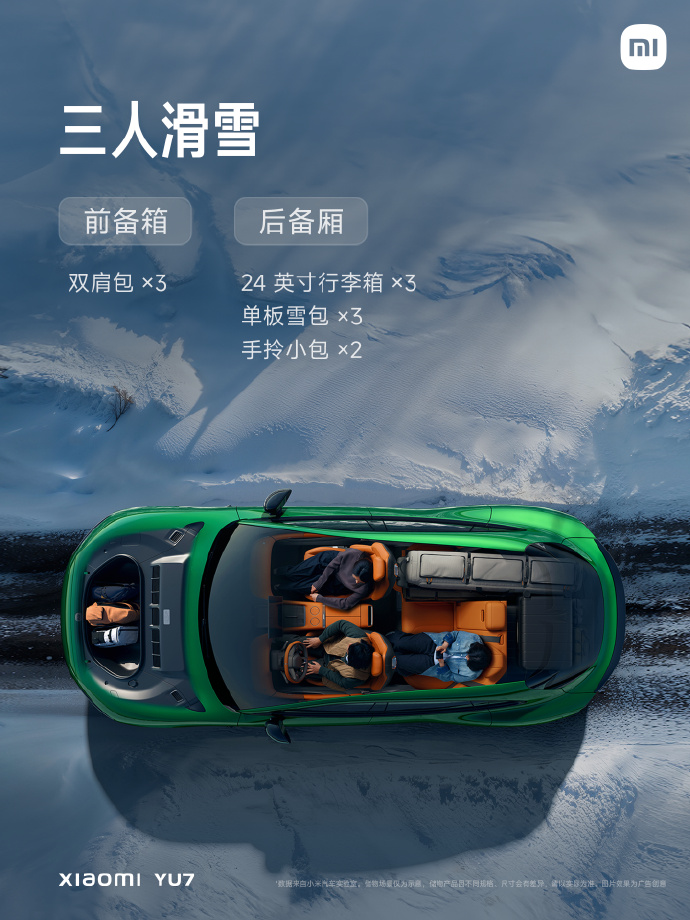
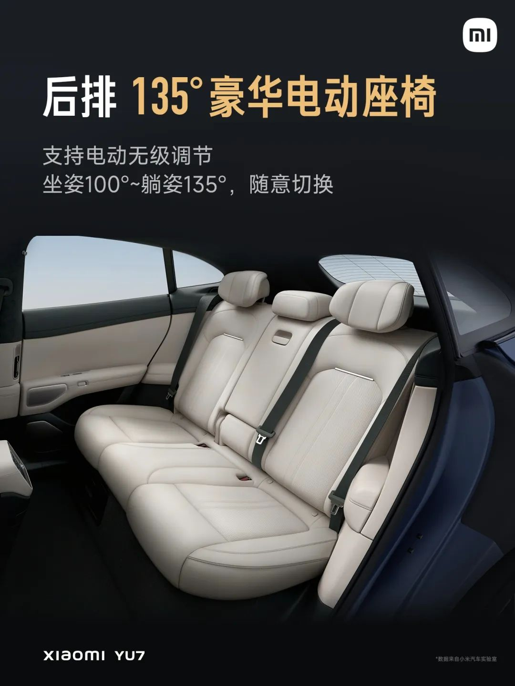

#  小米汽车答网友问（第145集）

[ 小米汽车 ](<javascript:void\(0\);>)

______

  

**01**

**听说小米YU7展车马上进店了，在哪些城市能看到？**

北京有13家门店即将于明日（5月29日）开启小米YU7的静态品鉴，详细门店列表请见下图；其余城市将于6月陆续开启品鉴，届时小米YU7展车将覆盖全国92座城市。

温馨提示：由于目前小米YU7还有诸多功能尚未发布，为呈现更完善的产品体验，本次静态展示将采取不开门的方式，更多惊喜将在上市后揭晓，欢迎您下载小米汽车APP预约咨询。

**02**

**小米YU7钛金属色的车模没货了，什么时候能****补货****？**

所有小米汽车APP商城里的热销产品，我们都会根据每周的到货情况第一时间上架补货。**一般来说，上架补货的时间会在每周五的上午10点。** 您可于每周五上午10点登录小米汽车APP，查看您心仪产品的补货情况并购买。您也可关注商城小掌柜发布的小米汽车APP商城开售日历，查看商品的到货情况。具体请您以实际销售为准。

03

**小米YU7有些什么轮胎型号可选？**

小米YU7的性能非常强大，因此我们为小米YU7提供了275mm后宽胎可选。后轮胎加宽可增大轮胎接地面积，显著提升抓地力，操控性和稳定性会更好，同时视觉更具运动感，姿态更稳健，为整车增添高性能风格元素。

同时，小米YU7也将提供更多的轮胎选项，来满足用户不同的性能及续航的需求。我们对小米YU7的各款轮胎都做了定制调校，保证其制动性能出色，加上四重制动冗余，以保障驾驶安全。在满足安全的同时，还兼顾了超长续航，例如小米YU7标准版的CLTC续航最高里程可实现835km。

更多详情可以关注后续小米汽车官方信息，并请以实际上市为准。

04

**小米YU7的后排座椅能放倒么？**

可以，除往前放倒外，小米YU7后排座椅靠背还可以灵活调整，从而兼具乘坐舒适性和储物功能性。

小米YU7后排座椅靠背支持4/6比例电动一键放倒、电动一键抬起，满足不同场景的后备厢储物需求；比如郊外骑行需携带自行车，可将后排靠背放倒；比如三人滑雪，可将后排一个座位的靠背放倒，既满足后排舒适乘坐，又可装载大件滑雪包。

此外，小米YU7的后排座椅靠背角度还支持100°~135°的超大范围电动无级调节：乘客可根据自身乘坐喜好调整靠背角度，也可以根据后备厢载物的数量，灵活调整靠背角度，既能满足后排乘坐舒适性，也能得到足够的储物空间。

*左右滑动 查看更多

  

  

  

< img alt="图片" class="rich_pages wxw-img" data-ratio="0.8824074074074074" src="https://mmbiz.qpic.cn/sz_mmbiz_png/UaK4PTh6Zpk2TaVLh0tUHxviapUIsTcXOFp1ATh7VRDuqnQr3V3oDvw9DodpJKDZDh0fV2YVzbrgHETVM5DzIqA/640?wx_fmt=png&from=appmsg&wxfrom=5&wx_lazy=1&wx_co=1" data-w="1080" style="visibility: visible !important;width: 350px !important;height: auto !important;" width="100%" data-imgqrcoded="1">

预览时标签不可点

微信扫一扫  
关注该公众号

继续滑动看下一个

轻触阅读原文

小米汽车 

向上滑动看下一个

[知道了](<javascript:;>)

微信扫一扫  
使用小程序

****

[取消](<javascript:void\(0\);>) [允许](<javascript:void\(0\);>)

****

[取消](<javascript:void\(0\);>) [允许](<javascript:void\(0\);>)

****

[取消](<javascript:void\(0\);>) [允许](<javascript:void\(0\);>)

× 分析

__

微信扫一扫可打开此内容，  
使用完整服务

： ， ， ， ， ， ， ， ， ， ， ， ， 。 视频 小程序 赞 ，轻点两下取消赞 在看 ，轻点两下取消在看 分享 留言 收藏 听过