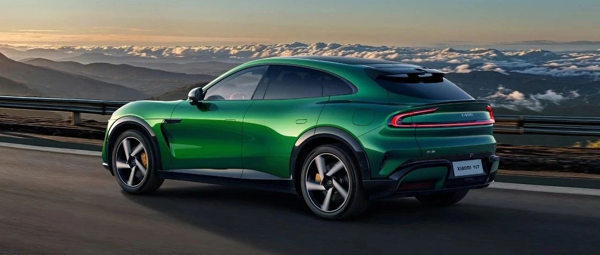
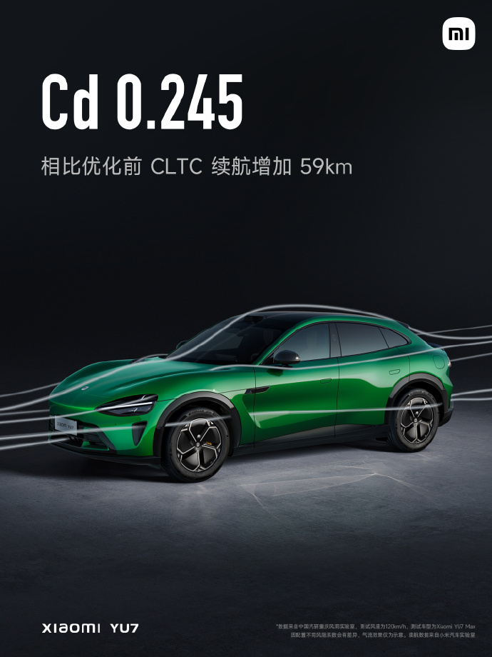
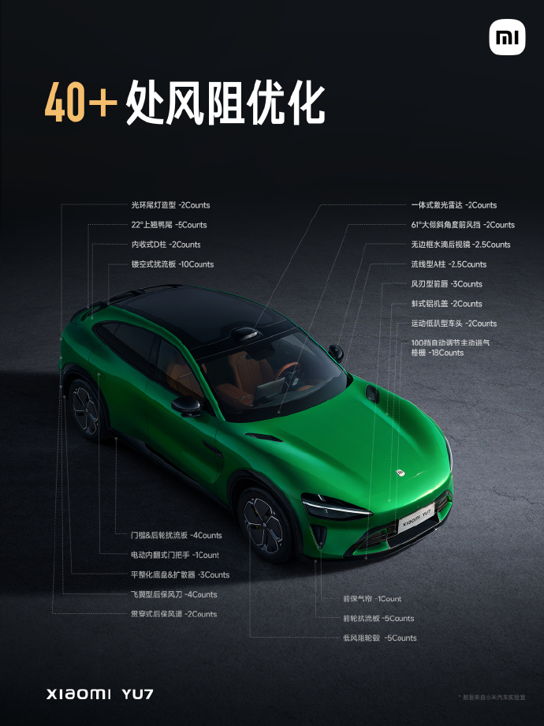
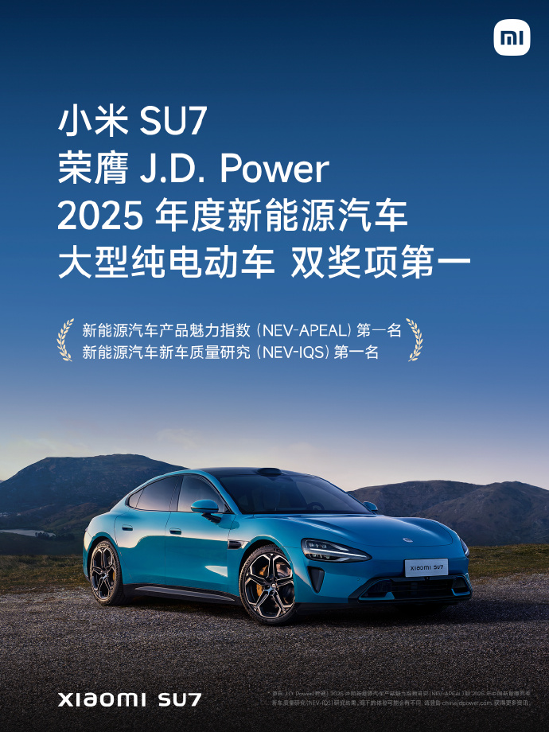

#  小米汽车答网友问（第152集）

[ 小米汽车 ](<javascript:void\(0\);>)

______

**01**

**小米YU7针对续航提升都做了些什么优化？**

小米YU7做了多项调校和优化来提升其续航表现。首先，足够的电池容量是实现超长续航的必要条件，小米YU7「标配即旗舰」，标准版起步即搭载96.3kWh大容量电池，CLTC最高续航达835km，续航水平行业领先。

其次为了降低能耗，小米YU7拥有非常多空气动力学细节设计，全车40多处风阻优化，使得其续航增加59km；同时优化了电子电气架构能效，续航提升16公里。

总的来说，纯电车型续航能力提升是一项非常复杂的整车系统工程，除上述以外，小米YU7还做了非常多的续航能力优化工作。更多信息，请期待后续小米汽车官方信息。

*左右滑动 查看更多

**02**

**小米YU7的充电速度怎么样？**

**小米YU7全系搭载800V碳化硅高压平台，其中小米YU7 Max的最大充电倍率可以达到5.2C，10% - 80%充电时间最快仅需12分钟，15分钟最长补能里程620km，充电速度行业领先。**

有关小米YU7产品相关的更多详情，敬请关注后续小米汽车官方信息。

**03**

**小米****SU7****在J.D. Power中国****新能源汽车****新车质量研究（NEV-IQS）榜单纯电大型车排名第一名，这个排名是怎么排的？**

据J.D. Power（君迪）披露的信息，中国新能源汽车新车质量研究（NEV-IQS）展现了用户对产品质量的综合评分，反映真实用车环境下的新车质量。榜单基于“客户之声”衡量和统计新能源车新车车主在2-6个月的拥车期内遇到的质量问题。研究按品牌、车型和细分市场来分析传统的产品质量（生产质量）和潜在的产品质量（设计所造成的使用缺陷），并使用PP100（每百辆车问题数）衡量新能源新车的质量表现好坏，覆盖10个问题大类（包含车身外观、驾驶体验、配置/操控系统/仪表板、驾驶辅助、信息娱乐系统、座椅、空调、车身内装、动力总成和电池/充电）的236个问题点。PP100分数越低，表明问题数越少，质量也越好。

小米SU7的PP100仅为193，在IQS评分中荣获纯电大型车第一名。虽然小米SU7是小米汽车的首款车型，但质量依旧做到了行业领先。

再加上前段时间小米SU7在J.D. Power（君迪）发布的2025年中国新能源汽车产品魅力指数研究（NEV-APEAL）榜单纯电大型车中排名第一，小米SU7成为了J.D. Power史上首个「上市第一年就获得这两个奖项」的产品。我们再次感谢小米汽车车主的认可，我们将继续为好产品而战。

**04**

**最近我在投保车险，发现有的车险报价单上把“保险”写成“保障/服务”，保费价格远低于常规车险，这种情况能投保吗？**

我们严肃地提醒大家：如果您在投保车险的时候遇到将“保险”表述为“保障”或“服务”，且保费明显低于常规车险的情况，需要高度警惕。

近期，有用户拿着写有“机动车损失保障”、“机动车第三者责任保障”的“商业电子单”去找保险公司申请车险理赔被拒，因为该产品是由某汽车服务公司提供的服务保障产品，不是由保险公司承保的正规商业险。

这类假车险主要表现为：高仿车险、低价诱导，实际上是由非保险机构提供的风险分担服务；所签署的合同不属于保险合同，不受保险法的保护和约束，且条款设置苛刻，理赔流程繁琐，拒赔风险高。这些机构未经国务院保险监督管理机构批准，不具备经营保险业务的资质，无资金储备要求，偿付能力无有效监管。一旦出现大规模赔付，这些机构可能会随时跑路。

请大家客观认识其风险，切勿因小失大。如有保险需求，请一定向具有合法经营车险业务资质的保险机构投保机动车辆交强险和商业保险。

  

< img alt="图片" class="rich_pages wxw-img" data-ratio="0.8824074074074074" src="https://mmbiz.qpic.cn/sz_mmbiz_png/UaK4PTh6Zpk2TaVLh0tUHxviapUIsTcXOFp1ATh7VRDuqnQr3V3oDvw9DodpJKDZDh0fV2YVzbrgHETVM5DzIqA/640?wx_fmt=png&from=appmsg&wxfrom=5&wx_lazy=1&wx_co=1" data-w="1080" style="visibility: visible !important;width: 350px !important;height: auto !important;" width="100%" data-imgqrcoded="1">

预览时标签不可点

微信扫一扫  
关注该公众号

继续滑动看下一个

轻触阅读原文

小米汽车 

向上滑动看下一个

[知道了](<javascript:;>)

微信扫一扫  
使用小程序

****

[取消](<javascript:void\(0\);>) [允许](<javascript:void\(0\);>)

****

[取消](<javascript:void\(0\);>) [允许](<javascript:void\(0\);>)

****

[取消](<javascript:void\(0\);>) [允许](<javascript:void\(0\);>)

× 分析

__

微信扫一扫可打开此内容，  
使用完整服务

： ， ， ， ， ， ， ， ， ， ， ， ， 。 视频 小程序 赞 ，轻点两下取消赞 在看 ，轻点两下取消在看 分享 留言 收藏 听过