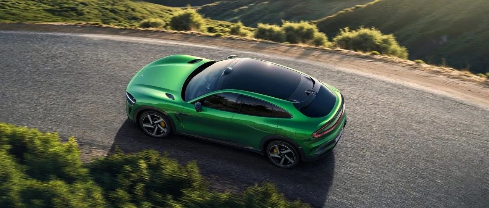

#  小米汽车答网友问（第153集）

[ 小米汽车 ](<javascript:void\(0\);>)

______

**01**

**小米YU7展车进店什么进度了？我的城市有展车了么？**

目前小米YU7的静态展车已到店全国34座城市，欢迎大家预约到店品鉴。目前已到店城市清单为：北京、上海、杭州、成都、广州、深圳、天津、重庆、武汉、南京、苏州、长沙、西安、厦门、福州、长春、合肥、石家庄、太原、无锡、宁波、南昌、金华、中山、扬州、南通、临沂、潍坊、六安、马鞍山、株洲、东营、邢台、仙桃。

**02**

**Gran Turismo 7（跑车浪漫旅 7）是一款什么游戏？现实中的车都能入驻该游戏么？**

Gran Turismo，在国内通常被称为《GT赛车》，被公认为“全球最真实的模拟驾驶平台”之一，车辆参数参照并尽量还原实车模型，凭借出色的模拟体验、竞技赛事以及对汽车文化的传播，成为全球汽车爱好者的聚集地。游戏中收录了众多不同年代最具传奇色彩的经典车型。

GT不仅是一款赛车游戏，更是一部“汽车文化百科全书”。同时。Gran Turismo系列对其产品收录有着非常严苛的标准。据Gran Turismo官方介绍，选车逻辑融合了 “历史价值” “技术代表性” “文化影响力” 以及 “玩家呼声” 等多重因素。

Gran Turismo系列制作人山内一典来访小米和试驾小米SU7 Ultra时，我们也问了他选车标准的问题。山内一典说，标准就是在汽车发展进程中有重要意义的、必须铭记的，或者是跟汽车文化有紧密关联的，当然，最重要的是他自己喜欢的车。

**03**

**Gran Turismo是怎么找到小米合作的？**

小米SU7 Ultra原型车在纽北创下了“最速四门车纪录”后，小米汽车赢得了业界内广泛的赞誉与认可。Gran Turismo方面联系到我们，邀请小米SU7 Ultra入驻这一全球传奇车型的“名人堂”。

小米SU7 Ultra是首款收录到GT赛车中的中国车。未来，我们将与GT一起，带着共同的热情、好奇与勤奋，邀全球玩家一起探索电车的驾驶乐趣，感受汽车文化！

**04**

**入驻Gran Turismo 7的小米****SU7 Ultra****是什么版本？**

即将收录到Gran Turismo 7中的将会是小米SU7 Ultra的量产版本，并将在游戏中实现1:1高精度复刻，我们可以一同期待在游戏中的体验。

**05**

**小米****SU7 Ultra****会在什么时间上架****到GT7游戏内？**

Gran Turismo将与小米汽车一同完成车辆收录及相关开发工作，在游戏中尽可能还原小米SU7 Ultra的极致驾控体验。到最终上线还需要一段时间，Gran Turismo官方和我们会在上线时第一时间通知大家，敬请期待。

  

< img alt="图片" class="rich_pages wxw-img" data-ratio="0.8824074074074074" src="https://mmbiz.qpic.cn/sz_mmbiz_png/UaK4PTh6Zpk2TaVLh0tUHxviapUIsTcXOFp1ATh7VRDuqnQr3V3oDvw9DodpJKDZDh0fV2YVzbrgHETVM5DzIqA/640?wx_fmt=png&from=appmsg&wxfrom=5&wx_lazy=1&wx_co=1" data-w="1080" style="visibility: visible !important;width: 350px !important;height: auto !important;" width="100%" data-imgqrcoded="1">

预览时标签不可点

微信扫一扫  
关注该公众号

继续滑动看下一个

轻触阅读原文

小米汽车 

向上滑动看下一个

[知道了](<javascript:;>)

微信扫一扫  
使用小程序

****

[取消](<javascript:void\(0\);>) [允许](<javascript:void\(0\);>)

****

[取消](<javascript:void\(0\);>) [允许](<javascript:void\(0\);>)

****

[取消](<javascript:void\(0\);>) [允许](<javascript:void\(0\);>)

× 分析

__

微信扫一扫可打开此内容，  
使用完整服务

： ， ， ， ， ， ， ， ， ， ， ， ， 。 视频 小程序 赞 ，轻点两下取消赞 在看 ，轻点两下取消在看 分享 留言 收藏 听过