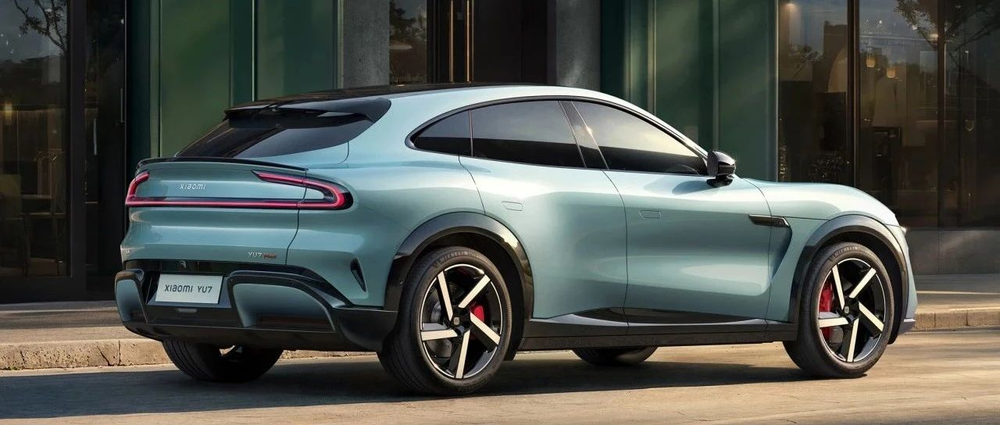

#  小米汽车答网友问（第164集）

[ 小米汽车 ](<javascript:void\(0\);>)

______

**01**

**我已经提车了，但为什么我买不了刚发布的新版小米汽车无忧服务包？**

自2024年3月随小米SU7同步上市并销售以来，小米汽车无忧服务包1.0版以其高价值感与高体验感，获得了众多用户朋友们的喜爱和认可。

今年随着小米YU7的上市发布，我们同时迭代发布了小米汽车无忧服务包2.0版本。其产品的主要变化是我们基于用户的反馈和建议，纳入了“车窗玻璃无忧（不含车顶/天幕）”的权益。

小米汽车无忧服务包2.0版本的销售和购买规则将依然延用1.0版本的规则，即：

  * 小米汽车无忧服务包是给小米汽车官方保险服务用户的用车权益升级的专属选择，仅供官保用户可选购；

  * 同时，其所含的部分车辆维修相关权益是小米汽车与关联保司合作开发的；无忧服务包的合同有效期也是与用户所购的车辆商业保险保单有效期1：1对齐一致的。因此，无忧服务包的购买窗口期为：车辆商业险投保之日起至商业险保单生效后7天内，用户可下单购买。

因此，无忧服务包2.0版发布开售时，在购买窗口期内的、已提车的小米SU7和小米SU7 Ultra的官保服务用户，可以选购该产品，以升级自己的专属用车权益。

此外，当首年车辆保险到期后，通过小米汽车官方保险服务渠道，续购了车辆商业保险的用户，也可以再次续购新版的小米汽车无忧服务包。

02

**小米YU7的座椅为什么没有侧翼支撑功能了？**

小米YU7的车型定位、配置取向与小米SU7、小米SU7 Ultra略有不同。作为一台SUV，小米YU7更多强调“好开”、“豪华感”以及“舒适性”，所以小米YU7的座椅设计得更厚、更软，主驾座椅也相应地没有配备主动侧翼支撑功能。

不过，您并不用担心小米YU7座椅的包裹性：小米YU7座椅采用零压感软海绵、高密度海绵做填充，让短途乘坐柔软、长途乘坐支撑性好；同时还对座椅不同部分的硬度进行了精细化设计，比如前后排座椅靠背、座垫与人体后背、臀部接触的部位比较软，确保舒适性，而靠背、座垫侧翼则有比较好的支撑性，保证了良好了包裹性。此外，您还可以为您的小米YU7选择前排双零重力座椅（在7月31日24点前下定将免费赠送）。欢迎您到店实际体验小米YU7的豪华座椅。

**03**

**小米YU7全车配备了双层夹胶玻璃，如果突发危险，会很难破窗吗？**

如遇突发情况，您无需担心破窗问题，我们特意针对小米YU7的夹层玻璃设计了一款破窗锤。这款破窗锤采用了5mm钨钢破窗尖，轻巧易握，可有效击破夹层玻璃。同时，它还内置安全带割刀，在危急时刻可快速割断安全带。这款破窗锤平时可收纳在中控台下方，不占用车内其他空间。我们将会在小米YU7交付时随车赠送您一把该破窗锤。

小米YU7作为一台「豪华高性能SUV」，拥有众多豪华配置，全系标配了双层夹层玻璃，不仅前风挡、四门车窗，连后三角窗都是夹层玻璃，带来了更好的静谧性、防晒隔热的表现。欢迎大家预约到店试驾体验！

04

**小米YU7为什么会采用全新的电动内翻式门把手？**

作为一款「豪华高性能SUV」，小米YU7自带宽体，后轮包极具肌肉感。为了配合这样的型面，门把手就需要贴合车身曲面线条，美观流畅。为了让门把手在多数时间都保持隐藏状态，我们为小米YU7设计了全新的电动内翻式门把手，在符合美学的同时，还能充分降低风阻。

小米YU7的全新电动内翻式门把手兼顾了美学与体验。我们全新设计了电动内翻功能，当您在中控屏内打开「门把手自动内翻」功能后，当人带着数字钥匙靠近，门把手就可以自动打开，开门体验和小米SU7是一样的。新设计的门把手手感也非常舒适，还有氛围灯照明，仪式感十足。关门后，门把手还能自动回位，整个过程非常优雅。

  

  
  

  

< img alt="图片" class="rich_pages wxw-img" data-ratio="0.8824074074074074" src="https://mmbiz.qpic.cn/sz_mmbiz_png/UaK4PTh6Zpk2TaVLh0tUHxviapUIsTcXOFp1ATh7VRDuqnQr3V3oDvw9DodpJKDZDh0fV2YVzbrgHETVM5DzIqA/640?wx_fmt=png&from=appmsg&wxfrom=5&wx_lazy=1&wx_co=1" data-w="1080" style="visibility: visible !important;width: 350px !important;height: auto !important;" width="100%" data-imgqrcoded="1">

预览时标签不可点

修改于

微信扫一扫  
关注该公众号

继续滑动看下一个

轻触阅读原文

小米汽车 

向上滑动看下一个

[知道了](<javascript:;>)

微信扫一扫  
使用小程序

****

[取消](<javascript:void\(0\);>) [允许](<javascript:void\(0\);>)

****

[取消](<javascript:void\(0\);>) [允许](<javascript:void\(0\);>)

****

[取消](<javascript:void\(0\);>) [允许](<javascript:void\(0\);>)

× 分析

__

微信扫一扫可打开此内容，  
使用完整服务

： ， ， ， ， ， ， ， ， ， ， ， ， 。 视频 小程序 赞 ，轻点两下取消赞 在看 ，轻点两下取消在看 分享 留言 收藏 听过