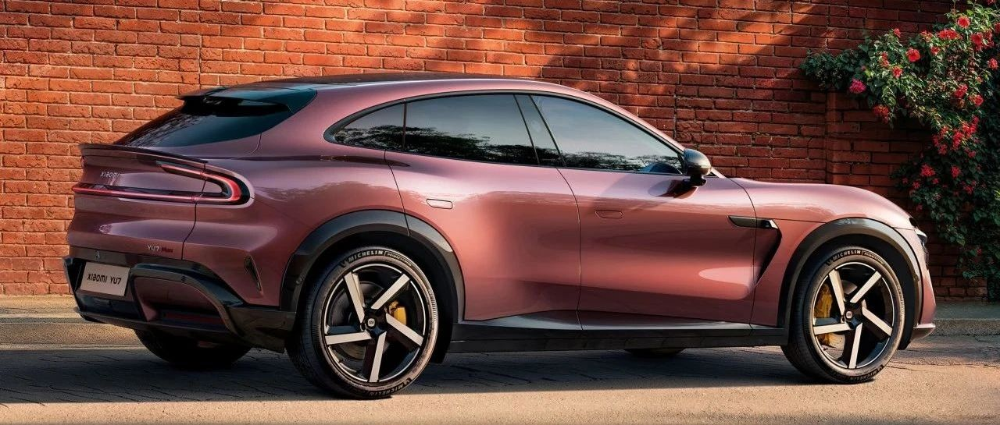
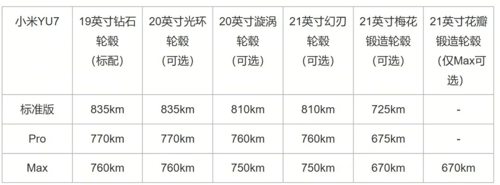

#  小米汽车答网友问（第165集）

[ 小米汽车 ](<javascript:void\(0\);>)

______

**01**

**小米YU7搭配不同型号尺寸的轮胎或****轮毂****，续航分别是多少？**

小米YU7提供多款轮毂轮胎组合可选，其搭配的 CLTC 续航里程会有所不同，以满足您对续航、静音、舒适、运动的不同需求，您可以根据自身实际情况进行选择。详情您可参考下表：

**  
**

02

**小米YU7各个版本的离地间隙分别是多少？**

小米YU7作为豪华高性能 SUV，拥有出色的通过性：其中小米YU7标准版离地间隙为185mm；而Pro版和Max版搭载闭式双腔空气弹簧系统，离地间隙范围为147mm - 222mm（支持5挡高度调节，总调节范围达75mm），其中147mm最低离地间隙适用于高速及良好路面行驶，222mm最高离地间隙则能轻松应对城郊颠簸路面等路况，灵活胜任多种不同驾驶场景。

值得一提的是，小米YU7 Pro和Max版搭载的闭式双腔空气弹簧系统除了可以调节离地间隙外，还可以快速调节悬架刚度，最大高低刚度差超40%，在满足通过性的同时还能调节底盘软硬程度，可以做到保持路感的同时也更加舒适。

**0 3**

**我能直接去当地的小米汽车门店试驾小米YU7么？**

小米YU7试驾车已于前段时间抵达全国各大小米汽车展厅，但由于当前试驾需求火爆，我们建议您前往门店前，先与您的销售顾问进行预约，确认好可试驾的时间段后再前往体验。少量门店或许可以接待临时到店的试驾请求，但可能需要等待较长时间。感谢大家的理解和支持。

04

**小米****SU7****和小米****SU7 Ultra****什么时候能用上1000万Clips版本的辅助驾驶功能？**

小米SU7 Pro、Max和小米SU7 Ultra估计会在7月下旬开始推送1000万Clips版本的辅助驾驶功能，敬请期待！

  

  
  

  

< img alt="图片" class="rich_pages wxw-img" data-ratio="0.8824074074074074" src="https://mmbiz.qpic.cn/sz_mmbiz_png/UaK4PTh6Zpk2TaVLh0tUHxviapUIsTcXOFp1ATh7VRDuqnQr3V3oDvw9DodpJKDZDh0fV2YVzbrgHETVM5DzIqA/640?wx_fmt=png&from=appmsg&wxfrom=5&wx_lazy=1&wx_co=1" data-w="1080" style="visibility: visible !important;width: 350px !important;height: auto !important;" width="100%" data-imgqrcoded="1">

预览时标签不可点

微信扫一扫  
关注该公众号

继续滑动看下一个

轻触阅读原文

小米汽车 

向上滑动看下一个

[知道了](<javascript:;>)

微信扫一扫  
使用小程序

****

[取消](<javascript:void\(0\);>) [允许](<javascript:void\(0\);>)

****

[取消](<javascript:void\(0\);>) [允许](<javascript:void\(0\);>)

****

[取消](<javascript:void\(0\);>) [允许](<javascript:void\(0\);>)

× 分析

__

微信扫一扫可打开此内容，  
使用完整服务

： ， ， ， ， ， ， ， ， ， ， ， ， 。 视频 小程序 赞 ，轻点两下取消赞 在看 ，轻点两下取消在看 分享 留言 收藏 听过