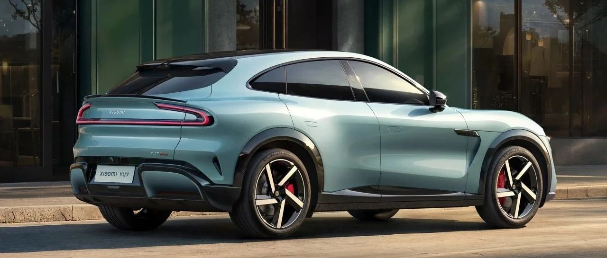

#  小米汽车答网友问（第167集）

[ 小米汽车 ](<javascript:void\(0\);>)

______

**01**

**Xiaomi Life车载磁吸纸巾盒除了在车上使用，还能有什么其他地方能用吗？**

小米YU7全车有9处16个可磁吸点位，针对Xiaomi Life车载磁吸纸巾我们建议您将其放置在中控屏后方磁吸点处。除此之外，它也很适合吸附在冰箱、带磁吸功能的办公桌或家具场景中使用。

值得一提的是，与市面上其他普通纸巾盒不同，Xiaomi Life车载磁吸纸巾盒专为车内环境设计，其塑料部件和内置的14块磁铁均选用耐高低温材料，可以在夏季仪表台暴晒超95℃到冬季零下30℃严寒的极端条件下，都不易变形或退磁。这款磁吸纸巾盒采用双层结构设计，磁铁藏在内部不外露；外层覆有耐高温PU皮并经过全手工包覆，内层则使用了柔软的超细纤维材质，整体不仅安全可靠，更具备高级质感和细腻的手感。欢迎您前往小米汽车APP - 商城 - 车品选购。

02

**小米YU7的25扬声器和14扬声器有什么差别？25扬声器值得选装吗？**

小米YU7标准版、Pro版标配14扬声器，可付费6000元选装25扬声器，小米YU7 Max则标配25扬声器。

无论14扬声器还是25扬声器，均采用小米自研算法，声音还原更加真实、全车低音听感更均衡。而且小米YU7全系标配2个主驾头枕扬声器，可播报导航、通话、辅助驾驶提醒。

25扬声器相比14扬声器，在硬件及功能体验上均有提升：

  * 硬件层面，前者的功放功率更大、失真率更低，带来更好的音质；高音、中音、低音、重低音均采用顶级PSS扬声器，高音、低音延展性更好。

  * 功能层面，25扬声器包括天空扬声器，组成了7.1.4系统，且支持网易云音乐、QQ音乐、爱奇艺等杜比全景声资源，在使用CarPlay时，也支持播放Apple Music的杜比全景声内容，从而像电影院、音乐厅一样为用户带来立体、沉浸的听音感受。此外，25扬声器还支持车内运动声浪，增加驾乘乐趣；无麦K歌的混响效果也比14扬声器更好，适合爱K歌的朋友。

如果您对音响品质、功能要求比较高，建议您可以在小米YU7标准版、Pro版上选装25扬声器，或购买小米YU7 Max。欢迎您到店体验。

**0 3**

**小米汽车提供置换服务吗？有什么优势？**

我们提供置换服务。小米汽车的置换服务是与甄选优质二手车商合作，为用户提供的以旧换新服务。无论用户当前车辆是什么品牌（包括小米汽车品牌或其他品牌），都支持询价和置换。用户可以通过小米汽车APP（锁单前或锁单后）或联系产品专家/交付专员发起需求。具体的置换流程您可以在小米汽车APP-「置换服务」中查看详情。

该服务的核心优势在于省心省力、价格透明、信息安全且规避行业痛点。我们提供免费上门检测评估和全程代办过户，您可足不出户完成新旧车的无缝衔接（至多21天保障期）。我们严格把控服务商，确保报价透明无套路（如拒绝“高报低收”、恶意压价或无故毁约等），并提供7天保价期让您安心比价。同时，它能有效保护用户隐私信息（避免信息泄露导致的骚扰），特别是对小米旧车能100%切换车控权限保障安全。相比外部平台或车商常见的套路多、价格波动大、手续繁杂、信息易泄露等痛点，小米汽车官方置换服务提供了更可靠、便捷和安心的选择。

  

  

  

< img alt="图片" class="rich_pages wxw-img" data-ratio="0.8824074074074074" src="https://mmbiz.qpic.cn/sz_mmbiz_png/UaK4PTh6Zpk2TaVLh0tUHxviapUIsTcXOFp1ATh7VRDuqnQr3V3oDvw9DodpJKDZDh0fV2YVzbrgHETVM5DzIqA/640?wx_fmt=png&from=appmsg&wxfrom=5&wx_lazy=1&wx_co=1" data-w="1080" style="visibility: visible !important;width: 350px !important;height: auto !important;" width="100%" data-imgqrcoded="1">

预览时标签不可点

微信扫一扫  
关注该公众号

继续滑动看下一个

轻触阅读原文

小米汽车 

向上滑动看下一个

[知道了](<javascript:;>)

微信扫一扫  
使用小程序

****

[取消](<javascript:void\(0\);>) [允许](<javascript:void\(0\);>)

****

[取消](<javascript:void\(0\);>) [允许](<javascript:void\(0\);>)

****

[取消](<javascript:void\(0\);>) [允许](<javascript:void\(0\);>)

× 分析

__

微信扫一扫可打开此内容，  
使用完整服务

： ， ， ， ， ， ， ， ， ， ， ， ， 。 视频 小程序 赞 ，轻点两下取消赞 在看 ，轻点两下取消在看 分享 留言 收藏 听过