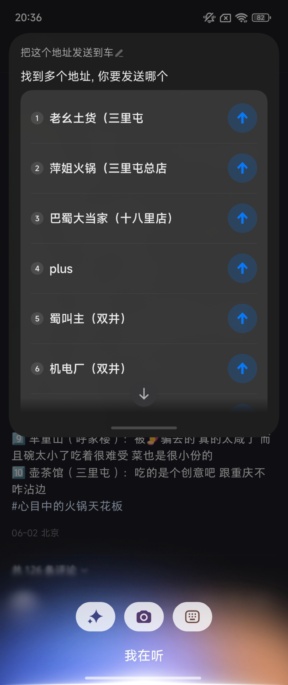
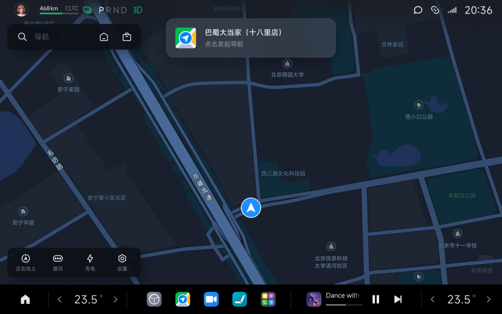
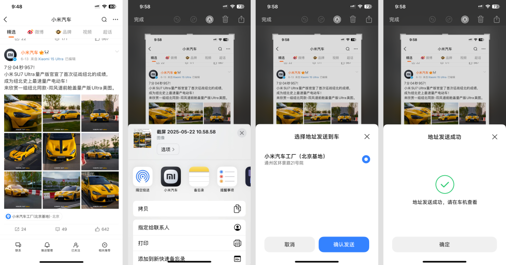
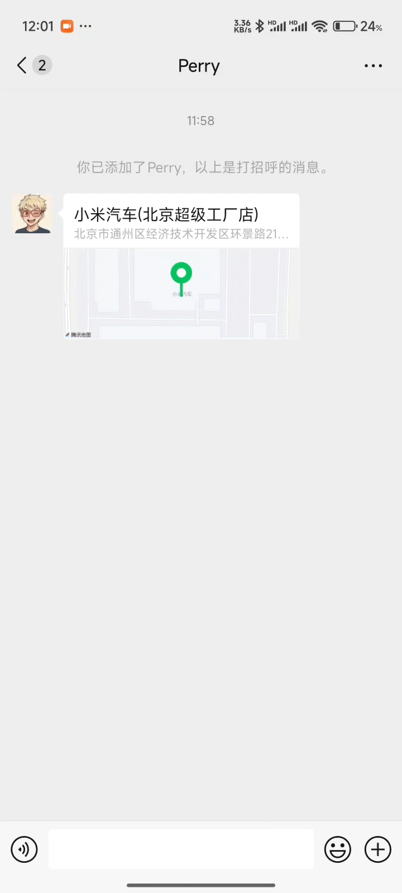

#  小米汽车答网友问（第175集）

[ 小米汽车 ](<javascript:void\(0\);>)

______

01

**小米YU7的前备箱，一共有哪些开闭方式？**

小米YU7配备141L超大电动前备箱，可以轻松容纳一个24英寸行李箱，也可以放随身背包、儿童挖沙玩具、渔具等，并且可水洗，非常实用。该电动前备箱支持以下多种开闭方式，非常便利：

  * 小米YU7主驾侧前翼子板有物理按键，可通过按键开闭电动前备箱；

  * 小米YU7全系车型支持车外语音功能，您通过中控屏「设置>超级小爱>车外语音唤醒」点击开启车外语音功能后，即可在车外唤醒小爱同学打开前备箱。为了防止误开启，您必须携带遥控钥匙或手机蓝牙钥匙在车辆5m范围内，才可使用车外语音；小米YU7的车外语音还提供了声纹识别功能，从而进一步提升安全性；

  * 若您的手机支持UWB功能，您通过中控屏「设置>门窗锁>自动开启前备箱」点击开启该功能后，携带支持UWB的手机靠近前备箱位置，站定3秒左右，前备箱即可自动开启，特别适合双手被物品占用时打开前备箱；

  * 小米汽车APP也支持开闭电动前备箱，特别适合接收快递的时候，远程为快递小哥打开前备箱；

  * 如果您在小米汽车APP商城购买了遥控钥匙，双击两次解锁按键即可打开前备箱，您也可将遥控钥匙的自定义按键设置为前备箱开闭，从而实现遥控开闭前备箱；

  * 如果您希望在车内打开前备箱，可通过车内语音、中控屏快捷操作；

  * 此外，如需在前备箱打开后关闭前备箱，您也可以用手将前备箱盖下拉一小段，前备箱盖随即电动关闭，非常方便。欢迎您到店体验小米YU7的超大电动前备箱。

02

**我如何将导航直接发送到车机上？**

我们一共设计了 5 种发送导航到车的方式，分别是小米手机超级小爱一键识别、苹果手机截图发送、三方应用内分享到车、微信地址长按分享到车、与车机同账号时高德选点同步。

  * 小米手机超级小爱一键识别，是最近推出的新功能之一。比如当您一家人出门游玩，在大众点评APP上找到心仪的餐厅后，您可以直接按住手机电源键唤起小爱，对小爱说“把这个地址发送到车上” ，小爱将自动识别页面中的餐厅地址并发送到车机上。

苹果手机截图发送导航信息，也是非常实用的新功能。现在很多朋友都通过小红书搜索网红打卡地，此时您只需将带有地址的截图分享至小米汽车APP，地址会被自动扫描识别并发送至车机。操作的操作方式为：浏览页面截图 > 发送截图 > 分享至小米汽车APP > 选择地址发送到车 > 确认发送。

另外还有三种一直以来都很实用的导航发送方式，您可以根据自己的使用习惯选择：

  * 小米手机：与车机登录同一个账号时，在手机高德地图上选择任意地点，即可同步发送至车机；

  * 苹果 & 安卓手机：在手机高德地图、百度地图、美团、大众点评等APP内，可通过系统分享弹窗，快速分享导航信息到车；

  * 苹果 & 安卓手机：长按微信对话中的位置消息，可快速分享地址信息到车机导航。

**0 3**

**我如何将应用添加到车机****桌面****上？哪些应用支持这个功能？**

目前，小米汽车支持将三方应用添加到车机桌面，以方便您快速访问：

您可以在小米汽车的应用商店中找到这些应用: 打开应用商店，点击第一个专区标题“添加到桌面”，您将看到所有支持添加到车机桌面的应用；

下载完成后，您就可以将这些应用添加到桌面上了，具体操作方式为：点击全部应用 > 左上角“+添加到桌面” > 选择要添加的应用即可。

后续，我们还将上架更多可以添加到车机桌面的应用，敬请期待。

**04**

**听说小米YU7内置了****ETC****，要怎么****激活****？**

小米YU7出厂时均已前装车载ETC，其设备集成在内后视镜罩盖中，支持全国高速公路通行并享受9.5折优惠，与市面上后装ETC设备折扣权益相同。

完成上牌后，您可参照以下步骤开通并激活车载ETC：

  * 在中控屏下方控制栏打开设置，进入服务>办理ETC服务，中控屏弹出办理ETC二维码；

  * 使用微信/支付宝扫描该二维码进入指定小程序，连接弹窗上显示的ETC蓝牙设备，根据小程序指引提交个人材料后完成ETC激活；

  * 激活成功后，您可直接使用该ETC进行消费交易。

此外，在激活过程中，您需要注意几点：

  * 一个车牌只允许办理一台ETC设备。

  * 请提前准备好身份证、行驶证，以备办理过程中使用。

  * 请使用系统提供的任一支付渠道作为后期高速ETC通行的代扣方式。

  * 如您自行在车辆上加装第三方ETC设备，第三方ETC设备信号可能会与本车车载ETC信号相互影响。

  * 如您自行交易车辆，为避免您的财产损失，请在交易前解除ETC绑定。

  

  

  

  

< img alt="图片" class="rich_pages wxw-img" data-ratio="0.8824074074074074" src="https://mmbiz.qpic.cn/sz_mmbiz_png/UaK4PTh6Zpk2TaVLh0tUHxviapUIsTcXOFp1ATh7VRDuqnQr3V3oDvw9DodpJKDZDh0fV2YVzbrgHETVM5DzIqA/640?wx_fmt=png&from=appmsg&wxfrom=5&wx_lazy=1&wx_co=1" data-w="1080" style="visibility: visible !important;width: 350px !important;height: auto !important;" width="100%" data-imgqrcoded="1">

预览时标签不可点

微信扫一扫  
关注该公众号

继续滑动看下一个

轻触阅读原文

小米汽车 

向上滑动看下一个

[知道了](<javascript:;>)

微信扫一扫  
使用小程序

****

[取消](<javascript:void\(0\);>) [允许](<javascript:void\(0\);>)

****

[取消](<javascript:void\(0\);>) [允许](<javascript:void\(0\);>)

****

[取消](<javascript:void\(0\);>) [允许](<javascript:void\(0\);>)

× 分析

__

微信扫一扫可打开此内容，  
使用完整服务

： ， ， ， ， ， ， ， ， ， ， ， ， 。 视频 小程序 赞 ，轻点两下取消赞 在看 ，轻点两下取消在看 分享 留言 收藏 听过