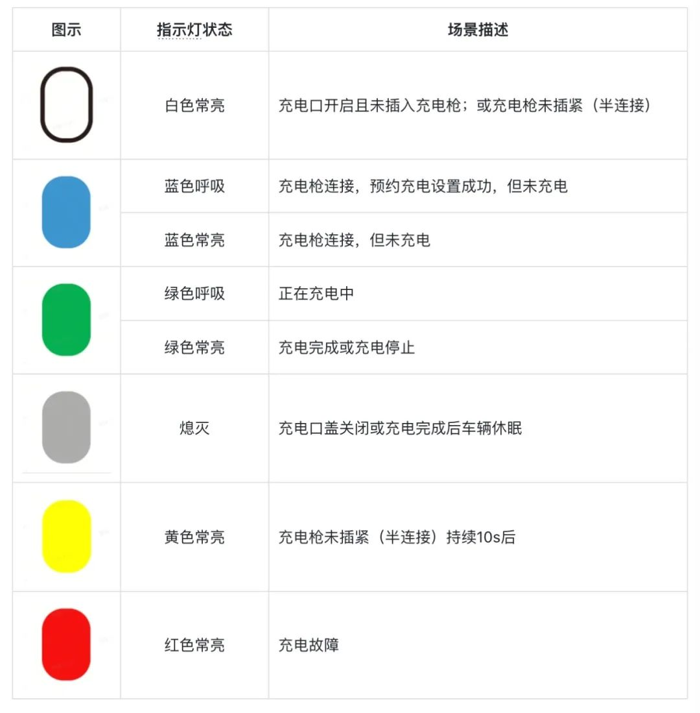
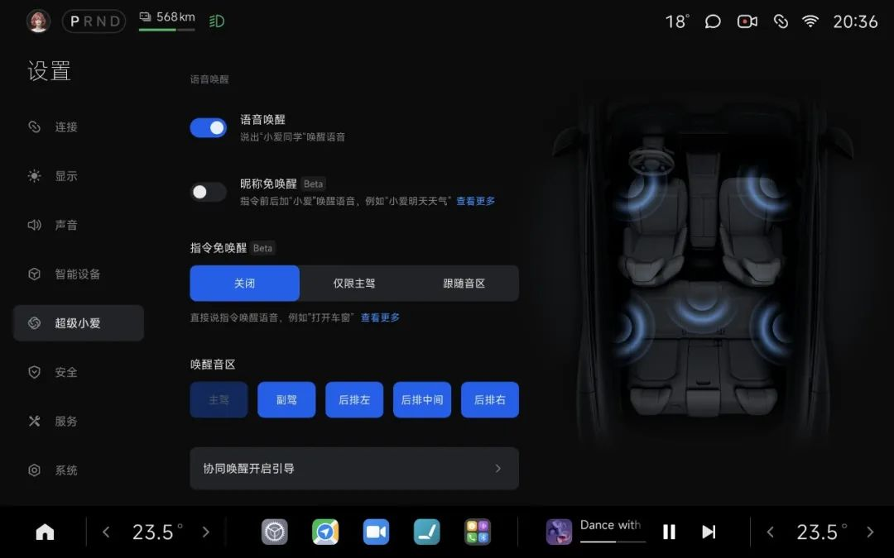
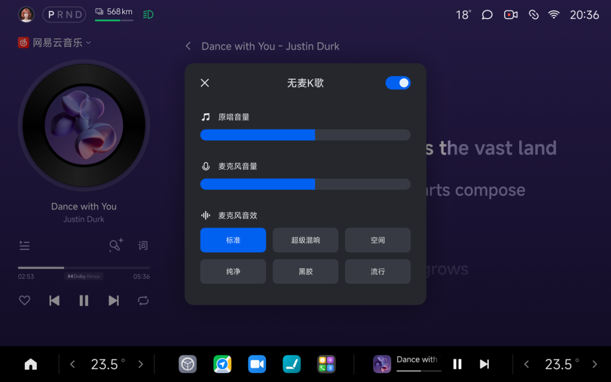

#  小米汽车答网友问（第178集）

[ 小米汽车 ](<javascript:void\(0\);>)

______

01

**小米YU7充电口旁边有个指示灯，灯的各种颜色代表什么意思？**

小米YU7的充电口指示灯共有6种颜色，不同颜色代表不同状态，您可以参考下表了解。

  

02

**小米YU7的****超级小爱****支持哪些****免唤醒****方式？**

小米YU7的超级小爱支持两种免唤醒方式，无需单独说出 「小爱同学」唤醒词，直接说出相关指令即可执行：

  * 昵称免唤醒：指令前/后加上「小爱」，如「小爱打开座椅通风」、「导航回家小爱」，任意功能均可使用，灵活适配各种操控需求；

  * 指令免唤醒：车控/导航/音乐等高频指令直接说即可执行，如「打开空调」、「导航去公司」等，覆盖日常行车中最常用的操作场景；

请注意，超级小爱免唤醒功能默认是关闭的，您可以自行打开，功能开启方式如下：

  * 语音开启：「小爱同学，打开免唤醒」；

  * 手动开启：设置 - 超级小爱 - 昵称免唤醒，设置 - 超级小爱 - 指令免唤醒。其中，指令免唤醒可选「仅限主驾」或「跟随音区」，如果选择「跟随音区」，则每位乘客均可使用指令免唤醒功能。

**0 3**

**如何开启小米YU7的****无麦K歌****功能？**

当音乐播放时，您只需直接对小爱同学说「开启无麦K歌」，或在音乐播放器中点击「话筒」图标，即可开启K歌模式。无需繁琐的麦克风连接，不必额外下载APP**，** 安全便捷地实现互动合唱。

  * 在音质呈现上，小米无麦K歌有着出色的抗噪效果。面对高速风噪、道路颠簸等强噪声干扰，系统能精准区分人声与噪声的频谱差异，智能消除车内噪音，实现高保真高还原的扩声效果。

  * 无麦K歌算法可精准定位并减弱原唱的频段强度，同时完整保留背景音乐的旋律、节奏与和声细节。既避免了人声被原唱淹没的尴尬，又让普通人也能唱出专业级的“氛围感”。

  * 小米无麦K歌还支持原唱音量的调节，想当低调伴唱还是全场焦点，动动手指就能切换。此类细节设计，都让车内K歌从此焕新。

小米SU7全系车型同样具备无麦K歌的硬件能力，后续将通过OTA的形式推送给大家，敬请期待！

**04**

**小米YU7车外****小爱****的麦克风在哪？洗车会把它们冲坏么？**

小米YU7的车外拾音系统有四组麦克风，分别在车头车尾、左右后视镜位置，且四组车外麦克风都具备 IP6K9K防水防尘等级，日常洗车也无需担心。它们为车外语音交互提供了全向收音支持，确保在车外不同方位都能清晰识别语音指令，如车外唤醒小爱打开前/后备箱等。

此外，我们温馨提示您，在洗完车后如有水迹残留在麦克风附近，车外语音交互功能可能会略微受到影响。但您不用担心，相关功能在水迹消失后即可完全恢复。

  

  
< img alt="图片" class="rich_pages wxw-img" data-ratio="0.8824074074074074" src="https://mmbiz.qpic.cn/sz_mmbiz_png/UaK4PTh6Zpk2TaVLh0tUHxviapUIsTcXOFp1ATh7VRDuqnQr3V3oDvw9DodpJKDZDh0fV2YVzbrgHETVM5DzIqA/640?wx_fmt=png&from=appmsg&wxfrom=5&wx_lazy=1&wx_co=1" data-w="1080" style="visibility: visible !important;width: 350px !important;height: auto !important;" width="100%" data-imgqrcoded="1">  

预览时标签不可点

修改于

微信扫一扫  
关注该公众号

继续滑动看下一个

轻触阅读原文

小米汽车 

向上滑动看下一个

[知道了](<javascript:;>)

微信扫一扫  
使用小程序

****

[取消](<javascript:void\(0\);>) [允许](<javascript:void\(0\);>)

****

[取消](<javascript:void\(0\);>) [允许](<javascript:void\(0\);>)

****

[取消](<javascript:void\(0\);>) [允许](<javascript:void\(0\);>)

× 分析

__

微信扫一扫可打开此内容，  
使用完整服务

： ， ， ， ， ， ， ， ， ， ， ， ， 。 视频 小程序 赞 ，轻点两下取消赞 在看 ，轻点两下取消在看 分享 留言 收藏 听过