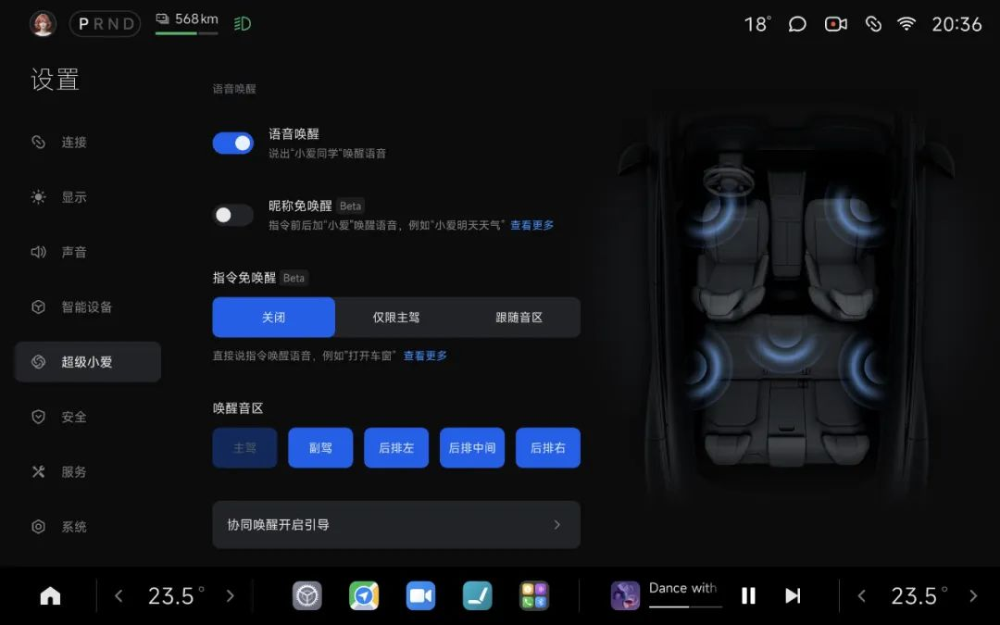

#  小米汽车答网友问（第187集）

[ 小米汽车 ](<javascript:void\(0\);>)

______

01

**我的小米****SU7****才换空调滤芯没多久，为什么提示我「空调滤芯已耗尽」？**

这是最新上线的「空调滤芯剩余寿命提醒」功能，系统将结合您上一次更换空调滤芯的时间和车辆行驶里程，计算空调滤芯剩余寿命，以提示您空调滤芯是否需要更换。您可在「设置>服务>车辆耗材」进行查看。

近期小米SU7系列和小米SU7 Ultra开启了新版本的推送，已升级新版本的车型将会具备该功能（小米YU7出厂即搭载）。如果您的爱车已经收到新版本的推送且完成升级，我们建议：

  * 如果您的小米SU7和小米SU7 Ultra还没有换过空调滤芯，您可点击「设置>服务>车辆耗材>重置」将「滤芯更换日期」手动重置为提车时间，即可显示正确的空调滤芯寿命；

  * 如果您曾换过空调滤芯，将「滤芯更换日期」手动重置为上次实际更换滤芯的时间即可；

  * 如果您还未提车，当您之后提车时，无需任何操作，系统将会显示正确的空调滤芯寿命。

我们温馨提示：在正常用车环境，建议您每一年或每行驶2万公里更换一次滤芯（二者以先到为准）。

02

**小米YU7在露天充电站充电时碰到了下雨，需要给充电口做什么防水措施吗？**

通常情况下，您无需做额外防水措施。 小米YU7充电接口安全防护通过国家强检认证，并且在充电枪插入后满足IP55防尘防水等级标准，充电插座自带排水系统，当少量水流进入充电口内部时不会堆积，可以排出车外。因此，日常小雨您无需担忧充电安全，但如遇极端暴雨天气，建议您暂缓充电。

但我们特别提醒您，请勿使用塑料袋、毛巾等物品覆盖或包裹充电接口，这可能导致散热不良，存在安全隐患。充电操作时，请确认充电枪头及车辆接口无异物且干燥，确保充电枪与车辆接口插接到位并锁紧；如果经常在户外场合充电，请用充电防尘盖把另一个“未充电的充电口”封堵到位，防止异物进入带来安全隐患。

**0 3**

**如果有坐在小米YU7后排的小朋友调皮，频频唤醒****小爱同学****，我该怎么才能让小爱同学只听我的？**

小米汽车全系支持五音区识别，您可以于「设置>超级小爱>唤醒音区」设置项内取消选取某个或某些音区唤醒功能，届时对应音区的语音唤醒指令将不会被小爱同学响应。

**04**

**我看到网上有人把玩偶磁吸在小米YU7车上，可以这样做么？**

如果车辆处于驻车/静止状态，您可以将喜爱的物品通过磁吸悬挂在车内。**但如果车辆处于行驶状态时，我们不建议您磁吸任何非官方推荐的磁吸产品。** 官方推荐的每款磁吸产品及其对应的安装位置，都避开了安全气囊的区域，且都通过了严格的碰撞测试。其中，标注为可长期使用的磁吸点位通过了实车耐久测试，确保在常规行驶条件下产品稳固可靠；而仅供临时使用的磁吸点位，则不建议长期吸附配件，以规避在极端路况下可能发生的脱落风险。请您严格区分并遵守不同点位的使用要求，以保障行车安全。

  
< img alt="图片" class="rich_pages wxw-img" data-ratio="0.8824074074074074" src="https://mmbiz.qpic.cn/sz_mmbiz_png/UaK4PTh6Zpk2TaVLh0tUHxviapUIsTcXOFp1ATh7VRDuqnQr3V3oDvw9DodpJKDZDh0fV2YVzbrgHETVM5DzIqA/640?wx_fmt=png&from=appmsg&wxfrom=5&wx_lazy=1&wx_co=1" data-w="1080" style="visibility: visible !important;width: 350px !important;height: auto !important;" width="100%" data-imgqrcoded="1">

预览时标签不可点

微信扫一扫  
关注该公众号

继续滑动看下一个

轻触阅读原文

小米汽车 

向上滑动看下一个

[知道了](<javascript:;>)

微信扫一扫  
使用小程序

****

[取消](<javascript:void\(0\);>) [允许](<javascript:void\(0\);>)

****

[取消](<javascript:void\(0\);>) [允许](<javascript:void\(0\);>)

****

[取消](<javascript:void\(0\);>) [允许](<javascript:void\(0\);>)

× 分析

__

微信扫一扫可打开此内容，  
使用完整服务

： ， ， ， ， ， ， ， ， ， ， ， ， 。 视频 小程序 赞 ，轻点两下取消赞 在看 ，轻点两下取消在看 分享 留言 收藏 听过