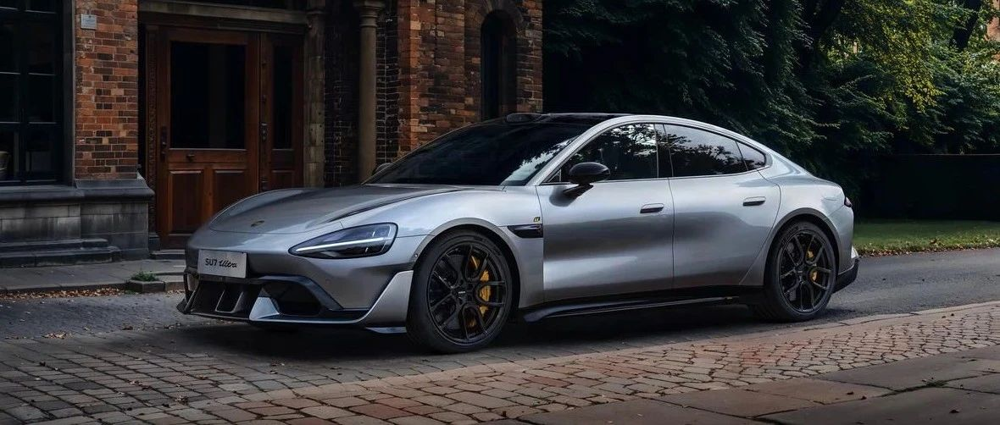
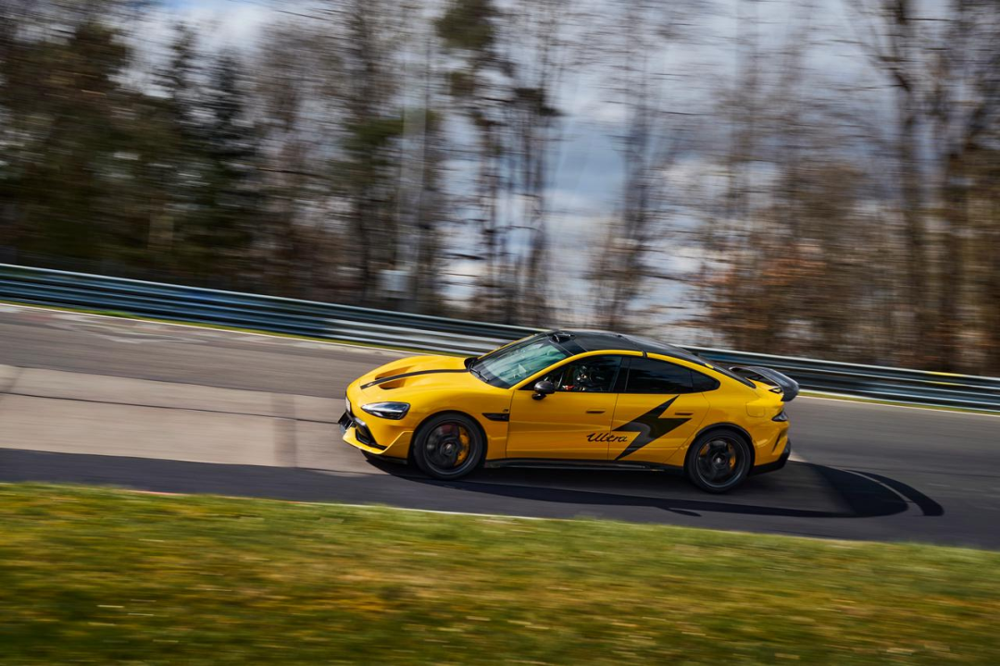

#  关于大家关心问题的回答

[ 小米汽车 ](<javascript:void\(0\);>)

______

  

****01 ‍****

### 小米SU7 Ultra「排位模式」功能到底有没有解锁条件？

之前我们推送的更新版本中「排位模式」功能添加了解锁条件，给部分用户带来了困扰，对此，我们深表歉意。

收到大家反馈后，我们高度重视，已暂停了这次推送。已升级的少量用户，我们将会在下个版本更新中解决。我们已开始推进新版本的开发和测试，预计用时4-8周， _**具体时间以小米官方通知为准。**_

我们设计的初衷是为了更好的保障驾驶安全，但没有充分征询大家意见，也没有做好相关功能的沟通说明，我们的工作确实存在不妥的地方。此次事件让我们深刻认识到：任何涉及用户体验的重大更新，都必须建立在充分沟通的基础上。未来我们将建立更完善的用户意见收集机制，充分听取用户意见。感谢您的理解和宽容。

  

**02**

###  小米SU7 Ultra的碳纤维双风道前舱盖到底有啥用？如果不喜欢，我可以改配吗？

在最早的量产计划中，SU7 Ultra 量产版已具备足够的综合性能去冲击国内专业赛道和纽北，没有计划做碳纤维双风道前舱盖。

在10月29日SU7 Ultra原型车纽北成绩发布后，原型车的实力和外造型获得巨大反响。经充分调研和评估工程可行性后，决定响应用户需求，复刻原型车同造型挖孔前舱盖设计，给用户更多造型选择。

碳纤维双风道前舱盖，**在满足复刻外造型的需求之外，还提供了部分气流导出和辅助前舱散热功能 。**

**我们对此前信息表达不够清晰深表歉意，我们将采取以下措施：**

  * **对于未****交付****的订单，我们将提供限时改配服务，可以改回铝制前舱盖；**

  * **对于已提车和在本次限时改配结束前选配碳纤维双风道前舱盖****（截至5月10日23:59:59前）****的****锁单****用户，我们将赠送2万积分以表诚意。具体信息请关注小米汽车****APP****后续官方信息。**

此外，碳纤维双风道前舱盖，碳纤维整体使用面积达到1.73㎡，给整车带来了1.3kg的减重。

同时，我们最近在各个赛道刷圈都是用的 SU7 Ultra 碳纤维双风道前舱盖版本。

###   

**03**

###  SU7 Ultra碳纤维双风道前舱盖改配服务和积分发放的具体政策是什么？

对于SU7 Ultra 非现车锁单未交付且在开票流程前用户，如果大家希望从碳纤维双风道前舱盖改回铝制前舱盖，**改配时间窗口为5月9日10:00开始至5月10日23:59:59截止。**

选配了碳纤维双风道前舱盖的全部用户**（截至5月10日23:59:59前的****锁单****用户）** ，在提车后将赠送 2万积分。已经提车的用户，我们将尽快安排发放。积分将发放至下单的小米账户。

更多细则可以关注小米汽车APP后续的官方信息或咨询您的Ultra Master。特别提醒一下，本次改配不影响当前SU7 Ultra 订单的权益；但改配成功后，**车辆将以改配成功时间为起点重新安排生产计划和计算预计****交付****时间，不可退回改配前的配置及交付顺序。**

**  
**

**04**

###  电商平台可以买到碳纤维双风道的改装件，和原厂的有什么区别？

碳纤维双风道前舱盖采用了行业领先的热压罐工艺制作，和很多超跑车型工艺相同。不仅需要6小时高标准工艺的人工铺贴，还需要6小时的热压罐保压成型。目前原厂碳纤维双风道前舱盖，一套模具一天仅可生产一个合格产品，外观质量、工艺和原材料成本都远超第三方仿制改装件。

原厂碳纤维双风道前舱盖，基于小米质量要求，充分验证了NVH、耐久、结构强度等设计指标，同时满足了行人保护的安全需求。还提供和整车质保期一致的5年或100,000公里原厂质保服务。

  

**05**

###  在上赛、浙赛等刷圈的SU7 Ultra，用的是同样的碳纤维双风道前舱盖吗？

是的。配备原厂碳纤维双风道前舱盖的小米SU7 Ultra，基于车辆自身强大的综合性能，在赛道极限驾驶场景中有着非常出色的表现，并刷新了多项国内专业赛道圈速纪录：

  * 浙江国际赛车场，圈速 1'32"616，是浙赛最速四门量产车；

  * 上海国际赛车场，圈速 2'09"944，是上赛最速量产车；

  * 在成都天府国际赛道、株洲国际赛车场、珠海国际赛车场上，均刷新了最速四门量产车的纪录。

目前小米SU7 Ultra 正在挑战纽北赛道，一起期待我们的好消息！

  

###   

**  

**

  

  

预览时标签不可点

微信扫一扫  
关注该公众号

继续滑动看下一个

轻触阅读原文

小米汽车 

向上滑动看下一个

[知道了](<javascript:;>)

微信扫一扫  
使用小程序

****

[取消](<javascript:void\(0\);>) [允许](<javascript:void\(0\);>)

****

[取消](<javascript:void\(0\);>) [允许](<javascript:void\(0\);>)

****

[取消](<javascript:void\(0\);>) [允许](<javascript:void\(0\);>)

× 分析

__

微信扫一扫可打开此内容，  
使用完整服务

： ， ， ， ， ， ， ， ， ， ， ， ， 。 视频 小程序 赞 ，轻点两下取消赞 在看 ，轻点两下取消在看 分享 留言 收藏 听过