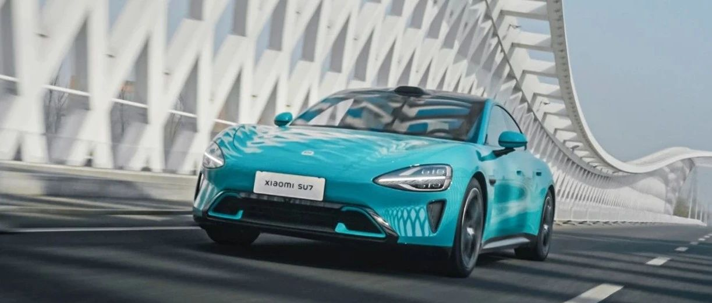

#  小米SU7答网友问：总集篇（上）

[ 小米汽车 ](<javascript:void\(0\);>)

______

> 「小米SU7答网友问」 ，从3月29日，也就是 #小米SU7 发布次日开始，每晚与大家见面，今天已经是第40天了。我们一直时刻留意大家关注的问题，并尽快解答，过去的39天中，我们已经回答了353条。
> 
>   
> 
> 
> 今天开始，我们将把过去回答过的问题，以“总集篇”的形式，分3天跟大家分享，以方便大家检索查阅。今天分享的是**总集篇（上），整车产品篇。**
> 
>   
> 
> 
> 当然，这不是「小米SU7答网友问」的终点，而是开始。未来，我们将针对大家关心的问题，继续不定期更新，感谢大家对小米SU7的关注、喜爱和支持！
> 
>   
> 

## **01**

## **加装手机支架、实体按键等CarIoT，如果发生碰撞等意外情况，是否能保障安全？**

  

在小米SU7中控屏周圈和仪表台上安装的CarIoT设备，都是有螺纹安装口固定的，牢固性不用担心。

官方出品的CarIoT均通过长周期整车搭载性验证，含安全性、环境适应性、坚固性、NVH及密封性、可靠耐久性等 ，验证设备本身及设备对车辆影响，相比外部购买的配件更安心。

此外，当副驾位有人乘坐时，建议行车过程中，不要在右侧1/4螺纹接口处安装手机支架等设备（右侧副驾驶位装有安全气囊）。

  

## **02**

**空气弹簧质保多久？**

  

空气弹簧质保60个月或10万公里里程。

我们为用户提供60个月或者行驶里程10万公里（以先到者为准）的整车质保权益（除了易损耗零部件），覆盖大家关注的悬架系统，包括弹簧（螺旋弹簧、扭杆弹簧、钢板弹簧、空气弹簧、液压弹簧等）、控制臂、连杆。详细质保政策可在小米汽车官网相关界面查询。

## **03**

## **小米SU7的能耗具体表现怎么样？**

小米SU7 一直把「长续航」作为最关键的产品目标之一，整车都做了低功耗的优化设计，拿出了非常出色的实际能耗表现，标准版CLTC最低能耗是12.3kWh/100km，小米SU7 Max的最低CLTC能耗是13.6kWh/100km。

正好今天就有媒体复验了我们的实际续航能力：在持续高速场景下，CLTC工况810km续航的小米SU7 Max，实际续航跑到了643公里（媒体测试至电量表显为0，实际上还可以继续行驶10多公里），续航保持率近80%。在高速高耗电的场景下，实际能耗15.7kWh/100km，这个成绩非常出色。

  

## **04**

**小米汽车后续会不会提供赛道模式？**

小米SU7 Max版带有专业驾驶相关的「大师模式APP beta」，该APP中将会提供G值表和驾驶能力热力图、更细致的TC牵引力辅助，以及ESC车身稳定辅助调节挡位，并预设了自定义模式和漂移模式两种选项。

「大师模式APP beta」主要针对专业驾驶相关用户，所以需要在车机中进行答题后激活，也建议在专业封闭场地激活使用。

  

## **05**

**为什么有媒体实测的加速时间跟官方数据有出入？**

为了充分排除起步瞬间的干扰因素，如轮胎打滑、车手反应时间等，零百加速不含起步时间是行业中普遍的一种测试方法，能更纯粹的反应车本身的能力。媒体实测包含起步时间，并且过程中，轮胎状态、路面条件、气候条件和车手反应均会影响加速表现，所以实测的数据会有些轻微出入。

在媒体实测中，小米SU7 Max 零百加速实测3.09s（官方2.78s），同场地特斯拉Model S Plaid实测2.73s（官方2.1s），保时捷Taycan Turbo 2022款实测3.44s（官方3.2s，含起步时间）。

  

## **06**

**前挡风玻璃三层镀银，是否会影响透光率，或者影响ETC信号？**

三层镀银并不会影响前挡风的透光率。前挡风玻璃的透光率为71%，驾驶时人眼最适合的透光率在70至78%之间，透光率过高驾驶时反而会感到晃眼和眩光。

我们在前挡风玻璃ETC安装位做了除银工艺，完全不影响ETC的使用。

  

## **07******

**小米SU7做过哪些碰撞测试，成绩如何？**

首先，我们提前使用C-NCAP 2024版来设计产品，内部的碰撞测试超过40项，完全覆盖C-NCAP、C-IASI、E-NCAP三大标准，甚至，很多测试是超过这些标准的：

相对24版C-NCAP，正面碰撞要求56km/h，我们做到了64km/h，侧面碰撞要求60km/h,，我们做到了65km/h，侧柱碰要求主驾1个点位，我们在此基础上又做了主副驾及后排的80个点位，追尾后碰要求50km/h，我们做到了全球最高的90km/h 70%偏置碰撞。

正式的碰撞评级需要量产车，请大家关注小米SU7后续的实测表现。

  

## **08**

**小米SU7有没有外放电功能？******

有。小米SU7外放电的功能，配合米家车载便携充放电枪，既能充电也能放电，可以实现2.8kW的充电，3.5kW的220V对外放电，方便户外使用智能设备；同时，小米SU7本身还能支持6.6kW给别车充电的能力。

  

## **09******

**小米SU7有没有牵引资质？**

没有牵引资质。一般情况下，原厂拥有牵引力资质的一般都是SUV、皮卡等偏向越野户外使用的的车型，小米SU7定位是C级豪华科技轿车，所以没有这项资质，还望理解。

  

## **10**

**小米SU7 标准版和Pro是否可以选配官方HUD？**

目前小米SU7 Max标配 56英寸HUD，小米SU7标准版和Pro版暂不支持选装。

## **11**

**小米SU7 Max的「漂移模式」使用场景有限制吗？**

我们诚恳地提醒大家，小米SU7 Max的动力充沛，是十足的“性能猛兽”，其配备的「漂移模式」更是针对具备专业驾驶经验的用户打造，非经专业训练的用户在人群密集的城市街道驾驶存在安全风险。如欲调整TC和ESC选项，强烈建议在专业封闭场地、由专业人士指导下使用。

  

## **12**

**小米汽车支持的充电桩有哪些，是否支持所有品牌的家充桩？**

对于第三方的公用充电桩，小米SU7累计测试了148个品牌超过2000款不同型号的充电桩，总计18900根，并联合三家第三方机构进行了测试验证，充电兼容性到达了99%以上，在已公开信息中充电兼容性行业最高。

基于国标的其它品牌家充桩也能实现充电，详情请咨询原厂家；如需获取更好的互联体验，实现OTA升级及自动开盖解锁等功能，建议使用小米汽车家充桩。

  

## **13**

**后备厢尾门有没有防夹功能？**

小米SU7尾门全系支持电动开启/关闭，并且带有防夹功能。在尾门关闭过程中，电动尾门遇到障碍物会反向弹开，避免误伤用户或车辆受损。

为了确保尾门安全关闭，尾门即将关闭瞬间会带有电动吸合过程，此时尾门即将进入锁止状态，无法实现反向弹开。

这是行业内为了避免尾门无法安全关闭的通用做法，请大家不要在尾门即将关闭时用手指去测试防夹功能。

  

## **14**

**近期多家媒体测试小米SU7续航，为何更换轮胎后对续航的影响那么大？**

轮胎对续航的主要影响因素是轮胎滚阻，通常情况下运动胎的滚阻大于舒适胎、低滚阻胎。轮胎滚阻小，汽车的行驶阻力小，能耗更低续航更长，同时会略微牺牲加速和刹车性能。反之滚阻大的轮胎加速和刹车性能更好。

以小米SU7 Max为例，全系都采用全球顶级品牌的轮胎，即使配备21"倍耐力P ZERO 5代运动胎，也能实现 725km CLTC续航，并且媒体实测中实现了接近500km的高速续航和超过550km的城市高速综合续航，表现极其优异。

  

## **15******

**电压平台接近，小米SU7标准版为什么能比特斯拉Model 3的充电要快不少？**

小米SU7 在自营桩能够实现15分钟补能350km（CLTC）的充电速度，相比同条件下的Model 3 后驱焕新版多了100km。

小米SU7标准版的高压平台峰值电压是486V，是全域碳化硅设计的「超级400V」平台。而Model 3焕新版的峰值电压是394V。因此，在相同的电流条件下，电压更大可获得更高的充电功率。

同时，小米摩德纳架构的运用能够实现更好的充电曲线优化；无论是在夏季还是冬季，强大的热管理系统都能让电池处于更高效的充电温度区间。

  

## **16**

**一些纯电动车在亏电后会出现无法直接充电的情况，需要小电瓶搭电，小米SU7会有这个问题吗？**

小米SU7的12V小电瓶采用的是磷酸铁锂电池，容量为20Ah，相比传统的铅酸电池电量更大、重量更轻、寿命更长。

并且，对于小电瓶的电量，小米SU7可以实现动态检测、智能补电。在车辆正常情况下，完全不需要担心小电瓶亏电的问题。

  

## **17**

**小米SU7 Max 800V电压平台，能否向下兼容一些比较老的500V快充桩？**

小米SU7 Max 采用峰值电压871V的「超级800V」平台，搭载车载升压器，能够将充电桩的电压升高，从而给动力电池充电，保证能够在最高电压为500V和750V的充电桩上充电，不用担心向下兼容的问题。

针对充电兼容性，小米SU7累计测试了148个品牌超过2000款不同型号的公用充电桩，总计18900根，其中包含很多当下主流的500V三方桩，并联合三家第三方机构进行了测试验证，充电兼容性到达了99%以上，在已公开信息中充电兼容性行业领先。

  

## **18**

**看到媒体评测时，表显续航到零后还能继续行驶一段时间，大概有多少公里？**

小米SU7 在表显续航为零时，还保留了一部分剩余里程，剩余里程数根据实际温度、路况会有所不同。

这部分应急里程，仅用于紧急脱困等极端情况，不建议用户使用这部分电量。

  

## **19**

**网上有视频爆料称，试驾小米SU7发现异响和漏液，是什么情况？**

经过我们调查确认，实际情况为：4月1日上午11点半左右，厦门的小米汽车门店店员在带客户试驾途中，突发异响后停车，发现整车状态稳定，底盘无异常，于是将车正常开回店内；经过店内详细检测，发现是一颗石子侵入刹车盘位置，造成异响；将石子取出后，异响消除，恢复正常。

至于车身四周的水迹，是由于近期厦门下雨，车辆曾行驶过积水区，停车后车身留有水迹，属于正常现象。后经过检测，整车无漏液，未见漏点，水壶液面正常，无相关液位报警故障灯提示。

  

## **20**

## **Max版能否自行分配前后动力？能调成一个纯后驱车型，来提升续航里程吗？**

## 

##  在小米SU7自定义模式中，提供多达100档的前后驱动分配比例个性调节功能，用户可以根据驾驶需要选择前后不同驱动分配比例，实现前驱/四驱/后驱的不同驾驶体验。

小米SU7在“M1经济模式”下，优先使用永磁同步电机进行后轮驱动，配合整车最优的能量管理策略，可以带来更优秀的能耗表现。同时，前电机在有动力需求时，也会进行动态扭矩补偿。

凭借“M1经济模式”的优异表现，小米SU7 Max 搭配19英寸米其林e primacy轮胎，即可实现810KM（CLTC工况）的强大续航能力。

  

## **21**  

**后排车窗为什么无法下降到底？**

小米SU7后排采用无边框车门和大尺寸后轮设计，并且车窗是整体面不分块设计，提高整体美观度的同时也不影响通风。采用相同设计的车型，后车窗下降路径都会被后轮包与后车门分缝挡住，所以无法降到底。同时，对于后排经常坐小朋友的使用场景来说，这样的设计也更安全。

  

## **22**

**小米SU7有没有强制中控屏重启的操作？**

如果车机系统发生异常，可同时按住方向盘左右两侧的滚轮10秒进行重启。请确保车辆在安全的环境下进行该操作。

  

## **23**

**小米SU7的主动安全配置，有无激光雷达效果差别大吗？**

现阶段，有无激光雷达的两个版本车型在主动安全方面表现一致，待年内产品能力不断升级后，带激光版本针对前向静态目标相关场景的安全避障能力会更具优势。

  

## **24**

**空气弹簧的调节范围、离地间隙多少，正常使用寿命是多少年？**

空气弹簧调节范围是-20至+30mm，标准位置离地间隙是134mm。因此，离地间隙最低是114mm，最高是164mm。

空气弹簧随整车一起进行过耐久测试，保养得当的情况下不用担心其使用寿命，且我们提供和整车一致的“5年10万公里”质保。

  

## **25**

**小米SU7线束为什么是铝，而不是铜？是不是“偷工减料”？**

目前绝大部分主机厂的充电线束等都采用铝导体方案，小米SU7也是。铝导体在导体性能、安全性能上和铜导体是一样的，只是导电率不同，但可通过截面积的不同实现相同载流能力。

但铝导体还有着铜导体不具备的优势，比如轻量化，铝线比铜线可以轻30%。

所以对于电车来说，因为续航和快充的额外关注，“铜改铝”已经是行业主流发展趋势，偷工减料绝对是无稽之谈。

  

## **26**

**小米SU7 命名有什么来由吗？**

SU，是 Speed Ultra 的缩写。高性能是小米的基因，小米SU7 的出色性能相信大家在看过那么多评测后已经不会有所质疑。至于如何念，我们内部也认真讨论过，最后大家都觉得，还是叫“苏七”，就像叫一个朋友的名字一样，更加亲切。

  

## **27**

**小米SU7 创始版方向盘上的专属编号铭牌，有网友说是贴纸，这是真的吗？**

专属铭牌是我们精心为创始版用户打造的。采用镍基镀铬金属板，编号则是用激光镭雕，质感非常好，当然不是贴纸。

为了给用户最大用车自由度，我们没有将编号激光镌刻于方向盘上，而是采用专属铭牌随车附送的方式，大家可在APP选择是否贴附。

  

## **28**

**小米SU7一键Boost，20秒扭矩峰值输出是否能连续使用？**

可以。小米SU7 Max版具备高效的热管理系统，搭载的小米超级电机V6s为全油冷却技术，小米CTB一体化电池具备双大面主动冷却技术，强大的冷却能力为持续的峰值输出提供了强大的支撑。

在媒体实测中，小米SU7 Max连续十次以上的一键Boost都未出现加速衰减的情况。

  

## **29**

**小米SU7设置了多少种车内模式？**

除了丰富的驾驶模式及相应的自定义能力，小米SU7还提供了应对多种特殊场景的功能设定组合。例如洗车模式、牵引模式、换胎模式、雨刮维护模式等。除此之外，还有保护车外隐私的“一键隐私”模式、最大化续航能力的“超级省电模式”等等。同时，更多的场景化模式与功能也即将通过OTA与用户见面。

  

## **30**

**车机的内存和存储多大，屏幕刷新率多少？**

小米澎湃智能座舱，搭载骁龙8295旗舰座舱芯片，具备16GB运行内存、256GB存储空间。搭载先进的Xiaomi HyperOS系统，中控屏刷新率达60Hz，软硬件深度协同，车机操作更流畅，响应更顺滑。

  

## **31**

**如何快速了解小米SU7的三个版本有啥区别、该怎么选？**

小米SU7 标准版 为「后驱 长续航 智驾版」，CLTC续航700km，零百加速5.28s，支持高速领航；

小米SU7 Pro 为「后驱 超长续航 高阶智驾版」，CLTC续航830km，零百加速5.7s，带激光雷达，支持城市领航；

小米SU7 Max为「高性能四驱 超长续航 高阶智驾版」，CLTC续航800km，零百加速2.78s，带激光雷达，支持城市领航；

当然，每款车在很多细节配置上也有所不同，详细的配置差异可以浏览小米汽车官网和小米汽车APP的完整参数配置表；具体体验上的差异可以预约到线下试驾来感受。

  

## **32**

**Max版三元锂电池是否建议每次都充满，会不会影响寿命？**

小米SU7 Max版的三元锂电池的质保和设计寿命都是按照每次满充的状态设计的，即使每次都充满电，电池使用寿命也无需担心。从材料特性上来说，三元锂电池最优电量使用区间为20%-80%。

但并不需要严格限制充电上限为80%，日常可根据实际情况而定，比如长途出行时充电至“80%以上”更为推荐，可以在车机和小米汽车APP上方便地调节电池充电电量上限。

  

## **33**

**小米SU7电池设计寿命多少年或多少公里？**

小米SU7电池设计寿命是15年30万公里。所以在正常用车的情况下，您无需担心电池的使用寿命。我们在用车手册中，详细介绍了车辆保养的相关细节以及质保服务，也希望大家能够仔细阅读了解。

  

## **34**

**小米SU7前备箱有承重限制吗？**

为保障合理承重及行车体验，不建议在前备箱装载超过20kg的物品。

  

## **35**

**有用户反馈，在特斯拉充电桩出现了无法拔出充电枪的情况，这是什么原因？**

近期有用户在使用特斯拉交流家充桩，对小米SU7进行充电后，出现无法正常拔出充电枪的情况。我们通过客服联系到用户，已经核查清楚问题，情况如下：

通过分析，我们发现车辆在启动充电后，因用户所在社区电网的三相电压严重不平衡，导致车辆充电机系统（OBC）连续报错3次，同时进入充电保护机制，因此无法响应用户解锁指令。

因每个用户的社区电网电压平衡性不一致，后续我们也将通过OTA的方式，优化因报错而导致进入充电保护模式的运行机制。此外，如果用户充电枪出现解锁故障，可以使用应急解锁拉线进行解锁，操作如下：

首先在车机内点击“停止充电”后，开启后备厢，

使用合适的工具拆卸后备箱维修盖板，并找到解锁拉线开关，

向车头方向拉动充电枪应急解锁拉线，即可解锁充电枪，并正常取出。

  

## **36**

**除了小米汽车，小米集团还有其他业务汽车业务吗？之前有传小米通过生态链和奇瑞合作，是真的吗？**

小米汽车是小米集团唯一的汽车业务。对于造车，我们充满敬畏、极度专注，小米也从没有通过生态链企业造车的安排。此前业内传闻的“智米与奇瑞造车”，并不属实。事实上是智米科技创始人苏峻个人与奇瑞合作的有关汽车业务，与小米集团、小米生态链完全无关；另据智米科技此前声明，也与智米科技无关。

  

## **37**

**下雨天小米SU7是否可以涉水，深度如何？**

小米SU7在半载状态下（乘员150kg+行李30kg），车辆最大涉水深度为350mm。如意外超过该水深，建议立即联系售后进行车辆状态检查。

350mm相当于车轮轮心的高度，当车辆通过静止水面时，车速建议控制在5-7km/h，经过流动水面时，需更加小心。

特别提醒，车辆涉水只是为了避险，建议用户不要故意涉水，更不要高速涉水，以免造成额外安全隐患。此外，涉水时若车速过高，也有可能面临车辆外饰件及车底护板冲脱的风险。

正常车辆涉水后，也建议用户自行检查车辆的制动、喇叭、转向助力以及车灯是否良好，若发现问题，可联系小米汽车服务中心进行检查。

当用户无法判断路面水深时，建议绕行而非贸然强行通过。

  

## **38**

**无边框后视镜下雨天会比较影响视线，应该如何处理？**

小米SU7在研发过程中进行了大量水管理仿真分析及实车测试，行车状态下，外后视镜主视野区域基本不会出现水流现象，不会对行车安全造成影响。车辆在低速或静止状态下，雨滴可能会飘落和附着到镜片上，进而可能会影响视线，而小米SU7全系标配外后视镜加热功能，建议在雨天有需要时开启外后视镜加热，以保证最佳视野。

后视镜加热开启方法：通过中控屏下方控制栏可进入空调控制界面，点击「后风挡加热/外后视镜加热功能」图标即可打开相关功能；或直接呼唤“小爱同学”下达指令，也可开启外后视镜加热功能。

  

## **39**

**下雨天，前备箱是否会进水？如果进水了怎么办？**

小米SU7前备箱有密封条，所以正常使用情况下，前备箱不会进水；如果前备箱载物出现液体遗洒，前备箱的前端有两个橡胶塞，用手拔开橡胶塞即可排水，排水后请注意将橡胶塞复位。

  

## **40**

**电动尾翼能否频繁的上升下降，冬天结冰冻住了怎么办？**

小米SU7电动尾翼，如果两次手动操作间隔小于10秒，且连续操作15次后，将会进入防玩保护模式。此时会限制尾翼关闭，等待150s后会退出防玩保护模式。

此外，小米SU7电动尾翼配备破冰功能，当检测到环境温度低于0度后，若尾翼正常开启时发生堵转，则会触发破冰功能。

破冰功能会以90%的最大扭矩尝试开启，如果3次开启不成功则会自动停止。此时，车辆重新进行上下电操作，会重置开启次数。

若电动尾翼遇到极端天气无法正常打开，为了保护尾翼电机机构，建议用户先手动除冰，避免持续使用破冰功能造成机构损坏。

  

## **41**

**第一次开有前备箱的车，有什么要注意的地方吗？**

前备箱与车内空间是隔绝的，所以储存物品的气味不会窜入座舱，可以放心收纳外卖、渔具等。

通过车载小爱同学，可以非常方便地语音开启前备箱。在关闭小米SU7前备箱盖时，建议缓慢降下前备箱盖，直到锁扣触碰锁体后，将双手或单手放在小米LOGO前方，也就是前备箱盖的最前端，向下按压前备箱盖，直到锁扣与锁完全啮合，并检查是否关闭到位。

  

## **42**

**后备厢底部隐藏的储物格，是否有承重限制？**

为保障合理承重及行车体验，小米SU7、小米SU7 Pro建议在后备厢底部隐藏储物格装载不超过15kg的物品。而小米SU7 Max因为是四驱车型，后备厢储物载重能力会有些不同，建议在该储物格装载不超过10kg的物品。

  

## **43**

**小米SU7 Max极速最高支持265km/h，如果想限制速度应该如何操作？**

小米SU7可在P档驻车状态下，在车机系统「安全与服务」界面中进行「最高车速限制」设置，最高车速设置范围为80-160km/h。

此外，当车辆切换至「新手」驾驶模式后，最高车速将被限制为140km/h。另外，我们也正在考虑在初次启用车机的流程中，加入“确认是否启用‘最高限速’”的强制提示通知，如果您有更好的建议，请在评论中告诉我们。

小米SU7拥有舒适、运动、运动+、经济、新手五种默认驾驶模式，兼顾了经济性、舒适性以及运动性等不同的需求。日常在城市内驾驶，也建议用户根据路况等因素选择适合的驾驶模式。

小米SU7拥有强大的性能表现，最高车速可达265km/h。该数据是在有安全防护的专业封闭测试场地，由专业驾驶人员进行的测试认证。在公共道路上，不建议大家尝试，也请大家遵守道路交通法规要求，切忌超速驾驶，一同倡导安全行车。

  

## **44**

**全系全域SiC碳化硅高压平台是什么意思，有什么优势？**

我们常说的IGBT/SiC是指代电驱控制器中的功率模块。是由一到多组功率芯片并联组成的开关器件。有以Si为材料的IGBT类型芯片，有以SiC为材料的MOSFET类型芯片（对，IGBT是半导体类型，SiC是指芯片材料）。功率模块负责电机驱动时将直流电转为交流电，能量回收时将交流电转换为直流电，所以它的效率对电动车至关重要。

SiC MOSFET相比Si IGBT开关损耗小，效率更高。因为SiC的制造工艺难度高、生产周期长，得片率、良品率低，致使SiC的价格是Si的2～5倍。

全系全域SiC碳化硅高压平台，指的是小米SU7高低配不仅在驱动电机上都使用了SiC碳化硅功率模块，车载充电机（OBC）及热管理系统的空调压缩机这两个对能效要求极高的关键部件，同样都包含了碳化硅材料，以便实现更好的能效表现。全域碳化硅是小米SU7实现极致的整车低能耗的技术手段之一。

  

## **45**

**下坡辅助和舒适刹停有开关可以关掉吗？**

小米SU7配备智能全域坡道辅助功能，通过计算车辆行驶路面的坡度，进行智能化的坡道扭矩辅助，在正常坡道上实现车速稳定控制及缓降。目前小米SU7全系标配该功能，但我们接收到有部分用户不太习惯，希望可以手动关闭，我们也将在后续OTA版本中增加该功能的独立功能开关。

此外， CST舒适刹停功能为出厂默认开启，无法关闭。舒适刹停功能可以在城市日常减速制动中（减速度<0.5g)，带来平稳舒适的制动停车效果。但当出现紧急制动需求时，例如急减速、全力制动以及AEB制动时（减速度>0.5g)，舒适刹停功能将不会激活，从而确保拥有最佳的制动距离。

  

## **46**

**前备箱关闭的正确方式是什么？**

小米SU7前备箱盖无法凭自身重量锁止，正确且省力的关闭前备箱盖方法为：

1、缓慢降下前备箱盖，直到锁扣触碰锁体；

2、将双手或单手放在前备箱盖的最前端，或双手同时放在小米LOGO两侧区域，稳稳向下按压前备箱盖，当听到第一声“咔哒”声请继续向下按压，直至第二声“咔哒”声发出后停止按压动作，此时前盖已经达到全锁止状态；

3、检查前备箱盖前沿是否与前保缝隙齐平，如前备箱盖高于前保则前盖没有完全关闭，请重复按压前备箱盖确保其关闭。

  

  

## **47**

**小米SU7的车漆看起来非常亮，有什么特别之处吗？有人测试发现漆膜厚度不一致是什么原因？**

小米SU7采用行业领先的3C2B的涂装工艺，共计8层涂层，其中增加的中涂工艺，不仅让漆面漆膜更厚、视觉效果更好，还可以将UV的隔绝率从99%提升到99.9%左右，从而更好地保护电泳漆，抗氧化及防老化效果也有非常优秀的表现。

在8层漆面喷涂工艺的前提下，小米使用先进的杜尔7轴喷涂机器人，雾化器旋杯转速可达7万rpm，雾化效果让漆膜平整度更高。还拥有自研的中涂层打磨机器人，800目砂纸可打磨掉3-5μm漆层，再次有效提高漆面平整度，也让车辆的漆膜厚度控制在100到140μm之间；

通过用户自测漆面厚度的视频来看，我们猜测数据存在一定偏差，不排除有其他影响因素，我们也欢迎各家媒体到我们工厂进行实地参观，进一步了解小米的涂装工艺并实地检验。

  

## **48**

**网上有视频显示，可通过魔改升级车机硬件，这样是可行的吗？**

不可行，原车机硬件是经过了含安全性、环境适应性、坚固性、NVH及密封性、可靠耐久性等专业测试验证的，私自魔改将带来不确定的安全质量隐患并失去相应的质量保证（具体质保内容详见用户手册质量担保服务章节）。

  

## **49**

**小米SU7 Max可以下赛道么？**

我们强烈提示您，小米SU7 Max是城市用途的高性能豪华科技轿车，请勿轻易尝试专业赛道等极限驾驶。

小米SU7 Max 制动系统采用NAO摩擦片，此摩擦片适用于用户日常驾驶，是平衡了制动噪音和制动性能，且满足公共道路驾驶需求的主流产品。

NAO摩擦片除满足国标要求外，还满足针对制动性能的专项性能标准和性能验证：

  * AMS性能，满载工况下10次连续100km/h-0全力制动后，百公里制动距离衰减<2m；

  * 100km/h-0制动距离33.3m，处于行业领先水平；

  * 模拟普通用户整车使用工况下，摩擦片磨损情况处于行业较好水平。

由于赛道工况下，车速高、动能累积大、制动急剧，持续高负载及高温下器件磨损速度急剧加快，所以对整车所有核心器件都提出了远超日常工况的要求。专业车手下赛道前，都需要对车辆进行系统级的专业整备。

赛道驾驶，无论对车手还是车辆都是最极限、最严苛的考验，需要对车辆专业知识以及专业驾驶有着深厚积累。我们再次呼吁，不要轻易尝试小米SU7赛道驾驶挑战，感谢大家的理解与支持。

  

## **50**

**能否自主调节方向盘转向反馈力度，还是只能跟随驾驶模式？**

在“舒适”“运动”“运动+”，这些固定的驾驶模式下有出厂预设的转向手感，不支持单独调节；

在“M1”“M2”自定义驾驶模式菜单中，驾驶者可以根据自己的喜好，灵活选择轻、中、重的转向手感。

  

## **51**

**小米SU7有车内摄像头吗，能否关闭不让拍摄以保护隐私？**

在方向盘和仪表屏之间有一颗用于检测驾驶员状态的摄像头。当检测到驾驶员闭眼、扭头、哈欠、使用手机接打电话等疲劳或分心行为时，系统会通过语音播报、中控屏弹窗等形式，提醒驾驶员注意安全驾驶。

该系统仅在车机本地进行行为判断和提醒，图像数据不会记录或对外传输，充分保护用户的隐私安全。

当然，如果您不需要驾驶员疲劳/分心提醒功能的话，可以在中控屏的“设置-驾驶偏好”菜单内将其关闭。甚至您也可以在车机的权限管理中直接将摄像头关闭。

  

## **52**

**设置中的超级省电模式具体有什么作用，何时会触发？**

超级省电模式是指车辆通过关闭智驾辅助功能、关闭或限制空调、座椅加热等舒适性功能、限制最高车速和整车加速性能，以达到降低整车功耗，增加更多续航里程。

在车辆预估续航里程低于50km时，中控屏会弹出相关设置项弹窗及说明，此时您可选择是否开启超级省电模式；同时您也可以在驾驶过程中的任意时刻主动开启或关闭超级省电模式。请在中控屏下方控制栏打开设置，进入驾驶偏好>超级省电模式，点击开启或关闭该功能。

超级省电模式开启后，以下车辆功能将受到限制：

  * 最大车速限制90km/h；

  * 系统设置单独的经济性动力响应，控制更平缓的扭矩输出；

  * 空调性能受限（风量降低、功率降低）；

  * 关闭方向盘加热功能；

  * 关闭座椅加热和座椅通风等舒适性功能；

  * 关闭氛围灯；

  * 关闭外后视镜加热和后风窗加热；

  * 智能辅助行车功能和智能辅助泊车功能关闭；

  * 关闭娱乐、生态服务功能、关闭哨兵模式；

  * 车载12V直流取电口断开；

  * 关闭电动尾翼控制；

  * 关闭车载智能冰箱。

当车辆通过中控屏弹窗开启超级省电模式后，在车辆充电预估里程大于300km后会自动退出超级省电模式。开启超级省电模式后，应对短时超车时，您仍可以深踩加速踏板进行短暂车速提升。

  

## **53**

**小米SU7标准胎压bar，比标准值低或者高有什么影响？**

小米SU7综合考量了行驶能耗、性能表现等多方面需求，制定了2.9bar的设计胎压，推荐用户定期（如一个月）按照冷态充气压力2.9bar调整胎压。

胎压不足或过高，也会对车辆行驶带来一定影响。例如胎压过高，会降低轮胎的滚动阻力、提升轮胎的承载能力以及抗冲击能力；此外，也会导致轮胎整体变硬，行驶起来路感更强。

反之胎压过低，会让轮胎的滚动阻力变大，轮胎的承载能力以及抗冲击能力变弱；同时，会让轮胎整体变软，让整车的乘坐舒适性更好。

  

## **54**

**小米SU7刹车踏板与卡钳活塞没有物理连接，这种设计是因为什么，有什么优势？**

小米SU7搭载博世全球首发的DPB+ESP10.0全解耦制动系统，具有以下4点优势：

相比传统机械真空制动系统，DPB全解耦制动系统可实现更快的建压速度，可有效缩短制动距离，助力小米SU7 Max版100km/h-0制动33.3m的优异性能。

DPB和ESP双建压模块的设计可互为冗余，结合动能回收可实现四重制动冗余功能，最大限度消除刹车失灵风险，可满足L4级别自动驾驶的安全冗余，给未来辅助驾驶系统的升级打下基础；

DPB全解耦制动系统在极限工况（如紧急制动）下，制动踏板不会传来因ABS工作或制动主缸压力波动导致的踏板反馈力度波动，可以给驾驶者提供更强的制动信心，保证安全性；

DPB全解耦制动系统可更有效地结合电机动能回收和机械液压制动，在日常驾驶中即便关闭动能回收，驾驶员踩下制动踏板时，车辆仍优先使用动能回收进行减速，可有效提高车辆的续航里程。

  

## **55**

**内部有无应急机械开启后备厢的方式？**

如遇紧急情况，您可以从内部使用机械方式开启后备厢，具体操作如下：

  * 折叠后排座椅靠背，进入后备厢；

  * 拆下后备厢应急开关装饰盖板；

  * 逆时针拨动后备厢应急开关并向外推动，打开后备厢。

## **56**

**如果充电枪解锁功能出现故障，怎么紧急拔线？**

如果用户充电枪出现解锁故障，可以使用应急解锁拉线进行解锁，操作如下：

  * 首先在车机内点击“停止充电”后，开启后备厢；

  * 使用合适的工具（用手也行）拆卸后备厢维修盖板，并找到解锁拉线开关；

  * 向车头方向拉动充电枪应急解锁拉线，即可解锁充电枪，并正常取出。

## **57**

**网上有人问小米SU7 Max刹车片面积是否足够大，能说明下吗？**

我们关注到今天网上流传了一组疑似小米SU7 Max刹车片的对比图，该组图将小米SU7 Max的前置制动卡钳与后置刹车片放在一起对比，陈述为“刹车皮面积感人”，**这本身就是一种错配的对比，事实上产生了信息误导。**

众所周知，前制动系统对刹车性能起到至关重要的作用，所以我们给小米SU7 Max配备了一套布雷博高性能四活塞固定卡钳。采用NAO刹车片，兼顾制动性能与舒适体验，并且**前刹车片有效接触面积相比豪华一线品牌的同级运动轿车更大，制动性和耐久性更佳。**

同时，小米SU7全系采用DPB+ESP10.0的制动系统，其中Max版本可通过电机能量回收，提供的最大减速度为-0.36g。对电动车来说，优异的动能回收系统能给予刹车片极大的负载缓冲，在日常使用中能够提供更长久耐用的使用体验。

在近期的媒体实测中，我们也看到小米SU7 Max呈现了非常出众的连续极限制动性能。在连续10次100km/h-0制动测试中，并未出现异常衰减现象。

我们非常感谢大家对我们的严苛要求，也实际证明了整车的制动性能。我们也再次重申，小米SU7 Max是为城市场景打造的高性能豪华科技轿车。而最严苛、最极限的赛道工况，需要对车辆进行重新整备，切勿直接原厂上赛道，我们也强烈不建议普通用户轻易尝试赛道等极限激烈驾驶。

  

## **58**

**布雷博brembo卡钳字体样式与以往不同，产品有什么区别吗？**

2022年10月25日起，布雷博发布了全新视觉形象和品牌标识，展现出布雷博的战略愿景：将能量转化为灵感。

小米SU7是国内最先采用换标后“brembo”新品牌标识的系列车型。布雷博作为全球一流的高性能制动器生产厂商，助力小米SU7 Max为大家提供高品质的制动性能，带来100km/h-0制动距离33.3米的优异表现。

## **59**

**小米SU7全系都支持杜比全景声吗？有什么内容资源支持？**

小米SU7 Max标配25个扬声器（包含2个头枕音响），搭载7.1.4音响系统，更有杜比全景声；

小米SU7、小米SU7 Pro标配10个扬声器（包含2个头枕音响），可选装25扬声器，从而支持7.1.4系统、杜比全景声。2024年4月30日前大定小米SU7及小米SU7 Pro，均享受免费赠送25扬声器豪华音响的权益。

小米SU7车机搭载了丰富的在线音视频应用，其中爱奇艺有杜比全景声专区，酷狗音乐的高品质专区也有杜比全景声资源。

  

## **60**

**小米SU7 Max的HUD显示内容信息，可否根据个人喜好选择？**

您可以选择系统预设好的两种主题模式：标准主题可显示车速限速、智驾状态、地图导航、电量续航等信息；简洁主题可显示车速、限速及简要的导航信息。

后续我们也将根据用户的反馈，通过OTA持续优化HUD的使用体验，欢迎用户朋友提出宝贵意见。

  

## **61**

**车辆断电后，车内冰箱还能继续工作吗？**

可以断电持续工作。您可以在车载智能冰箱的设置页面，开启“离车持续工作”并选择工作时长，最长可设置为24小时。这样可以确保您在下次上车时无需等待即可享受到冰爽的饮品。您也可以在小米汽车APP中提前开闭冰箱、调节温度。夏天马上到了，助您清凉一夏。

  

## **62**

**未来会推出适配小米SU7 Max的高性能套件吗？**

我们近期关注到不少用户在尝试探索体验小米SU7 Max的性能极致表现，为了给经验丰富的用户提供一些激烈驾驶的可能性，我们正在联合业内经验丰富的合作伙伴开发高性能套件，具体服务上线日期请随时关注小米汽车官方公告。

  

## **63**

**小米SU7支持盲区监测吗？**

小米SU7全系标配BSD盲区监测功能。当小米汽车在并线打灯时，目标车道侧向来车，BSD盲区监测系统会在仪表屏、中控屏和HUD上做动态警示。

同时，我们还会不断加强这一警示功能，将在后续OTA中增加「盲区影像显示」，当驾驶员打转向灯时，在中控屏上会显示侧向来车画面，并叠加红色警示提醒。

盲区监测功能并不能完全代替驾驶员控制车辆，请驾驶员在驾驶过程中务必全程保持注意力集中，时刻关注车辆周围路况。

## **64**

**空悬气罐的位置受到追尾撞击后，气罐会不会有安全风险？**

小米SU7 Max车型标配闭式空气弹簧（空悬），空气弹簧储气罐是该配置不可缺少的零部件。面对常规的轿车、SUV等车型低速追尾工况，得益于小米独创的三段式一体化压铸后地板，冲击力可以被防撞梁轻松化解。在小米汽车内部进行的40余项安全测试中我们同样考虑到了气罐碰撞安全性，在经历100%重叠 56km/h追尾工况时，防撞横梁承载吸能，气罐未受撞击，功能完好。

近期发生的小米SU7 Max追尾事故，因后车系跑车，其车头非常低，躲过了小米SU7 Max后防撞梁进而钻入底部，最终才造成了气罐脱落。事实上，将气罐放置在乘员舱外后侧，并不独见于小米，也有国际豪华品牌旗舰级轿车、SUV使用类似设计。

  

## **65**

**使用手机蓝牙解锁，如果关闭了蓝牙是否还能正常启动？**

不能。使用手机蓝牙解锁，包括拉门解锁、靠近自动解锁、离车自动闭锁，均需要手机与车辆通过蓝牙建立通讯。如果将手机端蓝牙关闭，则无法正常使用手机蓝牙钥匙。

因此您在使用手机蓝牙钥匙时，需将手机蓝牙打开。同时，受限于各家手机品牌的内存限制及性能策略，小米汽车APP进程可能被系统结束运行，导致解锁失败。如果出现手机蓝牙钥匙解闭锁失败的情况，请确保小米汽车APP在前台或后台运行。

  

## **66**

**运动声浪模拟跟车辆的版本、轮毂有关系吗？**

小米SU7运动声浪模拟需与25扬声器匹配，但与配置及轮毂版本无关。标准版、Pro版，在选配25扬声器后，均可以体验到极致的运动声浪模拟。

小米SU7的运动声浪模拟，在用户体验后均获得了一致好评。开发之初，我们从工程、声学、设计三个维度进行衡量，希望让乘客在真实反馈、音效品质、主观听感三个基础体验维度上，都拥有愉悦的体验。

小米SU7的运动声浪模拟由110轨音源合成，针对加速踏板开度、扭矩大小精准匹配音源，总计可覆盖81种不同工况。因此，性能更强的小米SU7 MAX版在音浪强度上，会比标准及Pro版更加震撼，配合独立的声浪算力芯片，拥有超低延迟，提供了流畅的音效体验。

  

## **67**

**下雨天想要解决后视镜雨水问题，如何开启后视镜加热功能？**

外后视镜加热和后风挡加热功能是绑定的，目前有4种开启方式：

1、点击中控屏空调控制主界面的外后视镜/后风挡加热图标，以开启/关闭该功能；

2、在中控屏下拉快捷操作栏，点击外后视镜/后风挡加热图标，以开启/关闭该功能；

3、如您购买了中控屏物理按键，点击外后视镜/后风挡加热按键，以开启/关闭该功能；

4、呼唤小爱同学，下达“打开后视镜加热” 或 “打开后风挡加热” 语音指令，以开启该功能。

  

## **68**

**车辆发生碰撞后，车窗会自动打开吗？**

高速碰撞后，车窗会自动降低，对应碰撞方向的安全气囊点爆，与此同时双闪灯自动激活，高压系统自动切断，车辆会自动刹车并驻车，同时自动进行呼叫救援，全维度保护乘员安全。

而如果仅为不涉及乘员安全的低速剐蹭，气囊和上述防护机制不会激活，以避免不必要的财产损失。

  

## **69**

**后排座椅安全带警报可以永久关闭吗？**

不可以。根据国内相关法规，车辆制造商不能将后排安全带未系警报永久关闭。出于安全考虑，也建议全车乘员在行车全程时刻保持安全带正确系好状态。

  

## **70**

**为什么在使用其他品牌家充桩充电时，可能遇到无法充电的情况？**

因不同品牌家充桩的默认权限设置不同，可能会因其仅限某品牌车型可用的设定或白名单授权机制，导致无法给小米SU7正常充电。请小米SU7用户使用其他品牌家充桩前，确保桩端打开充电权限设置，具体权限设置方法请查阅对应品牌桩的使用说明或与其客服沟通获取详细使用教程。

以特斯拉三代家充桩为例，需要将桩端的访问控制从「仅限Tesla」改为「所有车辆」，方可给小米SU7充电，修改初始设置程序的步骤如下：

  * 长按充电手柄按钮5秒，直至充电桩指示灯呈现绿色呼吸闪烁；

  * 使用手机打开WiFi；

  * 找到名为“TeslaWallConnector_XXX”；

  * 输入WiFi密码后连接，注意每个特斯拉三代家充桩包装内都附有《快速入门指南》，内嵌WPA2的12位字母就是密码；

  * 连接完成后，在手机上打开浏览器，输入192.168.92.1，跳转到设置界面；

  * 点击访问控制一栏，选择「所有车辆」完成设置。

  

## **71**

**很多车主反映前备箱想改成电动式，会影响整车质保吗？**

改装的结构和零件无法享受官方质保权益；因改装而导致的车辆结构和功能性受损，也超出质保权益覆盖范围。详细的小米SU7质保政策可在官网查询。

  

## **72**

**车载视觉摄像头是否有加热除雾功能呢？如何开启？**

小米SU7全系车型标配11个驾驶辅助摄像头，其中前向双目摄像头在检测到有遮挡时，会自动开启其视窗部分的加热丝，以进行加热、除雾/雨/雪，以上无需手动操作。如视窗有泥等脏污，仍需手动清除。

同时小米SU7 Pro、小米SU7 Max还配备激光雷达，检测到有遮挡时，激光雷达视窗也会自动开启加热功能，此加热功能同样无需手动操作。

  

## **73**

**空调出风口支持自动扫风或智能避人吹风吗？**

小米SU7全车有4个电动出风口，可自由选择吹风模式及风向。目前暂不支持自动扫风、避人吹风等功能，后续将通过OTA升级的形式推送相关功能。

另外，小米SU7的空调系统配备CN95级滤芯、PM2.5实时监测系统、AQS空气质量检测系统、抗菌蒸发器等，使座舱空气更加健康清新。

  

## **74**

**安装ETC有什么注意事项吗？是否有预留的固定区域？**

小米SU7采用三层镀银前风挡，能实现99.5%的紫外线隔绝率、97.6%的红外线隔绝率，既保证了合适的透光率，又能做到防晒隔热。

为保证ETC正常使用，前风挡玻璃特意在如图位置做了除银工艺，不必担心三层镀银影响信号。可采用粘贴的方式将ETC安装于该区域，完全不影响ETC的使用（肉眼观察，该区域有网格）。

  

## **75**

**小米家充桩宣传支持自动开盖，需要如何设置呢？**

小米SU7为用户提供了便捷的充电盖开启方式，米家充电桩拥有联动小米SU7自动开盖功能，当用户开启车机蓝牙后，充电桩将通过蓝牙自动与车机同步。当用户按下充电枪拔取按键后，充电口盖将自动打开。

但实现此功能需要保证车辆处于P挡状态，且充电桩处于通电状态，也需要确认小米汽车的蓝牙功能处于打开状态。车机蓝牙关闭，会造成与充电桩蓝牙加密交互失败，车辆充电口盖无法自动打开。

  

## **76**

**Boost模式在任何驾驶模式下都能打开吗？新手、舒适等基础模式下能不能用？**

Boost模式在舒适、运动、运动+、个性化M1、个性化M2所有驾驶模式下均可激活。

弹射起步会自动激活电机Boost功能；所以对于小米SU7 Max而言，使用运动+模式、开启弹射起步可实现最快的加速能力；对于小米SU7、小米SU7 Pro而言，使用运动模式、开启弹射起步可实现最快的加速能力（小米SU7、小米SU7 Pro为两驱车型，无运动+模式）。

对于中途加速而言，您也可以使用Boost模式，从而获得更快的加速能力。

关于Boost模式具体注意事项，详见用户手册。

  

## **77**

**小米SU7夏天车里面真的不热么？**

小米SU7相对来说更防晒隔热，能在同样的日晒环境中提供更为舒适的体验。当然，长时间暴晒后还是需要提前开空调。

首先，小米SU7拥有着**双层镀银** 的超大天幕玻璃，可以更好地反射太阳光，达到防晒隔热的效果。紫外线隔绝率达到99.9%，红外线隔绝率达到了99.1%，且透光率也做的很好，坐在车内不晒的同时，透光性也相当优秀。

前风挡玻璃的防晒体验更为突出，很多女生夏天开车的时候，为了防晒都带上了冰袖。为了解决这个痛点，我们采用了**三层镀银** 前风挡玻璃，我们也是目前轿车中唯一采用这一工艺和体验的。三层镀银的前风挡玻璃，紫外线隔绝率达到了99.5%，红外线隔绝率97.6%，让车内的整体温度可以较大幅度下降。

这些都还不够，小米SU7的四门车窗玻璃均采用了**UV-IR涂层技术** ，让四门车窗的紫外线隔绝率同样达到了99.9%。整车的防晒隔热能力都达到了行业领先水平，方方面面满足你的防晒需求。

我们的工程师在实验室做了测试，在38℃光照下**暴晒90分钟** 之后，小米SU7的车内温度要比友商整整低了**12℃** 。如此有效的隔热能力，让车辆在夏天暴晒后，座舱不再热浪袭人。

虽然温度相对较低，但是长时间剧烈暴晒后的座舱仍然不适合马上乘坐，大家可以通过小米汽车APP或小爱音响提前打开空调，配合优秀的空调能够更快速制冷降温，在炎炎夏日也能一上车就享受到更舒适的座舱体验。

  

## **78**

**在给小米SU7 车身贴膜的时候，需要注意什么？**

不少用户为了保护爱车，都会在车辆到手的第一时间去做“车衣”保护。但我们也温馨提醒您，在贴附车衣时，会应用到一些清洁剂，尤其当处理外部灯具的时候，切勿使用含有酸性、碱性、活性剂等成分的清洗剂，避免对灯具表面产生腐蚀，造成车灯外观受损，如裂痕等。同时，也避免对灯具进行高温烘烤等非正常操作，以防止灯具损坏的情况发生。

  

## **79**

**关于摄像头和雷达，是否需要定期做校准检查？**

小米SU7标准版搭载有摄像头、毫米波雷达、超声波雷达三个类型的传感器，小米SU7 Pro和Max版本还额外搭载激光雷达。

所有的传感器在出厂之前均完成了标定和校准，用户提车后可直接使用。

如若车辆传感器或安装位置存在碰撞损坏，或出现其他传感器故障提示时，需前往维修中心进行检查和标定，正常使用情况下无须定期标定和校准。

注意: 请勿自行更换或者维修传感器及周边部件，出现任何故障或损伤，请及时联系小米售后中心提供支持。

  

## **80**

**HUD设定好的位置，在重新启动时能恢复吗？**

HUD的位置设定、模式设定与账号绑定，此次行程的HUD设定会在下次行程登录账号时自动同步。

  

## **81**

**后备厢开启角度如何调节设定？**

在后备厢开启后，手动将其降低或升高至所需的开启高度，长按后备厢关闭按键3s后，响一声提示音代表后备厢开启高度记忆成功，响三声提示音代表后备厢开启高度记忆失败。

特别说明：后备厢最小设定高度为40%；手动降低或升高后备厢高度时，请缓慢平稳地进行操作，以免组件损坏。

  

## **82**

**提车后去贴隐形车衣，毫米波雷达、超声波雷达等传感器是否能够装贴，以及哪些部分不适合贴？**

隐形车衣装贴时，还请留心避开车辆雷达安装区域，以免影响与之相关的功能正常使用。其中，激光雷达（数量1个，仅小米SU7 Pro/Max搭载）安装在车辆前风挡顶部，超声波雷达（数量12个） 安装在前后保险杠区域，前毫米波雷达（数量1个）安装在前保险杠右侧内部，后角毫米波雷达（数量2个，仅小米SU7 Pro/Max搭载） 安装在后保险杠两侧内部。

由于毫米波雷达安装位置不可见，可参考如下示意图，在车衣装饰作业时避开对应的区域。

  

  

## **83**

**为什么有时候充电功率不够高，达不到峰值？**

小米SU7接入充电枪开始充电时，电池的起始电量和温度都会影响充电功率。充电过程中，电芯温度会稳步上升，若起初电芯温度过低，功率无法达到峰值；并且随着电量逐渐充满，也会使得充电功率降低。这些是电池管理系统的智能化充电策略，能够让电芯充电更安全、使用寿命更长。

使用车载地图导航至充电站时，车辆将预热电池以提升充电速率，保证电池在充电时，更快地达到最佳的功率状态。

同时，小米SU7 Max版的电池管理系统具备“原子化充电技术”，能够提供最高50倍的充电颗粒度去适应不同的温度和电量，充电时间最快可提速9.8%，平均充电功率最多可提升11kW。

  

## **84**

**手机蓝牙钥匙为什么会有无法自动解锁的情况？APP应该如何正确设置？**

受限于各家手机品牌的内存限制及性能策略，小米汽车APP进程可能被系统结束运行，导致手机蓝牙钥匙自动解锁失败。为了减少此类失败情况发生，在您正确激活启用手机蓝牙钥匙之后，可参照如下步骤进行手机相关设置：

苹果手机：

  * 将手机蓝牙功能始终保持开启状态；

  * 在“设置”-“小米汽车APP”中，授权小米汽车APP始终允许访问位置信息，并保持精确位置开启；

  * 小米汽车APP后台刷新功能保持打开。

小米及其他Android手机：

  * 将手机蓝牙功能始终保持开启状态；

  * 授权小米汽车APP始终允许定位权限；

  * 授权小米汽车APP自启动权限；

  * 将省电策略设置为无限制，并将小米汽车APP锁定在后台。

  

## **85**

**使用NFC卡片车钥匙，有什么注意事项吗？**

NFC卡片钥匙非常便于携带，如一张银行卡般轻薄易携带。卡片钥匙可实现车辆解闭锁等功能，只需将NFC卡片钥匙贴在主驾驶B柱的NFC钥匙感应区域，片刻停留即可轻松完成自动解锁或闭锁的操作。

但也提醒一下，如携带了有效的蓝牙钥匙远离车辆时，即使NFC卡片钥匙遗落在车内，也会正常执行闭锁操作。所以NFC卡片钥匙作为车辆权限管理的关键物品，还请务必随身携带。

同时，NFC卡片请勿弯折、扭曲、剪切，同时避免将卡片长期置于高温环境或接触高温电器件等，以上操作都可能造成卡片钥匙失效。在使用手机无线充电功能时，也请勿将NFC卡片钥匙置于无线充电板感应区域。

  

## **86**

**主驾如何保存座椅记忆设置？一共可以存多少个挡位？**

主驾座椅位置和其他一系列车辆设置内容，均保存在驾驶员账户下的“用车习惯”中。您可以通过点击头像进入个人中心，新建和管理不同的用车习惯，每个用户可以最多拥有10组用车习惯。

我们同时为副驾座椅提供了3个位置记忆，副驾驶乘客也可以享受个性便利的乘坐体验。

  

**87**  

**小米SU7首次参加北京国际车展，有什么看点吗？**

我们的展位在W2馆，W203展位，欢迎大家来我们的展台看看。我们准备了丰富的活动，能给您带来精彩的展示体验。同时，我们还将披露一系列大家关心的信息和小米SU7的最新进展，相信你会感兴趣，下周开始逐步向大家汇报。

  

## **88**

**前后排雨伞储物槽尺寸是多少？对雨伞款式、尺寸有什么限制吗？**

小米SU7在主副驾前门板各有一个雨伞储物槽，同时后排左右座椅下方也各有一个雨伞储物槽。

因前排门板的雨伞储物槽是开放式设计，所以大部分折叠伞均可容纳。

后排座椅下方的雨伞槽受到座椅骨架限制，放置长度300mm以下的三折折叠伞较为合适；另外，该雨伞槽也可容纳小米汽车APP在售的小米SU7车载前风挡遮阳伞。

  

## **89**

**360°全景影像在车辆时速超过多少就不能使用了？**

360°全景影像在车辆挡位从R挡切换到D挡后，车速超过10km/h时自动退出。您还可以通过点击中控屏Home键操作退出360°全景影像；

在行驶中，您也可以通过中控屏下方控制栏手动打开360°全景影像，此时360°全景影像不会随着车速增加而自动退出。

  

## **90**

**小米SU7长时间停放不启动，对于电池或者车辆有没有损害？**

从电池的材料特性上来说，车辆超过5天不使用时，建议将电池充至40%到60%的电量，这样可以更好地保护电池。

建议选择一个安全、干燥、通风的地方存放车辆，尽量避免阳光直射或者雨水淋湿。如果可能的话，最好将车辆存放在室内，比如车库。

长时间停放会对轮胎造成压力，可能导致轮胎局部变形或者产生气压问题。建议定期检查轮胎气压，并确保轮胎处于适当的气压状态。

在长时间停放之前，最好对电动车进行一次全面的检查，包括刹车、轮胎、电量等等。确保车辆处于良好的工作状态，以便减少停放期间出现的潜在问题。

  

## **91**

**小米SU7标准版家充能支持11kW交流电充电桩吗？**

小米SU7标准版及Pro版车端交流充电机为7kW，因此使用11kW交流充电桩，车端充电速率也为7kW。小米SU7标准版在7kW充电桩上，约11.7小时可补满电量，Pro版由于电池容量更大，则需要约15个小时。

在7kW交流充电桩下，车辆在回家后，充电一夜即可完成补能，同样拥有优秀的体验。

  

## **92**

**能否在车辆刚启动的时候就用Sport+或是一键Boost模式，对电机有没有影响？**

在车辆启动后，驾驶员均可以随时选择Sport+驾驶模式及使用一键Boost功能。我们开发的各模式下的动力输出，都是在系统边界和部件寿命范围内的，可以放心按需使用自己喜欢的驾驶模式。

但车辆在长时间静置后，电芯及电机温度并非最佳的性能状态。因此在冷车启动后，在Sport+运动模式下，或使用一键Boost模式时，可能无法发挥出最佳的性能表现。

  

## **93**

**能量回收强度的“柔和”和“标准”，分别对应自定义的什么档位呢？**

小米SU7共有3种动能回收模式，分别为柔和、标准以及自定义。柔和模式相当于自定义中的“1挡”，而标准版则是“100挡”。

小米SU7拥有优秀的动能回收设定，不仅可以实现“单踏板”的日常行驶制动效果，对于降低行驶能耗也有很好的帮助。

如果您希望自由调配动能回收的反馈力度，可以在自定义模式中进行调整，小米SU7拥有100挡的动能回收设定，总有一种可以满足您的需求。

  

## **94**

**顶棚的“SOS”按键是干什么用的？**

“SOS”按键为紧急呼叫功能。当车辆发生人伤事故或遇到其他紧急情况时，您可手动触发，或车辆自动触发紧急呼叫，请求呼叫中心帮助和救援。但请注意，SOS仅作为紧急呼叫所用，并非售后服务的直通服务。

1、手动呼叫：手动按下SOS按键并保持2s-10s内，松开后即激活SOS功能，此时车辆状态信息（位置、时间、车辆数据等）自动发送至救援中心且中控屏展开通话界面。救援中心根据车辆上传的状态信息和通话情况，及时提供救援服务。

特别说明/注意事项：

  * SOS按键仅在紧急情况下使用，如人伤事故、疾病或乘员受威胁。

  * 手动呼叫功能触发并且在呼叫过程中无法取消该功能，仅能由救援中心进行挂断。

2、自动呼叫：当车辆发生碰撞且车辆接收到碰撞信号时，SOS功能自动激活，此时车辆状态信息（位置、时间、车辆数据等）自动发送至救援中心且中控屏展开通话界面。

注意事项：

  * 自动呼叫功能触发并且在呼叫过程中无法取消该功能，仅能由救援中心进行挂断。

  * 自动呼叫功能不是任何事故都会触发，当您可以手动呼叫时，请勿等待该系统触发自动呼叫，应立即手动呼叫救援中心，以避免拖延响应时间。

  * 呼叫救援功能需要在车辆连接网络状态下才能使用。

  * 救援中心在紧急情况下会回呼到车机，并自动接起。

  

## **95**

**点烟器的最大输出功率是多少？**

小米SU7配备两个12V电源接口，可为小型电子设备供电。中控台下储物槽前部的12V电源接口，输出额定电压为12V，输出最大功率为240W；后备厢内右侧饰板上有一个12V电源接口，电源输出额定电压为12V，输出最大功率为180W。

  

## **96**

**小米SU7车模后续是否会再推出一些新的颜色？**

非常感谢大家对小米SU7 车模的喜爱，我们接收到了很多用户的呼声，新颜色的小米SU7 车模已经开始研发了。由于小米SU7 真车车漆颜色质感饱受好评，我们会非常重视车模的漆面调色和手工喷漆工艺，还请大家耐心等待。

**97**  

**车展上会有发布会吗？会宣布OTA时间吗？雷军会到场吗？**

明天早间开始，我们将逐步披露车展相关安排。我们的展位在W2馆W203展位，我们准备了丰富的活动和一系列大家关注的信息披露，雷军也会在车展现场跟朋友们交流，请大家一定来我们展位看看。

  

## **98**

**小米SU7车窗经过镀银处理后，还有贴太阳膜的必要吗？**

小米SU7拥有双层镀银的超大天幕玻璃，可以更好地反射太阳光，达到防晒隔热的效果。紫外线隔绝率达到99.9%，红外线隔绝率达到了99.1%。

前风挡玻璃的防晒体验更为突出，很多女生夏天开车的时候，为了防晒都带上了冰袖。为了解决这个痛点，我们采用了三层镀银前风挡玻璃，我们也是目前轿车中唯一采用这一工艺和体验的。三层镀银的前风挡玻璃，紫外线隔绝率达到了99.5%，红外线隔绝率97.6%，让车内的整体温度可以较大幅度下降。

这些都还不够，小米SU7的四门车窗玻璃均采用了UV-IR涂层技术，让四门车窗的紫外线隔绝率同样达到了99.9%。整车的防晒隔热能力都达到了行业领先水平，方方面面满足你的防晒需求。

综上，小米SU7玻璃防晒隔热能力优异，可以不贴膜。如仍有贴膜需求，尤其前风挡建议选择高透光性的膜，以免影响视线。

  

## **99**

**小米SU7方向盘最上方的“圆环”是干什么用的？**

小米SU7方向盘12点钟方向的圆环设计，被称作方向盘回中或回正标志。

这个设计来源于传统赛车方向盘上的设定，目的是当驾驶员激烈驾驶，尤其是出现方向盘回转圈数较大的时候，帮助驾驶员更好地判断目前方向盘的回正位置。

  

## **100**  

**小米SU7标准版方向盘电动调节功能能否后期加装？**

方向盘电动调节4向（带记忆）仅在小米SU7 Max版搭载，小米SU7标准版和Pro版不支持加装。

  

## **101**

**小米SU7座椅自动加热通风的开启逻辑是什么样的？**

如果您打开了座椅加热/通风的AUTO自动模式，系统将基于车内环境温度、车外环境温度及当前空调系统运行状态进行综合计算，判断座椅通风、加热的舒适性需求，从而输出加热/通风模式、挡位。

  

**102**  

**在没有充电桩的地方，如何用家用插座为小米SU7补能？**

我们向旅行露营爱好者，以及无法安装家充桩但希望能在家充电的朋友推荐「米家车载便携充放电枪」。它采用国家标准的交流充电接口，支持具有国标交流充电接口的主流车型，可以连接家用 220V 插座为车辆充电，非常适合在旅途中为车辆应急补能的场景；

另外，针对支持外放电功能的车型，它还可以作为外放电插排使用，放电电流最高可达 16A，支持 4KW 最大功率输出，可以满足露营场景下的照明、烹饪和娱乐等用电场景和需求；

其次，它还支持两车之间的充电补能模式，面对其他车辆中途没电的突发状况，可为其反向充电，缓解燃眉之急。值得注意的是，供电车辆需要支持外放电功能，且需要两台米家车载便携充放电枪，才能实现两车之间的应急补能；

最后，我们还为它设计了小巧便携的收纳包，日常放在车上也不占空间，非常推荐经常自驾露营，或者家中无法安装家充桩的朋友们购买使用。

  

## **103**

**遥控钥匙没电了是否会提醒，如何更换电池？**

如果遥控钥匙电量低于30%，车机屏幕会提醒用户及时更换钥匙；

至于更换遥控钥匙电池的步骤，说明书有详细图解，步骤如下：

  * 1、从遥控钥匙车尾的撬孔撬开车顶中部饰条；

  * 2、从遥控钥匙溜背部分向外部掰下外壳；

  * 3、更换电池后将遥控钥匙外壳复原即可。

  

## **104**

**尾翼设定为关闭，每次启动时还会自动打开是正常的吗？**

是正常的。电动尾翼具备迎宾模式，车辆开启解闭锁灯效后，当您解锁车辆时，将激活尾翼迎宾模式，尾翼展开进行上升动作，营造更加丰富的迎宾效果，增强您的迎宾体验。迎宾模式激活时，尾翼将从关闭状态上升到最高状态。

  

## **105**  

**小米SU7一共有多少个气囊？标准版、Pro版、Max版的气囊配置有差别吗？**

小米SU7全系所有版本均配置7个安全气囊，按照图片编号分别为副驾安全气囊、双侧气帘、前排左侧气囊、远端气囊、主驾安全气囊和前排右侧气囊。安全气囊的工作逻辑和注意事项详见用户手册。

  

**106**  

**网上有传言说，有用户在小米SU7 Max提车两天时就出现前保险杠掉漆现象，是什么情况？**

经核实，该用户视频中存在失实的内容。该用户非车辆首任车主，也并非是提车两天。造成掉漆的原因是首任车主做了全车改色膜，后续该用户在撕掉贴膜之后造成的保险杠内侧漆面黏连掉漆，非产品出厂问题。

小米SU7保险杠采用底漆、面漆及清漆三层喷涂工艺，效果上保证了和车身颜色的一致性。但是如果在使用中不规范地贴膜/撕膜，都有可能造成对漆面的伤害，望周知。感谢大家的关注和支持。

  

## **107**

**在车内安装拓展配件，是否有安全隐患和法规风险？**

目前小米官方的CarIoT车载智能设备及拓展配件（包括车载手机支架、智能双表盘、椅背平板支架、中控屏物理键盘等），均严格合规。相关法规要求驾驶机动车不得在机动车驾驶室的前后窗范围内悬挂、放置妨碍驾驶人视线的物品。小米官方的相关拓展设备，均不存在遮挡驾驶人视线的风险。

小米SU7的车内拓展配件，均经过了碰撞、耐久性等相关测试。以手机支架为例，通过1/4英寸标准接口安装的手机支架，具有更强的牢靠性，并且在严苛的滑台碰撞试验中，测试全部通过。所以，可以保证在正常使用过程中，最大程度保障用户使用安全。

但也需要提醒一点，请按照CarIoT车载智能设备说明书对设备进行安装，并将螺丝拧紧。此外，往期的《小米SU7答网友问》中也曾提示过，在使用仪表台右侧1/4英寸标准接口时，请确保副驾驶未坐人。手机支架在使用时，手机放置位置需得当。

  

## **108**

**每日问答中提到过的优化改善事项，具体什么时候会推送？**

感谢大家在过去20多天对小米SU7提出的产品建议。每天的「小米SU7答网友问」在第一时间回应大家疑问的同时，我们的研发团队也在马不停蹄地推进优化工作。

我们计划将在4月24日，开始陆续向用户推送部分功能优化，包括以下内容：

  * 修复交流充电系统进入保护机制后，偶发无法通过充电枪按钮解锁电子锁的问题；

  * 优化充电逻辑，提升第三方品牌充电桩充电兼容性；

  * 修复开门降音功能的偶发失效。

当您收到车机向您推送更新信息后，点击【立即更新】即可，或在中控台选择【设置】→【系统】→【系统版本】，或在小米汽车App中选择【车辆】进入版本更新。

为了确保更新顺利，更新前请保证车辆剩余电量大于20%，并处于驻车状态，请将车辆停放于安全且网络条件良好的地方。更新过程中车辆无法使用，请您预留足够的更新时间，以防影响您的出行。

此次功能优化是个小的优化版本。小米SU7 上市后的首次大版本升级，将在4月25日北京车展上公布OTA计划，敬请期待。

  

**109**  

**前风挡三层镀银是否会影响手机信号？**

小米SU7在开发过程中，做了充分的手机信号测试验证，不会对手机网络信号造成干扰。这个测试覆盖了主流的6个品牌15款手机，3大运营商，在全国多地的居民小区、商务写字楼区域、大型商超、地下车库、市区、郊区、山区、城市高架、隧道、高速、服务区、国道、省道场景，对不同车辆位置、开窗不开窗的状态都做了全面的测试验证。结论是：**所有测试手机均通过测试，导航信号、上网信号、通信信号、多媒体流畅度体验均无影响。**

小米SU7前风挡采用三层镀银玻璃，全景天幕采用双层镀银玻璃，四门车窗玻璃采用了UV-IR涂层技术，无需贴膜也能获得极佳的防晒隔热表现，并通过了“百万网友”亲测，且全面好评！

不具备原厂前挡风三层镀银玻璃的车型，选购第三方包含贵金属材料的隔热膜，由于没有严格的测试验证，确实有可能影响手机信号。

  

## **110**

**有网上用户反应，小米SU7翼子板脱落，是什么原因造成的？**

经核实，目前仅个例车辆出现了翼子板脱落的问题，且问题车辆均有过高速涉水的行驶工况。

在小米SU7设计之初，已充分考虑到雨天涉水的问题，并经过了严苛的高速涉水工况测试。包括60km/h通过潮湿路面、20km/h通过中高水位，甚至也进行过300mm高水位的低速缓行工况，所有测试小米SU7均车身完好、无任何零部件损伤情况发生。

目前我们还无法确认，事故车辆当时的具体涉水深度、通过速度、行驶转向姿态，以及路面是否有局部深坑或者有刮蹭。

同时因小米SU7全系采用空气动力学设计，翼子板风道在涉水路面会有水流通过，如进行超过标准情况下的高速行驶，高速水流会大幅加剧对翼子板的冲击。

建议大家在通过涉水路面的时候，都需要提前判断涉水深度，并且要缓慢驾驶。当无法判断路面水深时，建议绕行而非贸然强行通过。我们还在进一步就此类极端工况个案进行跟进研判。

  

## **111**

**小米SU7 Max 空簧气罐的后碰保护靠谱吗？**

小米SU7 Max后部防撞梁最低离地高度为440mm，在车辆发生追尾事故时，防撞横梁可有效参与碰撞，空气悬架气罐受到冲击损坏的风险很小。气罐是空气悬架的关键零部件，将其设计于舱外后侧并非小米独有，一线豪华品牌的不少车型也采用「舱外布置」设计，大家无需担忧。

在小米汽车内部进行的40余项安全测试中，我们同样考虑到了气罐碰撞安全性。在经历100%重叠 56km/h追尾工况时，防撞横梁承载吸能，气罐未受撞击，功能完好。

  

## **112**

**外后视镜支持防眩目吗？**

目前小米SU7 外后视镜并未配备自动防眩目功能，自产品上市我们也在收集所有用户的反馈，认真聆听、仔细考量，未来将会在后续产品规划中做合理改进。

  

## **113**

**360环视能否打开的时候直接开启透明底盘？**

现阶段进入泊车影像界面需要手动点击透明底盘图标，以开启透明底盘功能。如后续大家呼声较高，希望打开泊车影像默认开启透明底盘功能，小米SU7将考虑通过OTA实现该功能。

  

**114**

## **今天你们公布了浙赛成绩，什么时候会提供可以跑赛道的运动套件和车型？**

首先，我们还是要提示朋友们，小米SU7是一台家用轿车，并不是专为赛道设计的产品。请大家在没有专业赛用整备和专业赛车经验的情况下，切勿轻易尝试赛道驾驶。

浙赛是国内公认含金量最高的“原厂车圈速榜”，在搭载原厂轮胎的情况下，小米SU7达成了1分42.163秒的惊人成绩，超过了Taycan Turbo S 和 Model S Plaid这样以动力和速度著称的百万级豪车。为了探究这辆车的性能极限，搭载米其林CUP 2R半热熔轮胎的高性能运动套件后，小米SU7跑出了1分38.043秒的惊人成绩。

适配小米SU7的高性能运动套件，我们正在准备上架，请留意小米汽车APP中的信息。小米自研的超高转速电机V8s将于年底开始装车，来年我们将适时发布搭载小米超级电机V8s、拥有强大赛道性能的车型。

  

## **115**

**若主驾离开车辆但是车里还有人，能否自动识别到？还是会自动锁车？**

为了更好地保证车辆能够无感离车落锁和及时下电，是否自动锁车是根据车内是否有钥匙来判断的：车内有遥控蓝牙钥匙不会自动闭锁，车内有手机蓝牙钥匙也不会自动闭锁，以上两种情况请用户手动闭锁；车内有NFC钥匙会自动闭锁。

  

**116**  

**已经设置了车内高温保护，为何有时候温度超过了，空调也没有启动？**

在中控屏下方控制栏打开设置，进入安全与服务>车内高温保护，可开启该功能，用户可设定40℃、45℃、50℃三种激活温度；但如下条件将限制该功能：

  * 车辆电量低于20%，该功能不再触发；

  * 驻车超过12个小时后，该功能不再触发；

  * 如设置了远程开关空调、预约空调，优先执行以上功能，不触发高温保护。

  

## **117**

**光环尾灯可以在白天常亮吗？**

在车机的灯光控制界面中，手动打开近光灯，可使光环尾灯常亮，但离车要记得手动关闭或切回灯光的自动模式。

  

## **118**

**锁车后短时离开，可以让空调保持一直常开吗？**

在车机屏幕下拉菜单栏中，打开「驻车用电保持」功能，即便关门锁车，空调、娱乐系统等用电器也将保持工作状态；同时用电保持的时长可以设置15分钟~6小时，车辆电量耗至20%时将自动退出。

  

## **119**

**后备厢左侧的挂钩承重多少？**

后备厢左侧的挂钩适用于悬挂一些在后备厢中不易固定的袋子类物品，悬挂物品的重量不得超过5kg；

此外，中控台下方也有挂钩可悬挂外卖等物品，悬挂物品的重量不得超过10kg。

  

**120**  

**今天下午车展现场的央视直播中，小米SU7演示手车互联交互时出现了卡顿，这是BUG吗？**

经过排查，这一偶发现象并非Bug。实际情况是，车展现场人流过大，网络环境复杂，在直播演示过程中，设备连接出现延迟。也希望车主朋友们向我们分享您的实际使用体验。如果有部分网络情况复杂或连接不佳的环境，请向我们反馈，这将对我们优化相关场景下的体验有巨大的帮助。最简便快捷的反馈方法是，在座舱内说“小爱同学，我要反馈”，随后直接说出需要反馈的内容即可。感谢您的支持。

  

## **121**

**如果倒玻璃水的时候有遗撒，是否会有影响？**

玻璃水加注口旁边有排水路径，如加注玻璃水时有些许遗撒，液体将由图示位置排出，无需担心。

此外，前备箱前端左右位置也各有一个过水孔，如玻璃水或前备箱内有其它液体遗撒到前备箱中，用手拔出橡胶塞即可排水，如有少量水滴残留，用布擦干即可，排水后请注意将橡胶塞复位（如图所示，右侧橡胶塞已拔出演示）。

（玻璃水加注口旁边有排水路径）

（前备箱有过水孔，右侧橡胶塞已拔出演示）

  

## **122**

**25扬声器的功放功率有多大？**

小米SU7 Max标配25个扬声器（包含2个头枕音响），搭载7.1.4音响系统，更有杜比全景声，功放额定功率为1260W。

小米SU7、小米SU7 Pro标配10个扬声器（包含2个头枕音响），可选装25扬声器。

  

## **123**

**为什么有时候戴太阳镜看不清HUD？**

HUD的成像是TFT液晶显示屏产生的偏振光，折射到玻璃、反射到人眼，而偏光太阳镜恰恰会过滤掉这部分偏振光，导致HUD画面可视性降低，这是正常的物理原理，绝大部分HUD均是如此。

如您习惯于佩戴太阳镜，且习惯于使用HUD，建议选择非偏光太阳镜，HUD的可视性将得到提升。

  

## **124**

**有人说，Max版本主驾竖向空间高度比标准版矮，是真的吗？**

这是假的。小米SU7标准版、Pro版、Max版前排竖向空间是一样的，均为1012mm，为驾驶员提供充裕的头部空间。

  

## **125**

**小米SU7可以安装车顶架吗？**

小米SU7预留有车顶行李架安装接口（在全景天幕上有黑色实线标记），可以安装车顶行李架，目前官方平台暂未上架车顶行李架相关产品。

根据相关《机动车登记规定》《乘用车外观类改装要求及检验指南》要求：

  * 车辆可加装或更换行李架，加装行李架后车辆高度增加不大于300mm，行李架的长度、宽度方向上均不应超过车身顶部。

  * 在不改变车身主体结构且保证安全的情况下加装车顶行李架，机动车所有人应当在信息或者事项变更后三十日内，向登记地车辆管理所申请变更备案。

  

**126**  

**当车辆电量低于多少的时候，会对车速限制？**

在车辆预估续航里程低于50km时，中控屏会弹出相关设置项弹窗及说明，此时您可选择是否开启超级省电模式；同时您也可以在驾驶过程中任意时刻主动开启或关闭超级省电模式。

请在中控屏下方控制栏打开**设置** ，进入**驾驶偏好 >超级省电模式**，点击开启或关闭该功能。

超级省电模式开启后，最高车速会被限制为90km/h。

  

## **127**

**如果需要将宠物留置在车内一段时间，能设置锁车后一直空调常开吗？**

在车机屏幕下拉菜单栏中，打开「驻车用电保持」功能，即便关门锁车，空调、娱乐系统等用电器也将保持工作状态；同时用电保持的时长可以设置15分钟~6小时，车辆电量耗至20%时将自动退出。

  

## **128**

**车辆使用千斤顶举升的话，应该顶在什么位置？**

如需使用千斤顶或举升机对车辆进行举升，请将千斤顶支撑在门槛底部举升位置的举升支撑块上，位置如图所示，其余位置可能会造成护板损坏。

此外，针对搭载空气悬架的小米SU7 Max，在举升或顶起车辆时，必须激活换胎模式以禁用空气悬架高度调节功能。

小米SU7 Max换胎模式打开/关闭：在中控屏下方控制栏打开**设置** ，进入**安全与服务 >换胎模式**，点击开启或关闭该功能。

  

## **129**

**如何设置提前预热电池？可以设置为自动吗？**

可以通过设置预约出发，自动提前预热电池，请在中控屏下方控制栏打开**设置** ，进入**充放电 >预约出发**，点击开启或关闭该功能。预约出发功能开启后，您可在下方设置预约出发时间。

预约出发功能开启后，车辆会定位记录本次地点以及设定好的预约出发时间。车辆会按照设定的出发时间，提前开启空调、预热电池，以获得更佳出行体验。此后车辆每次到达该地点后，预约出发功能都将会自动开启，此时预约出发的设置会与上次设定一样，车辆驶离该地点后，预约出发功能将会自动关闭。

预约出发功能仅在整车电量大于20%以上时才可使用。

功能开启后，在寒冷天气下，出发前45min进行唤醒，对动力电池进行预热。

功能开启后，车辆会提前10min自动开启空调。

  

## **130**

**部分用户反馈无法正常使用"车载无线充手机支架"进行无线充电，什么原因？**

感谢您选购“车载无线充手机支架”。它不仅可以稳固安装在中控屏左侧用于固定手机，还支持手机无线充电、手机遗忘提醒，非常方便。

为了得到更好的使用体验，如下关于手机无线充电的温馨提示还请您关注：

  * 使用手机支架的无线充电功能，需要首先确保您使用的手机支持无线充电；其次在中控屏“智能设备”-“车载设备”中，进入“车载无线充手机支架”设置页面打开手机无线充电开关；

  * 该款支架的无线充电功能，经海量测试验证，适配市场99%以上的主流手机。而且针对不同手机无线充电线圈位置的差异，我们精心为支架的底爪设计了两个挡位，您可以按压支架背部按键轻松调节；

  * 当底爪处于下挡位时，适配小米手机（部分机型）、苹果手机（部分机型）、其他支持无线充电功能的手机；

  * 当底爪处于上挡位时，适配小米14 Ultra、小米13 Ultra、小米12S Ultra、小米10至尊纪念版、苹果mini系列等；

  * 如果发现您的手机无法正常进行无线充电，在确保您的手机支持无线充电、且支架的无线充电功能开启之后，也可调节下底爪挡位，以确保对齐无线充电线圈。

## **131**

**米家多功能强光手电筒，如何安装及拆卸？**

米家多功能强光手电筒，不仅仅是手电筒，还是安全带割刀、破窗器、充电宝，功能强大可应急，推荐更多朋友们进行选购。

在小米SU7上，我们还在中控台背部专门为其预留了稳固的收纳位，不使用时不侵占存储空间、需要使用时也可方便取下。

  

为了您能够拥有更好的使用体验，下面分享一些安装和拆卸方法供您参考：

如何安装？

1、首先确保手电筒的灯珠朝向车头方向，然后将手电筒后部对准卡到收纳槽底部，稍微用力向后推到底；

2、再将手电筒向上推入卡爪内即可。

  

（1、将手电筒向后推到底）

（2、将手电筒向上推入卡爪内）

如何拆卸？

1、将手放在手电筒灯珠前端，握住手电筒，向后推到底；

2、然后向下拉，使手电筒脱离卡爪，从而完成拆卸。

温馨提示：请先向后推到底再向下拉。切勿直接向下拉拔，以防用力较大损坏结构。

  

（1、将手电筒向后推到底）

（2、将手电筒向下拉，使其脱离卡爪）

## **132**

**在行车过程中如果有想记录的紧急瞬间，可以通过什么方式快捷保存吗？**

您可以在中控屏左上边缘向下滑动拉出**控制中心** ，点击**行车记录** ，系统将保存点击前一段时间的视频。特别提示：行车记录功能处于未开启状态下，首次点击控制中心中的行车记录，将开启行车记录，再次点击才能激活控制中心保存功能；行车记录功能处于开启状态下，点击控制中心中的行车记录，将直接激活控制中心保存功能。

此外，在**安全与服务** 的**行车记录** 页面中，您也可打开**「鸣笛保存」** 功能，该功能是在车辆鸣笛后，将保存鸣笛前后一段时间的行车视频至USB设备中。特别提示：开启行车记录功能后，才能开启鸣笛保存功能。

当车辆发生紧急事故时，行车记录会自动保存事故点前60s和事故发生后30s的紧急视频。

  

## **133**

**小米SU7车载舒适头枕，推荐绑法是什么样的？**

小米汽车APP有售米家车载舒适头枕，其采用Sorona生物绒填充、细腻麂皮绒面包覆，为驾乘者提供颈部、头部支撑，缓解驾乘疲劳感。

推荐将头枕绑带斜置于小米SU7座椅靠背上部，从而提供更美观、更好的位置固定效果。

（推荐绑法✅）

（不推荐绑法❌）

**134**  

**手机无线充电和NFC感应区域能手动关闭吗？**

手机无线充电目前是可以在“设置”-“车辆控制”-“无线充电板”进行开启关闭的。当您不需要使用手机无线充电功能时，可以进行关闭。

在即将到来的OTA升级中，我们将向您推送“手机无线充电板NFC开关”。当您仅需要手机无线充电，而不需要手机无线充电板位置的NFC感应功能时，您可以在中控屏的“设置”-“车辆控制”-“无线充电板”，将此区域的NFC感应关闭。

  

## **135**

**车内香氛能设置定时开启和关闭吗？**

目前香氛机不支持定时开启或关闭，您可通过中控屏或小爱同学便捷操作。

  

## **136**

**如果不选装冰箱的话，原来冰箱的位置是储物箱还是封闭起来呢？**

车载智能冰箱选装后位于中控扶手箱的最后方，方便您在后排取用饮品。选装价格是2000元。

如果不选装冰箱的话，相同位置会替换为储物空间。

  

**137**  

**Pro版本如果不选装尾翼，中控台有几个按键？**

正如之前问答所述，如果选装了电动尾翼的Pro用户，会搭配四个中控台物理按键。如果未选装尾翼，还是标配两个物理按键，支持空调温度及风量调节。

  

## **138**

**驾驶途中除了刹车踏板，还有哪些方式可以减速停车？**

优秀的制动系统，不仅仅是安全防线，更是赋予驾驶者勇往直前的信心之源。小米SU7 配备了布雷博4活塞固定卡钳，匹配全球首发的博世DPB，智能解耦制动系统，提供所有车轮上的制动压力。还有 ESP 10.0，负责车轮制动力调节和压力控制，保持车身稳定。

为了确保万无一失，小米SU7的刹车系统，我们采用了 「四重制动冗余」策略：

  * 如果制动踏板卡滞，或被卡住，可以 长按P档 减速制动；

  * 如果刹车模块失灵，DPB 与 ESP 互为备份；

  * 如果 DPB 与 ESP 同时失效，依然可以依靠 传统机械液压 制动有效减速；

  * 我们还有最后一重保障，通过小米超级电机的动能回收功能，以反向扭矩让减速度达到-0.36g，也可以快速制动。

  

## **139**

**如果没有选装25扬声器，运动声浪是否会受影响？**

小米SU7运动声浪模拟需与25扬声器匹配。Max版标配25扬声器；标准版、Pro版，在选配25扬声器后，可以体验到极致的运动声浪模拟。

  

## **140**

**小米SU7采用全景玻璃天幕，是否承压呢？最多承重是多少？**

小米SU7全景天幕承重能力大概为120kg，但为了您的安全以及行车安全着想，请勿站在车顶或直接使用全景天幕承载物品。

  

## **141**

**电池容量衰减到多少，可以免费更换呢？**

当动力蓄电池容量衰减超过下表的容量衰减限值时（详见用户手册三包凭证相关章节），可以到小米汽车服务中心免费更换。

电池类型| 期间（以先达到者为准）| 容量衰减限值  
---|---|---  
磷酸铁锂电池三元锂电池| 2年或50,000公里（三包有效期）| 15%  
5年或100,000公里（整车包修期）| 25%  
8年或160,000公里（关键零部件包修期）| 30%  
正常使用下，动力蓄电池当前安时（Ah）容量较额定容量的衰减不超过此表（仅适用于家用汽车）  
  
  

**142**

**三个车型的底盘高度相同吗？如果不同分别是多少?**

小米SU7 Max版配备了空气弹簧，而小米SU7标准版、Pro版未配置空气弹簧。所以三个版本车型的满载最小离地间隙不同，小米SU7标准版、Pro版离地间隙为120mm，小米SU7 Max版离地间隙为134mm。

  

## **143**

**选装19英寸低滚阻轮胎的抓地力表现如何？**  

19英寸低滚阻轮胎的抓地力依然相当出色，不必担心打滑等情况。小米SU7 Max版能够选装19英寸低滚阻轮胎搭配低风阻轮毂，能实现810km的CLTC续航，同时支持2.78s的零百加速时间。

并且小米 SU7全系搭载了博世全球首发的DPB＋ESP10.0，且具备动态扭矩控制dTCS等智能扭矩调节算法，在急刹车和急加速的情况下，都能很好地实现制动力分配和扭矩分配，在日常驾驶中最大程度抑制打滑的出现。

当然，部分专业驾驶员在赛道中会选择关闭部分辅助控制功能，此时建议使用高性能轮胎来获得更好的赛道表现，同时不建议非专业用户轻易尝试赛道驾驶。

  

## **144**

**雨季或潮湿天气下，如何应对车辆制动盘易生锈的问题？**

在雨季或潮湿天气下，停放车辆后会产生制动盘生锈的问题，这是所有车辆经常遇到的场景。小米SU7搭载了优秀的动能回收制动机制，让液压制动系统使用机会更少，但也可能产生生锈的问题。

为此，我们提供主被动两项制动盘除锈功能：

  * 被动除锈，是指在动能回收正常工作期间，系统会预估制动盘生锈趋势，定期灵活调用液压制动参与工作，完成“磨盘除锈”，在用户无感知的情况下默默完成除锈工作。

  * 主动除锈，主要是针对车辆长期停放后，制动盘会附着较多的锈迹，用户希望快速去除。我们将会在后续OTA上线该功能，通过大屏开关开启此功能后，液压制动将代替动能回收提供制动力，实现主动快速除锈，使用时会一定程度影响续航里程。

  

## **145**

**如果雨刮处于直立居中位置、无法复位，是怎么回事？应该如何操作？**

如车辆打开了「雨刮维护模式」，雨刮将直立停止在风挡玻璃上，便于您更换雨刮片。您可在中控屏下方控制栏打开**设置** ，进入**安全与服务 >雨****刮维护模****式** ，点击开启或关闭该功能。雨刮片更换后，需要您在中控屏关闭雨刮维护模式，雨刮功能恢复正常。

  

**146**

**如果行驶过程中一直开着空调制冷，到达目的地后是否会自动启动干燥通风？**

小米SU7全系标配空调蒸发器自干燥功能。当您开启空调制冷模式，到达行驶目的地锁车离开后，空调系统会自动开启鼓风机通风一段时间，以充分干燥空调蒸发器，避免发霉产生异味等不良情况。

  

## **147**

**车载的智能感知传感器，例如毫米波雷达、激光雷达等，如有意外磕碰损坏，更换维护有什么要注意的吗？**

小米SU7标准版搭载有摄像头、毫米波雷达、超声波雷达三个类型的传感器，小米SU7 Pro和Max还额外搭载有激光雷达。

所有的传感器在出厂之前均完成了标定和校准，用户提车后可直接使用。

如若车辆传感器或安装位置存在碰撞损坏，或出现其他传感器故障提示时，需前往维修中心进行检查和标定，正常使用情况下无须定期标定和校准。

注意: 请勿自行更换或者维修传感器及周边部件，出现任何故障或损伤，请及时联系小米售后中心提供支持。

  

**148**  

**打开主驾头枕扬声器模式，能实现什么功能？**

小米SU7全系车型标配2个头枕扬声器。打开头枕扬声器模式，电话、导航、辅助驾驶播报将仅从头枕扬声器播放，不影响车内乘客听歌娱乐。

在头枕扬声器模式下使用手机通话时，除了对方通话的声音仅从头枕扬声器播放外，还能带来“声音茧”般的通话降噪效果，即通话只收录主驾驶位声音，车内其他乘客的声音不收录，开车打电话不必再担心车内孩子调皮等嘈杂情况。

  

  

  

  

  

##    

预览时标签不可点

微信扫一扫  
关注该公众号

继续滑动看下一个

轻触阅读原文

小米汽车 

向上滑动看下一个

[知道了](<javascript:;>)

微信扫一扫  
使用小程序

****

[取消](<javascript:void\(0\);>) [允许](<javascript:void\(0\);>)

****

[取消](<javascript:void\(0\);>) [允许](<javascript:void\(0\);>)

****

[取消](<javascript:void\(0\);>) [允许](<javascript:void\(0\);>)

× 分析

__

微信扫一扫可打开此内容，  
使用完整服务

： ， ， ， ， ， ， ， ， ， ， ， ， 。 视频 小程序 赞 ，轻点两下取消赞 在看 ，轻点两下取消在看 分享 留言 收藏 听过