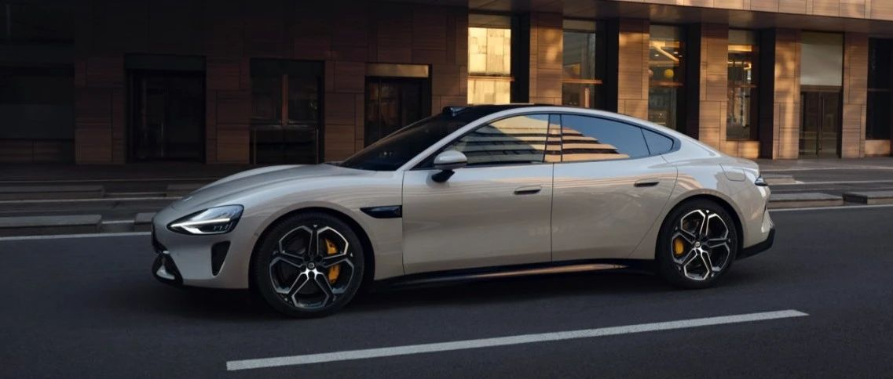

#  小米SU7答网友问：总集篇（下）

[ 小米汽车 ](<javascript:void\(0\);>)

______

> 小米SU7答网友问：**“总集篇”（下）：交付与服务篇** 。 针对小米SU7的交付与服务，我们总共回答了115个问题，今天一次性给大家汇总，以方便大家检索查阅。这也是前一段时间答网友问系列的终章，为前一阶段的解答画上圆满的句号。
> 
>   
> 
> 
> “和用户交朋友，做用户心中最酷的公司”是小米的愿景。未来，我们将持续倾听用户的声音，针对大家关心的问题，**不定期进行更新解答** 。
> 
>   
> 
> 
> 欢迎大家在我们所有的官方账号下积极反馈问题、提出建议。您的每一个声音，都是我们前进的动力。感谢大家对小米SU7的持续关注、喜爱与支持！

## **01**

**通知交付时如果本人不在，可以家人或朋友代提吗？**

可以代提。提车前，交付顾问在交付群内与购车人确认提车及付款人，若需代提车，付款时由交付顾问在群内发送代提车、付款确认函，购车人领取并打印后勾选所需事项（代提车，代付款）后双签，提车当天除携带正常提车手续证件外，还需携带此函件及提前登陆下单人的小米汽车账户。

  

**02**  

**支付尾款，可以分批分次支付吗？**

当然可以。我们支持尾款或首付款分多次支付，客户可按照自身资金分布的实际情况，完成线上或线下多次付尾款。具体来说有3种模式：

（1）可支持个人客户线上多次支付，支付入口在小米汽车APP中，可通过小米支付、支付宝支付、云闪付等支付方式进行支付，也支持在小米汽车app中获取收款账户，进行银行转账；

（2）同时也支持线下多笔支付，客户可到交付中心进行多笔储蓄卡、信用卡支付或支付宝和微信扫码支付；

（3）最后还支持客户线上支付部分尾款后，另一部分到交付中心进行刷卡或扫码等多笔付款。

总之，尾款可分多次支付，目标就是最大可能地满足个人客户不同情况的付款需求，为客户提供灵活便捷的支付体验。

  

## **03**

**能否使用数字人民币支付定金或尾款？**

目前尚不支持数字人民币支付，但我们仍旧提供了非常丰富的支付方式。

定金部分，可以在小米汽车微信小程序中使用微信支付，也可以在小米汽车APP中使用“微信支付/支付宝支付/小米支付/云闪付”其中一种支付方式进行支付。

尾款部分，可以选择在小米汽车APP中支付，也可以选择前往交付中心刷卡或扫码支付。

  

## **04**  

**每天这些问答问题或用车说明，有什么快速查询的办法吗？**

小米汽车官方微博、小米汽车官方微信公众号每天会更新网友问答文章，您也可以查阅往期问答文章。

小米汽车官网最底部左下角有「维修信息」入口，点击进入也可查阅小米SU7用户手册，其同样具备搜索功能。（小米SU7用户手册链接：https://tis.ev.xiaomi.com/#/home）

此外，小米汽车APP中有电子说明书，车主或授权使用车辆的用户在激活车辆后，可以在小米汽车APP“【我的】→【服务】”里查看。

小米SU7车机「全部应用」页面有「用户手册」，且具备搜索功能，用户可搜索关键词自行查阅。

当然，遇到用车疑问时，问问小爱同学会更加方便直接。并且针对一些车控开关，使用小爱同学还能自动跳转到相应控制页，箭头高亮指示，操作直观方便。

  

## **05**

**是否支持验车后再支付尾款？**

当然可以！小米支持验车后付尾款。但建议用户提前办理相关手续，方便到店后减少提车等待时间。同时，用户也尽可放心，小米对于车辆质量严格把关，提供合格的产品给到用户。

  

**06**  

**4月30日前下定，现在想改配，还能维持首销期权益吗？**

由于5月份的权益变化，车辆选配有调整，部分首销期赠送选装项不默认选配。

4月30日前完成大定支付的用户，5月犹豫期内改配依然可以保留4月份权益，改配时请手动选配4月份的免费赠送的选配权益，车辆显示的总价可能会超过4月权益抵扣后的总价，没关系，后期我们也会在交付前统一调整差价，您的交付专员届时也会与您做最终确认。

4月30日前完成大定支付的用户，如果5月您在犹豫期内有改配需求或有疑问，可以与您的产品专家联系获取帮助。

  

## **07**

**小米SU7如果在非官方授权渠道维修或保养，会影响质保吗？**

根据质保政策，在非官方授权渠道进行车辆维修/保养，更换的配件以及因使用不合格的配件和施工导致的车辆故障或损失，无法享受小米的质保政策。小米SU7质保权益政策可在小米汽车官网查询；

小米汽车售后服务定价，坚持了小米“价格厚道”的原则，充分考虑到了用户的用车维修经济性；建议用户在小米汽车官方授权的服务中心进行车辆维修和保养。

  

**08**  

**雷总在北京车展上宣布今年要交付10万辆，但是当前的预计交付周期为什么已经快排到明年了？**

小米SU7的火爆程度确实远超我们的预期，经过紧张的产能提拉，我们确实将今年的交付目标上调至10万辆。今天上午我们也刚刚宣布，第10000辆量产小米SU7下线，这在行业里也是非常快的速度。

由于此前限时改配活动的影响，我们需要一段时间结合工厂的物料情况重新梳理大家的交付周期，所以一直没有更新预计交付周期。

今天我们再次刷新了小米汽车APP下单界面的预计交付周期和已锁订单的预计交付周期。大家可以留意小米汽车APP，关注最新的预计交付周期变化。

  

**09**  

**后续充电桩移位如何操作，怎么提供帮助和收费？**

我们可以根据用户需求提供相应的移桩服务，收费标准详见售后服务政策：https://www.mi.com/service/serviceAgreement?id=55

  

**10**

**如果我对小米SU7体验有意见或建议，怎么快速反馈？**

您可以直接对小爱同学说“我要反馈”，然后用语音描述下您遇到的问题，提交反馈即可。

除此之外，还可以在全部应用中进入“用户反馈”，说出您遇到的问题，同时支持上传截屏或录屏。关于截屏，除了可以在用户反馈页面点击“录屏截屏”之外，长按中控屏右上角的时间，也能快速进行截屏操作。

  

## **11**

**第二批开放门店具体城市在哪里能查询到？**

我们正在全力以赴加速门店建设，预计今年年底将在46个城市中建成219家销售门店，基本覆盖全国所有省份/自治区/直辖市。所有新增开业的销售门店，我们会及时更新在小米汽车官网、小米汽车APP、小米汽车微信小程序的门店列表中，请您关注以上渠道了解相关信息。

  

## **12**

**小米汽车参加北京车展期间，定车会有什么优惠吗？**

4月30日24时前下定小米SU7，依然可以享受首销期权益。5月的下定权益，今天早上已经公布。5月1日至31日，下定全系享受：①赠送价值8000元Nappa真皮座椅；②小米智能驾驶增强智驾功能终身免费，具体活动细则大家可以到小米汽车APP中了解相关信息。

  

## **13**

**2024汽车以旧换新补贴，购买小米SU7可以享受吗？如何申请呢？**

可以的。根据商务部、财务部等7部门关于印发《汽车以旧换新补贴实施细则》的通知，在2024年4月24日至2024年12月31日内，个人消费者报废国三及以下排放标准燃油乘用车或2018年4月30日前（含当日）注册登记的新能源乘用车，并购买纳入工信部《减免车辆购置税的新能源汽车车型目录》的新能源乘用车或2.0升及以下排量燃油乘用车，给予一次性定额补贴。

**所以，如果报废上述符合条件车辆并购买小米SU7的个人消费者，将享受10000元补贴** 。可在2025年1月10日24时之前，通过线上申请的方式，访问“全国汽车流通信息管理系统网站”，或支付宝、抖音、微信、云闪付平台搜索“汽车以旧换新”小程序，完成补贴申请。

  

## **14**

**常见的用车问题，除了咨询客服，有什么渠道可以自行查询吗？**

小米汽车APP中有电子说明书，车主或授权使用车辆的用户在激活车辆后，可以在小米汽车APP“【我的】→【服务】”里查看。

小米SU7车机「全部应用」页面有「用户手册」，且具备搜索功能，用户可搜索关键词自行查阅；

小米汽车官网最底部左下角有「维修信息」入口，点击进入也可查阅小米SU7用户手册，其同样具备搜索功能。（小米SU7用户手册链接：https://tis.ev.xiaomi.com/#/home）

当然，遇到用车疑问时，问问小爱同学会更加方便直接。并且针对一些车控开关，使用小爱同学还能自动跳转到相应控制页，箭头高亮指示，操作直观方便。

  

## **15**  

**入门版能不能通过第三方加装尾翼，加装后是否影响保修？**

改装的结构和零件无法享受官方质保权益；因改装而导致的车辆结构和功能性受损，也超出质保权益覆盖范围。详细的小米SU7质保政策可在官网查询。

另外提醒，若车辆在上牌照时没有尾翼，而后来加装了尾翼，需要办理改装备案手续。

  

## **16**

**同版本不同颜色的交付时间是否有很大差异？**

相同配置的订单先锁单先排产，这里的相同配置是指相同的版本、颜色、内饰、轮毂和选装。因此，同版本不同颜色的订单交付时间会有差异，具体差异的大小是根据不同时期物料供应节奏情况而定的。

  

## **17**

**小米SU7零部件都是顶尖供应商的顶尖产品，那小米SU7售后维修用车成本会不会很高？**

尽管零部件成本贵，但小米汽车的售后维修配件定价，还是坚持了小米“价格厚道”的原则，充分考虑到了用户的用车维修经济性。

我们的售后维修配件零售价，和其他新能源汽车品牌相比，还是非常有诚意的！

  

**18**  

**今天雷军宣布小米SU7锁单量已经超过了75000台，我现在下定，会不会等待太久？**

上市28天，我们已经交付了5781台车，这在行业内是个很惊人的数字。我们正在全力扩充产能，并已开始提速。原本定于4月底开始交付的小米SU7标准版及Max版，已提前至4月18日开始。不少准车主也已发现，小米汽车APP中显示的预计交付时间提前了。

我们将在6月达成月交付10000台，并持续提升交付速度。感谢您的关注和支持，我们也恳请您能给我们一些时间和耐心，我们有信心小米SU7这样的好产品，一定值得您的等待。

  

## **19**  

**把车送去保养或维修，如何保护自己的隐私？**

我们基于账号对用户隐私数据进行隔离，交付给售后人员时，退出账号即可保证该账号下数据安全；用户远程解锁为维保人员开门时，车机会进入匿名模式，保护您账号下的隐私数据；

购车时会附赠两张卡片钥匙，用户可以选择一张卡片钥匙不绑定账号，借车、送去保养、维修或洗车时，服务人员用不绑定账号的卡片钥匙上车时，车机会进入匿名模式，保护您账号下的隐私数据；

此外，我们后续还将上线售后服务隐私数据自动隔离功能，车辆交给售后人员或上门取车人员时会自动进入代客模式保护您的隐私。

  

## **20**

**轮胎属于易损件1年保修，适用于哪些情况下？**

轮胎属于易损件质量保证期限是12个月或20,000公里，以先达到者为准。因零部件的设计、制造或原材料缺陷产生质量问题时，在小米汽车服务中心免费更换的纯正零部件的有限质量保证期，与被更换零部件的剩余有限质量保证期相一致，并随被更换零部件的剩余有限质量保证期的结束而结束。关于轮胎检查与保养，请参考用户手册相关章节。

  

## **21**

**小米为小米SU7用户提供的道路救援都有什么？**

小米汽车为用户提供了官方道路救援服务（中国境内，暂不包含中国香港特别行政区、中国澳门特别行政区及中国台湾地区）；

在小米SU7的整车质保期内，如因车辆质量问题，致使车辆无法正常行驶，用户可通过小米汽车APP专属服务管家群或小米汽车APP 400一键拨号的方式联系线上服务中心，获得7*24小时的紧急救援服务；

此外，购买了小米汽车官方用车服务包与保险产品的用户，还可免费享受7*24小时的事故类道路救援服务。

相关服务细则和服务产品信息，可查询小米汽车官网或咨询小米汽车线上服务中心。

  

## **22**

**锁单后，是等到交付后才需要正式分期还款，还是说一旦贷款通过就要还款？**

锁单后，先要进行贷款资格审核，审核通过且交付开票后，才能向银行申请贷款发放（不同银行的放款时效不同，一般在1-3天内），当银行贷款正式发放后（即放款后），才会开启还款，具体还款时间以银行通知为准。

  

## **23**

**金融方案假如预定的时候是选的分期，交付的时候可以改为全款吗？**

在交付当日车辆激活前，均可将分期付款改为全款交付，只需与您的交付专员提前沟通妥当即可。

  

## **24**

**误点进了修改配置界面，但不修改配置，会影响之前的排队时间吗？**

申请改配后，如未在改配时间内改配成功，改配时间截止后退出改配页面，订单会退回至原车型配置，不影响预计交付周期。

  

## **25**

**后续支持更换轮毂，需要注意什么？**

不同版本的小米SU7适配不同款型的轮毂，用户可以在购车下单时选配不同尺寸和款型的轮毂。同时，车辆的轮毂选购，除考虑产品本身适配性外，同时也需考虑法规要求。依据《机动车登记规定》要求，在提车上牌后，用户可以选购同尺寸的其他适配款型轮毂；但轮毂是车辆年检和过户审查项之一，轮毂更换也涉及车辆适配性调整，用户提车后如希望更换轮毂款型，建议先就近咨询小米官方服务中心。

  

## **26**

**如果选购时是19英寸轮胎轮毂，后续可换20或21英寸吗？在官方交付中心操作吗？**

小米SU7标准版和Pro版，标配19英寸低风阻轮毂，下定时可选配20英寸梅花轮毂。而小米SU7 Max，拥有四种轮毂可选，包括19英寸低风阻轮毂、19英寸运动轮毂、20英寸梅花轮毂以及21英寸运动轮毂。

如购车后希望更换其他款型的轮毂和轮胎，可通过汽车400热线或专属服务群，查询自己车辆的适配款型，并预约到店换购安装时间。同时，为确保门店库存能满足您的需要，建议用户提前3-5天预约。

用户可以在购车下单时选配不同尺寸和款型，在提车后，可以选购同尺寸的其他适配款型轮毂和轮胎。轮毂是车辆年检和过户审查项之一，轮毂更换也涉及车辆适配性调整，用户提车后如希望更换轮毂款型，建议先就近咨询小米官方服务中心。

  

## **27**

**锁单后可以跟销售沟通不按照APP预计交付时间提车吗？**

订单锁定后，将会进入生产序列，此过程不能更改。交付专员会在交付前与用户联系提前办理相关前置手续，方便用户提车。建议大家收到提车通知后，按照约定时间前往交付中心，避免影响用车，也有助于整体交付进展，让所有等待提车的车主受益。

  

## **28**

**非创始版的小米SU7什么时候开启交付？生产顺序是怎样的？**

小米汽车工厂目前正处于生产爬坡阶段，我们会尽快开始交付非创始版的小米SU7。生产初期，产能和物料准备节奏仍在提升过程中。我们已动员全部供应伙伴，正全力提高产能，加快交付效率！

工厂的生产受物料准备、生产批次等多种因素的影响，整体上来讲，完全相同配置的订单（相同车型版本、外观颜色、内饰材质和颜色、轮毂、选装）我们会根据锁单时间来进行排产。同时，因各地订单和发运时间差异，不同地区之间的交付节奏也会有所差异。

我们会在您锁单时APP显示的预计交付周期内安排提车，请大家再耐心等待一下，并关注APP显示交付时间的实时变化。

  

## **29**

**车辆状态提醒能否不发短信，仅在APP层面？**

小米SU7会时刻守护您的车辆，当车辆触发哨兵监控事件、离车门窗未关未锁、充电状态变化、胎压异常等特殊情况时，会通过小米汽车APP给您推送相应的提醒。

但如果用户收不到小米汽车APP的推送（比如卸载小米汽车APP或将其通知关闭），我们会为用户补发短信，以确保必要的车辆状态信息通知到位。

  

## **30**

**为什么Max版20英寸轮毂选配价格6000元，标准和Pro版要8000元？**

小米SU7 标准版和Pro版升级20寸梅花轮毂还会同步升级Brembo四活塞固定卡钳+打孔通风盘，而Max版标配Brembo四活塞固定卡钳+打孔通风盘。因此，同样是升级至20寸梅花轮毂，标准版、Pro版与Max版的价差不同。

今年4月30日前下定小米SU7 Max，我们会限时免费升级20寸梅花轮毂。

  

## **31**

**怎么更改交付地区以及上牌城市？**

交付与您首次联系确认订单信息时，可以协助您修改交付城市和上牌城市，确认后无法再修改。

  

## **32**

**全国地市级维保服务门店什么时候能铺开，有没有计划公开？**

售后服务中心的网络布局，会分批次逐步拓展开业，预计到今年年底逐步实现全国约80城的服务网络覆盖，以保障用户用车出行。

  

## **33**

**能否在提车前安装充电桩，需要准备什么资料？**

您可以在提车前安装充电桩。各个地区安装充电桩所需资料可能存在差异，需以当地要求为准，您可联系您的产品专家/服务工程师协助。如需电力报装，需向供电局提供购车协议、车位产权证明/租赁合同、身份证等资料。如物业需要施工单位提供相应资质，可提供安装资质证书、营业执照、施工人员电工证等资料。

  

## **34**

**为什么改配限时一天，后续不能延续这个政策？**

工厂的生产和物料的筹备是根据大家的锁单情况提前准备的，如果持续大量改配，会导致生产混乱，物料供应不及时，进而影响生产和交付车辆的效率。从保障所有用户的交付周期出发，我们选择了把影响降到最低的方案，希望能得到大家的理解。

  

## **35**

**如果改配，是否意味着需要重新排队，会导致提车时间推迟很久？**

关于改配对订单顺序的影响，我们确实权衡了很多次，最终还是决定改配后需要重新排队，这样对所有用户更加公平。

提车时间的推迟幅度则取决于您当前订单的锁单时间。即便您锁单很早，排位比较靠前，也会因为改配成功使得交付周期显著增加。且改配成功后不可退回，请谨慎改配！

上市以来，我们一直认真聆听大家的建议，并持续尽力为大家解决问题。感谢大家一直以来的信任与支持。具体规则以小米社区内的改配规则为准，您也可以咨询您的销售顾问或交付顾问获取更个性化的咨询回复。

  

## **36**

**后续任何版本是否都能更换不同尺寸轮毂，更换后要做哪些动作？**

小米SU7/小米SU7 PRO版，可适用以下轮毂款型：

  * 19英寸低风阻轮毂-米其林

  * 20英寸梅花轮毂-米其林

小米SU7 MAX版，可适用以下轮毂款型：

  * 19英寸低风阻轮毂-米其林

  * 19英寸运动轮毂-普利司通

  * 20英寸梅花轮毂-米其林

  * 21英寸运动轮毂-倍耐力

不同的轮毂和轮胎对车辆行驶有不同的适配性，也是车辆年检的检查项之一，如购车后希望更换购买其他型款/尺寸的轮毂和轮胎，建议咨询官方授权服务中心后再行换购。

  

## **37**

**首批权益政策截止日期为4月30日，要是定金交在这个时间前，尾款在之后，首批权益还能享受吗？**

在4月30日24点前完成支付5000元定金选购小米SU7的客户，均可享受至高价值22000元的限时购车权益，尾款支付时间不影响以上限时权益的获得，具体信息您可以在小米汽车APP内的权益介绍中查看。

  

## **38**

**当地没有小米交付中心，提车后如何联系安装充电桩？**

当地没有交付中心您也不用担心，在中国大陆范围内，您只要购买小米官方家充产品，都会有我们的工程师联系您，预约您的时间进行上门勘测。只要安装条件符合，都会为您妥善完成充电桩的安装服务。

  

## **39**

**小米汽车APP里面的预约充电，是仅支持小米汽车的家充桩，还是也能支持其他品牌？**

能支持其他品牌，预约充电可以让电动车在预先设置的时间点启动充电，人为地避开用电高峰期，合理规划充电时间，实现错峰用电，提高电力资源利用效率，在部分地区可以享有更低廉的电费。

小米SU7中控屏和小米汽车APP车控界面的预约充电，是由车端计时的，相当于开关由车主导，只要充电桩能够实时供电就可以预约充电。所以不仅小米家充桩，目前测试过的主流品牌家充桩都可以使用。

此外，在小米汽车APP “我的 - 家充桩”界面，有单独控制小米家充桩的预约充电功能。此功能由桩端计时，仅支持小米家充桩。

  

## **40**

**目前没有地库，充电桩想过一段时间再安装，这个最多能等多长时间？**

购买充电桩后，可随时预约安装日期，没有时效限制。

我们提供的充电桩产品，已包含家充设备和30米线缆内基础安装服务（中国大陆地区），但也建议大家先明确充电桩安装条件后再做选购。

  

## **41**

**小米SU7 Pro车型可选装电动尾翼，为什么不能选装物理按键？**

小米SU7 Pro 因默认并未标配电动尾翼和空气悬架，初期产品设计在中控台只保留了空调温度及风量调整两个物理按键。近期我们了解到广大小米SU7 Pro用户，在选装电动尾翼后，希望能够增加调节电动尾翼的物理按键。小米汽车产品团队经过多轮省慎讨论，并进行排产验证后，现作出如下调整：小米SU7 Pro车型，可选装电动尾翼，选装后即在中控台配备四个物理按键，支持调节电动尾翼。这一产品调整在小米SU7 Pro首批交付即可兑现。同时，4月30日之前下定小米SU7 Pro版本的用户，免费送电动尾翼，交付时同步配备四个物理按键。

从小米公司成立之初，就一直坚定与用户交朋友，秉承「参与感」的信条。“闭门造车”无法造出用户满意的完美产品，期待大家持续给予我们建议，我们一定会认真倾听。

  

## **42**

**Pro版能否加装尾翼调节实体按键？**

小米SU7 Pro版不能加装电动尾翼调节的实体按键。用户可以呼唤小爱同学（主驾位置）进行电动尾翼调节，比如“打开尾翼”、“尾翼调高点”、“尾翼调低点”等；用户也可在中控屏的“设置 - 驾驶偏好”页面，对电动尾翼开闭、角度进行调节。

  

## **43**

**什么时候开始交付非创始版车型，现在的交付周期很长，会提拉吗？**

目前的定单量大大超出我们上市前的预期。因此，这段时间我们也在持续与供应链伙伴沟通提拉产能的事宜。

今天上午我们进行了小米SU7的供应链提产会议，几十个供应链伙伴企业参加了会议，我们与各位伙伴企业制定了新的产能提升计划，并将根据新的产能计划对预计交付周期进行测算。非创始版的小米SU7/小米SU7 Max，预计交付时间也会提前，将于4月下旬陆续启动交付，小米SU7 Pro则于5月下旬陆续启动交付。

对于创始版定单，我们正在全力攻关提升交付效率，会尽快将爱车交到您的手中。感谢大家对小米SU7的喜爱！

  

## **44**

**如果在路上遇到扎胎/爆胎等意外情况，官方售后会提供什么服务吗？**

针对扎胎/爆胎情况，小米有两项服务可以覆盖用户需求：

第一，在移动服务已经覆盖的城市，用户可以通过线上服务中心（专属服务群/400热线）预约移动上门服务，完成对车辆的补胎/换胎。补胎和换胎的服务费用需用户自理，但购买了官方惠享服务包和保险产品的用户，可享受免费上门补胎服务，合同期内不限次数；

第二，用户可以通过线上服务中心，呼叫道路救援服务，将车辆拖运至最近的服务中心/维修站，再对车辆进行补胎/换胎。但免费的事故类道路救援服务，暂仅对购买了官方惠享服务包和保险产品的用户提供；其他用户，则需自己承担事故类道路救援费用；

针对高速场景，只能通过道路救援方式提供服务，因为高速路段不允许现场对车辆施工作业。

  

## **45**

**如果运输过程中车辆发生了磕碰剐蹭漆面等问题，如何解决？**

当门店接车后，我们会对全车外观进行全面检查，如果遇到运输过程中剐蹭磕碰有损漆面等问题，在交付前小米工作人员一定会提前告知用户，积极沟通寻求处理方案，与用户达成一致后才会开启交车流程。

  

## **46**

**提车时是否会有配件赠送？**

在4月30日24点前成功支付定金选购小米SU7的用户，除了发布会宣传的至高价值22000元的限时购车权益，以及至高价值26000元的小米智驾增强功能外，还可在车辆交付时，免费获得脚垫套装以及交付礼盒，包含NFC车钥匙卡套、车载U盘、Xiaomi Life 棒球帽。创始版用户还可额外获得创始版专属标识、专属编号证书、雷军签名版蓝牙钥匙。

  

## **47**

**小米SU7合金车模和小米Life不锈钢马克杯还会再次开售吗？**

首批开售的合金车模和金属马克杯非常受欢迎，我们正在紧急增加产能，已于今晚8点小米汽车APP商城再次开售。由于合金车模有大量手工制作工序，本次补货数量有限，也请大家理解。

  

## **48**

**小米汽车APP是否有电子说明书，能提供快速功能查询？**

小米汽车APP中有电子说明书，车主或授权使用车辆的用户在激活车辆后，可以在小米汽车APP“【我的】→【服务】”里查看。

当然，遇到用车疑问时，问问小爱同学会更加方便直接。并且针对一些车控开关，使用小爱同学还能自动跳转到相应控制页，箭头高亮指示，操作直观方便。

  

## **49**

**小米SU7创始版为什么在APP上还是显示“待生产”状态？**

我们的交付同学正在紧锣密鼓地为大家的车辆协调发运资源，待车辆到达交付中心以后，大家就能看到自己的车辆状态更新了。

  

## **50**

**不采用小米官方合作保险，在提车时是否会被区别对待？**

小米提供官方合作保险服务，但用户可以自由选择保险公司，不会被区别对待。

  

## **51**

**小米SU7 保险费用和50多万油车接近，这是为什么？**

新能源车和燃油车商业险条款不同，新能源车专属《条款》既为“三电”系统提供保障，又全面涵盖新能源汽车行驶、停放、充电及作业的使用场景。且还会根据新车/旧车、品牌、车型、上户类型、险种、保额等多种因素综合计算，保费价格也不尽相同，不能简单只通过车价进行比较。

  

## **52**

**后期会不会针对燃油车或新能源车，推出置换优惠政策？**

我们与行业内头部的二手车平台合作，为小米用户提供便捷省心的置换服务，目前暂未推出置换优惠政策，后续政策敬请关注小米汽车APP官方通知。

  

## **53**

**小米SU7主要零部件更换是否有官方价格能公示？**

小米汽车的售后维保零配件销售价格，在全国官方售后服务中心全网一致；

部分维保零配件价格信息，会按照法规要求在店内以上墙物料的方式直接公示，其余维保零配件价格可以在店内售后管理系统中查询；

用户维修订单的详细服务内容和收费明细，也会通过小米汽车APP推送给用户；用户可通过"【我的】→【订单】→【服务订单】" 查询服务订单信息、支付服务费用和对每次服务进行评价反馈。

  

## **54**

**据闻部分用户发现，有门店展车的座椅出现“鼓包”和“包浆”，这是什么情况？**

小米SU7的展车座椅采用Nappa真皮材质，真皮属于天然材料，此类材质都有一个通性，如果长时间挤压会导致真皮内部的纤维组织被拉伸，这时候皮质需要“休息一下”，也就是在压力消失后，纤维组织才会慢慢恢复到紧致的状态。

而小米SU7上市初期，门店人气火爆，座椅面料长时间高强度挤压变形，没有有效的恢复时间，导致座椅表面轻微变形。其实，在经过一段时间后，座椅表面会自然恢复紧致状态。且小米SU7量产车，在Nappa真皮下方还采用了高密度复合海绵，更能有效加强真皮的回弹性能。

至于“包浆”，是网友对皮质表面脏污的戏称，只是部分展车座椅经历了单日数千人的高频乘坐，清洁不及时导致的。小米SU7的真皮座椅，表面全部增加了耐脏污助剂，如有脏污，只需使用专用清洁液处理，即可恢复如新。

小米SU7的座椅总成经过了严苛的测试，比如导入导出耐久测试我们就做了25000次，远高于行业标准的15000次（QCT 740）。并且座椅随整车质保（具体质保内容详见用户手册质量担保服务章节），请大家放心使用。

  

## **55**

**购车送不送积分，还有什么渠道能够快速获得积分？**

目前暂未推出购车赠送积分的活动，在4月30日24点前成功支付定金选购小米SU7的用户，可享受至高价值22000元的限时购车权益，以及至高价值26000元的小米智驾增强功能的终身免费使用权。后续有关积分获取的信息请关注小米汽车APP官方通知。

  

## **56**

**在目前的质保基础上，能否额外购买更长时间或终身的质保？**

小米SU7的质保政策已在小米汽车官网公示，用户可在官网查询，暂无质保政策更新。

更长周期的小米SU7质保服务产品，我们正在根据用户需求情况，调研并推进开发，敬请关注小米汽车官网和小米汽车APP的官方信息。

  

## **57**

**每个交付中心都能直接办理临牌吗？**

交付中心会为您提供办理临牌的服务，但其中部分交付中心由于场地位置的原因，可能会需要到附近临牌点办理。

  

## **58**

**如何办理退款，时效是怎么样的？**

锁单前退定金，即时到账；锁单后不可退定金。

  

## **59**

**办理购车金融服务，是否有额外的手续费？**

小米汽车金融服务不收取任何分期手续费。

  

## **60**

**小米汽车金融服务与外面机构提供的产品有什么差别？**

小米汽车金融服务为小米汽车官方金融服务品牌，安全靠谱有保障。官方合作金融机构具备分期费率低、期限灵活等优点，方案多样，价格统一，可满足您的不同贷款方案需求。客户经理会在申请流程的全程提供支持，流程线上化，进件资料少，简单高效，审批快速。

非官方合作机构的资质情况需您费心甄别，且服务价格及方案未知，服务审批情况及服务质量存在较大不确定性，如您遇到问题，其他机构还可能面临服务人员失联、申请资料丢失、个人信息泄露等风险，对您实现分期购车造成不利影响。

因此，小米汽车建议您使用官方金融服务分期购车。

  

## **61**

**没有门店的城市是否会有巡展计划，让更多人能看到小米SU7？**

当前为产品上市首销期，用户热情高涨，我们专注在首批销售城市为大家提供好的服务。首销期之后，会根据市场情况制定其他区域的巡展计划。

  

## **62**

**这两天，网上曝出试驾车座椅有污损的现象，这是怎么回事？**

在当前远超预期的超大试驾客流高峰下，不少门店单日近10000人次来访。我们无法确认，在如此高强度、高频次的试乘过程中，是否有硬物对座椅皮质刮擦或是不当处理导致表面破损。另一方面，每台试驾车的乘坐人次、强度，也远超正常使用场景。我们将进一步提升我们的门店服务能力，提高试驾车清洁整备保障。

更重要的是，小米SU7座椅随整车质保（具体质保内容详见用户手册质量担保服务章节），请大家放心。

  

## **63**

## **小米汽车惠享服务包价格多少，什么途径购买？**

## 

##  小米汽车惠享服务包将在6月正式对用户开放订购，届时车主用户可通过手机APP商城订购。我们将通过服务包为小米汽车的用户提供更多体验好、性价比高的服务权益和服务体验，请您随时关注小米汽车APP。

  

## **64**

## **后续车辆维保只能去各城市的交付中心吗？**

##   

## 2024年，小米汽车将逐步建设约130个官方服务中心，逐渐覆盖60~80个城市，保障用户用车出行；其中一部分服务中心与交付中心在同一地理位置；

如有维保需求，用户可根据自己的习惯，通过APP预约、APP专属服务管家群聊天、拨打400服务热线这三种方式，随时发起维保需求；线上服务中心将根据您的地理位置和门店经营情况，择派最便捷、最高效的服务中心为您提供车辆维保服务；

用户也可以在地图上搜索到已开业的小米官方服务中心的位置，选择任何一家服务中心，直接驾车进店对车辆进行维修和保养。

  

## **65**

**家用充电桩是否已经可以下单安装，物业需要提供的材料会有专员协助准备吗？**

在选购家充桩后，会有工程师联系您，预约您的时间进行上门勘测。您有任何的疑问，都可以与产品专家沟通，他们会协助您准备材料。

  

## **66**

## **为什么APP里购买配件还区分创始版和非创始版，不是通用的吗？**

##   

## 目前小米SU7和小米SU7创始版选装配件是通用的，「适配车型」是为了未来更多车型选择的菜单设置。

  

## **67**

## **金融贷款未通过的，可以退定金吗？**

##   

## 小米汽车金融服务官方合作机构有建设银行、中信银行、平安银行、招商银行等主流商业银行，同时也有华晨东亚汽车金融有限公司、江苏金融租赁股份有限公司，我们可提供多种适配不同类型客户的金融产品；如您对分期审核是否能通过存有顾虑，可以提前咨询门店产品专家，使用金融“测一测”后，再根据结果确定是否进行锁单，锁单前定金自主可退，锁单后不可退定金。

  

## **68**

**能否购车后自行选择其他保险公司投保？**

建议您提车前完成交强险投保，无交强险会影响临时牌照的办理，车辆无法行驶上路。您可以在线上投保时看到多家官方合作保司的报价，并自行选择意向保司。我们合作的保司报价与提供的服务基本一致，续保报案一站式智能操作！如果选择非官方合作保司，可能会产生理赔争议风险及不能原厂原配维修等情况。建议选择小米汽车保险服务，为您的每一次智驾出行保驾护航。

  

## **69**

## **小米汽车有哪些官方合作的保险公司？**

##   

## 小米汽车与人保财险、平安财险、太平洋财险和阳光财险四家国内知名保险公司建立了官方合作，为小米车主提供专属的价格和理赔服务。

  

## **70**

## **小米汽车支持哪些支付方式？**

##  定金部分，可以在小米汽车微信小程序中使用微信支付，也可以在小米汽车APP中使用“微信支付/支付宝支付/小米支付/云闪付”其中一种支付方式进行支付；尾款部分，可以选择在小米汽车APP中支付，也可以选择前往交付中心刷卡或扫码支付。  

如您希望通过银行转账或到店刷卡（借记卡）支付尾款，建议您准备好一张足够支付尾款资金的借记卡，并提前确认银行卡单日、单笔限额是否满足转账条件。

如您希望通过支付宝、微信支付 、小米支付、云闪付等方式在小米汽车APP中支付尾款，由于单一支付方式有限额，可以选择使用【分多次支付】进行组合付款（支持信用卡）。

  

## **71******

**小米汽车APP上已经下定锁单，能否抢先试驾？**

我们为所有用户提供一致的试驾服务，用户可以通过联系门店销售伙伴，或在小米汽车APP及小米汽车小程序中选择“预约试驾”进行预约。已经下定锁单的用户，和未下定锁单的用户，均可以进行试驾预约，按照预约成功的时间进行试驾。

  

**72**  

**在一些社交平台上看到有推出小米SU7免息或优惠政策是否真实？**

小米官方渠道目前暂无额外的优惠政策，如遇非官方渠道宣称提供额外优惠，请您谨慎甄别，避免财产损失或信息泄露。

  

## **73**

**购车后具体能享受到哪些售后权益？**

首先，小米汽车用户可享受车辆的整车和关键零件的质保权益，且质保权益“跟车不跟人”，不受车辆交易的影响；详细质保权益可在小米汽车官网查询。

此外，如遇因质量问题而导致车辆无法正常行驶的情况，我们将为用户提供免费道路救援权益。

同时，我们还为用户提供7*24小时服务管家/专家专属群服务、在线远程技术诊断、移动上门服务、一站式维保服务等权益保障。部分服务权益需通过购买官方用车服务包和官方保险产品获得。详细信息可查询小米汽车官网或咨询小米汽车400-182-6888热线。

更多的服务权益和体验，将会根据小米汽车用户的反馈和需求，陆续开发并推出。

  

## **74**

**提车顺序是怎么安排的，相同配置绝对按照锁单顺序吗？**

您的订单会按照最终锁单的时间顺序排产，对于相同城市、相同配置的订单，车辆会按照锁单顺序交付。

  

## **75**

**目前数据显示小米SU7有些人退订了，是否意味着能更快提车？**

非常抱歉，目前我们暂时处于爆单状态，每天都有持续新增的锁单定单。您的定单会以最终锁单的时间顺序排产及安排交付。

如果您已经锁单，若在您前面有相同城市、相同配置的锁单客户由于客户自身原因未提车，那么您可能更快被安排车辆资源交付；如果您还未锁单，您的预计交付周期会依据您最终的锁单时间，和当时的产能及物料情况测算。

  

## **76**

**已经交了全款，但交付人员没有明确交付时间该怎么办？**

车辆到店后会主动联系用户预约后续提车时间，您随时可以关注小米汽车APP上的交付流程信息。

  

## **77**

**为什么小米SU7创始版是现车，但无法4月3日交付呢？**

首批创始版一共5000台，为了尽快给各位车主开启交付，采取了提前生产的方式，并在生产、质检、物流等交付全流程各环节，都设立了非常严格的标准。请放心，创始版车辆近期将完成全部生产及质检流程，正陆续发往29城，交付到用户手中，感谢您的耐心等待和理解。

  

# **78**

## **第二年如果不续费「车载网络服务包」是整车全部无网络服务吗？小爱语音、地图导航、远程控车、OTA升级等网络服务是否永久免费？**

小米SU7系列均可在交付之日起免费使用「车载网络服务包」一年，此权益与车辆绑定。权益期结束后，车主可以通过小米汽车应用程序付费购买「车载网络服务包」。「车载网络服务包」的定价是19.9元/月和199元/年。

小米SU7系列自交付就可使用车载网络连接服务，在没有第三方网络连接的情况下可实现地图导航、远程控车、OTA升级及辅助驾驶、系统应用更新和联网、小爱同学语音助手等基础功能，更多网络功能则需购买「车载网络服务包」或连接 Wi-Fi/手机热点。

购买「车载网络服务包」后，在没有第三方网络连接的情况下，仍可通过车载 SIM 卡的移动蜂窝网络使用车载网络连接服务，包括开启Wi-Fi热点供其他设备使用网络、下载与访问第三方应用（播放网络音乐、视频和 KTV 歌曲、进行游戏等用途）、哨兵模式远程查看视频、下载离线地图等，具体功能请以实车为准。

移动蜂窝网络的网络覆盖范围和网络服务连接速度取决于电信运营商，「车载网络服务包」仅支持中国大陆境内（不含中国香港特别行政区、中国澳门特别行政区及中国台湾地区）。

  

# **79**

## **定****购时不希望选装冰箱，能否取消？**

4月30日前支付大定赠送价值2000元的车载智能冰箱，但不支持替换为普通储物盒。

我们的车载智能冰箱支持远程控制和语音控制。它有4.6L容积，可以放6听标准可乐，还配备了防滚架。制冷制热都可以，既可以冰饮料、保鲜水果，还可以温热饮品。当然也可以关闭作为普通储物空间使用，值得您选装体验。

  

# **80**

## **小米汽车APP积分商城中的积分怎样使用兑换？**

您可以在小米汽车APP“商城”板块购买商品时使用积分抵扣部分应支付金额，使用商品范围以系统所示为准。

积分抵扣比例10:1（即10积分可以抵扣1元），若您的定单金额使用积分抵扣后存在低于0.1元的部分，则低于0.1元的部分不支持积分抵扣。

积分仅限获得该积分的用户（以小米账号为用户识别单位）使用，不可合并，不可转赠、买卖’不支持兑换现金或其他优惠形式，不支持用于非本规则约定的用途。

积分规则详情请查询“小米汽车APP-我的-积分-积分规则”部分。

  

# **81**

## **购车时选了分期后面还可以全款付尾款吗？**

如果您下单锁单时选了分期，想要修改为全款支付，您可以在交付同事与您首次联系时，主动告知交付。

  

# **82**

## **有没有更多种类的贷款政策，比如50-50，0首付提车等？**

目前暂时没有50-50或0首付产品政策，但我们提供了市场最主流的等额还款产品，15%首付起、最长60期，且现在定购还可享受年费率2.5%限时优惠；以SU7标准版为例，首付最低只需3.24万元，月供不足3500元。

小米汽车金融服务也将时刻关注用户需求，持续开发迭代金融产品，敬请期待。

  

# **83**

## **为什么门店试驾不能体验小米智驾功能？**

因为门店试驾需求远超预估，目前每位试驾用户体验时间为15分钟，时间较为紧凑，因此暂未在标准体验流程中安排智驾环节，还望大家谅解。如果您对智驾特别感兴趣，可以提前和店员预约说明需求，交车时搭载的智驾功能均可以体验。

我们也会不断优化试驾流程，未来争取给大家更充沛的时间去更全面了解SU7的方方面面。

  

# **84**

## **上门试驾的业务是否有规划？如有规划具体试点城市有哪些？**

目前，我们销售端能够支持的预约到店试驾，上门试驾在规划中。主要是因为当前订单与预约试驾需求远超预计，基于有限的试驾车和人员资源，为了保证用户服务的整体高效与时效性，暂时未开放上门试驾，还望谅解。

我们预计将在全国门店获得足量试驾车和人员补充后，逐步开放上门试驾业务。届时我们的销售伙伴也会与有需求的用户朋友联系沟通，敬请期待。

  

# **85**

## **如果我已经购买了小米SU7，能否变更提车地址？**

在小米汽车交付同事与您首次联系时，可以主动告知交付地址，我们会竭力配合。

  

# **86**

## **下定后显示的提车日期会不会发生变动？**

刚上市的时候我们提供的是全国启动交付时间，待定单配置锁定后，按照定单锁定的时间顺序与生产计划进行匹配，得到每个定单的预计交付时间(指用户锁定配置至车辆到店的时间间隔)。为方便各位用户提前了解并安排提车事宜，我们将此结果更新至用户的APP定单详情页。

自3月29日19时起，我们也把预计交付周期展示在小米汽车APP的选购流程中，作为用户下定和锁单之前的参考。我们正全力提升产能，加快交付，请随时关注APP内信息。

  

# **87**

**4月3日就能交付的创始版，是已经生产完很久的库存车吗？**

不是。给用户的首批创始版车辆，都是在3月28日发布会前后刚刚生产出来的新车，请大家放心。

大家应该在3月初到月中见过卫星和媒体拍摄我们工厂的远瞰图，出现其中的早期生产的车辆，是用于我们的超大规模道路测试以及门店的展车、试驾车。

  

## **88**

## **小米SU7的尾款什么时候开始支付？**

订单锁单后，交付会联系到用户，如果是全款用户，交付和用户确认订单信息后，小米汽车APP就会有支付尾款的界面出现。如果是金融贷款用户，会在金融审批通过后，小米汽车APP就会有支付尾款界面出现。

  

## **89**

## **对于内饰件(方向盘、坐垫)破损是否有快速上门维修服务？**

小米汽车为用户提供移动上门服务，满足用户对车辆的基础保养、偶发故障诊断排除和简易维修（轮胎修补/换新、门把手以及部分内饰件维修/更换）的服务需求。用户可通过小米汽车APP专属服务管家群或小米汽车APP 400一键拨号的方式联系线上服务中心发起相关服务需求。

移动上门服务首批开通29城，更多城市后续将逐步开通。

  

## **90**

## **小米SU7 是否提供快速救援服务？**

小米汽车为您提供了官方道路救援服务（中国境内，暂不包含中国香港特别行政区、中国澳门特别行政区及中国台湾地区）；在小米SU7的整车质保期内，如因车辆质量问题，致使车辆无法正常行驶，用户可通过小米汽车APP专属服务管家群或小米汽车APP 400一键拨号的方式联系线上服务中心，获得7*24小时的紧急救援服务。此外，购买了小米汽车官方用车服务包与保险产品的用户，还可免费享受7*24小时的事故类道路救援服务。

相关服务细则和服务产品信息，您可查询小米汽车官网或咨询小米汽车线上服务中心。

  

## **91**

## **小米SU7 提供的各项质保，是否每次维修保养都一定去指定网点？**

我们强烈建议用户选择官方授权的服务中心进行车辆的维修保养。

车辆属于结构非常复杂的产品，智能轿车维修后也涉及多项软件适配刷写。官方授权服务中心配备了经过培训认证的专业技术人员，具有原厂配件供应保障、官方技术支持的优势，能够保障车辆维修品质，同时也避免非专业维修或非原厂配件导致的车辆扩损，从而影响质保权益兑现。

  

## **92**

## **小米SU7 创始版为什么会再次开售，以后还有吗？**

  

小米SU7 创始版定购过程中，我们识别、拦截了部分异常订单、黄牛订单，因此将开启第二轮惊喜追加开售。开售时间为4月1日 12:00。

本次开售定金20000元，下定即锁单，定金不可退。本轮定购，同样享受3月28日当晚一样的至高31000元豪华购车权益。同时已下定非创始版的用户，也可参加本轮开售，下定成功后，可将原有定单转为创始版，非创始版订单已锁单的用户，明日下定成功创始版，也可以转单。转单相关事宜将会有客服统一联系，您也可主动联系客服处理。可通过小米汽车APP和小程序定购。

小米SU7 创始版不会再开启新轮次的定购了，感谢大家的支持。

  

## **93**

**小米SU7****的养车成本怎么样？小保养费****用是多少？**

首保（首年或两万公里）480元，第二年750元左右，第三年1400元左右。

  

## **94**

**质保是只限于首任车主么？是跟车还是跟人？**

质保不限首任车主，跟车不跟人。

  

## **95**

**小米家充桩有哪些规格？是否支持免费安装？**

小米家充桩有7kW和11kW两种规格，其中11kW适配SU7 Max车型。您所购买的家充桩产品中，包含家充设备和30米线缆内基础安装服务（中国大陆地区）。欢迎您在小米汽车APP商城选购。

  

## **96**

**小米SU7的车险费用大概是多少？小米有自己合作的保险吗？**

不同的车辆售价及不同的城市地区，新车保险价格均有不同。提车前车辆保险价格预估，可咨询当地销售人员或交付专员。

小米汽车与平安财险、阳光财险、人保财险、太平洋财险四大保司合作，为用户提供合适的官方保险产品。用户可在交付提车前，咨询交付专员获得详细产品信息和购买建议。

  

## **97******

**购车有无政策补贴？具体怎么查询政策？**

各地政策各有不同。如天津可享受车价15-25万元车型3000元补贴；25-35万元车型4000元补贴。

具体补政策可登录当地车管所或新能源办官网查询。您所在城市的小米汽车门店也可向您提供当地政策补贴的咨询服务。

  

## **98**

**小米SU7在海外有没有销售计划？**

目前暂没有海外销售计划，请等待官方的后续信息为准。

  

## **99**  

**锁定配置后，我大概什么时候可以提车？**

小米SU7标准版和Max版预计从4月底开始陆续启动交付，Pro版预计从5月底开始陆续启动交付。当您锁定配置后，我们的工厂即按您设定的配置开始排产。您可以从小米汽车APP中看到大致的进度，及预估的交车时间。锁定配置前，您可以通过「开始配置」的选装过程页面的最下方查看每种配置组合对应的预计交付周期；锁定配置后，您可以通过「查看订单」页面查询预计交付时间。创始版为现车，从4月3日起正式陆续交付。

  

  

## **100**

**购车之后去4S店的提车流程是哪些？我需要注意哪些材料和手续？**

购车后统一到当地的交付中心提车。

交付中心会预约用户提车时间，需携带以下材料：

  

## **101**

**轮胎是否为定制款，日后更换是否只能去官方？******

小米SU7 全系都采用全球顶级品牌的轮胎，除19‘’ 米其林 E-Primacy 低滚阻轮胎（能提供更长的续航里程）外，其余三款（原厂匹配 轮胎、19‘’ TURANZA 6 舒适胎、20‘’米其林PilotSport EV静音胎及倍耐力P ZERO 5代运动胎）均为轮胎品牌方结合SU7性能量身打造的定制款。建议通过官方渠道购买定制轮胎。

  

## **102**

**如果购买了创始版或其他版本，但有更换轮毂需求该怎么办？怎么购买/置换其它款轮毂？**

在锁单之前，可进行不同轮毂轮胎搭配的选择，锁单之后则无法更改。不同的轮毂和轮胎对车辆行驶有不同的适配性，也是车辆年检的检查项之一，如购车后希望更换购买其他型款的轮毂和轮胎，建议咨询官方授权服务中心后再行换购。

特别说明：创始版为已生产的特殊版本，上牌前已无法更换任何配置。

  

## **103**

**第二批交付中心什么时候公布 ？**

根据米粉们对20个备选城市的评论数据，结合门店布局情况，我们精选了以下10城补充建设销售、服务门店：山东济南、江苏常州、江苏南通、浙江金华、广西南宁、吉林长春、贵州贵阳、广东珠海、福建泉州、湖北仙桃。以上10城，今年年内会陆续开业。

后续我们将继续及时增加其他城市门店，为大家提供更便捷的看车试驾体验。

  

## **104**

**小米SU7车模、不锈钢马克杯等小米Life周边什么时候补货？**

感谢大家对生态产品的喜爱，目前订单十分火爆，我们已连夜拉动工厂产能。新一批的产品已经在路上了，请您随时关注小米汽车APP商城。

  

## **105**

**为什么黑色和白色需要加钱？黑白色免费，其他颜色收费，是不是更合理？**

12/28技术发布会后，大家对我们的海湾蓝、橄榄绿和雅灰反馈非常非常好，所以虽然这三个颜色成本也非常高，我们还是决定将它们免费给到大家。

我们希望每一台小米SU7都能成为街上一道靓丽的风景，所以精心打造了9个颜色，每一款都是从研制的数百个样漆中精心挑选的。

即使是最流行的黑白色，也不是普通的黑色和白色，我们也在珍珠白中加入了珍珠粉、在钻石黑中加入了金属粉，让最普遍的黑白也能呈现出远高于行业水平的质感。希望大家去我们的线下门店多多品鉴不同颜色。

  

## **106**

**我的城市没有交付中心，能否异地购车拖回本地上牌****？**

对于异地上牌的用户，我们在交付中心办理提车手续时会协助办理异地临时牌照，方便用户可以开到所属地。

我们暂不支持交付中心到异地城市的送车上门服务，还请大家理解。

  

## **107**

**如果在订车时看到的交付时间内无法提车，是否会有相应补偿？**

基于目前火爆的定单，我们在全力拉动生产来进行对应。如果在展示的交付时间内因我方原因无法提车，我们会视情况制定相应的政策并及时公布。

  

## **108**

**4月30日之后再下定，还能享购车权益礼包吗？******

目前购车权益礼包仅针对4月30日前下定的客户，4月30日后的购车权益请以后续官方通知为准。

  

## **109**

**目前提供的金融服务有哪些？首付最低多少？**

## 

2024年6月30日前订购小米SU7可享受年费率最低2.5%优惠金融方案，首付最低15%，期限最长60期。

  

## **110**

**这么火爆，现在下定多久能提车？产能跟得上吗？**

小米SU7创始版最早于4月3日开始交付。非创始版的小米SU7 与小米SU7 Max启动交付时间4月底开始，小米SU7 Pro启动交付时间5月底开始，具体可参照在APP选配时的预计提车周期。

目前的确定单持续火爆，我们的工厂正在全力以赴提高产能，并充分动员供应链伙伴全力保供。针对不同的车型、配置、颜色等，会有不同的提车周期，我们会基于调整后的生产情况更新至小米汽车APP和小程序中。

  

## **111**

# ****

**门店每天接待试驾人数有多少，现在预约大约要等多久？**

目前试驾预约非常火爆。当前，我们门店预计试驾人数单店大约90-120人/天，现在预约大概等待3-5天。感谢大家的耐心与支持，还请大家多多理解。

  

## **112**

## **如果已经下定锁单，定单是否可以改名或权益转交他人？**

  

锁单后，下定人不可修改，权益随车不随单。

  

## **113**

**支付定金，如何提前锁单？7天内如何正确退款？**

支付定金后，可登录小米汽车APP「我的」- 「订单」- 「车辆订单」- 「锁定配置」进行提前锁单；若您需要退款，可登录小米汽车APP 「我的」-「订单」-「车辆订单」中操作，7个工作日内定金原路退回。

  

## **114**

**那****为什么有用户反馈定金不可退？******

大定7天可退。但我们也提供了主动锁定配置的选择，一旦锁定配置也就意味着锁单完成，车辆将进入生产阶段，配置无法再次修改，这个时候定金是不可退的。截止3月29日中午12点，我们的客服体系，接到关于退单及改配需求，总计469例。

小米汽车APP购车流程中，关于主动锁单不可退，共计三次提示，并在最终「锁定配置」时直接弹窗提示。我们也在此希望大家理解，在锁定配置前，还请慎重选择。

## **115**

**小米SU7的大定为什么是7天可退？**

按行业惯例，大定一般都有犹豫期，从1-3天不等，在此期间可以退定也可以改配。一旦确认配置并锁单，车辆即进入生产。

考虑到小米SU7品鉴、试驾的预约量极大，同时，为了进一步保障用户权益，让大家有更充分的试驾体验和考量时间，我们将4月30日前的犹豫期延长至7天。

  

  

  

  

预览时标签不可点

微信扫一扫  
关注该公众号

继续滑动看下一个

轻触阅读原文

小米汽车 

向上滑动看下一个

[知道了](<javascript:;>)

微信扫一扫  
使用小程序

****

[取消](<javascript:void\(0\);>) [允许](<javascript:void\(0\);>)

****

[取消](<javascript:void\(0\);>) [允许](<javascript:void\(0\);>)

****

[取消](<javascript:void\(0\);>) [允许](<javascript:void\(0\);>)

× 分析

__

微信扫一扫可打开此内容，  
使用完整服务

： ， ， ， ， ， ， ， ， ， ， ， ， 。 视频 小程序 赞 ，轻点两下取消赞 在看 ，轻点两下取消在看 分享 留言 收藏 听过