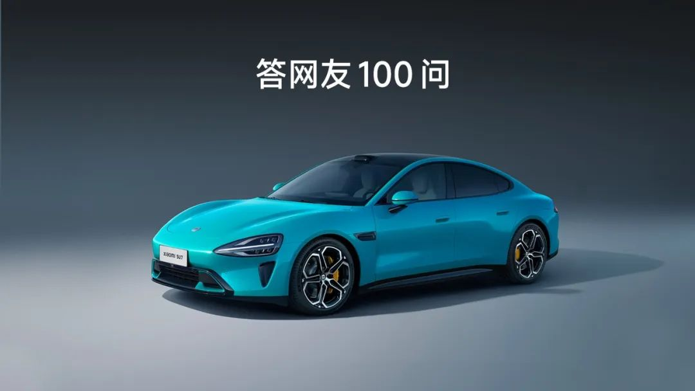

#  小米SU7答网友问（第三集）

[ 小米汽车 ](<javascript:void\(0\);>)

______

前两天我们就大家关心的问题

统一回答了前两集

[小米SU7答网友问（第一集）](<http://mp.weixin.qq.com/s?__biz=MzkyNzU3MDI3Nw==&mid=2247486958&idx=1&sn=fa1835ddd2eee3bdafefcad5b74d2d94&chksm=c2274de4f550c4f28c7b9e54f1a6a8bcacc3459e88bbe256c362a899a36ca32c80be4f87c45a&scene=21#wechat_redirect>)

[小米SU7答网友问（第二集）](<http://mp.weixin.qq.com/s?__biz=MzkyNzU3MDI3Nw==&mid=2247487024&idx=1&sn=0c7cfca4d7c560dedf8062fa3a7230e3&chksm=c2274e3af550c72cdf2c4b04f2e6f3f66f10eac3634f77346b68be322d895dfb1398978ccbcf&scene=21#wechat_redirect>)

今天，我们将继续回答大家关心的问题👇

  

## **01**

**小米SU7 创始版为什么会再次开售，以后还有吗？******

小米SU7 创始版定购过程中，我们识别、拦截了部分异常订单、黄牛订单，因此将开启第二轮惊喜追加开售。开售时间为4月1日 12:00。

本次开售定金20000元，下定即锁单，定金不可退。本轮定购，同样享受3月28日当晚一样的至高31000元豪华购车权益。同时已下定非创始版的用户，也可参加本轮开售，下定成功后，可将原有定单转为创始版，非创始版订单已锁单的用户，明日下定成功创始版，也可以转单。转单相关事宜将会有客服统一联系，您也可主动联系客服处理。可通过小米汽车APP和小程序定购。

小米SU7 创始版不会再开启新轮次的定购了，感谢大家的支持。

  

## **02**

**小米SU7 提供的各项质保，是否每次维修保养都一定去指定网点？**

我们强烈建议用户选择官方授权的服务中心进行车辆的维修保养。

车辆属于结构非常复杂的产品，智能轿车维修后也涉及多项软件适配刷写。官方授权服务中心配备了经过培训认证的专业技术人员，具有原厂配件供应保障、官方技术支持的优势，能够保障车辆维修品质，同时也避免非专业维修或非原厂配件导致的车辆扩损，从而影响质保权益兑现。

  

## **03**

**小米SU7 是否提供快速救援服务？**  

小米汽车为您提供了官方道路救援服务（中国境内，暂不包含中国香港特别行政区、中国澳门特别行政区及中国台湾地区）；在小米SU7的整车质保期内，如因车辆质量问题，致使车辆无法正常行驶，用户可通过小米汽车APP专属服务管家群或小米汽车APP 400一键拨号的方式联系线上服务中心，获得7*24小时的紧急救援服务。此外，购买了小米汽车官方用车服务包与保险产品的用户，还可免费享受7*24小时的事故类道路救援服务。

相关服务细则和服务产品信息，您可查询小米汽车官网或咨询小米汽车线上服务中心。

  

## **04**  

**对于内饰件(方向盘、坐垫)破损是否有快速上门维修服务？**

小米汽车为用户提供移动上门服务，满足用户对车辆的基础保养、偶发故障诊断排除和简易维修（轮胎修补/换新、门把手以及部分内饰件维修/更换）的服务需求。用户可通过小米汽车APP专属服务管家群或小米汽车APP 400一键拨号的方式联系线上服务中心发起相关服务需求。

移动上门服务首批开通29城，更多城市后续将逐步开通。

  

## **05**

**小米SU7的尾款什么时候开始支付？**

订单锁单后，交付会联系到用户，如果是全款用户，交付和用户确认订单信息后，小米汽车APP就会有支付尾款的界面出现。如果是金融贷款用户，会在金融审批通过后，小米汽车APP就会有支付尾款界面出现。

## **06**

**前挡风玻璃三层镀银，是否会影响透光率，或者影响ETC信号？**

三层镀银并不会影响前挡风的透光率。前挡风玻璃的透光率为71%，驾驶时人眼最适合的透光率在70至78%之间，透光率过高驾驶时反而会感到晃眼和眩光。

我们在前挡风玻璃ETC安装位做了除银工艺，完全不影响ETC的使用。

  

## **07******

**小米SU7做过哪些碰撞测试，成绩如何？**

首先，我们提前使用C-NCAP 2024版来设计产品，内部的碰撞测试超过40项，完全覆盖C-NCAP、C-IASI、E-NCAP三大标准，甚至，很多测试是超过这些标准的：

相对24版C-NCAP，正面碰撞要求56km/h，我们做到了64km/h，侧面碰撞要求60km/h,，我们做到了65km/h，侧柱碰要求主驾1个点位，我们在此基础上又做了主副驾及后排的80个点位，追尾后碰要求50km/h，我们做到了全球最高的90km/h 70%偏置碰撞。

正式的碰撞评级需要量产车，请大家关注小米SU7后续的实测表现。

  

## **08**

**小米SU7有没有外放电功能？******

有。小米SU7外放电的功能，配合米家车载便携充放电枪，既能充电也能放电，可以实现2.8kW的充电，3.5kW的220V对外放电，方便户外使用智能设备；同时，小米SU7本身还能支持6.6kW给别车充电的能力。

## **09******

**小米SU7有没有牵引资质？**

没有牵引资质。一般情况下，原厂拥有牵引力资质的一般都是SUV、皮卡等偏向越野户外使用的的车型，小米SU7定位是C级豪华科技轿车，所以没有这项资质，还望理解。

  

## **10**

**小米SU7 标准版和Pro是否可以选配官方HUD？**

目前小米SU7 Max标配 56英寸HUD，小米SU7标准版和Pro版暂不支持选装。

## **11**

**小爱同学语音支持多少种方言？**

目前暂时不支持方言，相关功能会在后续OTA中实现。

  

## **12**

**小米汽车APP具体有哪些车外控车功能？******

小米汽车APP支持丰富的车外控车功能，包括解锁/锁车、开关充电口、打开前/后备箱、远程启动、通风、闪灯、鸣笛等，同时还能查询车辆位置，并支持上车前提前打开空调、座椅加热及方向盘加热，还能远程开闭车载冰箱并调节温度。功能极其丰富，且反应非常快，欢迎大家买车后继续探索。

同时，还能授权分享车钥匙，亲友也能用。

  

## **13**

**小米SU7的中控屏三个版本配置一样吗？材质是LCD还是OLED？**  

小米SU7全系配备高素质LCD中控屏，16.1英寸超大尺寸、超窄边框设计，屏占比91.7%。同时3K分辨率精度极高，PPI达到211，画面显示细腻。而且屏幕最高亮度800nit，还能支持千级自动亮度调节。无论在尺寸、分辨率、显示精度还是屏占比方面，都在同级表现出色。

中控屏无论软件还是硬件均支持生态拓展。软件方面，16:10比例与小米Pad应用生态完美兼容，可支持更多平板应用上车。硬件方面，四周均有CarIoT生态拓展接口，可安装物理键盘、拾音氛围灯、智能双码表和无线充手机支架等。

## **14**

**后排拓展Pad是否限定型号，其他型号Pad什么时候能适配上车？**

后排拓展屏目前支持Xiaomi Pad与Apple iPad，需要搭配支架保护壳一起使用：

Xiaomi Pad：支持 Xiaomi Pad 6S Pro，其余Xiaomi Pad 仍在规划中，具体适配情况以未来公告为准。

Apple iPad：支持 iPad Pro 11英寸 第1-4代，以及 iPad Air 10.9英寸 第4/5代

  

## **15**

**后续是否有更多的CarIoT智能硬件配件？车内拓展pin口是否会向第三方开放？**

后续会我们会有更多更丰富的CarIoT配件上车，车内拓展pin口也将开放Xiaomi HyperOS Connect（小米澎湃智联）认证，全面拥抱三方开发者，欢迎大家共建智能空间生态。

## **16**

**小米SU7 Max的「漂移模式」使用场景有限制吗？**

我们诚恳地提醒大家，小米SU7 Max的动力充沛，是十足的“性能猛兽”，其配备的「漂移模式」更是针对具备专业驾驶经验的用户打造，非经专业训练的用户在人群密集的城市街道驾驶存在安全风险。如欲调整TC和ESC选项，强烈建议在专业封闭场地、由专业人士指导下使用。

  

  

预览时标签不可点

微信扫一扫  
关注该公众号

继续滑动看下一个

轻触阅读原文

小米汽车 

向上滑动看下一个

[知道了](<javascript:;>)

微信扫一扫  
使用小程序

****

[取消](<javascript:void\(0\);>) [允许](<javascript:void\(0\);>)

****

[取消](<javascript:void\(0\);>) [允许](<javascript:void\(0\);>)

****

[取消](<javascript:void\(0\);>) [允许](<javascript:void\(0\);>)

× 分析

__

微信扫一扫可打开此内容，  
使用完整服务

： ， ， ， ， ， ， ， ， ， ， ， ， 。 视频 小程序 赞 ，轻点两下取消赞 在看 ，轻点两下取消在看 分享 留言 收藏 听过