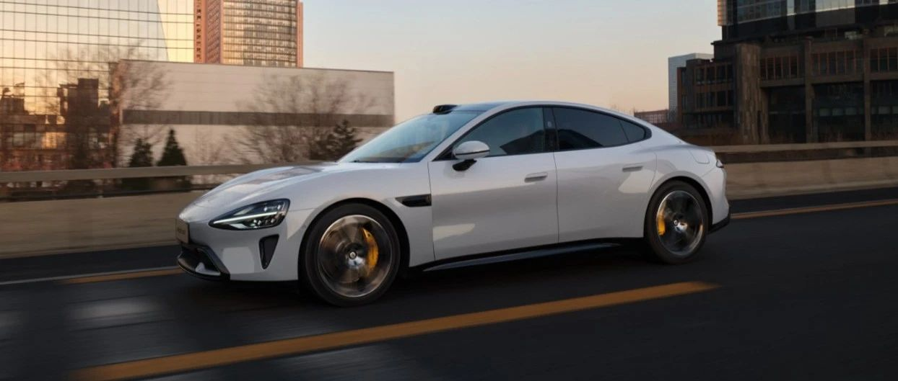

#  小米SU7答网友问（第六集）

[ 小米汽车 ](<javascript:void\(0\);>)

______

小米SU7答网友问  

持续进行中...

[小米SU7答网友问（第一集）](<http://mp.weixin.qq.com/s?__biz=MzkyNzU3MDI3Nw==&mid=2247486958&idx=1&sn=fa1835ddd2eee3bdafefcad5b74d2d94&chksm=c2274de4f550c4f28c7b9e54f1a6a8bcacc3459e88bbe256c362a899a36ca32c80be4f87c45a&scene=21#wechat_redirect>)

[小米SU7答网友问（第二集）](<http://mp.weixin.qq.com/s?__biz=MzkyNzU3MDI3Nw==&mid=2247487024&idx=1&sn=0c7cfca4d7c560dedf8062fa3a7230e3&chksm=c2274e3af550c72cdf2c4b04f2e6f3f66f10eac3634f77346b68be322d895dfb1398978ccbcf&scene=21#wechat_redirect>)

[小米SU7答网友问（第三集）](<http://mp.weixin.qq.com/s?__biz=MzkyNzU3MDI3Nw==&mid=2247487063&idx=2&sn=a0651af985a684e2379d3805947abc23&chksm=c2274e5df550c74b86d3871da393feb8fcadab0dfcdc8e77c806309341c89f1b37396b0e6318&scene=21#wechat_redirect>)

[小米SU7答网友问（第四集）](<http://mp.weixin.qq.com/s?__biz=MzkyNzU3MDI3Nw==&mid=2247487079&idx=1&sn=9cf62cd9e760babefdd444d29ee00b68&chksm=c2274e6df550c77b506f07fb315efff406bc12a55eba23c69b349cba973f61811d88fd0ade33&scene=21#wechat_redirect>)

[小米SU7答网友问（第五集）](<http://mp.weixin.qq.com/s?__biz=MzkyNzU3MDI3Nw==&mid=2247487101&idx=1&sn=9e00cc3239d1e6d9cb373f2efad42e3c&chksm=c2274e77f550c76157349d363d8e0c17ceadab29fae7538c156149e37c9c89e7cc22644201b2&scene=21#wechat_redirect>)

今天，针对金融相关等问题，为您解答👇

  

## **01**

## **小米汽车支持哪些支付方式？**

##   

## 定金部分，可以在小米汽车微信小程序中使用微信支付，也可以在小米汽车APP中使用“微信支付/支付宝支付/小米支付/云闪付”其中一种支付方式进行支付；尾款部分，可以选择在小米汽车APP中支付，也可以选择前往交付中心刷卡或扫码支付。  

如您希望通过银行转账或到店刷卡（借记卡）支付尾款，建议您准备好一张足够支付尾款资金的借记卡，并提前确认银行卡单日、单笔限额是否满足转账条件。

如您希望通过支付宝、微信支付 、小米支付、云闪付等方式在小米汽车APP中支付尾款，由于单一支付方式有限额，可以选择使用【分多次支付】进行组合付款（支持信用卡）。

  

## **02**

## **小米汽车有哪些官方合作的保险公司？**

##   

## 小米汽车与人保财险、平安财险、太平洋财险和阳光财险四家国内知名保险公司建立了官方合作，为小米车主提供专属的价格和理赔服务。

  

## **03**

**能否购车后自行选择其他保险公司投保？**

建议您提车前完成交强险投保，无交强险会影响临时牌照的办理，车辆无法行驶上路。您可以在线上投保时看到多家官方合作保司的报价，并自行选择意向保司。我们合作的保司报价与提供的服务基本一致，续保报案一站式智能操作！如果选择非官方合作保司，可能会产生理赔争议风险及不能原厂原配维修等情况。建议选择小米汽车保险服务，为您的每一次智驾出行保驾护航。

  

## **04**

## **金融贷款未通过的，可以退定金吗？**

##   

## 小米汽车金融服务官方合作机构有建设银行、中信银行、平安银行、招商银行等主流商业银行，同时也有华晨东亚汽车金融有限公司、江苏金融租赁股份有限公司，我们可提供多种适配不同类型客户的金融产品；如您对分期审核是否能通过存有顾虑，可以提前咨询门店产品专家，使用金融“测一测”后，再根据结果确定是否进行锁单，锁单前定金自主可退，锁单后不可退定金。

  

## **05**

## **为什么APP里购买配件还区分创始版和非创始版，不是通用的吗？**

##   

## 目前小米SU7和小米SU7创始版选装配件是通用的，「适配车型」是为了未来更多车型选择的菜单设置。

  

## **06**

**家用充电桩是否已经可以下单安装，物业需要提供的材料会有专员协助准备吗？**

在选购家充桩后，会有工程师联系您，预约您的时间进行上门勘测。您有任何的疑问，都可以与产品专家沟通，他们会协助您准备材料。

  

## **07**

## **后续车辆维保只能去各城市的交付中心吗？**

##   

## 2024年，小米汽车将逐步建设约130个官方服务中心，逐渐覆盖60~80个城市，保障用户用车出行；其中一部分服务中心与交付中心在同一地理位置；

如有维保需求，用户可根据自己的习惯，通过APP预约、APP专属服务管家群聊天、拨打400服务热线这三种方式，随时发起维保需求；线上服务中心将根据您的地理位置和门店经营情况，择派最便捷、最高效的服务中心为您提供车辆维保服务；

用户也可以在地图上搜索到已开业的小米官方服务中心的位置，选择任何一家服务中心，直接驾车进店对车辆进行维修和保养。

  

## **08**

## **小米汽车惠享服务包价格多少，什么途径购买？**

##   

##  小米汽车惠享服务包将在6月正式对用户开放订购，届时车主用户可通过手机APP商城订购。我们将通过服务包为小米汽车的用户提供更多体验好、性价比高的服务权益和服务体验，请您随时关注小米汽车APP。  

  

## **09**

## **Max版能否自行分配前后动力？能调成一个纯后驱车型，来提升续航里程吗？**

##   

##  在小米SU7自定义模式中，提供多达100档的前后驱动分配比例个性调节功能，用户可以根据驾驶需要选择前后不同驱动分配比例，实现前驱/四驱/后驱的不同驾驶体验。  

小米SU7在“M1经济模式”下，优先使用永磁同步电机进行后轮驱动，配合整车最优的能量管理策略，可以带来更优秀的能耗表现。同时，前电机在有动力需求时，也会进行动态扭矩补偿。

凭借“M1经济模式”的优异表现，小米SU7 Max 搭配19英寸米其林e primacy轮胎，即可实现810KM（CLTC工况）的强大续航能力。

  

## **10**

**这两天，网上曝出试驾车座椅有污损的现象，这是怎么回事？**

在当前远超预期的超大试驾客流高峰下，不少门店单日近10000人次来访。我们无法确认，在如此高强度、高频次的试乘过程中，是否有硬物对座椅皮质刮擦或是不当处理导致表面破损。另一方面，每台试驾车的乘坐人次、强度，也远超正常使用场景。我们将进一步提升我们的门店服务能力，提高试驾车清洁整备保障。

更重要的是，小米SU7座椅随整车质保（具体质保内容详见用户手册质量担保服务章节），请大家放心。

  

## **11**

**没有门店的城市是否会有巡展计划，让更多人能看到小米SU7？**

当前为产品上市首销期，用户热情高涨，我们专注在首批销售城市为大家提供好的服务。首销期之后，会根据市场情况制定其他区域的巡展计划。

  

  

预览时标签不可点

微信扫一扫  
关注该公众号

继续滑动看下一个

轻触阅读原文

小米汽车 

向上滑动看下一个

[知道了](<javascript:;>)

微信扫一扫  
使用小程序

****

[取消](<javascript:void\(0\);>) [允许](<javascript:void\(0\);>)

****

[取消](<javascript:void\(0\);>) [允许](<javascript:void\(0\);>)

****

[取消](<javascript:void\(0\);>) [允许](<javascript:void\(0\);>)

× 分析

__

微信扫一扫可打开此内容，  
使用完整服务

： ， ， ， ， ， ， ， ， ， ， ， ， 。 视频 小程序 赞 ，轻点两下取消赞 在看 ，轻点两下取消在看 分享 留言 收藏 听过