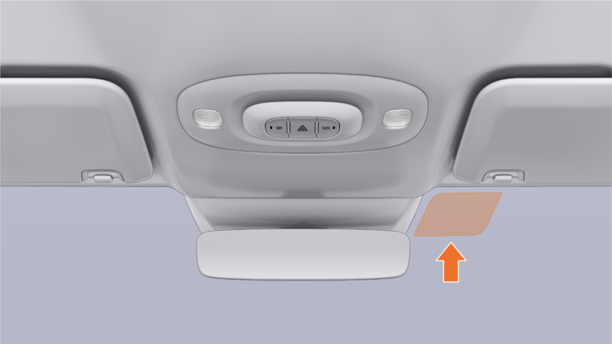

#  小米SU7答网友问（第十八集）

[ 小米汽车 ](<javascript:void\(0\);>)

______

小米SU7答网友问  

持续进行中...

[小米SU7答网友问（第一集）](<http://mp.weixin.qq.com/s?__biz=MzkyNzU3MDI3Nw==&mid=2247486958&idx=1&sn=fa1835ddd2eee3bdafefcad5b74d2d94&chksm=c2274de4f550c4f28c7b9e54f1a6a8bcacc3459e88bbe256c362a899a36ca32c80be4f87c45a&scene=21#wechat_redirect>)

[小米SU7答网友问（第二集）](<http://mp.weixin.qq.com/s?__biz=MzkyNzU3MDI3Nw==&mid=2247487024&idx=1&sn=0c7cfca4d7c560dedf8062fa3a7230e3&chksm=c2274e3af550c72cdf2c4b04f2e6f3f66f10eac3634f77346b68be322d895dfb1398978ccbcf&scene=21#wechat_redirect>)

[小米SU7答网友问（第三集）](<http://mp.weixin.qq.com/s?__biz=MzkyNzU3MDI3Nw==&mid=2247487063&idx=2&sn=a0651af985a684e2379d3805947abc23&chksm=c2274e5df550c74b86d3871da393feb8fcadab0dfcdc8e77c806309341c89f1b37396b0e6318&scene=21#wechat_redirect>)

[小米SU7答网友问（第四集）](<http://mp.weixin.qq.com/s?__biz=MzkyNzU3MDI3Nw==&mid=2247487079&idx=1&sn=9cf62cd9e760babefdd444d29ee00b68&chksm=c2274e6df550c77b506f07fb315efff406bc12a55eba23c69b349cba973f61811d88fd0ade33&scene=21#wechat_redirect>)

[小米SU7答网友问（第五集）](<http://mp.weixin.qq.com/s?__biz=MzkyNzU3MDI3Nw==&mid=2247487101&idx=1&sn=9e00cc3239d1e6d9cb373f2efad42e3c&chksm=c2274e77f550c76157349d363d8e0c17ceadab29fae7538c156149e37c9c89e7cc22644201b2&scene=21#wechat_redirect>)

[小米SU7答网友问（第六集）](<http://mp.weixin.qq.com/s?__biz=MzkyNzU3MDI3Nw==&mid=2247487835&idx=2&sn=30cf8170af01397c46dc34cf495f7c02&chksm=c2275151f550d847fcc5d8d333c20a5d27d60276888d7192f51064f53e6fa738e21bf375ef29&scene=21#wechat_redirect>)

[小米SU7答网友问（第七集）](<http://mp.weixin.qq.com/s?__biz=MzkyNzU3MDI3Nw==&mid=2247487849&idx=1&sn=45b7ceae12489188c167129f3fb8b1a6&chksm=c2275163f550d87500cbacfac5ee05ea1b5083b97beb0d16e375b98480c98c823fbfdcc4d45a&scene=21#wechat_redirect>)

[小米SU7答网友问（第八集）](<http://mp.weixin.qq.com/s?__biz=MzkyNzU3MDI3Nw==&mid=2247487860&idx=1&sn=337ffc5a7972e5758d3208fb1eb7a28d&chksm=c227517ef550d86838d64b08036486d07a6ea303f0f8e2e9bb93b097750beeb6b2649b692ede&scene=21#wechat_redirect>)

[小米SU7答网友问（第九集）](<http://mp.weixin.qq.com/s?__biz=MzkyNzU3MDI3Nw==&mid=2247487868&idx=1&sn=8021638c108d845fab76580a6cc405e9&chksm=c2275176f550d86086dc3bcdbc3b4cf518b1ba41a294c3ad5d39504791907edcc6422b015131&scene=21#wechat_redirect>)

[小米SU7答网友问（第十集）](<http://mp.weixin.qq.com/s?__biz=MzkyNzU3MDI3Nw==&mid=2247487890&idx=1&sn=47696df25bbc82e7c5aea71ccd30030e&chksm=c2275198f550d88e577cf942e5f0b4a7a6a21cc2cec4b0f04562b6acaa878177be8d8f2507b9&scene=21#wechat_redirect>)

[小米SU7答网友问（第十一集）](<http://mp.weixin.qq.com/s?__biz=MzkyNzU3MDI3Nw==&mid=2247487900&idx=1&sn=7765954b27cc8772008540f91ca7224d&chksm=c2275196f550d8807e8be4cee38e091559c454cfc8bed3e843d4e425f4b002ee0cb931c883d8&scene=21#wechat_redirect>)

[小米SU7答网友问（第十二集）](<http://mp.weixin.qq.com/s?__biz=MzkyNzU3MDI3Nw==&mid=2247487915&idx=1&sn=abbebbb9cbe0668b66a9c1026b12932f&chksm=c22751a1f550d8b73c8ad64a95a0158ef65c19c0becad656d616125a396dc6b4c6703e97f967&scene=21#wechat_redirect>)

[小米SU7答网友问（第十三集）](<http://mp.weixin.qq.com/s?__biz=MzkyNzU3MDI3Nw==&mid=2247487947&idx=1&sn=f544e6be6fd1221b57e5123f58c1f72c&chksm=c22751c1f550d8d76cf64deaaaf06423ad37525bfbda26eb8e1d0a5952a5b1ae30188c90c2c4&scene=21#wechat_redirect>)

[小米SU7答网友问（第十四集）](<http://mp.weixin.qq.com/s?__biz=MzkyNzU3MDI3Nw==&mid=2247487955&idx=1&sn=ee2a1734fe86b15000822bee9ae0ffd2&chksm=c22751d9f550d8cfdb48ae0c890173e37f66356ad6316e9ada00ee7c231d0772ee6e4c817c65&scene=21#wechat_redirect>)

[小米SU7答网友问（第十五集）](<http://mp.weixin.qq.com/s?__biz=MzkyNzU3MDI3Nw==&mid=2247487979&idx=1&sn=ab9d29fdf3c1147cd9c500ac5fafedde&chksm=c22751e1f550d8f725f7b294d004e04caa682567387ee5ee39a067fad1859fcaca2e68748e6f&scene=21#wechat_redirect>)

[小米SU7答网友问（第十六集）](<http://mp.weixin.qq.com/s?__biz=MzkyNzU3MDI3Nw==&mid=2247488003&idx=1&sn=9ed994132d197917e93f91b9f332e8d1&chksm=c2275209f550db1fe70c13abc492f5c01be8e5b5b81fba7379fe76c52c5256038eb4d6080ce6&scene=21#wechat_redirect>)

[小米SU7答网友问（第十七集）](<http://mp.weixin.qq.com/s?__biz=MzkyNzU3MDI3Nw==&mid=2247488035&idx=1&sn=fcfdeca83d7ca7c13e84b84a92146ed0&chksm=c2275229f550db3f3019dfe29d896a4c7c49a61351dd801e7b3520c9174e26ce040555c9756a&scene=21#wechat_redirect>)

  

## **01**

**安装ETC有什么注意事项吗？是否有预留的固定区域？**

小米SU7采用三层镀银前风挡，能实现99.5%的紫外线隔绝率、97.6%的红外线隔绝率，既保证了合适的透光率，又能做到防晒隔热。

为保证ETC正常使用，前风挡玻璃特意在如图位置做了除银工艺，不必担心三层镀银影响信号。可采用粘贴的方式将ETC安装于该区域，完全不影响ETC的使用（肉眼观察，该区域有网格）。

  

## **02**

**能否在提车前安装充电桩，需要准备什么资料？**

您可以在提车前安装充电桩。各个地区安装充电桩所需资料可能存在差异，需以当地要求为准，您可联系您的产品专家/服务工程师协助。如需电力报装，需向供电局提供购车协议、车位产权证明/租赁合同、身份证等资料。如物业需要施工单位提供相应资质，可提供安装资质证书、营业执照、施工人员电工证等资料。

  

## **03**

**小米家充桩宣传支持自动开盖，需要如何设置呢？**

小米SU7为用户提供了便捷的充电盖开启方式，米家充电桩拥有联动小米SU7自动开盖功能，当用户开启车机蓝牙后，充电桩将通过蓝牙自动与车机同步。当用户按下充电枪拔取按键后，充电口盖将自动打开。

但实现此功能需要保证车辆处于P挡状态，且充电桩处于通电状态，也需要确认小米汽车的蓝牙功能处于打开状态。车机蓝牙关闭，会造成与充电桩蓝牙加密交互失败，车辆充电口盖无法自动打开。

  

## **04**

**如何确保车机账号的无感登录正常工作？**

小米SU7支持车机账号的无感登录，即当您使用带有您账号信息的钥匙解锁车辆时，车机会自动登录您的账号，便捷无感。

为了给您更好的使用体验，以下三点注意事项建议车主朋友们关注：

  * 首次无感登录时，会出现扫码登录弹窗，完成一次扫码安全验证后，后续使用带有账号信息的钥匙解锁车辆，即可无感登录对应的账号。

  * 手机蓝牙钥匙默认带有账号信息，而实体遥控钥匙和随车附赠的卡片钥匙，为防止隐私泄漏，默认不绑定任何账号信息。

  * 若您同时携带了手机蓝牙钥匙和实体遥控钥匙，实体钥匙可能优先感应解锁。此时，如果实体钥匙未绑定账号，会导致无感登录失败。如需绑定，可打开小米汽车APP，进入“车辆-钥匙与安全-我的钥匙”，根据指引进行账号绑定。

## **05**

**全国地市级维保服务门店什么时候能铺开，有没有计划公开？**

售后服务中心的网络布局，会分批次逐步拓展开业，预计到今年年底逐步实现全国约80城的服务网络覆盖，以保障用户用车出行。

  

## **06**

**怎么更改交付地区以及上牌城市？**

交付与您首次联系确认订单信息时，可以协助您修改交付城市和上牌城市，确认后无法再修改。

  

## **07**

**为什么Max版20英寸轮毂选配价格6000元，标准和Pro版要8000元？**

小米SU7 标准版和Pro版升级20寸梅花轮毂还会同步升级Brembo四活塞固定卡钳+打孔通风盘，而Max版标配Brembo四活塞固定卡钳+打孔通风盘。因此，同样是升级至20寸梅花轮毂，标准版、Pro版与Max版的价差不同。

今年4月30日前下定小米SU7 Max，我们会限时免费升级20寸梅花轮毂。

  

## **08**

**Boost模式在任何驾驶模式下都能打开吗？新手、舒适等基础模式下能不能用？**

Boost模式在舒适、运动、运动+、个性化M1、个性化M2所有驾驶模式下均可激活。

弹射起步会自动激活电机Boost功能；所以对于小米SU7 Max而言，使用运动+模式、开启弹射起步可实现最快的加速能力；对于小米SU7、小米SU7 Pro而言，使用运动模式、开启弹射起步可实现最快的加速能力（小米SU7、小米SU7 Pro为两驱车型，无运动+模式）。

对于中途加速而言，您也可以使用Boost模式，从而获得更快的加速能力。

关于Boost模式具体注意事项，详见用户手册。

  

## **09**

**智能双表盘怎么调整显示内容？**

您可以在中控屏“设置-智能设备”中找到智能双表盘；或者从中控屏主驾侧下滑进入快控，点击“米家-车载设备”，进入智能双表盘设置界面；您也可以直接对小爱同学说“将左边码表设置为车速”等。

进入智能双表盘设置界面后，您可以为左右双表盘设置时钟、车速、本次行程、G值、指南针信息。后续我们也将通过OTA升级的形式为大家带来更丰富的显示内容及玩法，敬请期待。

  

## **10**

**车辆状态提醒能否不发短信，仅在APP层面？**

小米SU7会时刻守护您的车辆，当车辆触发哨兵监控事件、离车门窗未关未锁、充电状态变化、胎压异常等特殊情况时，会通过小米汽车APP给您推送相应的提醒。

但如果用户收不到小米汽车APP的推送（比如卸载小米汽车APP或将其通知关闭），我们会为用户补发短信，以确保必要的车辆状态信息通知到位。

  

## **11**

**小米SU7夏天车里面真的不热么？**

小米SU7相对来说更防晒隔热，能在同样的日晒环境中提供更为舒适的体验。当然，长时间暴晒后还是需要提前开空调。

首先，小米SU7拥有着**双层镀银** 的超大天幕玻璃，可以更好地反射太阳光，达到防晒隔热的效果。紫外线隔绝率达到99.9%，红外线隔绝率达到了99.1%，且透光率也做的很好，坐在车内不晒的同时，透光性也相当优秀。

前风挡玻璃的防晒体验更为突出，很多女生夏天开车的时候，为了防晒都带上了冰袖。为了解决这个痛点，我们采用了**三层镀银** 前风挡玻璃，我们也是目前轿车中唯一采用这一工艺和体验的。三层镀银的前风挡玻璃，紫外线隔绝率达到了99.5%，红外线隔绝率97.6%，让车内的整体温度可以较大幅度下降。

这些都还不够，小米SU7的四门车窗玻璃均采用了**UV-IR涂层技术** ，让四门车窗的紫外线隔绝率同样达到了99.9%。整车的防晒隔热能力都达到了行业领先水平，方方面面满足你的防晒需求。

我们的工程师在实验室做了测试，在38℃光照下**暴晒90分钟** 之后，小米SU7的车内温度要比友商整整低了**12℃** 。如此有效的隔热能力，让车辆在夏天暴晒后，座舱不再热浪袭人。

虽然温度相对较低，但是长时间剧烈暴晒后的座舱仍然不适合马上乘坐，大家可以通过小米汽车APP或小爱音响提前打开空调，配合优秀的空调能够更快速制冷降温，在炎炎夏日也能一上车就享受到更舒适的座舱体验。

预览时标签不可点

微信扫一扫  
关注该公众号

继续滑动看下一个

轻触阅读原文

小米汽车 

向上滑动看下一个

[知道了](<javascript:;>)

微信扫一扫  
使用小程序

****

[取消](<javascript:void\(0\);>) [允许](<javascript:void\(0\);>)

****

[取消](<javascript:void\(0\);>) [允许](<javascript:void\(0\);>)

****

[取消](<javascript:void\(0\);>) [允许](<javascript:void\(0\);>)

× 分析

__

微信扫一扫可打开此内容，  
使用完整服务

： ， ， ， ， ， ， ， ， ， ， ， ， 。 视频 小程序 赞 ，轻点两下取消赞 在看 ，轻点两下取消在看 分享 留言 收藏 听过