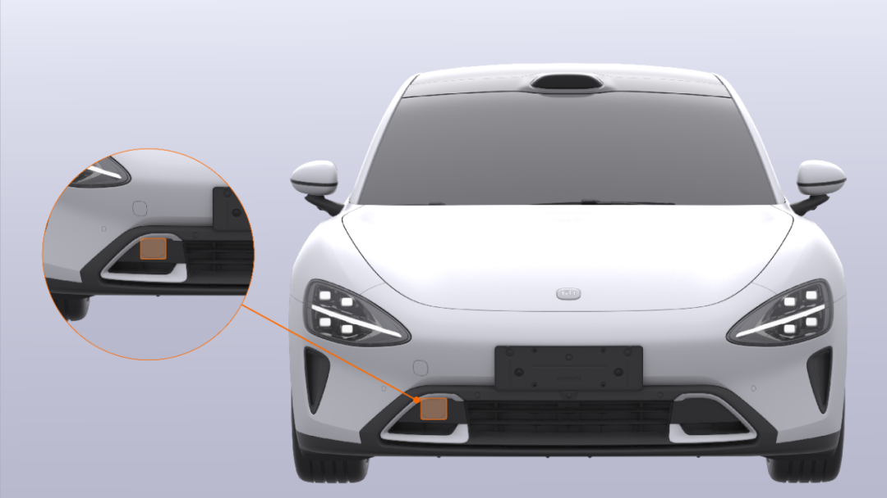
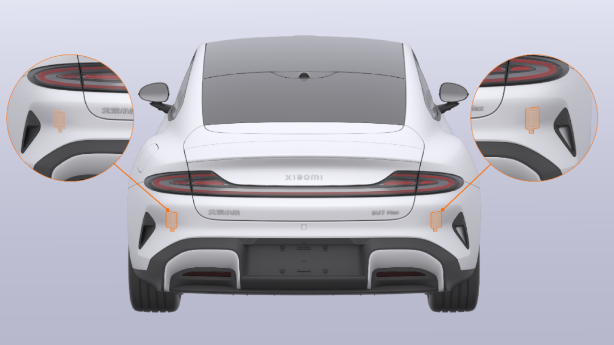
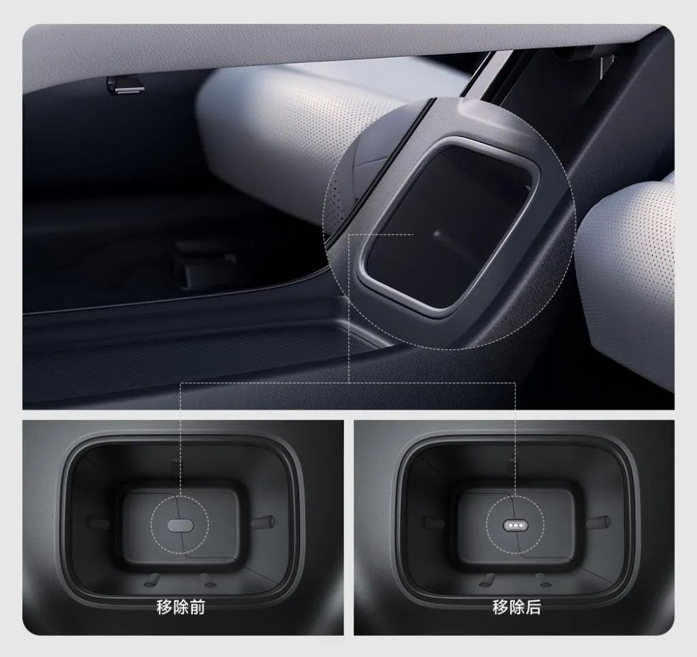
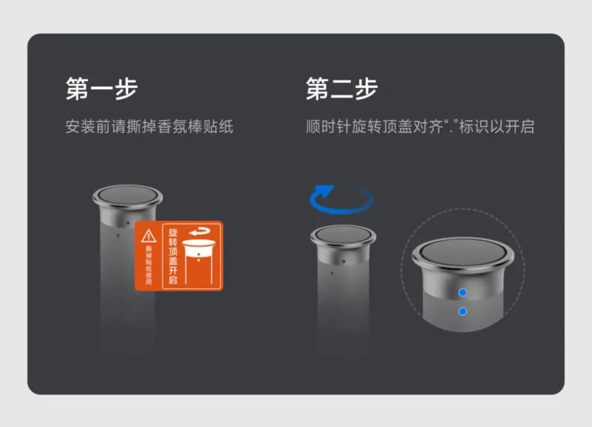
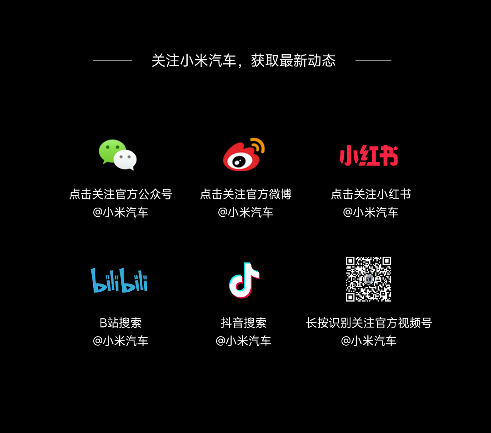

#  小米SU7答网友问（第二十一集）

[ 小米汽车 ](<javascript:void\(0\);>)

______

小米SU7答网友问  

持续进行中...

[小米SU7答网友问（第一集）](<http://mp.weixin.qq.com/s?__biz=MzkyNzU3MDI3Nw==&mid=2247486958&idx=1&sn=fa1835ddd2eee3bdafefcad5b74d2d94&chksm=c2274de4f550c4f28c7b9e54f1a6a8bcacc3459e88bbe256c362a899a36ca32c80be4f87c45a&scene=21#wechat_redirect>)

[小米SU7答网友问（第二集）](<http://mp.weixin.qq.com/s?__biz=MzkyNzU3MDI3Nw==&mid=2247487024&idx=1&sn=0c7cfca4d7c560dedf8062fa3a7230e3&chksm=c2274e3af550c72cdf2c4b04f2e6f3f66f10eac3634f77346b68be322d895dfb1398978ccbcf&scene=21#wechat_redirect>)

[小米SU7答网友问（第三集）](<http://mp.weixin.qq.com/s?__biz=MzkyNzU3MDI3Nw==&mid=2247487063&idx=2&sn=a0651af985a684e2379d3805947abc23&chksm=c2274e5df550c74b86d3871da393feb8fcadab0dfcdc8e77c806309341c89f1b37396b0e6318&scene=21#wechat_redirect>)

[小米SU7答网友问（第四集）](<http://mp.weixin.qq.com/s?__biz=MzkyNzU3MDI3Nw==&mid=2247487079&idx=1&sn=9cf62cd9e760babefdd444d29ee00b68&chksm=c2274e6df550c77b506f07fb315efff406bc12a55eba23c69b349cba973f61811d88fd0ade33&scene=21#wechat_redirect>)

[小米SU7答网友问（第五集）](<http://mp.weixin.qq.com/s?__biz=MzkyNzU3MDI3Nw==&mid=2247487101&idx=1&sn=9e00cc3239d1e6d9cb373f2efad42e3c&chksm=c2274e77f550c76157349d363d8e0c17ceadab29fae7538c156149e37c9c89e7cc22644201b2&scene=21#wechat_redirect>)

[小米SU7答网友问（第六集）](<http://mp.weixin.qq.com/s?__biz=MzkyNzU3MDI3Nw==&mid=2247487835&idx=2&sn=30cf8170af01397c46dc34cf495f7c02&chksm=c2275151f550d847fcc5d8d333c20a5d27d60276888d7192f51064f53e6fa738e21bf375ef29&scene=21#wechat_redirect>)

[小米SU7答网友问（第七集）](<http://mp.weixin.qq.com/s?__biz=MzkyNzU3MDI3Nw==&mid=2247487849&idx=1&sn=45b7ceae12489188c167129f3fb8b1a6&chksm=c2275163f550d87500cbacfac5ee05ea1b5083b97beb0d16e375b98480c98c823fbfdcc4d45a&scene=21#wechat_redirect>)

[小米SU7答网友问（第八集）](<http://mp.weixin.qq.com/s?__biz=MzkyNzU3MDI3Nw==&mid=2247487860&idx=1&sn=337ffc5a7972e5758d3208fb1eb7a28d&chksm=c227517ef550d86838d64b08036486d07a6ea303f0f8e2e9bb93b097750beeb6b2649b692ede&scene=21#wechat_redirect>)

[小米SU7答网友问（第九集）](<http://mp.weixin.qq.com/s?__biz=MzkyNzU3MDI3Nw==&mid=2247487868&idx=1&sn=8021638c108d845fab76580a6cc405e9&chksm=c2275176f550d86086dc3bcdbc3b4cf518b1ba41a294c3ad5d39504791907edcc6422b015131&scene=21#wechat_redirect>)

[小米SU7答网友问（第十集）](<http://mp.weixin.qq.com/s?__biz=MzkyNzU3MDI3Nw==&mid=2247487890&idx=1&sn=47696df25bbc82e7c5aea71ccd30030e&chksm=c2275198f550d88e577cf942e5f0b4a7a6a21cc2cec4b0f04562b6acaa878177be8d8f2507b9&scene=21#wechat_redirect>)

[小米SU7答网友问（第十一集）](<http://mp.weixin.qq.com/s?__biz=MzkyNzU3MDI3Nw==&mid=2247487900&idx=1&sn=7765954b27cc8772008540f91ca7224d&chksm=c2275196f550d8807e8be4cee38e091559c454cfc8bed3e843d4e425f4b002ee0cb931c883d8&scene=21#wechat_redirect>)

[小米SU7答网友问（第十二集）](<http://mp.weixin.qq.com/s?__biz=MzkyNzU3MDI3Nw==&mid=2247487915&idx=1&sn=abbebbb9cbe0668b66a9c1026b12932f&chksm=c22751a1f550d8b73c8ad64a95a0158ef65c19c0becad656d616125a396dc6b4c6703e97f967&scene=21#wechat_redirect>)

[小米SU7答网友问（第十三集）](<http://mp.weixin.qq.com/s?__biz=MzkyNzU3MDI3Nw==&mid=2247487947&idx=1&sn=f544e6be6fd1221b57e5123f58c1f72c&chksm=c22751c1f550d8d76cf64deaaaf06423ad37525bfbda26eb8e1d0a5952a5b1ae30188c90c2c4&scene=21#wechat_redirect>)

[小米SU7答网友问（第十四集）](<http://mp.weixin.qq.com/s?__biz=MzkyNzU3MDI3Nw==&mid=2247487955&idx=1&sn=ee2a1734fe86b15000822bee9ae0ffd2&chksm=c22751d9f550d8cfdb48ae0c890173e37f66356ad6316e9ada00ee7c231d0772ee6e4c817c65&scene=21#wechat_redirect>)

[小米SU7答网友问（第十五集）](<http://mp.weixin.qq.com/s?__biz=MzkyNzU3MDI3Nw==&mid=2247487979&idx=1&sn=ab9d29fdf3c1147cd9c500ac5fafedde&chksm=c22751e1f550d8f725f7b294d004e04caa682567387ee5ee39a067fad1859fcaca2e68748e6f&scene=21#wechat_redirect>)

[小米SU7答网友问（第十六集）](<http://mp.weixin.qq.com/s?__biz=MzkyNzU3MDI3Nw==&mid=2247488003&idx=1&sn=9ed994132d197917e93f91b9f332e8d1&chksm=c2275209f550db1fe70c13abc492f5c01be8e5b5b81fba7379fe76c52c5256038eb4d6080ce6&scene=21#wechat_redirect>)

[小米SU7答网友问（第十七集）](<http://mp.weixin.qq.com/s?__biz=MzkyNzU3MDI3Nw==&mid=2247488035&idx=1&sn=fcfdeca83d7ca7c13e84b84a92146ed0&chksm=c2275229f550db3f3019dfe29d896a4c7c49a61351dd801e7b3520c9174e26ce040555c9756a&scene=21#wechat_redirect>)

[小米SU7答网友问（第十八集）](<http://mp.weixin.qq.com/s?__biz=MzkyNzU3MDI3Nw==&mid=2247488044&idx=1&sn=15e0313c7b352da563c38d6b64e5cb27&chksm=c2275226f550db303d96d77050e8fe6c21f6c0fd9453e84d129f29cd0024fcf7dd5d0cab4ec8&scene=21#wechat_redirect>)

[小米SU7答网友问（第十九集）](<http://mp.weixin.qq.com/s?__biz=MzkyNzU3MDI3Nw==&mid=2247488049&idx=1&sn=20d5d20c485040ccd9bbe1100ad0dd18&chksm=c227523bf550db2d8d6d7bb477f3f83742d63b451060848150a41d9bf819ff812b73c67add01&scene=21#wechat_redirect>)

[小米SU7答网友问（第二十集）](<http://mp.weixin.qq.com/s?__biz=MzkyNzU3MDI3Nw==&mid=2247488056&idx=1&sn=efcffc7ee04fad7bcb74c548c6941929&chksm=c2275232f550db24c3c6d404748637a9d2a1e60c653ddbf9ddafdc767e79454a3602f3d0ef1c&scene=21#wechat_redirect>)

## **01**

**提车后去贴隐形车衣，毫米波雷达、超声波雷达等传感器是否能够装贴，以及哪些部分不适合贴？**

隐形车衣装贴时，还请留心避开车辆雷达安装区域，以免影响与之相关的功能正常使用。其中，激光雷达（数量1个，仅小米SU7 Pro/Max搭载）安装在车辆前风挡顶部，超声波雷达（数量12个） 安装在前后保险杠区域，前毫米波雷达（数量1个）安装在前保险杠右侧内部，后角毫米波雷达（数量2个，仅小米SU7 Pro/Max搭载） 安装在后保险杠两侧内部。

由于毫米波雷达安装位置不可见，可参考如下示意图，在车衣装饰作业时避开对应的区域。

  

## **02**

**提车前能否提前学习智驾，以便提车后可以节约时间？**

为了节约用户提车时间，当车辆到店后，我们的交付预约专员会将智驾学堂学习及考试路径推送给用户。获得推送后，登录车主账号，点击小米汽车APP，“我的→右上角扫描下方二维码”，用户即可进行智驾学堂的学习及考试。

当通过相应功能课程的考试后，即可开启相应功能的智驾体验。

  

## **03**

**为什么有时候充电功率不够高，达不到峰值？**

小米SU7接入充电枪开始充电时，电池的起始电量和温度都会影响充电功率。充电过程中，电芯温度会稳步上升，若起初电芯温度过低，功率无法达到峰值；并且随着电量逐渐充满，也会使得充电功率降低。这些是电池管理系统的智能化充电策略，能够让电芯充电更安全、使用寿命更长。

使用车载地图导航至充电站时，车辆将预热电池以提升充电速率，保证电池在充电时，更快地达到最佳的功率状态。

同时，小米SU7 Max版的电池管理系统具备“原子化充电技术”，能够提供最高50倍的充电颗粒度去适应不同的温度和电量，充电时间最快可提速9.8%，平均充电功率最多可提升11kW。

  

## **04**

**网上有传闻称，小米智驾中低阶方案会采用三方竞标的方式，这是真的吗？**

完全是谣言。小米智驾采用全栈自研技术架构，包含了道路大模型、超分占用网络、变焦BEV等领先算法的先进架构，其中超分占用网络，还在2024年初被计算机视觉领域国际顶级学术会议CVPR收录，小米智驾核心算法的创新性获得国内外专业领域的一致认可。

小米智驾共有两套方案，包括Xiaomi Pilot Pro和Xiaomi Pilot Max，并且两个方案技术同源，且全部基于小米自研的智驾技术，全部支持体验领先的智能辅助驾驶功能。

智能驾驶是智能电动汽车的核心技术赛道，我们充满敬畏并认为意义深远，从立项之初就坚持全自研方案，也请大家切勿传播不实言论。

  

## **05**

**百变中控台的智能香氛如何安装、如何连接车机？**

非常感谢您选购「智能香氛机套装」，为了给您更好的使用体验，如下安装及连接有关的注意事项，还请您关注：

关于安装：

  * 位于小米SU7百变中控台底部的储物格，既可用于收纳存储，也可秒变「智能香氛机套装」、「对讲机充电座」、「户外蓝牙音箱」等车载智能设备的收纳位。您可非常方便地将香氛机安放于此。

  * 在将香氛机放入储物格之前，请先确保移除储物格底部的黑色硅胶塞，以露出Pin点，供香氛机与车机连接。

  * 安装香氛棒也请特别注意，第一步先撕掉香氛棒贴纸、第二步顺时针旋转顶盖对齐“·”标识，最后再依次将香氛棒插入香氛机内。

  

关于连接：

  * 连接香氛机之前，请先确保车机已登录车主账号，再进行连接操作。

  * 当您首次将香氛机放入储物格时（请确保储物格底部硅胶塞被移除），车机会自动弹出连接窗口，您根据提示进行连接即可。

  * 如果没有自动弹出连接窗口，可从中控屏左侧顶部下滑进入快控，点击“米家”-“车载设备”；或进入“设置”-“智能设备”-“打开智能设备应用”-“车载设备”。然后点击“添加设备”，根据提示进行连接即可。

  * 如果香氛机设备发生连接异常，您可先移除设备（在车载设备页面长按图片删除设备），再尝试重置香氛机进行重新配网连接（长按香氛机顶部复位键7秒以上，当橙灯闪烁时进入配网模式）。

  

## **06**

**手机蓝牙钥匙为什么会有无法自动解锁的情况？APP应该如何正确设置？**

受限于各家手机品牌的内存限制及性能策略，小米汽车APP进程可能被系统结束运行，导致手机蓝牙钥匙自动解锁失败。为了减少此类失败情况发生，在您正确激活启用手机蓝牙钥匙之后，可参照如下步骤进行手机相关设置：

苹果手机：

  * 将手机蓝牙功能始终保持开启状态；

  * 在“设置”-“小米汽车APP”中，授权小米汽车APP始终允许访问位置信息，并保持精确位置开启；

  * 小米汽车APP后台刷新功能保持打开。

小米及其他Android手机：

  * 将手机蓝牙功能始终保持开启状态；

  * 授权小米汽车APP始终允许定位权限；

  * 授权小米汽车APP自启动权限；

  * 将省电策略设置为无限制，并将小米汽车APP锁定在后台。

## **07**

**使用NFC卡片车钥匙，有什么注意事项吗？**

NFC卡片钥匙非常便于携带，如一张银行卡般轻薄易携带。卡片钥匙可实现车辆解闭锁等功能，只需将NFC卡片钥匙贴在主驾驶B柱的NFC钥匙感应区域，片刻停留即可轻松完成自动解锁或闭锁的操作。

但也提醒一下，如携带了有效的蓝牙钥匙远离车辆时，即使NFC卡片钥匙遗落在车内，也会正常执行闭锁操作。所以NFC卡片钥匙作为车辆权限管理的关键物品，还请务必随身携带。

同时，NFC卡片请勿弯折、扭曲、剪切，同时避免将卡片长期置于高温环境或接触高温电器件等，以上操作都可能造成卡片钥匙失效。在使用手机无线充电功能时，也请勿将NFC卡片钥匙置于无线充电板感应区域。

  

## **08**

**主驾如何保存座椅记忆设置？一共可以存多少个挡位？**

主驾座椅位置和其他一系列车辆设置内容，均保存在驾驶员账户下的“用车习惯”中。您可以通过点击头像进入个人中心，新建和管理不同的用车习惯，每个用户可以最多拥有10组用车习惯。

我们同时为副驾座椅提供了3个位置记忆，副驾驶乘客也可以享受个性便利的乘坐体验。

  

## **09**

**后续支持更换轮毂，需要注意什么？**

不同版本的小米SU7适配不同款型的轮毂，用户可以在购车下单时选配不同尺寸和款型的轮毂。同时，车辆的轮毂选购，除考虑产品本身适配性外，同时也需考虑法规要求。依据《机动车登记规定》要求，在提车上牌后，用户可以选购同尺寸的其他适配款型轮毂；但轮毂是车辆年检和过户审查项之一，轮毂更换也涉及车辆适配性调整，用户提车后如希望更换轮毂款型，建议先就近咨询小米官方服务中心。

  

  

预览时标签不可点

微信扫一扫  
关注该公众号

继续滑动看下一个

轻触阅读原文

小米汽车 

向上滑动看下一个

[知道了](<javascript:;>)

微信扫一扫  
使用小程序

****

[取消](<javascript:void\(0\);>) [允许](<javascript:void\(0\);>)

****

[取消](<javascript:void\(0\);>) [允许](<javascript:void\(0\);>)

****

[取消](<javascript:void\(0\);>) [允许](<javascript:void\(0\);>)

× 分析

__

微信扫一扫可打开此内容，  
使用完整服务

： ， ， ， ， ， ， ， ， ， ， ， ， 。 视频 小程序 赞 ，轻点两下取消赞 在看 ，轻点两下取消在看 分享 留言 收藏 听过