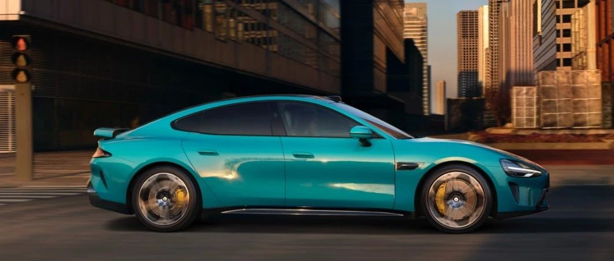

#  小米SU7答网友问（第二十三集）

[ 小米汽车 ](<javascript:void\(0\);>)

______

**01**  

**哨兵模式一有人靠近就开始双闪，能不能关掉灯光提示，仅记录就好？**

目前不能。开启哨兵模式之后，当车辆识别到警惕事件时，会自动开始记录，同时启动双闪灯，并在中控屏显示“正在录制”状态，提醒靠近人员。

一方面警示可能图谋不轨之人，避免其进一步实施针对车辆的危险行为；另一方面也告知其他周围人员，系统正在录制画面，照顾周围人员的隐私。

  

## **02**

**小米SU7标准版家充能支持11kW交流电充电桩吗？**

小米SU7标准版及Pro版车端交流充电机为7kW，因此使用11kW交流充电桩，车端充电速率也为7kW。小米SU7标准版在7kW充电桩上，约11.7小时可补满电量，Pro版由于电池容量更大，则需要约15个小时。

在7kW交流充电桩下，车辆在回家后，充电一夜即可完成补能，同样拥有优秀的体验。

  

## **03**

**能否在车辆刚启动的时候就用Sport+或是一键Boost模式，对电机有没有影响？**

在车辆启动后，驾驶员均可以随时选择Sport+驾驶模式及使用一键Boost功能。我们开发的各模式下的动力输出，都是在系统边界和部件寿命范围内的，可以放心按需使用自己喜欢的驾驶模式。

但车辆在长时间静置后，电芯及电机温度并非最佳的性能状态。因此在冷车启动后，在Sport+运动模式下，或使用一键Boost模式时，可能无法发挥出最佳的性能表现。

## **04**

**能量回收强度的“柔和”和“标准”，分别对应自定义的什么档位呢？**

小米SU7共有3种动能回收模式，分别为柔和、标准以及自定义。柔和模式相当于自定义中的“1挡”，而标准版则是“100挡”。

小米SU7拥有优秀的动能回收设定，不仅可以实现“单踏板”的日常行驶制动效果，对于降低行驶能耗也有很好的帮助。

如果您希望自由调配动能回收的反馈力度，可以在自定义模式中进行调整，小米SU7拥有100挡的动能回收设定，总有一种可以满足您的需求。

  

## **05**

**顶棚的“SOS”按键是干什么用的？**

“SOS”按键为紧急呼叫功能。当车辆发生人伤事故或遇到其他紧急情况时，您可手动触发，或车辆自动触发紧急呼叫，请求呼叫中心帮助和救援。但请注意，SOS仅作为紧急呼叫所用，并非售后服务的直通服务。

1、手动呼叫：手动按下SOS按键并保持2s-10s内，松开后即激活SOS功能，此时车辆状态信息（位置、时间、车辆数据等）自动发送至救援中心且中控屏展开通话界面。救援中心根据车辆上传的状态信息和通话情况，及时提供救援服务。

特别说明/注意事项：

  * SOS按键仅在紧急情况下使用，如人伤事故、疾病或乘员受威胁。

  * 手动呼叫功能触发并且在呼叫过程中无法取消该功能，仅能由救援中心进行挂断。

2、自动呼叫：当车辆发生碰撞且车辆接收到碰撞信号时，SOS功能自动激活，此时车辆状态信息（位置、时间、车辆数据等）自动发送至救援中心且中控屏展开通话界面。

注意事项：

  * 自动呼叫功能触发并且在呼叫过程中无法取消该功能，仅能由救援中心进行挂断。

  * 自动呼叫功能不是任何事故都会触发，当您可以手动呼叫时，请勿等待该系统触发自动呼叫，应立即手动呼叫救援中心，以避免拖延响应时间。

  * 呼叫救援功能需要在车辆连接网络状态下才能使用。

  * 救援中心在紧急情况下会回呼到车机，并自动接起。

  

## **06**

**点烟器的最大输出功率是多少？**

小米SU7配备两个12V电源接口，可为小型电子设备供电。中控台下储物槽前部的12V电源接口，输出额定电压为12V，输出最大功率为240W；后备厢内右侧饰板上有一个12V电源接口，电源输出额定电压为12V，输出最大功率为180W。

## **07**

**小米SU7车模后续是否会再推出一些新的颜色？**

非常感谢大家对小米SU7 车模的喜爱，我们接收到了很多用户的呼声，新颜色的小米SU7 车模已经开始研发了。由于小米SU7 真车车漆颜色质感饱受好评，我们会非常重视车模的漆面调色和手工喷漆工艺，还请大家耐心等待。

  

小米SU7答网友问  

持续进行中...

[小米SU7答网友问（第一集）](<http://mp.weixin.qq.com/s?__biz=MzkyNzU3MDI3Nw==&mid=2247486958&idx=1&sn=fa1835ddd2eee3bdafefcad5b74d2d94&chksm=c2274de4f550c4f28c7b9e54f1a6a8bcacc3459e88bbe256c362a899a36ca32c80be4f87c45a&scene=21#wechat_redirect>)

[小米SU7答网友问（第二集）](<http://mp.weixin.qq.com/s?__biz=MzkyNzU3MDI3Nw==&mid=2247487024&idx=1&sn=0c7cfca4d7c560dedf8062fa3a7230e3&chksm=c2274e3af550c72cdf2c4b04f2e6f3f66f10eac3634f77346b68be322d895dfb1398978ccbcf&scene=21#wechat_redirect>)

[小米SU7答网友问（第三集）](<http://mp.weixin.qq.com/s?__biz=MzkyNzU3MDI3Nw==&mid=2247487063&idx=2&sn=a0651af985a684e2379d3805947abc23&chksm=c2274e5df550c74b86d3871da393feb8fcadab0dfcdc8e77c806309341c89f1b37396b0e6318&scene=21#wechat_redirect>)

[小米SU7答网友问（第四集）](<http://mp.weixin.qq.com/s?__biz=MzkyNzU3MDI3Nw==&mid=2247487079&idx=1&sn=9cf62cd9e760babefdd444d29ee00b68&chksm=c2274e6df550c77b506f07fb315efff406bc12a55eba23c69b349cba973f61811d88fd0ade33&scene=21#wechat_redirect>)

[小米SU7答网友问（第五集）](<http://mp.weixin.qq.com/s?__biz=MzkyNzU3MDI3Nw==&mid=2247487101&idx=1&sn=9e00cc3239d1e6d9cb373f2efad42e3c&chksm=c2274e77f550c76157349d363d8e0c17ceadab29fae7538c156149e37c9c89e7cc22644201b2&scene=21#wechat_redirect>)

[小米SU7答网友问（第六集）](<http://mp.weixin.qq.com/s?__biz=MzkyNzU3MDI3Nw==&mid=2247487835&idx=2&sn=30cf8170af01397c46dc34cf495f7c02&chksm=c2275151f550d847fcc5d8d333c20a5d27d60276888d7192f51064f53e6fa738e21bf375ef29&scene=21#wechat_redirect>)

[小米SU7答网友问（第七集）](<http://mp.weixin.qq.com/s?__biz=MzkyNzU3MDI3Nw==&mid=2247487849&idx=1&sn=45b7ceae12489188c167129f3fb8b1a6&chksm=c2275163f550d87500cbacfac5ee05ea1b5083b97beb0d16e375b98480c98c823fbfdcc4d45a&scene=21#wechat_redirect>)

[小米SU7答网友问（第八集）](<http://mp.weixin.qq.com/s?__biz=MzkyNzU3MDI3Nw==&mid=2247487860&idx=1&sn=337ffc5a7972e5758d3208fb1eb7a28d&chksm=c227517ef550d86838d64b08036486d07a6ea303f0f8e2e9bb93b097750beeb6b2649b692ede&scene=21#wechat_redirect>)

[小米SU7答网友问（第九集）](<http://mp.weixin.qq.com/s?__biz=MzkyNzU3MDI3Nw==&mid=2247487868&idx=1&sn=8021638c108d845fab76580a6cc405e9&chksm=c2275176f550d86086dc3bcdbc3b4cf518b1ba41a294c3ad5d39504791907edcc6422b015131&scene=21#wechat_redirect>)

[小米SU7答网友问（第十集）](<http://mp.weixin.qq.com/s?__biz=MzkyNzU3MDI3Nw==&mid=2247487890&idx=1&sn=47696df25bbc82e7c5aea71ccd30030e&chksm=c2275198f550d88e577cf942e5f0b4a7a6a21cc2cec4b0f04562b6acaa878177be8d8f2507b9&scene=21#wechat_redirect>)

[小米SU7答网友问（第十一集）](<http://mp.weixin.qq.com/s?__biz=MzkyNzU3MDI3Nw==&mid=2247487900&idx=1&sn=7765954b27cc8772008540f91ca7224d&chksm=c2275196f550d8807e8be4cee38e091559c454cfc8bed3e843d4e425f4b002ee0cb931c883d8&scene=21#wechat_redirect>)

[小米SU7答网友问（第十二集）](<http://mp.weixin.qq.com/s?__biz=MzkyNzU3MDI3Nw==&mid=2247487915&idx=1&sn=abbebbb9cbe0668b66a9c1026b12932f&chksm=c22751a1f550d8b73c8ad64a95a0158ef65c19c0becad656d616125a396dc6b4c6703e97f967&scene=21#wechat_redirect>)

[小米SU7答网友问（第十三集）](<http://mp.weixin.qq.com/s?__biz=MzkyNzU3MDI3Nw==&mid=2247487947&idx=1&sn=f544e6be6fd1221b57e5123f58c1f72c&chksm=c22751c1f550d8d76cf64deaaaf06423ad37525bfbda26eb8e1d0a5952a5b1ae30188c90c2c4&scene=21#wechat_redirect>)

[小米SU7答网友问（第十四集）](<http://mp.weixin.qq.com/s?__biz=MzkyNzU3MDI3Nw==&mid=2247487955&idx=1&sn=ee2a1734fe86b15000822bee9ae0ffd2&chksm=c22751d9f550d8cfdb48ae0c890173e37f66356ad6316e9ada00ee7c231d0772ee6e4c817c65&scene=21#wechat_redirect>)

[小米SU7答网友问（第十五集）](<http://mp.weixin.qq.com/s?__biz=MzkyNzU3MDI3Nw==&mid=2247487979&idx=1&sn=ab9d29fdf3c1147cd9c500ac5fafedde&chksm=c22751e1f550d8f725f7b294d004e04caa682567387ee5ee39a067fad1859fcaca2e68748e6f&scene=21#wechat_redirect>)

[小米SU7答网友问（第十六集）](<http://mp.weixin.qq.com/s?__biz=MzkyNzU3MDI3Nw==&mid=2247488003&idx=1&sn=9ed994132d197917e93f91b9f332e8d1&chksm=c2275209f550db1fe70c13abc492f5c01be8e5b5b81fba7379fe76c52c5256038eb4d6080ce6&scene=21#wechat_redirect>)

[小米SU7答网友问（第十七集）](<http://mp.weixin.qq.com/s?__biz=MzkyNzU3MDI3Nw==&mid=2247488035&idx=1&sn=fcfdeca83d7ca7c13e84b84a92146ed0&chksm=c2275229f550db3f3019dfe29d896a4c7c49a61351dd801e7b3520c9174e26ce040555c9756a&scene=21#wechat_redirect>)

[小米SU7答网友问（第十八集）](<http://mp.weixin.qq.com/s?__biz=MzkyNzU3MDI3Nw==&mid=2247488044&idx=1&sn=15e0313c7b352da563c38d6b64e5cb27&chksm=c2275226f550db303d96d77050e8fe6c21f6c0fd9453e84d129f29cd0024fcf7dd5d0cab4ec8&scene=21#wechat_redirect>)

[小米SU7答网友问（第十九集）](<http://mp.weixin.qq.com/s?__biz=MzkyNzU3MDI3Nw==&mid=2247488049&idx=1&sn=20d5d20c485040ccd9bbe1100ad0dd18&chksm=c227523bf550db2d8d6d7bb477f3f83742d63b451060848150a41d9bf819ff812b73c67add01&scene=21#wechat_redirect>)

[小米SU7答网友问（第二十集）](<http://mp.weixin.qq.com/s?__biz=MzkyNzU3MDI3Nw==&mid=2247488056&idx=1&sn=efcffc7ee04fad7bcb74c548c6941929&chksm=c2275232f550db24c3c6d404748637a9d2a1e60c653ddbf9ddafdc767e79454a3602f3d0ef1c&scene=21#wechat_redirect>)

[小米SU7答网友问（第二十一集）](<http://mp.weixin.qq.com/s?__biz=MzkyNzU3MDI3Nw==&mid=2247488116&idx=1&sn=023b64046c6b458d5d18d3127927f1d7&chksm=c227527ef550db683a84f930ced2a5490c3db91875d0f42b3f9389ccd9c7f28f2df9bc801981&scene=21#wechat_redirect>)

[小米SU7答网友问（第二十二集）](<http://mp.weixin.qq.com/s?__biz=MzkyNzU3MDI3Nw==&mid=2247488132&idx=1&sn=9886d3575c66671b6730a33b6306dab3&chksm=c227528ef550db987a53c13da3d506b2811d5055612cd653ef3991e43c17f4ec4537272e2921&scene=21#wechat_redirect>)

  

预览时标签不可点

微信扫一扫  
关注该公众号

继续滑动看下一个

轻触阅读原文

小米汽车 

向上滑动看下一个

[知道了](<javascript:;>)

微信扫一扫  
使用小程序

****

[取消](<javascript:void\(0\);>) [允许](<javascript:void\(0\);>)

****

[取消](<javascript:void\(0\);>) [允许](<javascript:void\(0\);>)

****

[取消](<javascript:void\(0\);>) [允许](<javascript:void\(0\);>)

× 分析

__

微信扫一扫可打开此内容，  
使用完整服务

： ， ， ， ， ， ， ， ， ， ， ， ， 。 视频 小程序 赞 ，轻点两下取消赞 在看 ，轻点两下取消在看 分享 留言 收藏 听过