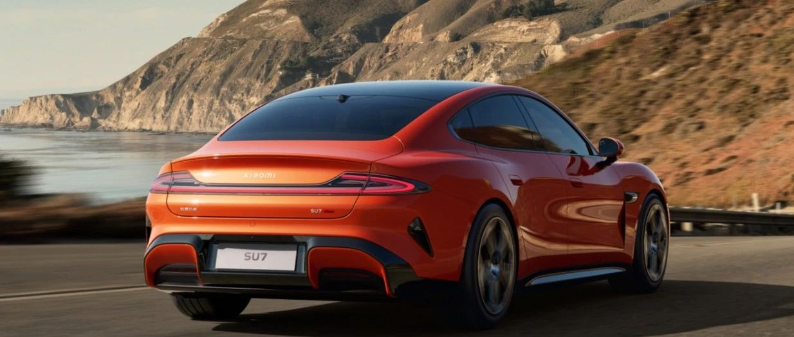

#  小米SU7答网友问（第二十八集）

[ 小米汽车 ](<javascript:void\(0\);>)

______

**01**  

**今天雷军宣布小米SU7锁单量已经超过了75000台，我现在下定，会不会等待太久？**

上市28天，我们已经交付了5781台车，这在行业内是个很惊人的数字。我们正在全力扩充产能，并已开始提速。原本定于4月底开始交付的小米SU7标准版及Max版，已提前至4月18日开始。不少准车主也已发现，小米汽车APP中显示的预计交付时间提前了。

我们将在6月达成月交付10000台，并持续提升交付速度。感谢您的关注和支持，我们也恳请您能给我们一些时间和耐心，我们有信心小米SU7这样的好产品，一定值得您的等待。

## **02**

**今天你们公布了浙赛成绩，什么时候会提供可以跑赛道的运动套件和车型？**

首先，我们还是要提示朋友们，小米SU7是一台家用轿车，并不是专为赛道设计的产品。请大家在没有专业赛用整备和专业赛车经验的情况下，切勿轻易尝试赛道驾驶。

浙赛是国内公认含金量最高的“原厂车圈速榜”，在搭载原厂轮胎的情况下，小米SU7达成了1分42.163秒的惊人成绩，超过了Taycan Turbo S 和 Model S Plaid这样以动力和速度著称的百万级豪车。为了探究这辆车的性能极限，搭载米其林CUP 2R半热熔轮胎的高性能运动套件后，小米SU7跑出了1分38.043秒的惊人成绩。

适配小米SU7的高性能运动套件，我们正在准备上架，请留意小米汽车APP中的信息。小米自研的超高转速电机V8s将于年底开始装车，来年我们将适时发布搭载小米超级电机V8s、拥有强大赛道性能的车型。

  

## **03**

**小米SU7零部件都是顶尖供应商的顶尖产品，那小米SU7售后维修用车成本会不会很高？**

尽管零部件成本贵，但小米汽车的售后维修配件定价，还是坚持了小米“价格厚道”的原则，充分考虑到了用户的用车维修经济性。

我们的售后维修配件零售价，和其他新能源汽车品牌相比，还是非常有诚意的！

  

## **04**

**若主驾离开车辆但是车里还有人，能否自动识别到？还是会自动锁车？**

为了更好地保证车辆能够无感离车落锁和及时下电，是否自动锁车是根据车内是否有钥匙来判断的：车内有遥控蓝牙钥匙不会自动闭锁，车内有手机蓝牙钥匙也不会自动闭锁，以上两种情况请用户手动闭锁；车内有NFC钥匙会自动闭锁。

  

## **05**

**同版本不同颜色的交付时间是否有很大差异？**

相同配置的订单先锁单先排产，这里的相同配置是指相同的版本、颜色、内饰、轮毂和选装。因此，同版本不同颜色的订单交付时间会有差异，具体差异的大小是根据不同时期物料供应节奏情况而定的。

## **06**  

**入门版能不能通过第三方加装尾翼，加装后是否影响保修？**

改装的结构和零件无法享受官方质保权益；因改装而导致的车辆结构和功能性受损，也超出质保权益覆盖范围。详细的小米SU7质保政策可在官网查询。

另外提醒，若车辆在上牌照时没有尾翼，而后来加装了尾翼，需要办理改装备案手续。

## **07**

**去洗车房洗车，小米SU7有洗车模式吗？**

小米SU7拥有洗车模式，请在中控屏下方控制栏打开设置，进入到安全与服务>洗车模式，点击开启或关闭该功能。

开启前请注意：

  * 开启洗车模式前请先切换至P挡，并确认模式条件是否满足；

  * 如使用传送带洗车机，请在开启洗车模式后挂入N挡，车辆会禁用离车自动挂入P挡功能；如人工洗车，P挡即可；

  * 洗车模式开启后，车辆将关闭全车车窗，折叠外后视镜；

  * 洗车模式开启超过60min或车速超过11km/h时将自动退出。

此外，洗车模式开启后以下车辆功能将受到限制，请您知悉：

  * 开启空调内循环（内/外循环不生效）；

  * 哨兵模式将被禁用；

  * 雨刮将被禁用；

  * 充电口盖无法开启；

  * 蓝牙钥匙离车自动上锁功能将被禁用。

  

## **08**

**通过手机端的小爱同学，我能实现哪些控车功能？**

手机上的小爱支持多种车辆控制功能，比如：

  * 出门前，可以用手机小爱，查询车辆续航里程、剩余电量、车里的温度；

  * 进车前，可以提前打开车里的空调、座椅加热、打开方向盘加热；

  * 停车场找不到车时，可以打开车辆鸣笛、车辆闪灯；

  * 离车后，也可以问手机小爱：“我的车窗关了吗”“后备厢关好了吗”“我的车锁好了吗？”

  * 特别提醒：为拥有更好的体验，请升级至最新手机小爱版本。

  

  

小米SU7答网友问  

持续进行中...

[小米SU7答网友问（第一集）](<http://mp.weixin.qq.com/s?__biz=MzkyNzU3MDI3Nw==&mid=2247486958&idx=1&sn=fa1835ddd2eee3bdafefcad5b74d2d94&chksm=c2274de4f550c4f28c7b9e54f1a6a8bcacc3459e88bbe256c362a899a36ca32c80be4f87c45a&scene=21#wechat_redirect>)

[小米SU7答网友问（第二集）](<http://mp.weixin.qq.com/s?__biz=MzkyNzU3MDI3Nw==&mid=2247487024&idx=1&sn=0c7cfca4d7c560dedf8062fa3a7230e3&chksm=c2274e3af550c72cdf2c4b04f2e6f3f66f10eac3634f77346b68be322d895dfb1398978ccbcf&scene=21#wechat_redirect>)

[小米SU7答网友问（第三集）](<http://mp.weixin.qq.com/s?__biz=MzkyNzU3MDI3Nw==&mid=2247487063&idx=2&sn=a0651af985a684e2379d3805947abc23&chksm=c2274e5df550c74b86d3871da393feb8fcadab0dfcdc8e77c806309341c89f1b37396b0e6318&scene=21#wechat_redirect>)

[小米SU7答网友问（第四集）](<http://mp.weixin.qq.com/s?__biz=MzkyNzU3MDI3Nw==&mid=2247487079&idx=1&sn=9cf62cd9e760babefdd444d29ee00b68&chksm=c2274e6df550c77b506f07fb315efff406bc12a55eba23c69b349cba973f61811d88fd0ade33&scene=21#wechat_redirect>)

[小米SU7答网友问（第五集）](<http://mp.weixin.qq.com/s?__biz=MzkyNzU3MDI3Nw==&mid=2247487101&idx=1&sn=9e00cc3239d1e6d9cb373f2efad42e3c&chksm=c2274e77f550c76157349d363d8e0c17ceadab29fae7538c156149e37c9c89e7cc22644201b2&scene=21#wechat_redirect>)

[小米SU7答网友问（第六集）](<http://mp.weixin.qq.com/s?__biz=MzkyNzU3MDI3Nw==&mid=2247487835&idx=2&sn=30cf8170af01397c46dc34cf495f7c02&chksm=c2275151f550d847fcc5d8d333c20a5d27d60276888d7192f51064f53e6fa738e21bf375ef29&scene=21#wechat_redirect>)

[小米SU7答网友问（第七集）](<http://mp.weixin.qq.com/s?__biz=MzkyNzU3MDI3Nw==&mid=2247487849&idx=1&sn=45b7ceae12489188c167129f3fb8b1a6&chksm=c2275163f550d87500cbacfac5ee05ea1b5083b97beb0d16e375b98480c98c823fbfdcc4d45a&scene=21#wechat_redirect>)

[小米SU7答网友问（第八集）](<http://mp.weixin.qq.com/s?__biz=MzkyNzU3MDI3Nw==&mid=2247487860&idx=1&sn=337ffc5a7972e5758d3208fb1eb7a28d&chksm=c227517ef550d86838d64b08036486d07a6ea303f0f8e2e9bb93b097750beeb6b2649b692ede&scene=21#wechat_redirect>)

[小米SU7答网友问（第九集）](<http://mp.weixin.qq.com/s?__biz=MzkyNzU3MDI3Nw==&mid=2247487868&idx=1&sn=8021638c108d845fab76580a6cc405e9&chksm=c2275176f550d86086dc3bcdbc3b4cf518b1ba41a294c3ad5d39504791907edcc6422b015131&scene=21#wechat_redirect>)

[小米SU7答网友问（第十集）](<http://mp.weixin.qq.com/s?__biz=MzkyNzU3MDI3Nw==&mid=2247487890&idx=1&sn=47696df25bbc82e7c5aea71ccd30030e&chksm=c2275198f550d88e577cf942e5f0b4a7a6a21cc2cec4b0f04562b6acaa878177be8d8f2507b9&scene=21#wechat_redirect>)

[小米SU7答网友问（第十一集）](<http://mp.weixin.qq.com/s?__biz=MzkyNzU3MDI3Nw==&mid=2247487900&idx=1&sn=7765954b27cc8772008540f91ca7224d&chksm=c2275196f550d8807e8be4cee38e091559c454cfc8bed3e843d4e425f4b002ee0cb931c883d8&scene=21#wechat_redirect>)

[小米SU7答网友问（第十二集）](<http://mp.weixin.qq.com/s?__biz=MzkyNzU3MDI3Nw==&mid=2247487915&idx=1&sn=abbebbb9cbe0668b66a9c1026b12932f&chksm=c22751a1f550d8b73c8ad64a95a0158ef65c19c0becad656d616125a396dc6b4c6703e97f967&scene=21#wechat_redirect>)

[小米SU7答网友问（第十三集）](<http://mp.weixin.qq.com/s?__biz=MzkyNzU3MDI3Nw==&mid=2247487947&idx=1&sn=f544e6be6fd1221b57e5123f58c1f72c&chksm=c22751c1f550d8d76cf64deaaaf06423ad37525bfbda26eb8e1d0a5952a5b1ae30188c90c2c4&scene=21#wechat_redirect>)

[小米SU7答网友问（第十四集）](<http://mp.weixin.qq.com/s?__biz=MzkyNzU3MDI3Nw==&mid=2247487955&idx=1&sn=ee2a1734fe86b15000822bee9ae0ffd2&chksm=c22751d9f550d8cfdb48ae0c890173e37f66356ad6316e9ada00ee7c231d0772ee6e4c817c65&scene=21#wechat_redirect>)

[小米SU7答网友问（第十五集）](<http://mp.weixin.qq.com/s?__biz=MzkyNzU3MDI3Nw==&mid=2247487979&idx=1&sn=ab9d29fdf3c1147cd9c500ac5fafedde&chksm=c22751e1f550d8f725f7b294d004e04caa682567387ee5ee39a067fad1859fcaca2e68748e6f&scene=21#wechat_redirect>)

[小米SU7答网友问（第十六集）](<http://mp.weixin.qq.com/s?__biz=MzkyNzU3MDI3Nw==&mid=2247488003&idx=1&sn=9ed994132d197917e93f91b9f332e8d1&chksm=c2275209f550db1fe70c13abc492f5c01be8e5b5b81fba7379fe76c52c5256038eb4d6080ce6&scene=21#wechat_redirect>)

[小米SU7答网友问（第十七集）](<http://mp.weixin.qq.com/s?__biz=MzkyNzU3MDI3Nw==&mid=2247488035&idx=1&sn=fcfdeca83d7ca7c13e84b84a92146ed0&chksm=c2275229f550db3f3019dfe29d896a4c7c49a61351dd801e7b3520c9174e26ce040555c9756a&scene=21#wechat_redirect>)

[小米SU7答网友问（第十八集）](<http://mp.weixin.qq.com/s?__biz=MzkyNzU3MDI3Nw==&mid=2247488044&idx=1&sn=15e0313c7b352da563c38d6b64e5cb27&chksm=c2275226f550db303d96d77050e8fe6c21f6c0fd9453e84d129f29cd0024fcf7dd5d0cab4ec8&scene=21#wechat_redirect>)

[小米SU7答网友问（第十九集）](<http://mp.weixin.qq.com/s?__biz=MzkyNzU3MDI3Nw==&mid=2247488049&idx=1&sn=20d5d20c485040ccd9bbe1100ad0dd18&chksm=c227523bf550db2d8d6d7bb477f3f83742d63b451060848150a41d9bf819ff812b73c67add01&scene=21#wechat_redirect>)

[小米SU7答网友问（第二十集）](<http://mp.weixin.qq.com/s?__biz=MzkyNzU3MDI3Nw==&mid=2247488056&idx=1&sn=efcffc7ee04fad7bcb74c548c6941929&chksm=c2275232f550db24c3c6d404748637a9d2a1e60c653ddbf9ddafdc767e79454a3602f3d0ef1c&scene=21#wechat_redirect>)

[小米SU7答网友问（第二十一集）](<http://mp.weixin.qq.com/s?__biz=MzkyNzU3MDI3Nw==&mid=2247488116&idx=1&sn=023b64046c6b458d5d18d3127927f1d7&chksm=c227527ef550db683a84f930ced2a5490c3db91875d0f42b3f9389ccd9c7f28f2df9bc801981&scene=21#wechat_redirect>)

[小米SU7答网友问（第二十二集）](<http://mp.weixin.qq.com/s?__biz=MzkyNzU3MDI3Nw==&mid=2247488132&idx=1&sn=9886d3575c66671b6730a33b6306dab3&chksm=c227528ef550db987a53c13da3d506b2811d5055612cd653ef3991e43c17f4ec4537272e2921&scene=21#wechat_redirect>)

[小米SU7答网友问（第二十三集）](<http://mp.weixin.qq.com/s?__biz=MzkyNzU3MDI3Nw==&mid=2247488147&idx=1&sn=152e9e104197e2a3cf83a0752b29ab2c&chksm=c2275299f550db8f55fc3419acf0eaaa7942e67e59fd74824fe80163cc474cfe2c2c4f86b57e&scene=21#wechat_redirect>)

[小米SU7答网友问（第二十四集）](<http://mp.weixin.qq.com/s?__biz=MzkyNzU3MDI3Nw==&mid=2247488153&idx=1&sn=5813bae70bf685e3be696e424e91c2b8&chksm=c2275293f550db85b0f9e2c070e7e44c503db4898fc24aa5408212264c0047d4f027510be852&scene=21#wechat_redirect>)

[小米SU7答网友问（第二十五集）](<http://mp.weixin.qq.com/s?__biz=MzkyNzU3MDI3Nw==&mid=2247488181&idx=2&sn=8c839457b13992e0fa44edf3c74c9b89&chksm=c22752bff550dba973f0a90364cfd25c389abce8b4d1f193fd418ab7ec724579d6b6b7c70848&scene=21#wechat_redirect>)

[小米SU7答网友问（第二十六集）](<http://mp.weixin.qq.com/s?__biz=MzkyNzU3MDI3Nw==&mid=2247488457&idx=2&sn=dc543fd12a83946ac754f5587901551b&chksm=c22753c3f550dad5ffda70b1d547b1c1ebfb49acd80723e8532dbf868b6ce80322f3a21f54c2&scene=21#wechat_redirect>)

[小米SU7答网友问（第二十七集）](<http://mp.weixin.qq.com/s?__biz=MzkyNzU3MDI3Nw==&mid=2247488844&idx=2&sn=98831e69ba6a5309e094f854c33c1239&chksm=c2275546f550dc50ae5e62fa68397d8534114ad575fa9d42a024a02a7c76e4f387c67870ecd4&scene=21#wechat_redirect>)

  

  

* * *

  

4月25日至5月4日，关注“小米汽车”公众号，每小时抽送**不锈钢马克杯** 、**合金T恤** ，每天抽送**手机** 、**合金****车模** 。点击下方卡片链接，即可参与⬇️

  

预览时标签不可点

微信扫一扫  
关注该公众号

继续滑动看下一个

轻触阅读原文

小米汽车 

向上滑动看下一个

[知道了](<javascript:;>)

微信扫一扫  
使用小程序

****

[取消](<javascript:void\(0\);>) [允许](<javascript:void\(0\);>)

****

[取消](<javascript:void\(0\);>) [允许](<javascript:void\(0\);>)

****

[取消](<javascript:void\(0\);>) [允许](<javascript:void\(0\);>)

× 分析

__

微信扫一扫可打开此内容，  
使用完整服务

： ， ， ， ， ， ， ， ， ， ， ， ， 。 视频 小程序 赞 ，轻点两下取消赞 在看 ，轻点两下取消在看 分享 留言 收藏 听过